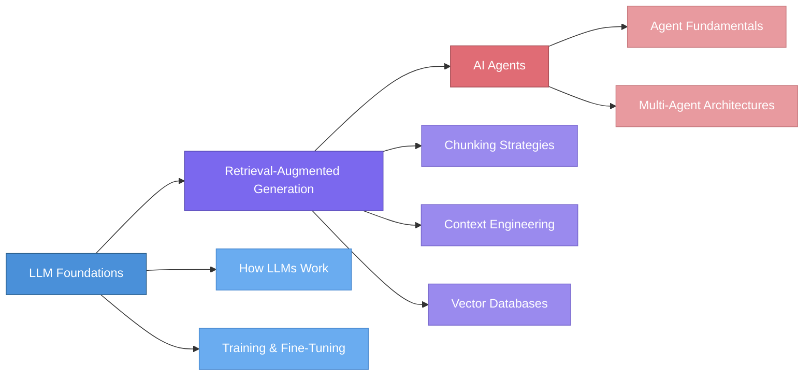

# Deep Dive into LLMs & AI Agents

> A structured, tutorial-style knowledge base covering Large Language Models, Retrieval-Augmented Generation, and AI Agents — from foundations to advanced architectures.

## Learning Roadmap

## Table of Contents

### 1. LLM Foundations
- [Section Overview](docs/01-llm-foundations/README.md)
- [How LLMs Work](docs/01-llm-foundations/how-llms-work.md) — Evolution from statistical models to modern LLMs, Transformer architecture, emergent abilities
- [Training & Fine-Tuning](docs/01-llm-foundations/training-and-fine-tuning.md) — Pre-training, SFT, RLHF, DPO, and practical considerations

### 2. Retrieval-Augmented Generation
- [Section Overview](docs/02-retrieval-augmented-generation/README.md)
- [Chunking Strategies](docs/02-retrieval-augmented-generation/chunking-strategies.md) — How to split documents for optimal retrieval, based on Chroma research
- [Context Engineering](docs/02-retrieval-augmented-generation/context-engineering.md) — Why context degrades and how to fight it, based on Chroma research
- [Vector Databases](docs/02-retrieval-augmented-generation/vector-databases.md) — Elasticsearch vs. Qdrant vs. Milvus comparison

### 3. AI Agents
- [Section Overview](docs/03-ai-agents/README.md)
- [Agent Fundamentals](docs/03-ai-agents/agent-fundamentals.md) — ReAct, tool use, memory, planning
- [Multi-Agent Architectures](docs/03-ai-agents/multi-agent-architectures.md) — Patterns, LangChain, LangGraph

### Resources
- [Key Papers](resources/papers.md) — Curated reading list with annotations
- [Tools & Frameworks](resources/tools-and-frameworks.md) — Reference guide to the ecosystem

## Who Is This For?

- **ML/AI Engineers** who want a structured reference on LLM internals, RAG pipelines, and agent architectures
- **Software Engineers** transitioning into AI/ML who need practical, concept-first explanations
- **Technical Leaders** evaluating where LLMs and agents fit into their stack
- **Students & Researchers** looking for a curated, opinionated guide through the literature

## Quick-Start Reading Guide

| Your Goal | Start Here |
|---|---|
| Understand how LLMs work from scratch | [How LLMs Work](docs/01-llm-foundations/how-llms-work.md) |
| Build or improve a RAG pipeline | [Chunking Strategies](docs/02-retrieval-augmented-generation/chunking-strategies.md) |
| Choose a vector database | [Vector Databases](docs/02-retrieval-augmented-generation/vector-databases.md) |
| Understand AI agents | [Agent Fundamentals](docs/03-ai-agents/agent-fundamentals.md) |
| Design multi-agent systems | [Multi-Agent Architectures](docs/03-ai-agents/multi-agent-architectures.md) |
| Find key papers to read | [Papers](resources/papers.md) |

## Contributing

Want to add a topic or improve existing content? See the [Contributing Guide](CONTRIBUTING.md) for templates, style conventions, and how to submit changes.
