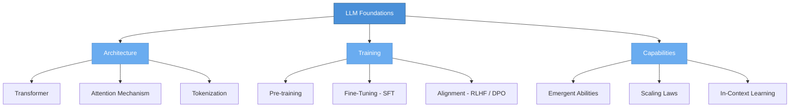

# LLM Foundations

> Understanding how Large Language Models work under the hood — from architecture to training to emergent capabilities.

## What This Section Covers

This section builds your foundational understanding of LLMs. Before diving into applications like RAG or agents, it's critical to understand what these models are, how they're built, and why they behave the way they do. These foundations inform every design decision you'll make when building on top of LLMs.

## Concept Map

## Pages in This Section

| Page | What You'll Learn |
|---|---|
| [How LLMs Work](how-llms-work.md) | The evolution from statistical models to Transformers, how attention works, emergent abilities, and a timeline of key models |
| [Training & Fine-Tuning](training-and-fine-tuning.md) | Pre-training objectives, SFT, RLHF, DPO, and practical considerations for training and adapting LLMs |

## Suggested Reading Order

1. Start with **How LLMs Work** to understand what these models are and how they evolved
2. Then read **Training & Fine-Tuning** to understand how raw models become useful assistants
