# LLM Foundations

> Understanding how Large Language Models work under the hood — from architecture to training to emergent capabilities.

## What This Section Covers

This section builds your foundational understanding of LLMs. Before diving into applications like RAG or agents, it's critical to understand what these models are, how they're built, and why they behave the way they do. These foundations inform every design decision you'll make when building on top of LLMs.

## Concept Map

```mermaid
graph TD
    A[LLM Foundations] --> B[Architecture]
    A --> C[Training]
    A --> D[Capabilities]

    B --> B1[Transformer]
    B --> B2[Attention Mechanism]
    B --> B3[Tokenization]

    C --> C1[Pre-training]
    C --> C2[Fine-Tuning - SFT]
    C --> C3[Alignment - RLHF / DPO]

    D --> D1[Emergent Abilities]
    D --> D2[Scaling Laws]
    D --> D3[In-Context Learning]

    A --> E[Prompting]
    A --> F[Evaluation]
    A --> G[Inference]
    A --> H[Long Context]

    E --> E1[Chain-of-Thought]
    E --> E2[Few-Shot / Zero-Shot]
    E --> E3[Tree-of-Thought]

    F --> F1[Benchmarks - MMLU, HumanEval]
    F --> F2[Human Evaluation]
    F --> F3[Eval Frameworks - HELM]

    G --> G1[Quantization]
    G --> G2[KV Caching]
    G --> G3[Speculative Decoding]

    H --> H1[RoPE Scaling]
    H --> H2[Long Context vs. RAG]
    H --> H3[Context Compression]

    style A fill:#4a90d9,stroke:#2c5f8a,color:#fff
    style B fill:#6aacf0,stroke:#4a8ad0,color:#fff
    style C fill:#6aacf0,stroke:#4a8ad0,color:#fff
    style D fill:#6aacf0,stroke:#4a8ad0,color:#fff
    style E fill:#6aacf0,stroke:#4a8ad0,color:#fff
    style F fill:#6aacf0,stroke:#4a8ad0,color:#fff
    style G fill:#6aacf0,stroke:#4a8ad0,color:#fff
```

## Pages in This Section

| Page | What You'll Learn |
|---|---|
| [How LLMs Work](how-llms-work.md) | The evolution from statistical models to Transformers, how attention works, emergent abilities, and a timeline of key models |
| [Training & Fine-Tuning](training-and-fine-tuning.md) | Pre-training objectives, SFT, RLHF, DPO, and practical considerations for training and adapting LLMs |
| [Tokenization](tokenization.md) | BPE, WordPiece, SentencePiece, and tiktoken -- how text becomes tokens, and why tokenizer choice affects cost, multilingual support, and model behavior |
| [Prompting Techniques](prompting-techniques.md) | Zero-shot, few-shot, Chain-of-Thought, Tree-of-Thought, Self-Consistency, and structured output techniques with a decision framework |
| [Evaluation & Benchmarks](evaluation-and-benchmarks.md) | MMLU, HumanEval, GSM8K, MT-Bench, Chatbot Arena, HELM, LM Eval Harness -- what they measure, their limitations, and how to build your own evaluations |
| [Inference Optimization](inference-optimization.md) | KV caching, quantization (GPTQ, AWQ, GGUF), Flash Attention, speculative decoding, continuous batching, and knowledge distillation |
| [Long Context and Context Windows](long-context-and-context-windows.md) | Context window evolution, RoPE scaling, ring attention, long context vs. RAG, context compression, and practical guidelines |

## Suggested Reading Order

1. Start with **How LLMs Work** to understand what these models are and how they evolved
2. Then read **Training & Fine-Tuning** to understand how raw models become useful assistants
3. Read **Tokenization** to understand the critical first step in the LLM pipeline
4. Move to **Prompting Techniques** to learn how to effectively communicate with LLMs
5. Read **Evaluation & Benchmarks** to understand how model quality is measured and compared
6. Read **Inference Optimization** to learn how LLMs are deployed efficiently in production
7. Finish with **Long Context and Context Windows** to understand how models handle large inputs and when to use long context vs. retrieval
