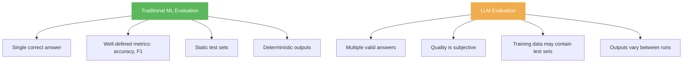
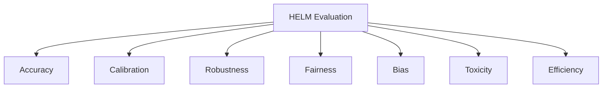

# Evaluation and Benchmarks

> **TL;DR:** Evaluating LLMs is fundamentally harder than evaluating traditional ML models. The field relies on a combination of automated benchmarks (MMLU, HumanEval, GSM8K), human evaluation frameworks (Chatbot Arena), and holistic suites (HELM, LM Eval Harness). No single benchmark captures model quality -- understanding what each measures and its limitations is essential for making informed model selection decisions.

## Table of Contents

- [Why This Matters](#why-this-matters)
- [Why LLM Evaluation Is Hard](#why-llm-evaluation-is-hard)
- [Major Benchmarks](#major-benchmarks)
  - [MMLU](#mmlu)
  - [HumanEval](#humaneval)
  - [GSM8K](#gsmk)
  - [MT-Bench](#mt-bench)
  - [Chatbot Arena](#chatbot-arena)
- [Evaluation Frameworks](#evaluation-frameworks)
  - [HELM](#helm)
  - [LM Eval Harness](#lm-eval-harness)
- [Benchmark Categories](#benchmark-categories)
- [Limitations of Benchmarks](#limitations-of-benchmarks)
- [Human Evaluation](#human-evaluation)
- [Building Your Own Evaluation](#building-your-own-evaluation)
- [Key Takeaways](#key-takeaways)
- [References](#references)

---

## Why This Matters

Model selection is one of the highest-impact decisions in any LLM-powered system. Choosing between GPT-4o, Claude, Gemini, LLaMA, or Mistral requires understanding what "better" means for your specific use case. Benchmarks provide a shared language for comparing models, but misinterpreting them leads to poor decisions -- choosing a model that excels at trivia but fails at your actual task.

Beyond model selection, evaluation is critical for:

- **Measuring prompt engineering impact** -- quantifying whether a prompt change actually helps.
- **Regression testing** -- ensuring model updates or prompt changes do not degrade performance.
- **Cost-quality trade-offs** -- determining whether a cheaper, smaller model is "good enough."

## Why LLM Evaluation Is Hard

LLM evaluation differs from traditional ML evaluation in several fundamental ways:



Core challenges:

1. **Open-ended outputs**: For generation tasks, there is no single correct answer. "Summarize this article" has thousands of valid summaries.
2. **Contamination**: Models may have seen benchmark questions during pre-training, inflating scores.
3. **Metric mismatch**: Automated metrics (BLEU, ROUGE) correlate poorly with human judgment for many tasks.
4. **Task diversity**: A model that excels at code may underperform at creative writing, and vice versa.
5. **Sensitivity to formatting**: Changing the prompt format (e.g., multiple choice letter order) can swing accuracy by 5-10%.

## Major Benchmarks

### MMLU

**Massive Multitask Language Understanding** (Hendrycks et al., 2021)

- **What it measures**: Broad knowledge across 57 subjects (STEM, humanities, social sciences, professional domains).
- **Format**: Multiple-choice questions (4 options) with few-shot prompting.
- **Size**: ~15,000 questions.
- **Scoring**: Accuracy (% correct).

| Difficulty Level | Example Subjects |
|---|---|
| Elementary | World religions, human sexuality |
| High school | Biology, US history, computer science |
| College | Mathematics, physics, chemistry |
| Professional | Medicine, law, accounting |

**Strengths**: Broad coverage, easy to run, widely reported.
**Weaknesses**: Multiple-choice format does not reflect real usage; susceptible to contamination; ceiling effects as top models approach 90%+.

### HumanEval

**HumanEval** (Chen et al., 2021)

- **What it measures**: Code generation ability (Python function synthesis).
- **Format**: Given a function signature and docstring, generate the function body.
- **Size**: 164 problems.
- **Scoring**: pass@k -- the probability that at least one of k generated solutions passes all unit tests.

**Strengths**: Objective evaluation via test execution; directly relevant to coding assistants.
**Weaknesses**: Small dataset; Python-only; problems are relatively simple (interview-level); widely contaminated due to public availability.

**Extended variants**: HumanEval+ (more rigorous tests), MultiPL-E (multi-language), SWE-bench (real GitHub issues).

### GSM8K

**Grade School Math 8K** (Cobbe et al., 2021)

- **What it measures**: Multi-step arithmetic and word problem reasoning.
- **Format**: Natural language math problems requiring 2-8 steps to solve.
- **Size**: 8,500 problems (7,500 train / 1,000 test).
- **Scoring**: Exact-match accuracy on the final numerical answer.

**Example**: "Natalia sold clips to 48 of her friends in April, and then she sold half as many in May. How many clips did Natalia sell altogether in April and May?"

**Strengths**: Tests genuine multi-step reasoning; answers are unambiguous numbers.
**Weaknesses**: Math-only scope; models now approach 95%+ accuracy, creating ceiling effects.

### MT-Bench

**Multi-Turn Benchmark** (Zheng et al., 2023)

- **What it measures**: Multi-turn conversational ability across 8 categories (writing, roleplay, reasoning, math, coding, extraction, STEM, humanities).
- **Format**: 80 two-turn questions judged by GPT-4 as an automated evaluator.
- **Scoring**: 1-10 scale per response, averaged across categories.

**Strengths**: Tests multi-turn coherence; covers diverse skills; automated and reproducible.
**Weaknesses**: Relies on GPT-4 as judge (introduces bias toward GPT-4-like responses); small question set.

### Chatbot Arena

**LMSYS Chatbot Arena** (Zheng et al., 2023)

- **What it measures**: Overall model quality via human preference.
- **Format**: Users submit prompts to two anonymous models side-by-side and vote for the better response.
- **Scoring**: Elo rating system (similar to chess rankings).

**Strengths**: Large-scale human evaluation; reflects real user preferences; resistant to gaming (anonymous models, diverse prompts).
**Weaknesses**: Biased toward fluent, verbose responses; under-represents specialized tasks; user base skews toward English-speaking developers.

## Evaluation Frameworks

### HELM

**Holistic Evaluation of Language Models** (Liang et al., 2022, Stanford CRFM)

HELM evaluates models across multiple dimensions simultaneously:



- **42 scenarios** covering question answering, summarization, information retrieval, sentiment analysis, and more.
- **7 metrics** per scenario, going beyond accuracy to measure calibration, fairness, and robustness.
- **Standardized prompting** to ensure fair comparison.

### LM Eval Harness

**EleutherAI LM Evaluation Harness**

The open-source standard for reproducible LLM evaluation. Used by Hugging Face's Open LLM Leaderboard.

Key properties:

- **200+ tasks** implemented with standardized prompts and metrics.
- **Multiple backends**: supports Hugging Face models, API-based models, and GGUF quantized models.
- **Community-driven**: new benchmarks are continuously added.
- **Reproducible**: deterministic evaluation with configurable few-shot counts, batch sizes, and prompt formats.

```bash
# Example usage
lm_eval --model hf \
  --model_args pretrained=meta-llama/Llama-3-8B \
  --tasks mmlu,gsm8k,hellaswag \
  --num_fewshot 5 \
  --batch_size 8
```

## Benchmark Categories

| Category | Benchmarks | What It Tests |
|---|---|---|
| **Knowledge** | MMLU, ARC, TriviaQA | Factual recall, subject expertise |
| **Reasoning** | GSM8K, MATH, BBH, ARC-Challenge | Logical and mathematical reasoning |
| **Code** | HumanEval, MBPP, SWE-bench | Code generation and debugging |
| **Language** | HellaSwag, WinoGrande | Commonsense, coreference, completion |
| **Conversation** | MT-Bench, Chatbot Arena | Multi-turn dialogue, instruction following |
| **Safety** | TruthfulQA, ToxiGen, BBQ | Truthfulness, toxicity, bias |
| **Long context** | RULER, Needle-in-a-Haystack | Information retrieval over long inputs |
| **Multilingual** | MGSM, XQuAD, FLORES | Cross-lingual transfer, translation |

## Limitations of Benchmarks

### Data Contamination

Models may have encountered benchmark questions during pre-training. This inflates scores without reflecting genuine capability. Contamination is difficult to detect and impossible to fully prevent for models trained on internet-scale data.

**Mitigation strategies:**
- Use held-out, unpublished test sets.
- Create dynamic benchmarks that generate new questions.
- Report contamination checks alongside scores (e.g., n-gram overlap analysis).

### Benchmark Gaming

When benchmarks become targets, they lose their value as measures (Goodhart's Law). Specific risks:

- **Overfitting to format**: training specifically on multiple-choice format improves MMLU without improving actual knowledge.
- **Cherry-picking**: reporting results only on favorable benchmarks.
- **Prompt tuning**: optimizing the evaluation prompt to maximize scores.

### Saturation

Top models now exceed 90% on MMLU, 95% on GSM8K, and 90% on HumanEval. When benchmarks saturate, they lose their ability to differentiate between models, and the field must create harder alternatives (e.g., MMLU-Pro, MATH-500, SWE-bench Verified).

## Human Evaluation

Despite the challenges, human evaluation remains the gold standard for open-ended tasks. Effective human evaluation requires:

| Component | Description |
|---|---|
| **Clear rubric** | Define what "good" means along specific dimensions (accuracy, helpfulness, safety) |
| **Calibration** | Train evaluators on examples before scoring |
| **Inter-annotator agreement** | Measure consistency between evaluators (Cohen's kappa) |
| **Sufficient scale** | Small sample sizes produce unreliable results; aim for 100+ examples |
| **Blind evaluation** | Evaluators should not know which model produced which output |

**LLM-as-Judge** is an increasingly popular alternative where a strong model (typically GPT-4 or Claude) evaluates outputs from other models. It is cheaper and faster than human evaluation but introduces systematic biases (preference for verbosity, self-preference).

## Building Your Own Evaluation

For production systems, benchmark scores are starting points, not destinations. Build task-specific evaluations:

1. **Collect representative examples** (50-200) from your actual use case.
2. **Define success criteria** with clear rubrics.
3. **Create automated checks** for format compliance, factual accuracy (against known answers), and safety.
4. **Supplement with human review** for subjective quality dimensions.
5. **Track metrics over time** to catch regressions from model updates or prompt changes.
6. **Version everything**: prompts, evaluation sets, model versions, and results.

## Key Takeaways

- No single benchmark captures LLM quality; use a portfolio of benchmarks relevant to your use case.
- MMLU tests breadth of knowledge, HumanEval tests code, GSM8K tests reasoning, and Chatbot Arena tests real user preference -- each tells a different story.
- Benchmark scores are inflated by contamination and format overfitting; treat them as directional signals, not absolute truth.
- Chatbot Arena's Elo ratings are currently the most trusted signal for overall model quality because they use real users and anonymous pairwise comparisons.
- HELM and LM Eval Harness provide standardized, reproducible evaluation pipelines for running your own assessments.
- For production systems, build task-specific evaluations rather than relying solely on public benchmarks.
- Human evaluation remains the gold standard for open-ended generation but is expensive and slow; LLM-as-Judge is a practical (if biased) alternative.

## References

- Hendrycks, D. et al. (2021). "Measuring Massive Multitask Language Understanding." [arXiv:2009.03300](https://arxiv.org/abs/2009.03300)
- Chen, M. et al. (2021). "Evaluating Large Language Models Trained on Code." [arXiv:2107.03374](https://arxiv.org/abs/2107.03374)
- Cobbe, K. et al. (2021). "Training Verifiers to Solve Math Word Problems." [arXiv:2110.14168](https://arxiv.org/abs/2110.14168)
- Zheng, L. et al. (2023). "Judging LLM-as-a-Judge with MT-Bench and Chatbot Arena." [arXiv:2306.05685](https://arxiv.org/abs/2306.05685)
- Liang, P. et al. (2022). "Holistic Evaluation of Language Models." [arXiv:2211.09110](https://arxiv.org/abs/2211.09110)
- EleutherAI LM Evaluation Harness: [github.com/EleutherAI/lm-evaluation-harness](https://github.com/EleutherAI/lm-evaluation-harness)
- Srivastava, A. et al. (2023). "Beyond the Imitation Game: Quantifying and Extrapolating the Capabilities of Language Models." [arXiv:2206.04615](https://arxiv.org/abs/2206.04615)
