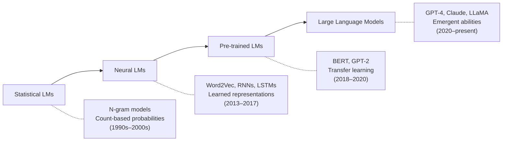
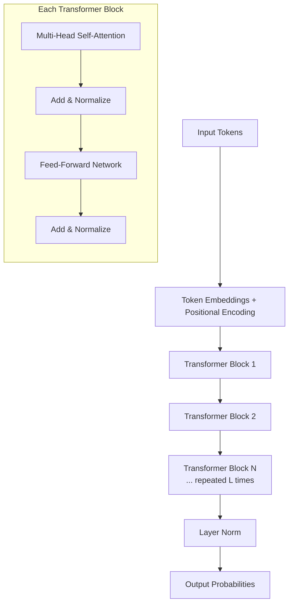
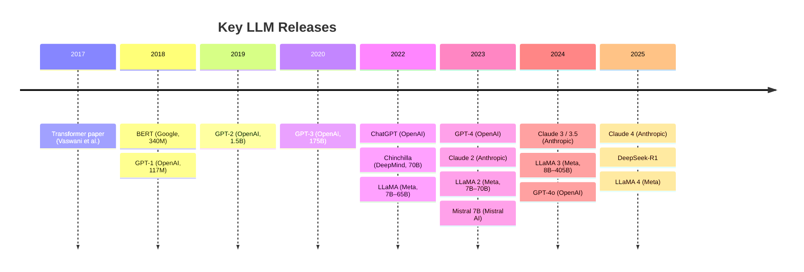

# How LLMs Work

> **TL;DR:** Large Language Models are Transformer-based neural networks trained on massive text corpora to predict the next token. At sufficient scale, they exhibit emergent abilities — capabilities like in-context learning and chain-of-thought reasoning that don't appear in smaller models. Understanding the architecture and scaling dynamics is essential for anyone building on top of LLMs.

## Table of Contents
- [Why This Matters](#why-this-matters)
- [The Evolution of Language Models](#the-evolution-of-language-models)
- [The Transformer Architecture](#the-transformer-architecture)
- [Attention: The Core Innovation](#attention-the-core-innovation)
- [Scaling Laws](#scaling-laws)
- [Emergent Abilities](#emergent-abilities)
- [Key Models Timeline](#key-models-timeline)
- [Key Takeaways](#key-takeaways)
- [References](#references)

## Why This Matters

Every decision you make when building with LLMs — prompt design, retrieval strategies, fine-tuning approaches, agent architectures — is shaped by how these models work internally. Understanding the Transformer architecture, attention mechanisms, and scaling behavior lets you reason about model behavior rather than treating it as a black box.

## The Evolution of Language Models

Language models have evolved through four distinct generations, each building on the limitations of its predecessor:



### Statistical Language Models (1990s–2000s)
Statistical LMs estimated the probability of a word sequence using **n-gram** counts from a corpus. They powered early spell-checkers and simple text prediction but couldn't capture long-range dependencies. A trigram model only looks at the two preceding words — it has no concept of broader context.

### Neural Language Models (2013–2017)
**Word2Vec** (2013) showed that neural networks could learn dense vector representations of words, capturing semantic relationships (the famous "king – man + woman = queen" example). **Recurrent Neural Networks (RNNs)** and **LSTMs** processed sequences token by token, maintaining a hidden state. But they struggled with long sequences — information from early tokens faded as the sequence grew (the vanishing gradient problem).

### Pre-trained Language Models (2018–2020)
**BERT** (2018) and **GPT-2** (2019) introduced the idea of pre-training on large corpora and then fine-tuning for specific tasks. BERT used masked language modeling (predicting hidden words in a sentence), while GPT used autoregressive modeling (predicting the next word). These models demonstrated that general-purpose language understanding could transfer across tasks. However, their scale was modest by today's standards — BERT-large had 340M parameters.

### Large Language Models (2020–present)
When models crossed roughly **10 billion parameters**, something changed qualitatively. Models began exhibiting **emergent abilities** — capabilities that don't appear at smaller scales but suddenly emerge at larger ones. GPT-3 (175B) demonstrated few-shot learning. GPT-4, Claude, and LLaMA pushed further with instruction following, complex reasoning, and multi-turn conversation.

## The Transformer Architecture

The **Transformer** (Vaswani et al., 2017) is the architecture behind all modern LLMs. It replaced sequential processing (RNNs) with **parallel self-attention**, enabling models to process entire sequences at once.



Key components:

1. **Token Embeddings** — Each input token (word or subword) is mapped to a dense vector. Positional encodings are added so the model knows the order of tokens.

2. **Multi-Head Self-Attention** — The core mechanism (detailed below). Each token attends to every other token in the sequence, computing relevance scores.

3. **Feed-Forward Network** — A two-layer MLP applied independently to each position. This is where much of the model's "knowledge" is stored.

4. **Layer Norm + Residual Connections** — Stabilize training and allow gradients to flow through deep networks.

5. **Stacked Layers** — Modern LLMs stack 32–128+ of these blocks. GPT-3 has 96 layers; LLaMA 2 70B has 80.

## Attention: The Core Innovation

Self-attention answers the question: *for each token, how much should it attend to every other token in the sequence?*

For each token, the model computes three vectors:
- **Query (Q):** "What am I looking for?"
- **Key (K):** "What do I contain?"
- **Value (V):** "What information do I provide?"

The attention score between two tokens is the dot product of the query and key, scaled and softmaxed:

```
Attention(Q, K, V) = softmax(QK^T / √d_k) × V
```

**Multi-head attention** runs this computation multiple times in parallel (e.g., 32 or 64 heads), each learning to attend to different types of relationships — syntactic, semantic, positional, and more.

### Why Attention Works

Consider the sentence: *"The cat sat on the mat because it was tired."*

An attention head can learn to connect "it" to "cat" across any distance in the sequence. RNNs had to pass this information through every intermediate step. Attention creates direct connections between any two positions.

### Causal (Decoder-Only) Attention

Most modern LLMs (GPT, Claude, LLaMA) use **causal** or **decoder-only** attention: each token can only attend to itself and previous tokens, not future ones. This makes the model naturally autoregressive — it generates text left-to-right, one token at a time.

## Scaling Laws

Kaplan et al. (2020) and Hoffmann et al. (2022, "Chinchilla") established that LLM performance follows predictable **power laws** across three dimensions:

| Dimension | Effect |
|---|---|
| **Parameters (N)** | More parameters → lower loss, but with diminishing returns |
| **Data (D)** | More training tokens → lower loss |
| **Compute (C)** | More FLOPs → lower loss |

### The Chinchilla Insight

The key finding from Hoffmann et al. was that many early LLMs were **over-parametered and under-trained**. GPT-3 (175B parameters) was trained on 300B tokens. Chinchilla (70B parameters) trained on 1.4T tokens achieved better performance with less compute. The optimal ratio is roughly **20 tokens per parameter**.

This insight directly influenced the design of LLaMA, which prioritized training data quantity over raw parameter count.

## Emergent Abilities

**Emergent abilities** are capabilities that appear only when models cross a critical scale threshold. Below that threshold, performance is near-random; above it, the ability appears suddenly.

Key emergent abilities include:

| Ability | Description | Approximate Threshold |
|---|---|---|
| **Few-shot learning** | Performing tasks from a few examples in the prompt | ~10B parameters |
| **Chain-of-thought reasoning** | Step-by-step problem solving | ~60B parameters |
| **Instruction following** | Understanding and executing natural language instructions | ~10B+ with fine-tuning |
| **Code generation** | Writing functional code from descriptions | ~10B parameters |
| **Self-correction** | Identifying and fixing errors in own outputs | ~100B parameters |

> **Important caveat:** Schaeffer et al. (2023) argued that some "emergent" abilities may be artifacts of how performance is measured (nonlinear metrics on smooth improvement curves). The debate continues, but the practical observation holds: larger models can do things smaller models cannot.

## Key Models Timeline



## Key Takeaways

- LLMs evolved from count-based statistics → neural representations → pre-trained models → today's large-scale Transformers
- The **Transformer architecture** replaces sequential processing with parallel self-attention, enabling models to capture long-range dependencies efficiently
- **Self-attention** computes relevance scores between all token pairs, with multi-head attention learning diverse relationship types
- **Scaling laws** show predictable performance gains with more parameters, data, and compute — and the Chinchilla insight showed data scaling matters more than previously thought
- **Emergent abilities** appear at critical scale thresholds, making larger models qualitatively different from smaller ones
- Modern LLMs use **decoder-only** (causal) architectures, generating text autoregressively

## References

1. Zhao et al., "A Survey of Large Language Models," 2023. [arXiv:2303.18223](https://arxiv.org/abs/2303.18223)
2. Vaswani et al., "Attention Is All You Need," 2017. [arXiv:1706.03762](https://arxiv.org/abs/1706.03762)
3. Kaplan et al., "Scaling Laws for Neural Language Models," 2020. [arXiv:2001.08361](https://arxiv.org/abs/2001.08361)
4. Hoffmann et al., "Training Compute-Optimal Large Language Models" (Chinchilla), 2022. [arXiv:2203.15556](https://arxiv.org/abs/2203.15556)
5. Wei et al., "Emergent Abilities of Large Language Models," 2022. [arXiv:2206.07682](https://arxiv.org/abs/2206.07682)
6. Schaeffer et al., "Are Emergent Abilities of Large Language Models a Mirage?," 2023. [arXiv:2304.15004](https://arxiv.org/abs/2304.15004)
