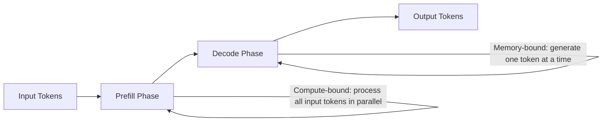
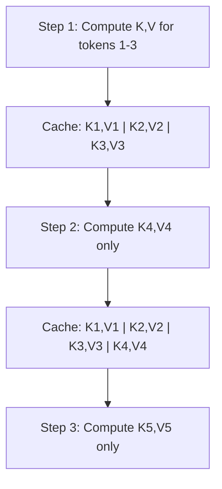
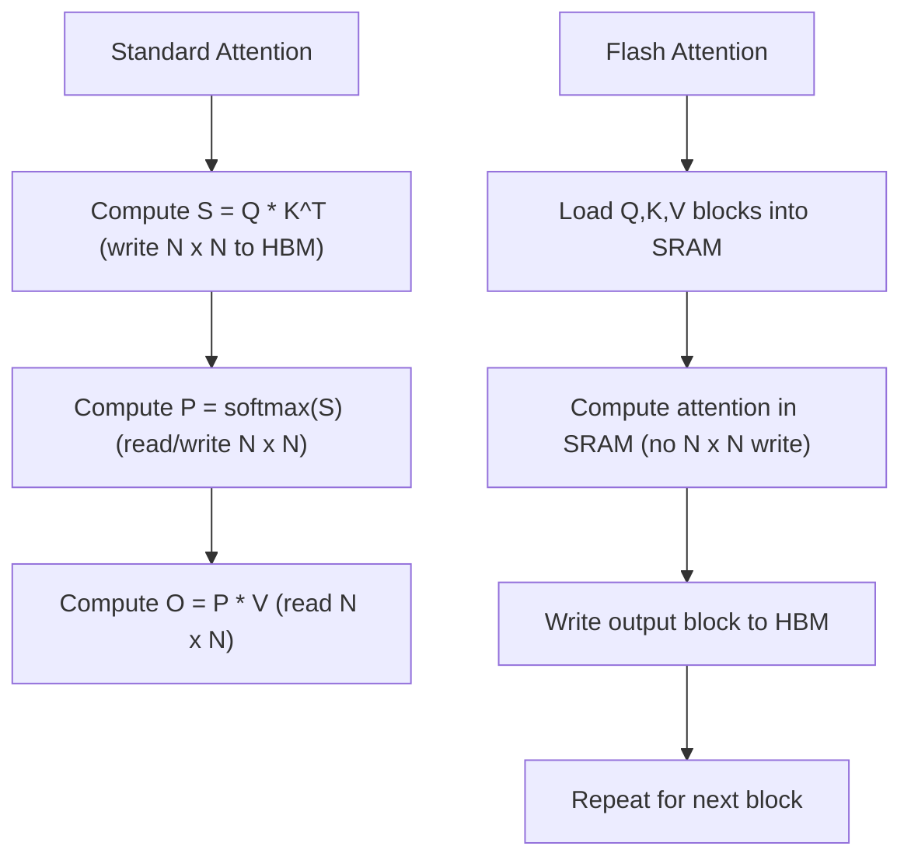
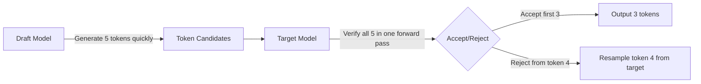
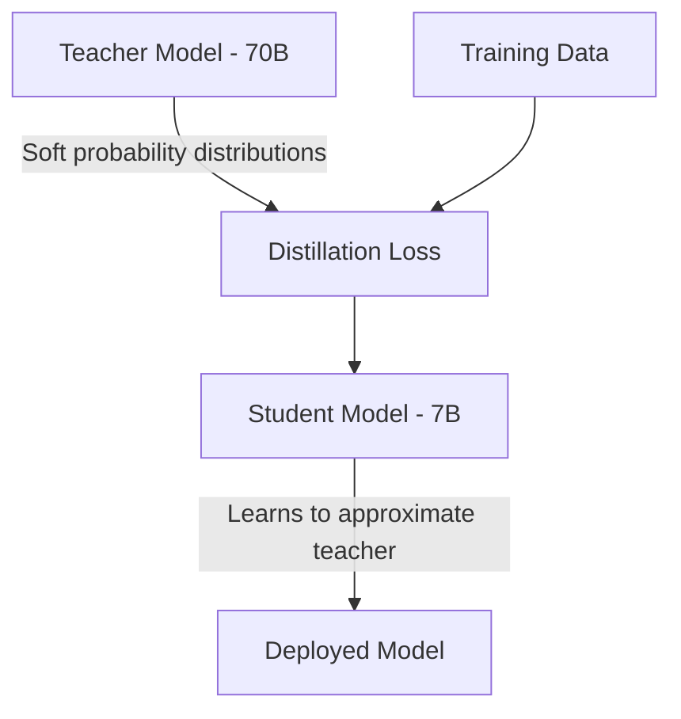
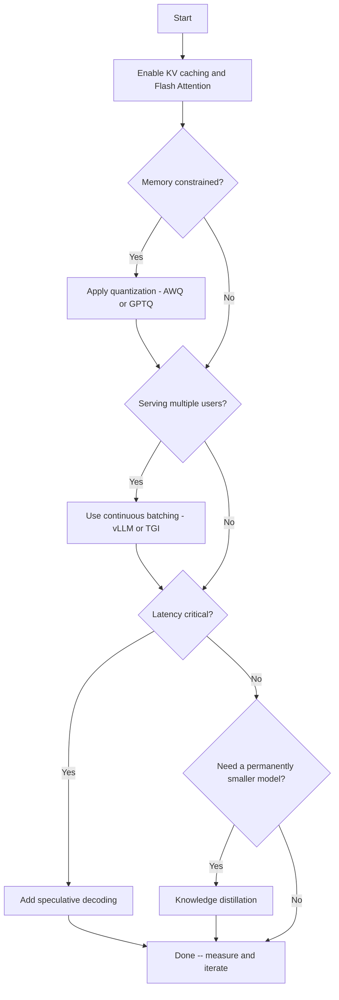

# Inference Optimization

> **TL;DR:** LLM inference is expensive and slow by default. Techniques like KV caching, quantization (GPTQ, AWQ, GGUF), Flash Attention, speculative decoding, continuous batching, and knowledge distillation can reduce latency by 2-10x and memory usage by 2-4x with minimal quality degradation. Understanding these techniques is essential for deploying LLMs cost-effectively in production.

## Table of Contents

- [Why This Matters](#why-this-matters)
- [The Inference Pipeline](#the-inference-pipeline)
- [KV Caching](#kv-caching)
- [Quantization](#quantization)
  - [Core Concepts](#core-concepts)
  - [GPTQ](#gptq)
  - [AWQ](#awq)
  - [GGUF](#gguf)
  - [Quantization Comparison](#quantization-comparison)
- [Flash Attention](#flash-attention)
- [Speculative Decoding](#speculative-decoding)
- [Continuous Batching](#continuous-batching)
- [Knowledge Distillation](#knowledge-distillation)
- [Technique Comparison](#technique-comparison)
- [Choosing the Right Optimizations](#choosing-the-right-optimizations)
- [Key Takeaways](#key-takeaways)
- [References](#references)

---

## Why This Matters

The cost of running LLMs in production is dominated by inference, not training. For a model serving millions of requests per day, inference compute dwarfs the one-time training cost. The core bottleneck is that autoregressive generation is inherently sequential: each token depends on all previous tokens, and for large models, each step requires moving billions of parameters through memory.

This creates three practical problems:

- **Latency**: Users experience delays, especially for long outputs.
- **Throughput**: Serving many concurrent users requires expensive hardware.
- **Cost**: GPU-hours translate directly to dollars, and margins matter at scale.

Inference optimization techniques address these problems by reducing memory usage, computation, or both -- often with negligible impact on output quality.

## The Inference Pipeline

Understanding where time is spent is essential for choosing the right optimization:



LLM inference has two distinct phases:

| Phase | Bottleneck | What Happens |
|---|---|---|
| **Prefill** | Compute | All input tokens are processed in parallel to build the initial KV cache. Latency scales with input length. |
| **Decode** | Memory bandwidth | Tokens are generated one at a time. Each step reads the full model weights and KV cache from memory. |

Most optimization techniques target the decode phase because it dominates total inference time for typical workloads.

## KV Caching

KV caching is the most fundamental inference optimization and is enabled by default in all modern serving frameworks.

**The problem**: In self-attention, each new token attends to all previous tokens. Without caching, this means recomputing the key (K) and value (V) projections for every previous token at every generation step -- O(n^2) computation for n tokens.

**The solution**: Store the K and V tensors from previous steps and append new entries as tokens are generated. Each decode step only computes K and V for the new token.



**Memory cost**: The KV cache grows linearly with sequence length and can become the dominant memory consumer for long contexts. For a 70B parameter model with 128K context:

```
KV cache size ~ 2 * num_layers * hidden_dim * seq_len * 2 bytes (FP16)
             ~ 2 * 80 * 8192 * 131072 * 2
             ~ ~320 GB
```

**Optimizations for KV cache size:**

| Technique | Reduction | Description |
|---|---|---|
| Multi-Query Attention (MQA) | ~8x | All heads share one K,V pair |
| Grouped-Query Attention (GQA) | ~4-8x | Groups of heads share K,V pairs |
| KV cache quantization | ~2-4x | Store cache in INT8 or INT4 |
| Sliding window attention | Bounded | Only cache the last N tokens |

## Quantization

### Core Concepts

Quantization reduces the precision of model weights (and optionally activations) from 16-bit floating point to lower bit-widths, reducing memory usage and increasing throughput.

```
FP16:  16 bits per parameter  (baseline)
INT8:   8 bits per parameter  (~2x memory reduction)
INT4:   4 bits per parameter  (~4x memory reduction)
```

The key insight is that LLM weights are overparameterized: most weights can be represented in lower precision without meaningful quality loss. The challenge is identifying and preserving the small number of "important" weights that are sensitive to quantization.

### GPTQ

**GPTQ** (Frantar et al., 2022) is a post-training quantization method based on optimal brain quantization (OBQ).

- **How it works**: Quantizes weights layer-by-layer, using a small calibration dataset (128-256 examples) to measure and compensate for quantization error. Each weight is quantized while adjusting remaining weights to minimize the layer's output error.
- **Precision**: Typically INT4 or INT3 with group-wise quantization.
- **Speed**: Quantization takes minutes to hours depending on model size.
- **Inference**: Requires GPU; optimized kernels (e.g., ExLlama, Marlin) provide fast matrix multiplication with quantized weights.

### AWQ

**Activation-Aware Weight Quantization** (Lin et al., 2023) improves upon GPTQ by observing that a small fraction (~1%) of weights are disproportionately important because they correspond to large activation magnitudes.

- **How it works**: Identifies salient weight channels by analyzing activation distributions, then scales these channels before quantization to preserve precision where it matters most.
- **Advantage over GPTQ**: Better quality at the same bit-width, especially at INT4 and below.
- **Inference**: Similar to GPTQ; supported by vLLM, TensorRT-LLM, and other serving frameworks.

### GGUF

**GGUF** (GPT-Generated Unified Format) is a file format and quantization approach from the llama.cpp ecosystem, designed for CPU and mixed CPU/GPU inference.

- **How it works**: Supports multiple quantization types (Q2_K through Q8_0) with different trade-offs. Uses k-quant methods that partition weights into blocks with per-block scaling factors.
- **Key advantage**: Runs on consumer hardware (CPUs, Apple Silicon) without requiring a GPU.
- **Naming convention**: `Q4_K_M` = 4-bit quantization, k-quant method, medium size.

| GGUF Type | Bits/Weight | Quality | Use Case |
|---|---|---|---|
| Q2_K | ~2.5 | Poor | Experimentation only |
| Q4_K_M | ~4.8 | Good | Best balance for most users |
| Q5_K_M | ~5.7 | Very good | When quality matters more than speed |
| Q6_K | ~6.6 | Excellent | Near-FP16 quality |
| Q8_0 | ~8.5 | Near-lossless | Maximum quality, 2x compression |

### Quantization Comparison

| Method | Precision | Hardware | Speed Gain | Quality Loss | Ecosystem |
|---|---|---|---|---|---|
| **GPTQ** | INT4/INT3 | GPU | 2-4x | Low | ExLlama, AutoGPTQ, vLLM |
| **AWQ** | INT4 | GPU | 2-4x | Very low | vLLM, TensorRT-LLM |
| **GGUF** | Q2-Q8 | CPU/GPU | 1-3x | Varies | llama.cpp, Ollama |
| **bitsandbytes** | INT8/NF4 | GPU | 1.5-2x | Low | Hugging Face Transformers |
| **FP8** | 8-bit float | GPU (H100+) | 1.5-2x | Negligible | TensorRT-LLM, vLLM |

## Flash Attention

**Flash Attention** (Dao et al., 2022) is an IO-aware attention algorithm that computes exact attention while dramatically reducing memory reads/writes to GPU high-bandwidth memory (HBM).

**The problem**: Standard attention materializes the full N x N attention matrix in HBM, requiring O(N^2) memory and dominated by slow HBM reads/writes.

**The solution**: Flash Attention tiles the computation so that blocks of Q, K, V fit in fast GPU SRAM (on-chip memory), computing attention in a fused kernel without materializing the full attention matrix.



**Impact:**

| Metric | Improvement |
|---|---|
| Memory usage | O(N) instead of O(N^2) |
| Wall-clock speed | 2-4x faster for long sequences |
| Quality | Exact (no approximation) |

Flash Attention 2 further improved performance by optimizing parallelism across GPU thread blocks. Flash Attention 3 (2024) adds support for Hopper GPU features (FP8, asynchronous operations).

## Speculative Decoding

Speculative decoding (Leviathan et al., 2023; Chen et al., 2023) accelerates generation by using a small, fast "draft" model to propose multiple tokens, which the large "target" model then verifies in parallel.



**Why it works**: The target model's forward pass processes all candidate tokens in parallel (like prefill), which is much faster than generating them one by one. If the draft model's predictions match the target model's distribution (which happens frequently for easy tokens), multiple tokens are accepted per target model forward pass.

**Key properties:**

- **Lossless**: The output distribution is mathematically identical to the target model alone.
- **Speedup**: Typically 2-3x, depending on draft model accuracy and acceptance rate.
- **Overhead**: Requires running a second (smaller) model and managing the draft/verify loop.

## Continuous Batching

Traditional static batching waits for a full batch of requests before processing them together. Continuous batching (also called iteration-level batching or in-flight batching) dynamically adds and removes requests from the batch at each decode step.

**The problem with static batching**: Short requests finish early but must wait for the longest request in the batch to complete, wasting GPU cycles.

**Continuous batching solution:**

| Step | Static Batching | Continuous Batching |
|---|---|---|
| Request A finishes | Waits for batch to complete | Immediately returns, slot freed |
| Request D arrives | Waits for next batch | Inserted into current batch |
| GPU utilization | Low (padding waste) | High (slots always filled) |

**Throughput improvement**: 2-10x higher throughput compared to static batching, depending on request length variance.

**Implementations**: vLLM (PagedAttention), TensorRT-LLM, TGI (Hugging Face Text Generation Inference).

## Knowledge Distillation

Knowledge distillation trains a smaller "student" model to replicate the behavior of a larger "teacher" model, transferring knowledge from the teacher's output distribution rather than just hard labels.



**Approaches:**

| Method | Description | Example |
|---|---|---|
| **Output distillation** | Student learns from teacher's token probabilities | Standard KD |
| **Synthetic data** | Teacher generates training data for student | Alpaca, Orca |
| **Feature distillation** | Student matches teacher's internal representations | DistilBERT |
| **Step-by-step** | Teacher generates reasoning traces for student training | Distilling CoT |

**Trade-offs**: Distillation produces permanently smaller, faster models (unlike quantization, which compresses an existing model). However, it requires a training pipeline and significant compute for the distillation process itself.

## Technique Comparison

| Technique | Speedup | Memory Reduction | Quality Impact | Implementation Complexity | When to Use |
|---|---|---|---|---|---|
| **KV Caching** | 10-100x | Increases memory | None | Low (default) | Always |
| **Quantization (INT4)** | 2-4x | ~4x | Low (~1-2% degradation) | Low | Memory-constrained deployment |
| **Flash Attention** | 2-4x | O(N) vs O(N^2) | None (exact) | Low (drop-in) | Always for long sequences |
| **Speculative Decoding** | 2-3x | ~1.2x increase | None (lossless) | Medium | Latency-sensitive, single-user |
| **Continuous Batching** | 2-10x throughput | Neutral | None | Medium | Multi-user serving |
| **Knowledge Distillation** | Model-dependent | Model-dependent | Moderate (5-15%) | High | When you need a smaller model |
| **KV Cache Compression** | 1.5-2x | 2-8x cache reduction | Very low | Medium | Long-context workloads |

## Choosing the Right Optimizations

Start with the highest-impact, lowest-effort techniques and layer on more as needed:



**General rules:**

1. KV caching and Flash Attention are free wins -- always enable them.
2. Quantization (AWQ/GPTQ INT4) gives the best bang for the buck when GPU memory is the bottleneck.
3. Continuous batching is essential for any multi-user serving scenario.
4. Speculative decoding helps most when latency per request matters more than aggregate throughput.
5. Knowledge distillation is a strategic investment when you need a fundamentally smaller model.

## Key Takeaways

- LLM inference has two phases (prefill and decode) with different bottlenecks; most optimizations target the memory-bound decode phase.
- KV caching is foundational and eliminates redundant computation; GQA and cache quantization reduce its memory overhead.
- Quantization (GPTQ, AWQ, GGUF) reduces memory by 2-4x with minimal quality loss; AWQ generally offers the best quality at INT4.
- Flash Attention is an exact algorithm (no quality loss) that reduces memory from O(N^2) to O(N) and speeds up attention 2-4x.
- Speculative decoding is lossless and provides 2-3x speedup by using a small draft model to propose tokens verified by the large model in parallel.
- Continuous batching is essential for serving and can increase throughput by 2-10x compared to static batching.
- Knowledge distillation is the path to permanently smaller, faster models but requires significant upfront investment.
- Start with the easy wins (caching, Flash Attention, quantization) before investing in more complex techniques.

## References

- Frantar, E. et al. (2022). "GPTQ: Accurate Post-Training Quantization for Generative Pre-trained Transformers." [arXiv:2210.17323](https://arxiv.org/abs/2210.17323)
- Lin, J. et al. (2023). "AWQ: Activation-aware Weight Quantization for LLM Compression and Acceleration." [arXiv:2306.00978](https://arxiv.org/abs/2306.00978)
- Dao, T. et al. (2022). "FlashAttention: Fast and Memory-Efficient Exact Attention with IO-Awareness." [arXiv:2205.14135](https://arxiv.org/abs/2205.14135)
- Dao, T. (2023). "FlashAttention-2: Faster Attention with Better Parallelism and Work Partitioning." [arXiv:2307.08691](https://arxiv.org/abs/2307.08691)
- Leviathan, Y. et al. (2023). "Fast Inference from Transformers via Speculative Decoding." [arXiv:2211.17192](https://arxiv.org/abs/2211.17192)
- Kwon, W. et al. (2023). "Efficient Memory Management for Large Language Model Serving with PagedAttention." [arXiv:2309.06180](https://arxiv.org/abs/2309.06180)
- Hinton, G. et al. (2015). "Distilling the Knowledge in a Neural Network." [arXiv:1503.02531](https://arxiv.org/abs/1503.02531)
- Dettmers, T. et al. (2022). "LLM.int8(): 8-bit Matrix Multiplication for Transformers at Scale." [arXiv:2208.07339](https://arxiv.org/abs/2208.07339)
