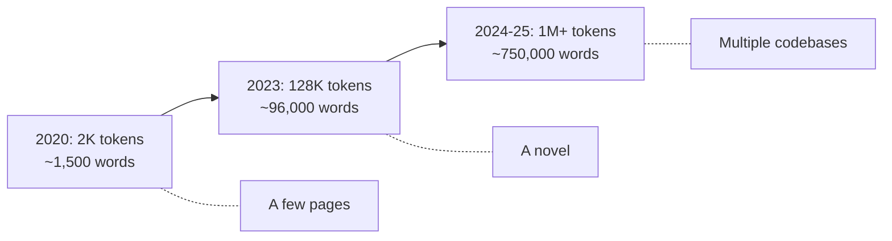
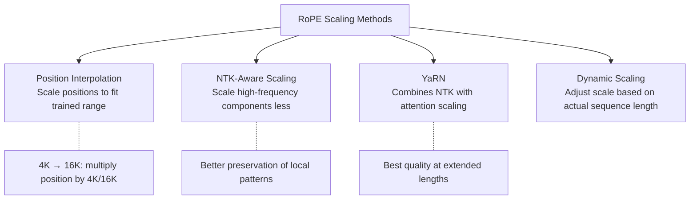
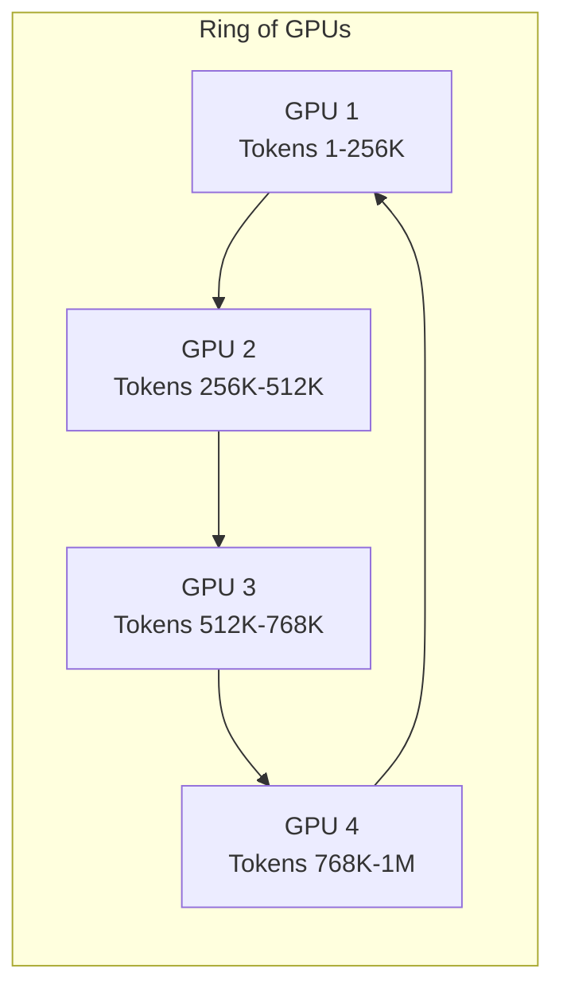
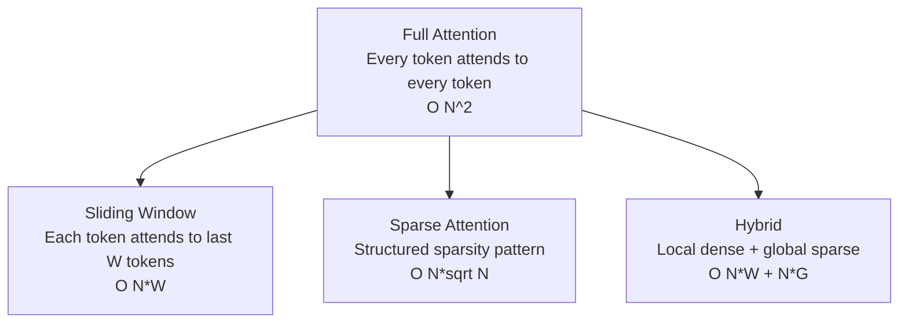
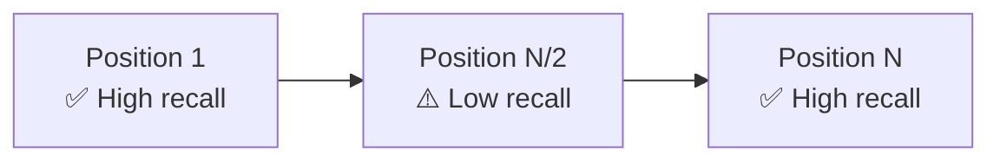
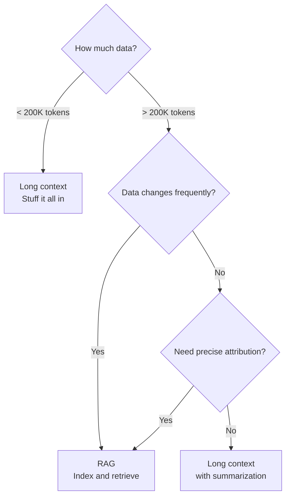

# Long Context and Context Windows

> **TL;DR:** Modern LLMs support context windows from 8K to 2M+ tokens, but bigger isn't always better. Extending context requires architectural innovations (RoPE scaling, ring attention, sparse attention), and effective use demands understanding the trade-offs between long context and retrieval-based approaches. The key challenge isn't fitting tokens into the window — it's ensuring the model actually *uses* them reliably.

## Table of Contents
- [Why This Matters](#why-this-matters)
- [Context Window Landscape](#context-window-landscape)
- [How Context Extension Works](#how-context-extension-works)
  - [Positional Encoding Challenges](#positional-encoding-challenges)
  - [RoPE Scaling](#rope-scaling)
  - [Ring Attention and Sequence Parallelism](#ring-attention-and-sequence-parallelism)
  - [Sparse and Sliding Window Attention](#sparse-and-sliding-window-attention)
- [The Reality of Long Context Performance](#the-reality-of-long-context-performance)
  - [Needle in a Haystack](#needle-in-a-haystack)
  - [Lost in the Middle](#lost-in-the-middle)
  - [Effective vs. Advertised Context Length](#effective-vs-advertised-context-length)
- [Long Context vs. RAG](#long-context-vs-rag)
- [Context Compression Techniques](#context-compression-techniques)
- [Practical Guidelines](#practical-guidelines)
- [Key Takeaways](#key-takeaways)
- [References](#references)

## Why This Matters

Every LLM has a finite context window — the maximum number of tokens it can process in a single forward pass. This window constrains everything: how much of a codebase an agent can reason about, how many documents a RAG system can inject, and how long a conversation can continue before the model loses track.

The race to extend context windows has been one of the defining trends in LLM development. But context length is not just a number on a spec sheet. How models are trained to use long context, where performance degrades, and when to use long context vs. retrieval are all critical decisions for application design.

## Context Window Landscape

Context windows have expanded dramatically across model generations:

| Model | Context Window | Year |
|---|---|---|
| GPT-3 | 2K tokens | 2020 |
| GPT-3.5 | 4K / 16K tokens | 2023 |
| GPT-4 | 8K / 128K tokens | 2023 |
| Claude 2 | 100K tokens | 2023 |
| Claude 3.5 Sonnet | 200K tokens | 2024 |
| Gemini 1.5 Pro | 1M / 2M tokens | 2024 |
| GPT-4.1 | 1M tokens | 2025 |
| Llama 3.1 | 128K tokens | 2024 |



To put this in perspective: 128K tokens is roughly a 300-page book. 1M tokens is roughly 10 novels, or the entire codebase of a mid-sized application.

## How Context Extension Works

Extending context windows is not as simple as changing a configuration parameter. Several architectural challenges must be solved.

### Positional Encoding Challenges

Transformers need positional information to understand token order. The original Transformer used absolute positional encodings — fixed vectors added to each token position, defined at training time up to a maximum length. The model cannot generalize to positions it has never seen during training.

This means a model trained with a 4K context window has no concept of position 4,001. Naively extending the context produces degraded or incoherent outputs because the model encounters positional values outside its training distribution.

### RoPE Scaling

**Rotary Position Embeddings (RoPE)** encode position by rotating the query and key vectors in attention, allowing relative position information to emerge naturally from the dot product. RoPE has become the standard positional encoding for modern LLMs (Llama, Mistral, Qwen, etc.).

RoPE enables several context extension strategies:



| Method | Approach | Quality at 4x Extension | Fine-tuning Required |
|---|---|---|---|
| **Position Interpolation** | Linearly compress all positions into trained range | Good | Short fine-tune recommended |
| **NTK-Aware** | Scale different frequency components at different rates | Better | Minimal or none |
| **YaRN** | NTK scaling + attention temperature adjustment | Best | Short fine-tune |
| **Dynamic NTK** | Apply scaling only when sequence exceeds trained length | Good | None |

**Key insight:** Position Interpolation compresses positions uniformly, which can blur nearby tokens. NTK-Aware scaling preserves high-frequency (local) position information while only stretching low-frequency (distant) information — matching how attention naturally operates at different distance scales.

### Ring Attention and Sequence Parallelism

Processing very long sequences runs into GPU memory limits — the KV cache alone for a 1M-token context can exceed 100 GB (see [Inference Optimization](inference-optimization.md)). **Ring Attention** distributes long sequences across multiple devices.



Each device holds a chunk of the sequence and computes attention over its local block. KV blocks are passed around the ring so each device eventually attends to all positions. This enables near-linear scaling of context length with the number of devices.

**Sequence parallelism** (DeepSpeed Ulysses, Megatron-SP) takes a complementary approach by partitioning the attention computation along the sequence dimension, distributing the workload without the ring communication pattern.

### Sparse and Sliding Window Attention

Full attention is O(N^2) in sequence length — at 1M tokens, the attention matrix would have 10^12 entries. Sparse attention reduces this by restricting which tokens attend to which.

| Pattern | How It Works | Used By |
|---|---|---|
| **Sliding window** | Each token attends to the last W tokens only | Mistral (W=4096) |
| **Dilated sliding window** | Sliding window with gaps, increasing receptive field layer by layer | Longformer |
| **Global + local** | Most tokens use local attention; designated tokens attend globally | BigBird, Longformer |
| **Blockwise** | Divide sequence into blocks; full attention within blocks, sparse between | Gemini |



Mistral's approach is instructive: each layer uses a sliding window of 4,096 tokens, but because information propagates through layers, the effective receptive field grows with depth. After L layers, a token can indirectly attend to L * W positions.

## The Reality of Long Context Performance

Having a large context window does not guarantee the model uses all of it effectively.

### Needle in a Haystack

The **Needle in a Haystack (NIAH)** test inserts a specific fact at various positions in a long document and checks if the model can retrieve it. Most modern models score near-perfectly on basic NIAH.

However, NIAH is a poor proxy for real-world performance because it tests **exact-match retrieval** of an obviously out-of-place fact. Real tasks require synthesis, reasoning, and filtering across the full context.

### Lost in the Middle

Liu et al. (2023) demonstrated that models show strong **positional bias**: information at the beginning and end of the context is recalled far better than information in the middle.



This is the **U-shaped attention curve** — performance is highest for information at the start (primacy bias) and end (recency bias) of the context, with a valley in the middle.

**Practical impact:** If your application stuffs 20 retrieved chunks into the prompt, chunks in the middle are least likely to be used by the model, regardless of their relevance. This is why strategies like placing the most relevant information at the beginning or end of the prompt matter (see [Context Engineering](../02-retrieval-augmented-generation/context-engineering.md)).

### Effective vs. Advertised Context Length

There is a meaningful gap between a model's **advertised** context length and its **effective** context length — the length at which it reliably performs tasks.

| Metric | What It Measures |
|---|---|
| **Advertised context** | Maximum tokens the model can accept |
| **Trained context** | Maximum length seen during pre-training |
| **Effective context** | Length at which the model maintains acceptable performance on real tasks |

Models extended via RoPE scaling (without continued pre-training on long sequences) often have advertised contexts much larger than their effective contexts. A model that "supports 128K tokens" may only reliably use 32K–64K for reasoning-heavy tasks.

**How to test effective context:** Use task-specific benchmarks, not NIAH. For RAG applications, measure answer accuracy as a function of context length with realistic queries. For code, test whether the model can reason across files at increasing total token counts.

## Long Context vs. RAG

A model with a 1M-token context could theoretically ingest an entire knowledge base — does that eliminate the need for RAG?



| Factor | Long Context | RAG |
|---|---|---|
| **Data volume** | Limited by context window (cost, latency, performance degradation) | Scales to millions of documents |
| **Latency** | Higher prefill time with more context | Retrieval adds latency but context is smaller |
| **Cost** | Proportional to total input tokens every call | Retrieval is cheap; LLM cost proportional to retrieved subset |
| **Accuracy** | Degrades with more context (context rot) | Depends on retrieval quality |
| **Freshness** | Data must be re-injected each call | Index can be updated incrementally |
| **Attribution** | Hard to trace which part of context was used | Retrieved chunks provide natural attribution |
| **Reasoning** | Can reason across full context holistically | Reasoning limited to retrieved subset |

### When Long Context Wins

- **Small corpora** (< 200K tokens): A complete codebase, a contract, a specification document. Stuffing the whole thing in the context avoids retrieval errors entirely.
- **Cross-document reasoning**: When the task requires connecting information from multiple parts of a large document (e.g., "compare chapters 3 and 17"), long context enables holistic reasoning that retrieval can't easily replicate.
- **Conversational memory**: Long context can hold entire conversation histories without external memory stores.
- **Structured data analysis**: Feeding a full CSV or JSON dataset for the model to analyze.

### When RAG Wins

- **Large knowledge bases** (millions of documents): Long context can't hold it all, and even if it could, performance would degrade catastrophically.
- **Dynamic data**: Information that changes frequently is better served by an index that can be updated incrementally rather than re-injecting everything each call.
- **Cost-sensitive applications**: Sending 1M tokens per request is expensive. Retrieving 5 relevant chunks and sending 2K tokens is 500x cheaper.
- **Auditability**: RAG provides natural attribution — you know which documents contributed to the answer.

### The Hybrid Approach

In practice, many production systems combine both:

1. **Retrieve** relevant documents using a RAG pipeline
2. **Stuff** more context than a short-context model could handle (10K–50K tokens of retrieved content)
3. **Leverage** the model's long context to reason across retrieved chunks without aggressive truncation

This approach uses long context to improve RAG quality rather than replace RAG entirely.

## Context Compression Techniques

When the available information exceeds even the largest context windows — or when cost and latency matter — context compression can help.

### Summarization-Based Compression

Use the LLM itself to summarize long documents before injecting them as context. This trades information loss for reduced context size.

```
Input: 50,000-token document
→ Summarize into 2,000 tokens
→ Use summary as context for the downstream task
```

**Best for:** Background knowledge where gist matters more than precise details.

### Selective Extraction

Extract only the sections relevant to the current query using a combination of retrieval and heuristic filtering.

```
Input: 100,000-token codebase
→ Identify relevant files via embedding search
→ Extract functions/classes referenced in the query
→ Context: 5,000 tokens of targeted code
```

### Prompt Caching

Several providers (Anthropic, OpenAI, Google) now support **prompt caching**, where repeated prefixes of prompts are cached server-side. This doesn't reduce the context size, but dramatically reduces cost and latency for repeated prefixes — such as a system prompt with a large embedded knowledge base.

| Provider | Mechanism | Cost Savings | Latency Savings |
|---|---|---|---|
| Anthropic | Automatic caching of repeated prefixes | 90% on cached tokens | Up to 85% faster prefill |
| OpenAI | Automatic prompt caching | 50% on cached tokens | Reduced latency |
| Google | Context caching API | Up to 75% on cached tokens | Reduced latency |

**When to use:** When the same large context is reused across many requests (e.g., a system prompt containing documentation, a codebase injected for a coding session).

See [Caching Strategies](../06-production-and-mlops/caching-strategies.md) for a broader treatment of caching in production.

### Context Distillation

Fine-tune a model on examples where the long context was provided during training, so the model internalizes the knowledge without needing it at inference time. This is effectively knowledge distillation applied to context (see [When to Fine-Tune](../08-fine-tuning-in-practice/when-to-fine-tune.md)).

## Practical Guidelines

### Choosing a Context Strategy

1. **Measure your data volume.** If it fits in < 100K tokens, long context is the simplest path. If not, you need RAG or compression.
2. **Profile your cost tolerance.** Long context is expensive per-request. For high-volume APIs, even 10K extra tokens per request adds up quickly.
3. **Test at realistic lengths.** Don't assume your model works well at its advertised context length. Benchmark with your actual tasks and data.
4. **Place critical information strategically.** Put the most important context at the beginning or end of the prompt, not the middle.
5. **Use prompt caching.** If your context has a stable prefix (system prompt, documentation, code), prompt caching provides significant cost and latency savings.
6. **Consider hybrid approaches.** RAG for recall, long context for reasoning across retrieved results.

### Context Length and Cost

Context length directly affects inference cost through two mechanisms:

| Mechanism | Effect |
|---|---|
| **Input token pricing** | Most providers charge per input token; longer context = higher cost per request |
| **KV cache memory** | Longer contexts require more GPU memory, reducing the number of concurrent requests a server can handle |
| **Prefill latency** | Time to first token scales with input length |

For latency-sensitive applications, keep context as short as possible while maintaining task performance. For throughput-sensitive applications, shorter contexts allow more concurrent requests on the same hardware.

## Key Takeaways

- Context windows have expanded from 2K to 2M+ tokens, but **effective** context length is often much shorter than advertised.
- Context extension relies on innovations in positional encodings (RoPE scaling), distributed attention (ring attention), and sparse attention patterns.
- Models show strong positional bias (**lost in the middle**) — information at the start and end of context is used more reliably.
- **Long context and RAG are complementary**, not competing approaches. Long context improves RAG by allowing more retrieved content; RAG keeps costs manageable and provides attribution.
- Context compression (summarization, selective extraction, prompt caching) reduces cost and latency while preserving most of the benefit of larger contexts.
- Always benchmark with your actual tasks at realistic context lengths — NIAH scores are necessary but not sufficient.

## References

1. Su, J. et al. (2021). "RoFormer: Enhanced Transformer with Rotary Position Embedding." [arXiv:2104.09864](https://arxiv.org/abs/2104.09864)
2. Chen, S. et al. (2023). "Extending Context Window of Large Language Models via Positional Interpolation." [arXiv:2306.15595](https://arxiv.org/abs/2306.15595)
3. Liu, N. F. et al. (2023). "Lost in the Middle: How Language Models Use Long Contexts." [arXiv:2307.03172](https://arxiv.org/abs/2307.03172)
4. Liu, H. et al. (2023). "Ring Attention with Blockwise Transformers for Near-Infinite Context." [arXiv:2310.01889](https://arxiv.org/abs/2310.01889)
5. Peng, B. et al. (2023). "YaRN: Efficient Context Window Extension of Large Language Models." [arXiv:2309.00071](https://arxiv.org/abs/2309.00071)
6. Gemini Team (2024). "Gemini 1.5: Unlocking Multimodal Understanding Across Millions of Tokens of Context." [arXiv:2403.05530](https://arxiv.org/abs/2403.05530)
7. Beltagy, I. et al. (2020). "Longformer: The Long-Document Transformer." [arXiv:2004.05150](https://arxiv.org/abs/2004.05150)
8. Zaheer, M. et al. (2020). "Big Bird: Transformers for Longer Sequences." [arXiv:2007.14062](https://arxiv.org/abs/2007.14062)
