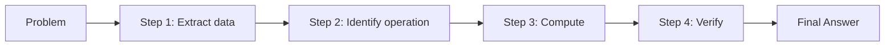
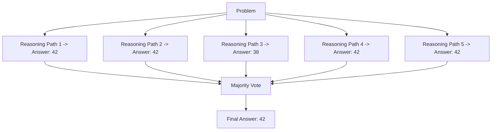
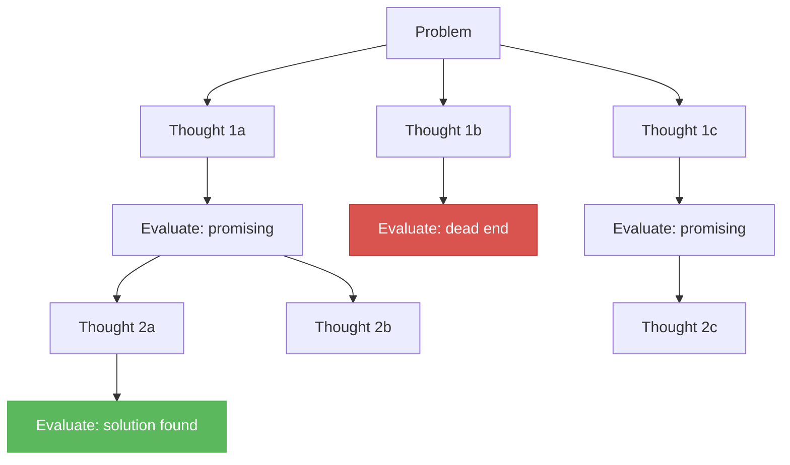
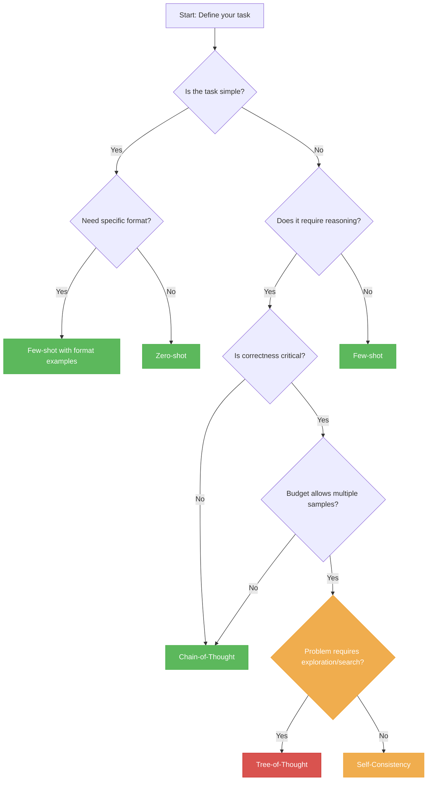

# Prompting Techniques

> **TL;DR:** Prompting is the primary interface for controlling LLM behavior. Techniques range from simple zero-shot instructions to advanced methods like Chain-of-Thought, Tree-of-Thought, and Self-Consistency that significantly improve reasoning performance. Choosing the right technique depends on task complexity, latency requirements, and cost constraints.

## Table of Contents

- [Why This Matters](#why-this-matters)
- [Foundational Prompting Strategies](#foundational-prompting-strategies)
  - [Zero-Shot Prompting](#zero-shot-prompting)
  - [Few-Shot Prompting](#few-shot-prompting)
  - [System Prompting](#system-prompting)
- [Advanced Reasoning Techniques](#advanced-reasoning-techniques)
  - [Chain-of-Thought (CoT)](#chain-of-thought-cot)
  - [Zero-Shot CoT](#zero-shot-cot)
  - [Self-Consistency](#self-consistency)
  - [Tree-of-Thought (ToT)](#tree-of-thought-tot)
- [Structured Output Techniques](#structured-output-techniques)
- [Technique Comparison](#technique-comparison)
- [Decision Framework](#decision-framework)
- [Common Pitfalls](#common-pitfalls)
- [Key Takeaways](#key-takeaways)
- [References](#references)

---

## Why This Matters

Prompting is the primary way developers and users communicate intent to LLMs. Unlike traditional programming where you write explicit logic, prompting requires you to describe what you want in natural language -- and the way you describe it dramatically affects the quality of the output.

Research has shown that simple prompt modifications can swing accuracy on reasoning benchmarks by 20-40 percentage points. Understanding prompting techniques is not optional -- it is the most cost-effective lever for improving LLM output quality before reaching for fine-tuning or more expensive interventions.

## Foundational Prompting Strategies

### Zero-Shot Prompting

Zero-shot prompting provides the model with only an instruction and no examples. It relies entirely on the model's pre-trained knowledge and instruction-following ability.

```
Classify the following review as positive, negative, or neutral.

Review: "The battery life is incredible but the screen is too dim."

Classification:
```

**When to use:** Simple tasks where the model's training data likely covers the format and domain. Works well for classification, summarization, translation, and straightforward generation tasks.

**Limitations:** Performance degrades on tasks requiring specific output formats, domain-specific reasoning, or ambiguous instructions.

### Few-Shot Prompting

Few-shot prompting includes examples (demonstrations) before the actual task. The model uses in-context learning to infer the pattern from the examples.

```
Classify the following reviews:

Review: "Absolutely love this product!"
Classification: positive

Review: "Broke after two days. Waste of money."
Classification: negative

Review: "The battery life is incredible but the screen is too dim."
Classification:
```

**Key considerations for example selection:**

- **Diversity**: cover edge cases and boundary conditions.
- **Relevance**: examples should resemble the target task.
- **Order**: models can be sensitive to example ordering; placing harder examples last often helps.
- **Count**: 3-5 examples typically suffice; more examples consume context window tokens.

### System Prompting

System prompts (supported in chat-format APIs) establish persistent behavioral guidelines that frame all subsequent interactions. They set the model's persona, constraints, and output format expectations.

```
System: You are a senior software engineer conducting code reviews.
        Be concise and actionable. Focus on bugs, security issues,
        and performance problems. Ignore style preferences.
        Format your response as a numbered list.

User: Review this function: [code]
```

**Effective system prompt components:**

1. **Role definition** -- who the model should act as.
2. **Behavioral constraints** -- what to do and what to avoid.
3. **Output format** -- how to structure the response.
4. **Domain context** -- background information the model needs.

## Advanced Reasoning Techniques

### Chain-of-Thought (CoT)

Chain-of-Thought prompting (Wei et al., 2022) instructs the model to produce intermediate reasoning steps before arriving at a final answer. This dramatically improves performance on arithmetic, commonsense reasoning, and symbolic manipulation tasks.

```
Q: Roger has 5 tennis balls. He buys 2 more cans of tennis balls.
   Each can has 3 tennis balls. How many tennis balls does he have now?

A: Roger started with 5 balls. He bought 2 cans of 3 balls each,
   so he bought 2 * 3 = 6 balls. 5 + 6 = 11.
   The answer is 11.
```

**Why it works:** CoT decomposes complex problems into sequential steps, reducing the chance of errors that occur when the model attempts to "jump" directly to an answer. It is especially effective for problems requiring multi-step reasoning.



**Key findings from the original paper:**
- CoT provides the largest gains on the most difficult problems.
- It is an emergent ability -- small models (below ~10B parameters) do not benefit from CoT.
- Few-shot CoT (providing reasoning examples) outperforms zero-shot CoT.

### Zero-Shot CoT

A remarkably simple variant: appending "Let's think step by step" to the prompt triggers chain-of-thought reasoning without any examples (Kojima et al., 2022).

```
Q: If a store has 4 shelves and each shelf holds 8 books,
   but 5 books are checked out, how many books are in the store?

A: Let's think step by step.
```

This works because instruction-tuned models have been trained on reasoning traces and can activate this behavior with a simple trigger phrase.

### Self-Consistency

Self-Consistency (Wang et al., 2022) improves upon CoT by sampling multiple reasoning paths and selecting the most frequent answer through majority voting.



**How it works:**

1. Prompt the model with a CoT prompt.
2. Sample multiple completions (typically 5-20) with temperature > 0.
3. Extract the final answer from each completion.
4. Return the answer that appears most frequently.

**Trade-offs:** Self-Consistency significantly improves accuracy (5-15% on reasoning benchmarks) but multiplies cost and latency by the number of samples. It is best reserved for high-stakes reasoning tasks where correctness matters more than speed.

### Tree-of-Thought (ToT)

Tree-of-Thought (Yao et al., 2023) generalizes CoT from a linear chain to a tree structure, allowing the model to explore multiple reasoning branches, evaluate them, and backtrack from dead ends.



**How it works:**

1. **Thought decomposition**: break the problem into sequential thought steps.
2. **Thought generation**: at each step, generate multiple candidate thoughts.
3. **Evaluation**: use the model (or a heuristic) to evaluate each thought's promise.
4. **Search**: use BFS or DFS to explore the tree, pruning unpromising branches.

**When to use:** Problems requiring exploration, planning, or search -- such as puzzles, creative writing with constraints, or multi-step planning tasks. ToT is too expensive for routine tasks.

## Structured Output Techniques

Structured outputs (JSON, XML, YAML) are critical for integrating LLMs into software systems. Several approaches exist:

| Approach | Description | Reliability |
|---|---|---|
| **Prompt instruction** | Ask the model to output JSON in the prompt | Moderate -- may produce malformed output |
| **Few-shot examples** | Provide JSON examples in the prompt | Higher -- model follows demonstrated pattern |
| **JSON mode** | API-level enforcement (e.g., OpenAI `response_format`) | High -- guarantees valid JSON structure |
| **Function calling** | Define function schemas; model produces structured arguments | High -- schema-validated |
| **Constrained decoding** | Grammar-based token filtering at generation time | Highest -- guarantees schema conformance |

**Best practice:** When reliability matters, use API-level enforcement (JSON mode, function calling) rather than relying solely on prompt instructions. Prompt-only approaches will fail some percentage of the time, and defensive parsing code is required.

## Technique Comparison

| Technique | Accuracy Gain | Cost Multiplier | Latency Impact | Best For |
|---|---|---|---|---|
| Zero-shot | Baseline | 1x | None | Simple, well-defined tasks |
| Few-shot | +5-15% | 1.2-1.5x (context) | Minimal | Format-sensitive tasks, classification |
| Chain-of-Thought | +10-30% | 1.5-2x (output) | Moderate | Arithmetic, logic, multi-step reasoning |
| Zero-shot CoT | +5-20% | 1.3-1.8x (output) | Moderate | Quick reasoning improvement, no examples |
| Self-Consistency | +5-15% over CoT | 5-20x | High | High-stakes reasoning, math |
| Tree-of-Thought | +10-30% over CoT | 10-50x | Very high | Planning, puzzles, creative search |

## Decision Framework

Use this flowchart to select the appropriate prompting technique:



## Common Pitfalls

1. **Over-engineering prompts**: Start simple. Add complexity only when simpler techniques fail.
2. **Ignoring example quality**: Few-shot examples with errors teach the model to make errors.
3. **Excessive instructions**: Long, contradictory system prompts confuse the model. Be concise.
4. **Prompt injection blindness**: If your prompt includes user-supplied text, sanitize or delimit it clearly to prevent injection attacks.
5. **Assuming determinism**: LLM outputs vary between runs (unless temperature=0, and even then, across API versions). Build systems that handle variation.
6. **Neglecting evaluation**: "It looks right" is not evaluation. Measure performance on representative test sets before and after prompt changes.

## Key Takeaways

- Zero-shot and few-shot are your starting points; only escalate to advanced techniques when simpler ones fail.
- Chain-of-Thought is the single most impactful technique for reasoning tasks, providing 10-30% accuracy gains at moderate cost.
- Self-Consistency trades cost for reliability by sampling multiple reasoning paths and taking a majority vote.
- Tree-of-Thought is powerful but expensive; reserve it for problems that genuinely require search and exploration.
- Structured output techniques (JSON mode, function calling) should be used over prompt-only approaches when integrating LLMs into software.
- Always evaluate prompt changes quantitatively -- intuition about prompt quality is unreliable.
- Prompting is complementary to fine-tuning, not a replacement. When prompting hits its ceiling, fine-tuning is the next step.

## References

- Wei, J. et al. (2022). "Chain-of-Thought Prompting Elicits Reasoning in Large Language Models." [arXiv:2201.11903](https://arxiv.org/abs/2201.11903)
- Kojima, T. et al. (2022). "Large Language Models are Zero-Shot Reasoners." [arXiv:2205.11916](https://arxiv.org/abs/2205.11916)
- Wang, X. et al. (2022). "Self-Consistency Improves Chain of Thought Reasoning in Language Models." [arXiv:2203.11171](https://arxiv.org/abs/2203.11171)
- Yao, S. et al. (2023). "Tree of Thoughts: Deliberate Problem Solving with Large Language Models." [arXiv:2305.10601](https://arxiv.org/abs/2305.10601)
- Brown, T. et al. (2020). "Language Models are Few-Shot Learners." [arXiv:2005.14165](https://arxiv.org/abs/2005.14165)
- OpenAI (2024). "Structured Outputs." [platform.openai.com/docs/guides/structured-outputs](https://platform.openai.com/docs/guides/structured-outputs)
- Schulhoff, S. et al. (2024). "The Prompt Report: A Systematic Survey of Prompting Techniques." [arXiv:2406.06608](https://arxiv.org/abs/2406.06608)
