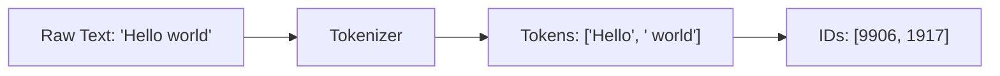

# Tokenization

> **TL;DR:** Tokenization is the process of converting raw text into numerical tokens that LLMs can process. The choice of tokenizer (BPE, WordPiece, SentencePiece) directly impacts vocabulary size, multilingual performance, cost, and how well a model handles edge cases like code and URLs. Understanding tokenization is essential for prompt engineering, cost estimation, and debugging unexpected model behavior.

## Table of Contents

- [Why This Matters](#why-this-matters)
- [What Is Tokenization?](#what-is-tokenization)
- [Tokenization Algorithms](#tokenization-algorithms)
  - [Byte Pair Encoding (BPE)](#byte-pair-encoding-bpe)
  - [WordPiece](#wordpiece)
  - [SentencePiece](#sentencepiece)
  - [tiktoken](#tiktoken)
- [Tokenizer Comparison](#tokenizer-comparison)
- [How Tokenizer Choice Affects Model Behavior](#how-tokenizer-choice-affects-model-behavior)
- [Practical Considerations](#practical-considerations)
  - [Token Counting and Cost Estimation](#token-counting-and-cost-estimation)
  - [Edge Cases](#edge-cases)
- [Key Takeaways](#key-takeaways)
- [References](#references)

---

## Why This Matters

Tokenization is the invisible first step in every LLM interaction. Before a model sees any text, a tokenizer breaks it into discrete units -- tokens -- and maps them to integer IDs. This step determines:

- **How much a prompt costs** (API pricing is per-token).
- **Whether the model can "see" a word** or must reconstruct it from subword fragments.
- **How well the model handles non-English languages**, code, and structured data.
- **The effective context window** (a 128K token limit means different word counts depending on the tokenizer).

Getting tokenization wrong leads to silent failures: truncated prompts, inflated costs, and degraded multilingual performance.

## What Is Tokenization?

At its core, tokenization maps a string of text to a sequence of integers:



A tokenizer consists of two components:

1. **A vocabulary** -- a fixed mapping from token strings to integer IDs, built during training.
2. **A merging/splitting algorithm** -- the rules for breaking unseen text into vocabulary entries.

The vocabulary is learned from a training corpus and then frozen. At inference time, the tokenizer applies its learned rules deterministically.

## Tokenization Algorithms

### Byte Pair Encoding (BPE)

BPE is the most widely used algorithm in modern LLMs (GPT-2, GPT-3, GPT-4, LLaMA 3). It works bottom-up, starting from individual characters and merging frequent pairs.

**Step-by-step process:**

1. Start with a base vocabulary of individual characters (or bytes).
2. Count all adjacent character pairs in the training corpus.
3. Merge the most frequent pair into a new token.
4. Repeat steps 2-3 until the desired vocabulary size is reached.

**Example -- learning merges:**

```
Corpus:  "low low low low low newer newer wider wider wider"

Step 0:  Characters: l, o, w, n, e, r, i, d, ...
Step 1:  Most frequent pair: (l, o) -> merge into "lo"
Step 2:  Most frequent pair: (lo, w) -> merge into "low"
Step 3:  Most frequent pair: (e, r) -> merge into "er"
Step 4:  Most frequent pair: (n, ew) -> merge into "new"
...
```

At encoding time, BPE applies the learned merges in priority order to segment any new text. Words seen frequently during training become single tokens; rare words decompose into subword pieces.

### WordPiece

WordPiece is used by BERT and its derivatives. It is similar to BPE but uses a different selection criterion: instead of raw frequency, it selects the merge that maximizes the likelihood of the training data under a unigram language model.

Key differences from BPE:

- Subword tokens (except the first in a word) are prefixed with `##` to indicate continuation.
- Merge selection is likelihood-based, not frequency-based.
- Tends to produce slightly different segmentations than BPE for the same vocabulary size.

**Example:**

```
Input:    "unaffable"
WordPiece: ["un", "##aff", "##able"]
```

### SentencePiece

SentencePiece (Kudo and Richardson, 2018) is not a single algorithm but a framework that treats the input as a raw byte stream, removing the need for language-specific pre-tokenization (like whitespace splitting). It supports both BPE and Unigram models internally.

**Used by:** LLaMA, LLaMA 2, T5, mT5, ALBERT, XLNet.

Key properties:

- **Language-agnostic**: operates on raw Unicode, so it works identically for English, Chinese, Arabic, and code.
- **Reversible**: the tokenization is lossless -- you can always reconstruct the original string.
- **Whitespace as a token**: spaces are treated as regular characters (often represented as `_`), not as delimiters.
- **Unigram mode**: instead of bottom-up merging, it starts with a large vocabulary and prunes tokens that contribute least to corpus likelihood.

### tiktoken

tiktoken is OpenAI's open-source tokenizer library, used by GPT-3.5, GPT-4, and subsequent models. It implements BPE at the byte level with performance optimizations.

Key properties:

- **Byte-level BPE**: operates on raw bytes, ensuring every possible input can be encoded (no "unknown token" problem).
- **Highly optimized**: written in Rust with Python bindings, orders of magnitude faster than reference BPE implementations.
- **Model-specific encodings**: different models use different trained vocabularies (e.g., `cl100k_base` for GPT-4, `o200k_base` for GPT-4o).

## Tokenizer Comparison

| Feature | BPE (GPT) | WordPiece (BERT) | SentencePiece (LLaMA/T5) | tiktoken (GPT-4) |
|---|---|---|---|---|
| **Base unit** | Bytes | Characters | Bytes/Unicode | Bytes |
| **Merge criterion** | Frequency | Likelihood | Frequency or Unigram | Frequency |
| **Pre-tokenization** | Regex-based | Whitespace + punctuation | None (raw stream) | Regex-based |
| **Unknown tokens** | None (byte fallback) | `[UNK]` token | None (byte fallback) | None (byte fallback) |
| **Typical vocab size** | 50K-100K | 30K | 32K-128K | 100K-200K |
| **Multilingual support** | Moderate | Limited | Strong | Moderate-Strong |
| **Subword indicator** | None | `##` prefix | `_` for space | None |
| **Speed** | Moderate | Moderate | Moderate | Very fast |
| **Notable models** | GPT-2, GPT-3 | BERT, DistilBERT | LLaMA, T5, mT5 | GPT-4, GPT-4o |

## How Tokenizer Choice Affects Model Behavior

### Vocabulary Size

Larger vocabularies mean more words are represented as single tokens, which improves efficiency and reduces sequence length. However, larger vocabularies increase the embedding matrix size and memory footprint.

| Vocabulary Size | Trade-off |
|---|---|
| Small (8K-32K) | More subword splits, longer sequences, smaller model |
| Medium (32K-100K) | Good balance for English-centric models |
| Large (100K-200K) | Better multilingual coverage, fewer splits, larger embedding layer |

### Token-to-Word Ratio

The number of tokens per word varies dramatically by language and content type:

| Content Type | Approx. Tokens/Word (GPT-4) |
|---|---|
| English prose | ~1.3 |
| German text | ~1.8 |
| Chinese text | ~2.5 per character |
| Python code | ~2.5 |
| JSON/structured data | ~3.0 |
| URLs | ~4.0+ |

### Multilingual Impact

Models with byte-level tokenizers (like SentencePiece) handle non-Latin scripts more gracefully. A tokenizer trained primarily on English data will fragment Chinese, Arabic, or Hindi text into many small byte-level tokens, leading to:

- Higher cost per equivalent content.
- Shorter effective context windows.
- Potentially degraded generation quality.

## Practical Considerations

### Token Counting and Cost Estimation

For API-based models, every token counts -- literally. A rough estimator for English text:

```
1 token ~ 4 characters ~ 0.75 words
```

For precise counting, use the tokenizer directly:

```python
import tiktoken

enc = tiktoken.encoding_for_model("gpt-4o")
text = "Tokenization is the unsung hero of NLP."
tokens = enc.encode(text)
print(f"Token count: {len(tokens)}")  # Exact count
print(f"Tokens: {[enc.decode([t]) for t in tokens]}")
```

**Cost estimation formula:**

```
Cost = (input_tokens * input_price_per_token) + (output_tokens * output_price_per_token)
```

### Edge Cases

Tokenizers frequently produce surprising results with certain inputs:

| Input Type | Issue | Example |
|---|---|---|
| Numbers | Each digit may be a separate token | `123456` -> `['123', '456']` or `['1', '23', '45', '6']` |
| URLs | Highly fragmented | `https://example.com/path` -> many tokens |
| Code | Indentation consumes tokens | 4 spaces vs 1 tab may differ in token count |
| Repeated characters | Unpredictable splits | `aaaaaaa` -> varies by tokenizer |
| Trailing whitespace | Invisible but counted | `"hello "` != `"hello"` in token count |
| Special characters | May become multi-token | Emojis, math symbols, rare Unicode |

**Best practices for token-efficient prompts:**

- Prefer concise phrasing over verbose instructions.
- Use structured formats (JSON, YAML) judiciously -- they are token-expensive.
- Be aware that few-shot examples consume tokens from your context window.
- Strip unnecessary whitespace and formatting.

## Key Takeaways

- Tokenization is the first and often overlooked step in the LLM pipeline; it determines what the model can "see."
- BPE is the dominant algorithm, used (with variations) by GPT, LLaMA 3, and most modern models.
- SentencePiece provides the best multilingual support by treating input as a raw byte stream without language-specific pre-processing.
- Vocabulary size is a trade-off: larger vocabularies improve efficiency but increase model size.
- Token count directly determines API cost, effective context length, and latency.
- Edge cases (code, URLs, numbers, non-English text) can produce unexpectedly high token counts -- always verify with the actual tokenizer.
- The token-to-word ratio varies significantly by language and content type, making "word count" an unreliable proxy for "token count."

## References

- Sennrich, R., Haddow, B., & Birch, A. (2016). "Neural Machine Translation of Rare Words with Subword Units." [arXiv:1508.07909](https://arxiv.org/abs/1508.07909)
- Kudo, T. & Richardson, J. (2018). "SentencePiece: A simple and language independent subword tokenizer and detokenizer for Neural Text Processing." [arXiv:1808.06226](https://arxiv.org/abs/1808.06226)
- Kudo, T. (2018). "Subword Regularization: Improving Neural Network Translation Models with Multiple Subword Candidates." [arXiv:1804.10959](https://arxiv.org/abs/1804.10959)
- OpenAI tiktoken library: [github.com/openai/tiktoken](https://github.com/openai/tiktoken)
- Devlin, J. et al. (2019). "BERT: Pre-training of Deep Bidirectional Transformers for Language Understanding." [arXiv:1810.04805](https://arxiv.org/abs/1810.04805) (WordPiece details)
- Petrov, A. et al. (2024). "Language Model Tokenizers Introduce Unfairness Between Languages." [arXiv:2305.15425](https://arxiv.org/abs/2305.15425)
