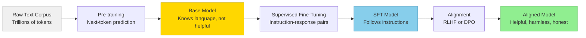
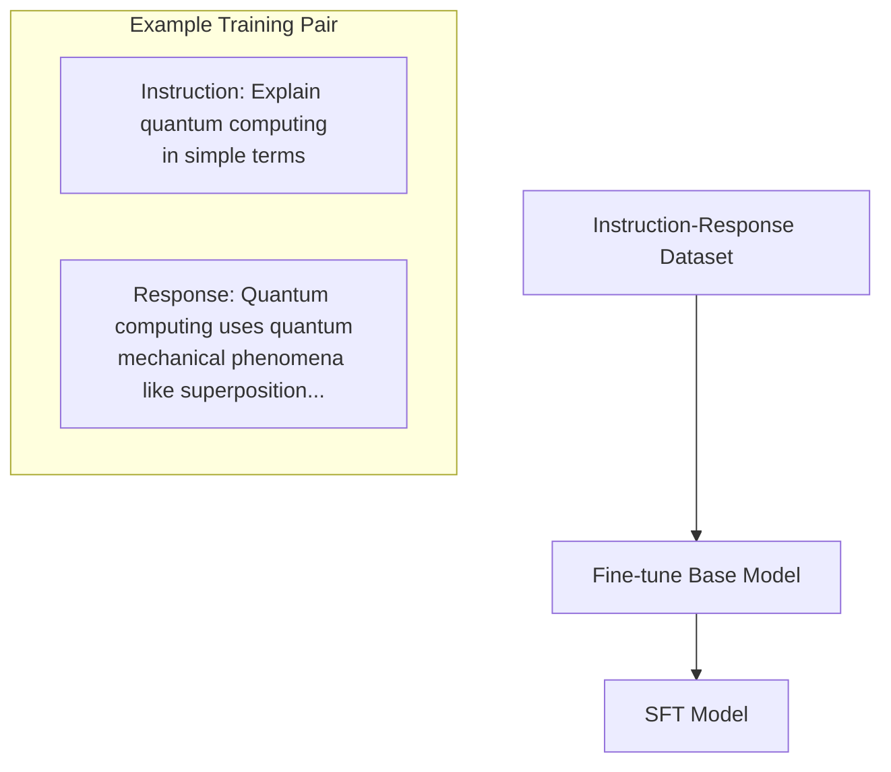
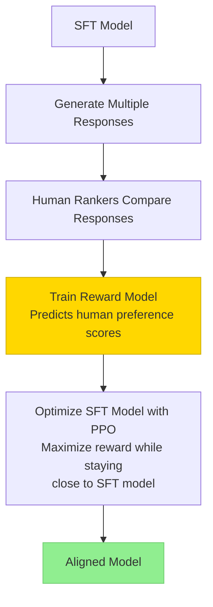

# Training & Fine-Tuning

> **TL;DR:** Building a useful LLM requires three stages: pre-training on massive text to learn language, supervised fine-tuning (SFT) to learn to follow instructions, and alignment (RLHF or DPO) to match human preferences. Each stage has distinct data requirements, costs, and failure modes. Understanding this pipeline is essential for deciding whether to fine-tune, when to use prompting instead, and how to evaluate model quality.

## Table of Contents
- [Why This Matters](#why-this-matters)
- [The Three-Stage Pipeline](#the-three-stage-pipeline)
- [Stage 1: Pre-training](#stage-1-pre-training)
- [Stage 2: Supervised Fine-Tuning](#stage-2-supervised-fine-tuning)
- [Stage 3: Alignment](#stage-3-alignment)
- [Practical Considerations](#practical-considerations)
- [Key Takeaways](#key-takeaways)
- [References](#references)

## Why This Matters

When you evaluate an LLM for your application, you're evaluating the result of a multi-stage training pipeline. Understanding each stage helps you:
- **Diagnose problems** — Is the model lacking knowledge (pre-training issue) or behaving poorly (alignment issue)?
- **Choose your approach** — Should you fine-tune, use RAG, or just prompt better?
- **Evaluate tradeoffs** — What does fine-tuning cost, and when is it worth it?

## The Three-Stage Pipeline



Each stage transforms the model significantly:

| Stage | Input | Output | Scale |
|---|---|---|---|
| Pre-training | Raw text | Base model | Trillions of tokens, weeks–months of GPU time |
| SFT | Instruction-response pairs | Instruction-following model | Thousands–millions of examples |
| Alignment | Human preferences | Aligned model | Tens of thousands of comparisons |

## Stage 1: Pre-training

Pre-training teaches the model the structure of language, factual knowledge, and reasoning patterns by exposing it to vast amounts of text.

### Next-Token Prediction (Autoregressive)

The dominant pre-training objective for modern LLMs. Given a sequence of tokens, predict the next one:

```
Input:  "The capital of France is"
Target: "Paris"
```

The model learns to minimize the **cross-entropy loss** between its predicted probability distribution and the actual next token. Despite its simplicity, this objective is remarkably powerful — predicting the next word in diverse text requires understanding grammar, facts, reasoning, and style.

### Masked Language Modeling (MLM)

Used by encoder models like **BERT**. Randomly mask 15% of tokens and predict them:

```
Input:  "The capital of [MASK] is Paris"
Target: "France"
```

MLM creates bidirectional representations (the model sees both left and right context), making it excellent for understanding tasks (classification, NER) but not for generation.

### Pre-training Data

The quality and composition of pre-training data profoundly affects the model:

| Data Source | What It Provides |
|---|---|
| Web crawls (Common Crawl) | Breadth of knowledge, language diversity |
| Books | Long-form reasoning, narrative structure |
| Code (GitHub) | Logical reasoning, structured problem-solving |
| Scientific papers (ArXiv) | Technical knowledge, precise language |
| Wikipedia | Factual knowledge, structured information |

**Key insight:** Data quality matters more than quantity. Deduplication, filtering toxic/low-quality content, and balancing domains all significantly impact model quality. LLaMA showed that a smaller model trained on more curated data outperforms a larger model on less curated data.

## Stage 2: Supervised Fine-Tuning

After pre-training, a base model can complete text but isn't helpful in a conversational sense. Ask it a question and it might continue writing the question, or generate a random paragraph. **SFT** teaches the model to follow instructions by training on (instruction, response) pairs.

### How SFT Works



The model is fine-tuned using the same next-token prediction objective, but now on curated conversation-style data. The loss is typically computed only on the response tokens (not the instruction), so the model learns to generate good responses rather than memorize questions.

### SFT Data Sources

- **Human-written demonstrations** — Highest quality but expensive. OpenAI hired contractors to write thousands of instruction-response pairs for InstructGPT.
- **Self-instruct / Synthetic** — Use a strong model (e.g., GPT-4) to generate training data for a weaker model. Alpaca and Vicuna used this approach. Effective but can propagate biases.
- **Distillation** — Train a smaller model to mimic a larger model's outputs. Useful for deployment efficiency.

### What SFT Does and Doesn't Do

| SFT Can | SFT Can't |
|---|---|
| Teach the model to follow a conversation format | Add new knowledge the base model doesn't have |
| Improve instruction following | Reliably prevent harmful outputs |
| Adapt style and tone | Override deeply learned patterns |
| Teach domain-specific formatting | Guarantee factual accuracy |

## Stage 3: Alignment

SFT models follow instructions but may still produce harmful, biased, or unhelpful outputs. **Alignment** training optimizes the model to match human preferences — producing responses that are helpful, harmless, and honest.

### RLHF (Reinforcement Learning from Human Feedback)

RLHF, used by OpenAI for InstructGPT and ChatGPT, is a three-step process:



1. **Collect comparisons** — For each prompt, generate multiple responses and have humans rank them
2. **Train a reward model** — A separate model that predicts the human-assigned quality score for any (prompt, response) pair
3. **Optimize with PPO** — Use the reward model as the objective function and optimize the LLM using Proximal Policy Optimization, with a KL penalty to prevent the model from diverging too far from the SFT baseline

**Pros:** Produces highly aligned models. Well-validated approach.
**Cons:** Complex pipeline (three models: SFT, reward, policy). Reward model can be exploited (reward hacking). Expensive human annotation.

### DPO (Direct Preference Optimization)

DPO (Rafailov et al., 2023) simplifies RLHF by eliminating the reward model entirely. Instead of training a separate reward model and then optimizing against it, DPO directly optimizes the language model on preference pairs.

Given a preferred response y_w and a dispreferred response y_l for a prompt x, DPO optimizes:

```
L_DPO = -log σ(β · (log π(y_w|x)/π_ref(y_w|x) - log π(y_l|x)/π_ref(y_l|x)))
```

In plain terms: increase the probability of preferred responses relative to dispreferred ones, regularized against the reference (SFT) model.

**Pros:** Simpler pipeline (no reward model, no RL). More stable training. Less hyperparameter tuning.
**Cons:** May underperform RLHF on some tasks. Less flexibility than having a learned reward model. Sensitive to data quality.

### Other Alignment Approaches

| Method | Key Idea |
|---|---|
| **RLAIF** | Use AI (instead of humans) to generate preference labels |
| **Constitutional AI (CAI)** | Model critiques its own outputs against a set of principles |
| **KTO** | Optimize using binary (good/bad) signals instead of pairwise comparisons |
| **IPO** | Addresses DPO's overfitting issues with a different loss function |

## Practical Considerations

### When to Fine-Tune vs. Prompt

| Approach | When to Use |
|---|---|
| **Prompting / Few-shot** | Model has the knowledge, just needs guidance. Start here. |
| **RAG** | Model needs external/current knowledge. See the [RAG section](../02-retrieval-augmented-generation/README.md). |
| **SFT** | Need specific formatting, style, or behavior patterns. Have high-quality training data. |
| **Full Fine-Tuning** | Need deep domain adaptation. Have significant compute and data. |

### Data Quality > Quantity

- **1,000 high-quality examples** often outperform 100,000 noisy ones for SFT
- Deduplication, filtering, and careful curation matter enormously
- LIMA (Zhou et al., 2023) showed that just 1,000 carefully curated examples produce competitive SFT results

### Compute Costs

| Stage | Relative Cost | Typical Duration |
|---|---|---|
| Pre-training a 70B model | $$$$$  | Weeks to months |
| SFT a 70B model | $$ | Hours to days |
| LoRA/QLoRA fine-tuning | $ | Hours |
| RLHF alignment | $$$ | Days |
| DPO alignment | $$ | Hours to days |

**Parameter-efficient fine-tuning (PEFT)** methods like LoRA and QLoRA make fine-tuning accessible by only updating a small fraction of parameters, reducing memory and compute requirements by 10–100x.

## Key Takeaways

- Modern LLMs go through three stages: **pre-training** (language and knowledge), **SFT** (instruction following), and **alignment** (matching human preferences)
- **Pre-training** uses next-token prediction on trillions of tokens — simple but powerful
- **SFT** teaches the model conversational behavior using curated instruction-response pairs
- **RLHF** optimizes for human preferences using a reward model and RL, producing well-aligned but complex-to-train models
- **DPO** simplifies alignment by directly optimizing on preference pairs without a reward model
- **Data quality** matters more than quantity at every stage
- Start with **prompting and RAG** before reaching for fine-tuning — it's cheaper, faster, and often sufficient

## References

1. Zhao et al., "A Survey of Large Language Models," 2023. [arXiv:2303.18223](https://arxiv.org/abs/2303.18223)
2. Ouyang et al., "Training Language Models to Follow Instructions with Human Feedback" (InstructGPT), 2022. [arXiv:2203.02155](https://arxiv.org/abs/2203.02155)
3. Rafailov et al., "Direct Preference Optimization: Your Language Model Is Secretly a Reward Model," 2023. [arXiv:2305.18290](https://arxiv.org/abs/2305.18290)
4. Hu et al., "LoRA: Low-Rank Adaptation of Large Language Models," 2021. [arXiv:2106.09685](https://arxiv.org/abs/2106.09685)
5. Zhou et al., "LIMA: Less Is More for Alignment," 2023. [arXiv:2305.11206](https://arxiv.org/abs/2305.11206)
6. Bai et al., "Constitutional AI: Harmlessness from AI Feedback," 2022. [arXiv:2212.08073](https://arxiv.org/abs/2212.08073)
