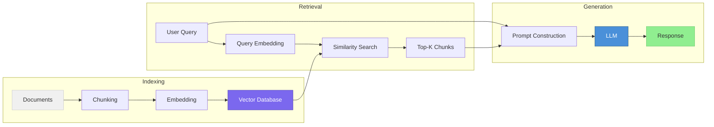

# Retrieval-Augmented Generation (RAG)

> Grounding LLM outputs in external knowledge — how to retrieve the right context and present it effectively.

## What This Section Covers

Retrieval-Augmented Generation (RAG) is the most common pattern for building LLM applications that need access to external or up-to-date knowledge. Instead of relying solely on what the model memorized during training, RAG retrieves relevant documents and includes them in the prompt.

This section covers the full RAG pipeline — from how you split documents, to how you store and search them, to how the model processes the retrieved context.

## The RAG Pipeline

Each stage of this pipeline introduces decisions that affect the final answer quality:

| Stage | Key Question | Covered In |
|---|---|---|
| **Chunking** | How do you split documents for optimal retrieval? | [Chunking Strategies](chunking-strategies.md) |
| **Context Quality** | How does retrieved context degrade and how do you prevent it? | [Context Engineering](context-engineering.md) |
| **Storage & Search** | Which vector database should you use? | [Vector Databases](vector-databases.md) |

## Pages in This Section

| Page | What You'll Learn |
|---|---|
| [Chunking Strategies](chunking-strategies.md) | Evaluation of 6 chunking methods, optimal chunk sizes, and why defaults are often wrong |
| [Context Engineering](context-engineering.md) | Why LLM performance degrades with more context, and strategies to fight it |
| [Vector Databases](vector-databases.md) | How vector search works, and when to use Elasticsearch, Qdrant, or Milvus |

## Suggested Reading Order

1. Start with **Chunking Strategies** — the first decision in any RAG pipeline
2. Then read **Context Engineering** — understanding how context quality affects generation
3. Finally, **Vector Databases** — choosing the right storage and retrieval infrastructure
