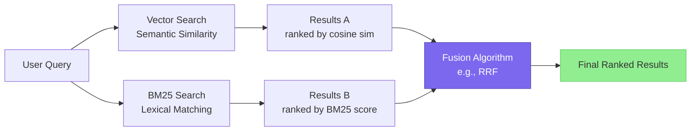
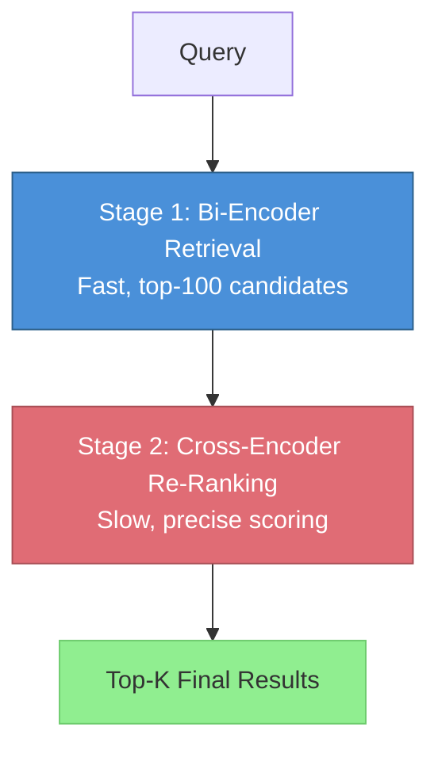
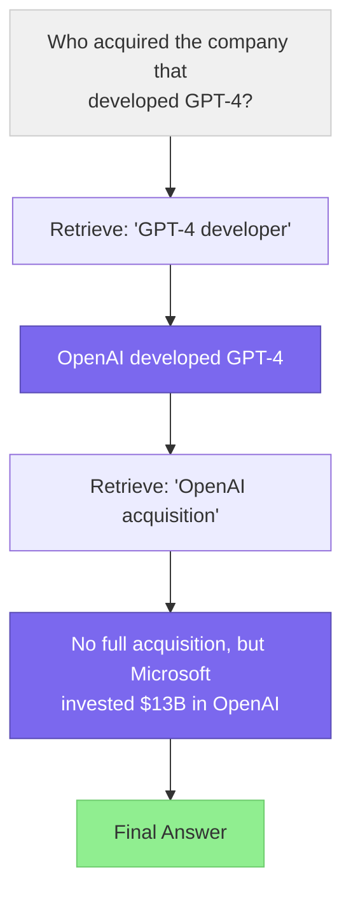
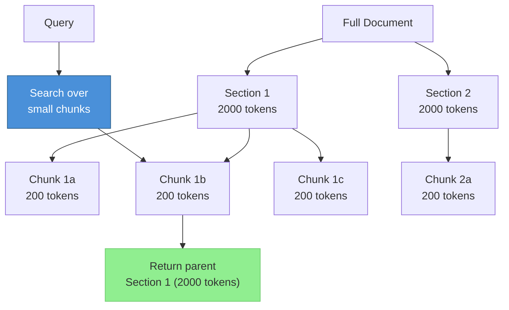
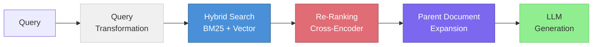

# Advanced Retrieval Patterns

> **TL;DR:** Naive vector search retrieves plausible but often wrong results. Hybrid search, re-ranking, HyDE, query transformation, and multi-hop retrieval are complementary techniques that dramatically improve retrieval quality — each addressing a different failure mode of simple similarity search.

## Table of Contents

- [Why This Matters](#why-this-matters)
- [Limitations of Naive Vector Search](#limitations-of-naive-vector-search)
- [Hybrid Search](#hybrid-search)
- [Re-Ranking](#re-ranking)
- [HyDE: Hypothetical Document Embeddings](#hyde-hypothetical-document-embeddings)
- [Query Transformation](#query-transformation)
- [Multi-Hop Retrieval](#multi-hop-retrieval)
- [Parent Document Retrieval](#parent-document-retrieval)
- [Pattern Comparison](#pattern-comparison)
- [Composing Patterns into Pipelines](#composing-patterns-into-pipelines)
- [Key Takeaways](#key-takeaways)
- [References](#references)

## Why This Matters

The default RAG pipeline — embed a query, find the top-K nearest vectors, stuff them into a prompt — works well for simple factoid questions. But real-world queries are ambiguous, multi-faceted, or require reasoning across multiple documents. Each advanced retrieval pattern addresses a specific failure mode, and combining them is how production RAG systems achieve reliable accuracy.

## Limitations of Naive Vector Search

Before diving into solutions, it helps to understand what goes wrong with basic semantic search:

| Failure Mode | Example | Root Cause |
|---|---|---|
| **Keyword mismatch** | Query: "EPS guidance" misses chunks about "earnings per share" | Embeddings may not capture all synonyms |
| **Semantic ambiguity** | Query: "Python" retrieves snake content instead of programming | Embedding space conflates meanings |
| **Information scattered** | Answer requires facts from 3 different chunks | Top-K returns each chunk independently |
| **Query-document asymmetry** | Short query vs. long document paragraph | Embedding spaces are optimized for similar-length pairs |
| **Lack of exact match** | Query includes a specific ID or code | Embeddings prioritize semantics over lexical precision |

## Hybrid Search

Hybrid search combines dense vector search with sparse lexical search (typically BM25) to capture both semantic similarity and exact keyword matches.



### Reciprocal Rank Fusion (RRF)

RRF is the most common fusion algorithm. For each document, it computes:

```
RRF_score(d) = sum(1 / (k + rank_i(d))) for each ranker i
```

Where `k` is a constant (typically 60) and `rank_i(d)` is the rank of document `d` in ranker `i`. RRF is effective because it is rank-based rather than score-based, making it robust to differences in score distributions between retrievers.

### When to Use Hybrid Search

- Your corpus contains technical terms, product IDs, or proper nouns that require exact matching
- Users may query with specific jargon that embeddings might not handle well
- You need a safety net — hybrid search rarely performs worse than either method alone

Most vector databases (Elasticsearch, Qdrant, Weaviate, Milvus) support hybrid search natively.

## Re-Ranking

Re-ranking introduces a second, more powerful model that scores each retrieved document against the query. Unlike bi-encoders (which encode query and document independently), cross-encoders process the query-document pair jointly, enabling much richer interaction modeling.



### Cross-Encoder Models

Cross-encoders are significantly more accurate than bi-encoders but cannot be used for initial retrieval because they require comparing every query-document pair (O(n) vs. O(log n) with vector indices). Common cross-encoder options:

- **Cohere Rerank**: Proprietary API, consistently strong performance, supports `rerank-english-v3` and multilingual variants
- **bge-reranker-v2-m3**: Open-source, multilingual, competitive with proprietary options
- **ms-marco-MiniLM**: Lightweight open-source option trained on MS MARCO, good for latency-sensitive applications

### Practical Considerations

- Retrieve 50-100 candidates in stage 1, then re-rank to top 5-10
- Re-ranking adds 100-300ms latency depending on the model and number of candidates
- The quality improvement is typically 5-15% on retrieval metrics (nDCG, MRR)

## HyDE: Hypothetical Document Embeddings

HyDE (Gao et al., 2022) addresses the query-document asymmetry problem. Instead of embedding the user's short query directly, HyDE asks an LLM to generate a hypothetical answer, then embeds that hypothetical document to search for real documents.


The key insight is that a hypothetical answer, even if factually wrong, is structurally and semantically similar to the real answer — making it a better search query than the original short question.

### When HyDE Helps

- Short, underspecified queries ("What about the merger?")
- Queries that use different vocabulary than the source documents
- Domains where query-document style mismatch is common

### When HyDE Hurts

- Factoid questions where the query already matches document language well
- Queries where the LLM's hypothetical answer is so wrong it leads search astray
- Latency-sensitive applications (adds an LLM call before retrieval)

## Query Transformation

Query transformation rewrites or decomposes the user's query before retrieval to improve recall and precision.

### Common Strategies

| Strategy | Description | Example |
|---|---|---|
| **Query expansion** | Generate multiple rephrasings of the query | "EPS guidance" becomes ["earnings per share forecast", "EPS outlook", "profit per share guidance"] |
| **Sub-query decomposition** | Break complex queries into simpler sub-queries | "Compare revenue growth and margin trends" becomes two separate queries |
| **Step-back prompting** | Ask a more general question first | "What was Apple's Q3 2024 revenue?" steps back to "What are Apple's recent financial results?" |
| **Query routing** | Route different query types to different retrievers | Factoid queries to keyword search, analytical queries to vector search |

### Multi-Query Retrieval

A practical variant: generate 3-5 rephrasings of the query using an LLM, retrieve for each, then deduplicate and merge results. This significantly improves recall at the cost of additional retrieval calls.

## Multi-Hop Retrieval

Some questions require synthesizing information from multiple documents that do not individually contain the answer. Multi-hop retrieval chains multiple retrieval steps together, using intermediate results to inform subsequent queries.



Multi-hop retrieval is typically implemented as an agentic loop where the LLM decides whether more retrieval is needed after each step. This pattern naturally overlaps with the agent architectures covered in the AI Agents section.

## Parent Document Retrieval

Parent document retrieval decouples the unit of embedding from the unit of context passed to the LLM. Small chunks (e.g., 200 tokens) are embedded for precise retrieval, but when a small chunk is retrieved, the system returns its parent document (e.g., the full 2000-token section).



This gives you the best of both worlds: precise retrieval (small chunks match queries well) and rich context (the LLM sees the surrounding information it needs to generate a good answer).

## Pattern Comparison

| Pattern | Problem Solved | Latency Impact | Quality Improvement | Complexity |
|---|---|---|---|---|
| **Hybrid search** | Keyword vs. semantic mismatch | Minimal (+10-20ms) | Moderate (5-10%) | Low |
| **Re-ranking** | Imprecise initial ranking | Moderate (+100-300ms) | High (5-15%) | Low |
| **HyDE** | Query-document asymmetry | High (+1-3s LLM call) | Variable (0-20%) | Medium |
| **Query transformation** | Ambiguous/complex queries | Moderate (+200ms-2s) | Moderate (5-15%) | Medium |
| **Multi-hop retrieval** | Multi-document reasoning | High (+2-10s) | High for complex queries | High |
| **Parent document** | Context insufficiency | Minimal | Moderate (5-10%) | Low |

## Composing Patterns into Pipelines

In production, these patterns are not mutually exclusive. A common high-quality pipeline:



Start simple (vector search + re-ranking), measure retrieval quality, then layer on additional patterns to address specific failure modes you observe.

## Key Takeaways

- Naive vector search fails on keyword-heavy queries, ambiguous queries, and multi-document reasoning
- Hybrid search (BM25 + vector with RRF) is nearly always worth implementing — low cost, consistent improvement
- Re-ranking with cross-encoders is the highest-ROI addition to any retrieval pipeline
- HyDE helps with short or underspecified queries but adds latency and can mislead search if the hypothetical answer is poor
- Query transformation and multi-hop retrieval address complex, multi-faceted queries at the cost of additional LLM calls
- Parent document retrieval decouples retrieval granularity from context granularity
- Compose patterns incrementally — start simple and add complexity only where metrics show gaps

## References

- Gao, L. et al. (2022). "Precise Zero-Shot Dense Retrieval without Relevance Labels." [arXiv:2212.10496](https://arxiv.org/abs/2212.10496)
- Cormack, G. et al. (2009). "Reciprocal Rank Fusion Outperforms Condorcet and Individual Rank Learning Methods." SIGIR.
- Nogueira, R. & Cho, K. (2019). "Passage Re-ranking with BERT." [arXiv:1901.04085](https://arxiv.org/abs/1901.04085)
- Ma, X. et al. (2023). "Query Rewriting for Retrieval-Augmented Large Language Models." [arXiv:2305.14283](https://arxiv.org/abs/2305.14283)
- Zheng, S. et al. (2023). "Take a Step Back: Evoking Reasoning via Abstraction in Large Language Models." [arXiv:2310.06117](https://arxiv.org/abs/2310.06117)
- Trivedi, H. et al. (2022). "MuSiQue: Multihop Questions via Single Hop Question Composition." TACL. [arXiv:2108.00573](https://arxiv.org/abs/2108.00573)
