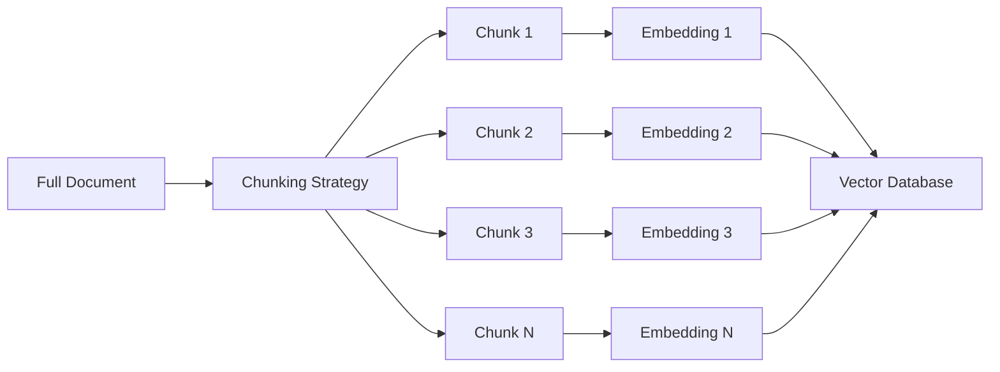
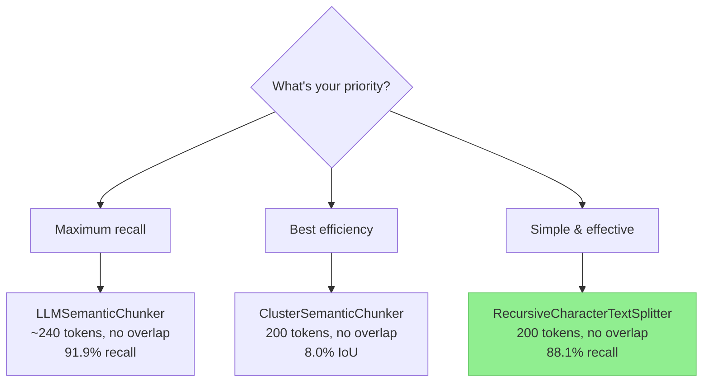

# Chunking Strategies

> **TL;DR:** How you split documents into chunks is one of the most impactful decisions in a RAG pipeline. Research from Chroma shows that **200-token chunks with no overlap** consistently outperform popular defaults (like 800 tokens with 400 overlap). Simpler strategies like `RecursiveCharacterTextSplitter` perform surprisingly well, while semantic and LLM-based approaches offer precision or recall advantages at higher cost.

## Table of Contents
- [Why This Matters](#why-this-matters)
- [What Is Chunking?](#what-is-chunking)
- [Strategies Evaluated](#strategies-evaluated)
- [Key Findings](#key-findings)
- [Comparison Table](#comparison-table)
- [Practical Recommendations](#practical-recommendations)
- [Key Takeaways](#key-takeaways)
- [References](#references)

## Why This Matters

Chunking sits at the very beginning of the RAG pipeline. Get it wrong, and no amount of model quality or prompt engineering will save you — the model can only work with the context it receives. Too-large chunks dilute relevant information with noise. Too-small chunks lose necessary context. The wrong strategy can miss semantic boundaries entirely.

## What Is Chunking?

**Chunking** is the process of splitting documents into smaller pieces (chunks) that can be independently embedded and retrieved. Each chunk becomes a unit of retrieval — when a user asks a question, the system finds the most relevant chunks and provides them to the LLM.

The two fundamental parameters for any chunking strategy are:
- **Chunk size** — How many tokens per chunk
- **Overlap** — How many tokens are shared between adjacent chunks

## Strategies Evaluated

The following strategies were evaluated in Chroma's research using OpenAI's `text-embedding-3-large` model with 5 retrieved chunks:

### 1. RecursiveCharacterTextSplitter
The most widely used strategy (LangChain default). Splits text by trying a hierarchy of separators — paragraph breaks, then sentence breaks, then word breaks — until chunks are within the target size.

**Pros:** Simple, fast, respects natural boundaries
**Cons:** No semantic awareness; splits are purely structural

### 2. TokenTextSplitter
Splits text at exact token boundaries using the model's tokenizer. Ensures precise token counts.

**Pros:** Exact control over chunk size
**Cons:** Can split mid-sentence, ignores semantic boundaries

### 3. KamradtSemanticChunker
Uses embedding similarity between consecutive sentences to identify "breakpoints" where topic shifts occur. When similarity drops below a threshold, a chunk boundary is created.

**Pros:** Semantically aware splits
**Cons:** Requires computing embeddings for every sentence during indexing; threshold tuning needed

### 4. KamradtModifiedChunker
An improved version of the Kamradt approach that uses binary search to find optimal breakpoints, producing more consistent chunk sizes.

**Pros:** Better size consistency than the original
**Cons:** Same embedding overhead

### 5. ClusterSemanticChunker
Groups consecutive sentences into clusters based on embedding similarity, optimizing for intra-cluster coherence.

**Pros:** Strong precision — chunks are semantically coherent
**Cons:** Computationally expensive; cluster sizes can vary

### 6. LLMSemanticChunker
Uses an LLM to determine where to place chunk boundaries, considering semantic meaning at a higher level than embeddings alone.

**Pros:** Highest recall (91.9%) — best at capturing all relevant information
**Cons:** Expensive (requires LLM calls during indexing); slow; lower precision

## Key Findings

### 1. Chunk Size: Smaller Is Better

**200-token chunks** consistently outperformed larger sizes across all strategies. This is notable because many popular defaults use much larger chunks:

| Configuration | Recall | Notes |
|---|---|---|
| 200 tokens | **88.1%** | Optimal for most strategies |
| 400 tokens | ~82% | Moderate degradation |
| 800 tokens, 400 overlap (OpenAI Assistants default) | Poor | "Particularly poor recall-efficiency tradeoff" |

Smaller chunks mean each chunk is more focused, making embedding similarity more meaningful and reducing noise in retrieved context.

### 2. Overlap: None Is Best

Counter to common intuition, **zero overlap** produced the best results. Overlap adds redundant tokens that:
- Waste embedding dimensions on repeated content
- Inflate the retrieved context without adding information
- Reduce retrieval efficiency (IoU)

### 3. Simple Strategies Perform Surprisingly Well

`RecursiveCharacterTextSplitter` at 200 tokens with no overlap achieved **88.1% recall** — within 4% of the best LLM-based approach while being orders of magnitude cheaper and faster.

### 4. Semantic Approaches Have Niche Advantages

- **ClusterSemanticChunker** achieved the best **precision** (8.0%) — useful when you need every retrieved chunk to be highly relevant
- **LLMSemanticChunker** achieved the best **recall** (91.9%) — useful when completeness matters more than efficiency

## Comparison Table

| Strategy | Chunk Size | Overlap | Recall | Precision | IoU | Relative Cost |
|---|---|---|---|---|---|---|
| RecursiveCharacterTextSplitter | 200 | 0 | 88.1% | 7.0% | 6.9% | Very Low |
| TokenTextSplitter | 200 | 0 | ~86% | ~6.5% | ~6.5% | Very Low |
| KamradtSemanticChunker | 200 | 0 | ~86% | ~7.0% | ~7.0% | Medium |
| KamradtModifiedChunker | 200 | 0 | ~87% | ~7.2% | ~7.1% | Medium |
| ClusterSemanticChunker | 200 | 0 | 87.3% | **8.0%** | **8.0%** | High |
| LLMSemanticChunker | ~240 | 0 | **91.9%** | 3.9% | 3.9% | Very High |

## Practical Recommendations

1. **Start with `RecursiveCharacterTextSplitter` at 200 tokens, no overlap.** This is the best default for most applications — simple, fast, and competitive with advanced methods.

2. **Avoid popular defaults.** Configurations like 800 tokens with 400 overlap (OpenAI Assistants default) are measurably suboptimal. Audit your chunking settings.

3. **Consider semantic chunking when precision matters.** If your application penalizes irrelevant retrieved content (e.g., limited context window, cost-sensitive), the `ClusterSemanticChunker` may justify its cost.

4. **Use LLM-based chunking only when recall is paramount.** For applications where missing any relevant information is unacceptable (legal, medical), the LLMSemanticChunker's 91.9% recall is worth the cost.

5. **Always benchmark on your data.** These findings are general — your specific documents, queries, and embedding model may behave differently.

## Key Takeaways

- **200-token chunks with no overlap** is the optimal default — not the 800/400 defaults many tools ship with
- **Simple strategies work well** — `RecursiveCharacterTextSplitter` is within 4% recall of the best approach at a fraction of the cost
- **Overlap hurts more than it helps** — it adds redundancy without improving retrieval quality
- Semantic and LLM-based chunking offer advantages in **precision** and **recall** respectively, but at significantly higher cost
- **Always benchmark** on your specific data and queries

## References

1. Chroma Research, "Evaluating Chunking Strategies for Retrieval," 2024. [research.trychroma.com/evaluating-chunking](https://research.trychroma.com/evaluating-chunking)
2. LangChain Documentation, "Text Splitters." [docs.langchain.com](https://docs.langchain.com)
3. OpenAI, "Assistants API Documentation." [platform.openai.com](https://platform.openai.com)
