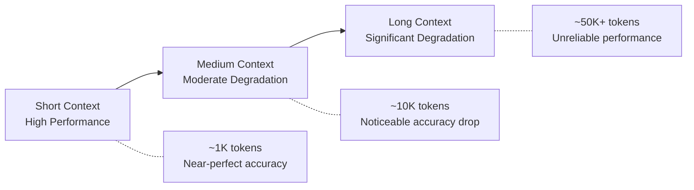
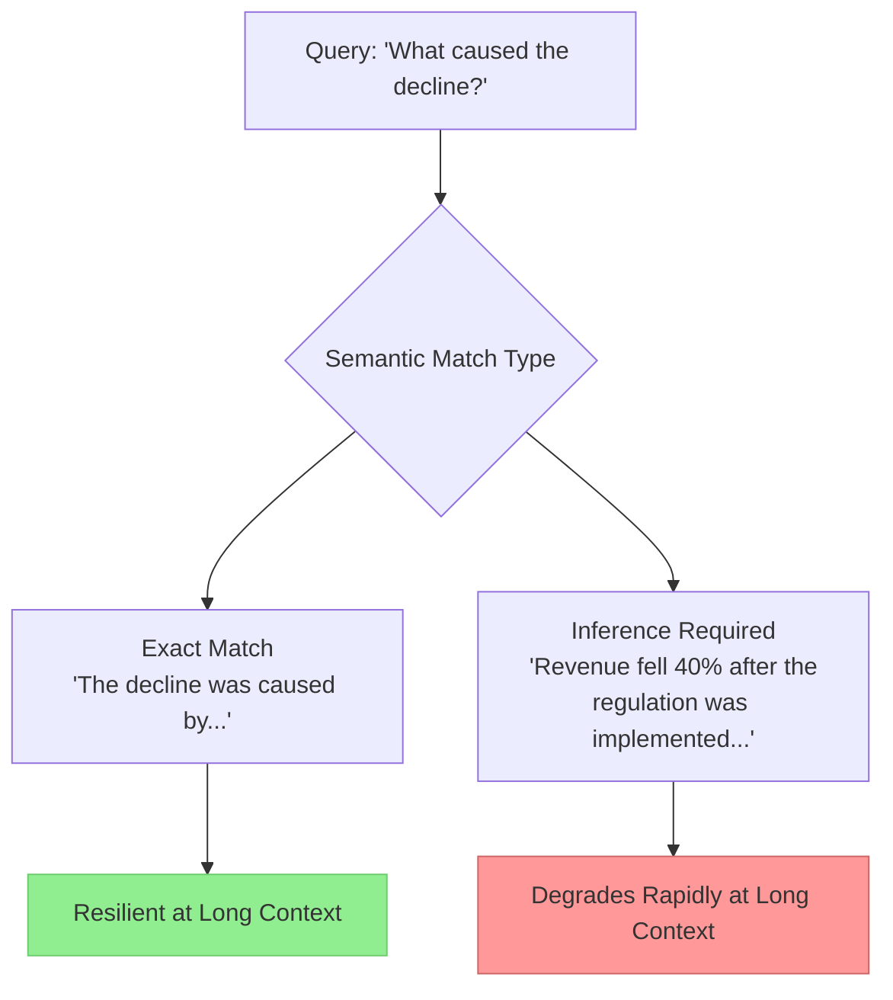

# Context Engineering

> **TL;DR:** LLM performance degrades as input context grows — even on simple retrieval tasks. Chroma's research on "context rot" shows that performance drops accelerate with lower semantic similarity, distractors cause non-uniform failures, and models paradoxically perform better on shuffled text than logically structured text. The takeaway: *how* you present context matters as much as *what* you include.

## Table of Contents
- [Why This Matters](#why-this-matters)
- [What Is Context Rot?](#what-is-context-rot)
- [Performance Degradation Patterns](#performance-degradation-patterns)
- [Semantic Complexity](#semantic-complexity)
- [Distractor Vulnerability](#distractor-vulnerability)
- [Structural Sensitivity](#structural-sensitivity)
- [Context Engineering Strategies](#context-engineering-strategies)
- [Key Takeaways](#key-takeaways)
- [References](#references)

## Why This Matters

RAG systems work by stuffing retrieved context into the prompt. The naive assumption is that more context is always better — just retrieve more chunks, provide more information, let the model sort it out. Chroma's research demonstrates this is dangerously wrong. Understanding how context degrades model performance is critical for building reliable RAG applications.

## What Is Context Rot?

**Context rot** refers to the phenomenon where LLM performance degrades as input length increases, even on simple tasks. Despite models achieving near-perfect scores on standard benchmarks like Needle in a Haystack, actual performance in realistic settings is far less reliable.



The key insight is that context rot is **not** a simple linear degradation. It interacts with the semantic complexity of the task, the presence of distractors, and the structure of the input.

## Performance Degradation Patterns

As input length grows, LLM performance drops in predictable but concerning ways:

| Factor | Effect on Performance |
|---|---|
| Input length | Performance worsens consistently as context expands |
| Semantic distance | Degradation accelerates when answer requires inference rather than exact matching |
| Distractor density | More topically-related-but-wrong content amplifies degradation |
| Task complexity | Compound effect — harder tasks degrade faster at longer lengths |

The degradation is non-linear. A model may handle 4K tokens with 95% accuracy, 8K with 88%, and 16K with just 70% — the drop accelerates rather than remaining steady.

## Semantic Complexity

One of the most important findings: performance degradation is **worse when the semantic similarity between the query and the answer is lower**.

### What This Means

When the answer to a question is a near-exact lexical match in the context (e.g., Q: "What is the capital of France?" with "The capital of France is Paris" in the context), models perform well even at long contexts.

But when the answer requires **inference** — connecting information that isn't lexically similar to the question — performance drops sharply as context grows.



This mirrors real-world scenarios. In production RAG systems, users rarely ask questions that have verbatim answers in the knowledge base. They ask questions that require synthesis, inference, and connection of multiple pieces of information — exactly the scenario where context rot hits hardest.

## Distractor Vulnerability

**Distractors** are passages that are topically related to the question but contain incorrect or irrelevant information. In a RAG pipeline, distractors are a natural consequence of retrieval — not every retrieved chunk will contain the answer.

### Key Findings on Distractors

1. **Single distractors reduce performance** relative to distractor-free baselines
2. **Different distractors have inconsistent effects** — some are more "distracting" than others, making failure modes unpredictable
3. **Distractor impact amplifies with context length** — at short contexts, models can usually ignore distractors; at long contexts, they increasingly confuse distractors with the real answer
4. **Model-specific behavior:**
   - Claude models show lower hallucination rates when facing distractors
   - GPT models tend to generate confident but incorrect responses from distractor content

### Implications for RAG

This means **retrieval precision matters enormously**. It's not enough to retrieve chunks that are topically relevant — chunks that are relevant but don't contain the answer actively hurt performance. This is another argument for smaller, more focused chunks (see [Chunking Strategies](chunking-strategies.md)).

## Structural Sensitivity

Perhaps the most surprising finding: **models perform better on shuffled, incoherent haystacks than on logically structured ones**.

When the surrounding context is well-structured prose (a coherent article or document), models have a harder time isolating the answer. When the context is randomly shuffled sentences with no logical flow, models actually perform better.

### Why This Happens

The hypothesis is that attention mechanisms are influenced by the narrative structure of the input. Coherent text creates strong inter-sentence attention patterns that can pull the model's focus away from the needle. Shuffled text lacks these patterns, making the relevant information stand out more.

### Practical Implication

This doesn't mean you should shuffle your context. But it does mean that:
- **Context from multiple disparate sources** (typical in RAG) may actually be easier for models to process than a single long document
- **Clear demarcation** between retrieved chunks (e.g., separators, source labels) may help the model identify relevant sections
- The structure of your prompt template significantly affects retrieval accuracy

## Context Engineering Strategies

Based on the research, here are strategies to mitigate context rot:

### 1. Minimize Context Length
Only include what's necessary. More context is not better — it actively degrades performance.

```
Instead of: Retrieve top-20 chunks, concatenate all
Better:     Retrieve top-5, re-rank, include top-3
```

### 2. Position Relevant Information Strategically
Models show position biases. Information at the **beginning** and **end** of the context tends to be recalled better than information in the middle (the "lost in the middle" phenomenon).

### 3. Reduce Distractor Exposure
- Use re-ranking to filter out topically-similar-but-irrelevant chunks
- Use higher similarity thresholds (accept fewer results but higher quality)
- Consider cross-encoder re-ranking after initial retrieval

### 4. Demarcate Retrieved Context
Clearly separate chunks with markers that help the model identify boundaries:

```
[Source 1: financial_report_2024.pdf, Page 3]
Revenue grew 15% year-over-year...

[Source 2: earnings_call_transcript.pdf, Page 7]
The CEO attributed growth to...
```

### 5. Summarize When Possible
For long documents, consider summarizing retrieved chunks before including them. A 50-token summary of a relevant section may outperform the full 200-token chunk.

### 6. Test at Realistic Context Lengths
Don't evaluate your RAG system with single-chunk contexts. Test with the actual number and size of chunks your system retrieves in production.

## Key Takeaways

- **Context rot is real:** LLM performance degrades with input length, even on simple tasks
- **Semantic complexity accelerates degradation:** Tasks requiring inference degrade faster than exact-match tasks
- **Distractors are not neutral:** Topically-related-but-wrong content actively hurts model performance, especially at longer contexts
- **Structure matters paradoxically:** Coherent text is harder for models to search through than random text
- **How you present context matters as much as what you include:** Position, demarcation, length, and distractor management are all critical engineering decisions
- **Less is more:** Retrieve fewer, higher-quality chunks rather than maximizing context window usage

## References

1. Chroma Research, "Context Rot: Understanding and Mitigating Performance Degradation in Long Contexts," 2024. [research.trychroma.com/context-rot](https://research.trychroma.com/context-rot)
2. Liu et al., "Lost in the Middle: How Language Models Use Long Contexts," 2023. [arXiv:2307.03172](https://arxiv.org/abs/2307.03172)
3. Cuconasu et al., "The Power of Noise: Redefining Retrieval for RAG Systems," 2024. [arXiv:2401.14887](https://arxiv.org/abs/2401.14887)
