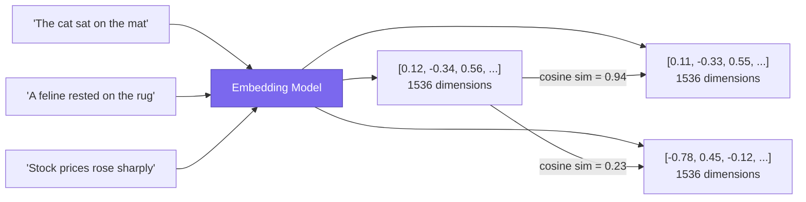
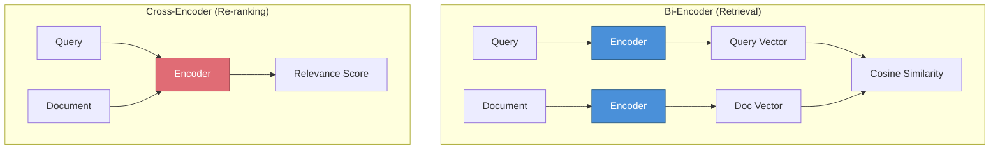
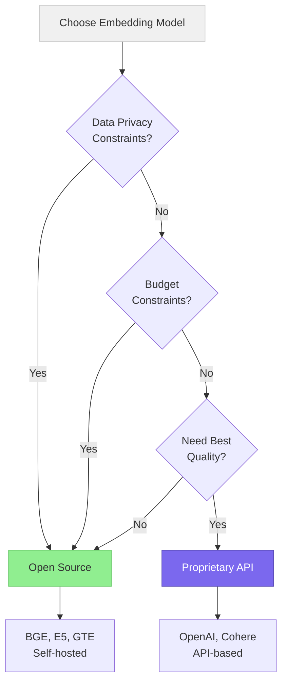

# Embedding Models

> **TL;DR:** Embedding models convert text into dense vector representations that capture semantic meaning. Choosing the right model involves tradeoffs between dimensionality, latency, cost, and retrieval quality — and the MTEB leaderboard is your best starting point for comparison.

## Table of Contents

- [Why This Matters](#why-this-matters)
- [What Are Embeddings?](#what-are-embeddings)
- [How Embedding Models Work](#how-embedding-models-work)
- [Key Embedding Models](#key-embedding-models)
- [MTEB Leaderboard](#mteb-leaderboard)
- [Model Comparison](#model-comparison)
- [Open vs Proprietary Models](#open-vs-proprietary-models)
- [Fine-Tuning Embeddings](#fine-tuning-embeddings)
- [Practical Guidance](#practical-guidance)
- [Key Takeaways](#key-takeaways)
- [References](#references)

## Why This Matters

Every RAG system depends on embeddings to bridge the gap between a user query and stored documents. A poorly chosen embedding model silently degrades retrieval quality — returning plausible but wrong chunks, missing relevant passages, or conflating unrelated concepts. Understanding the embedding landscape is essential for building RAG systems that actually work.

## What Are Embeddings?

An embedding is a fixed-length vector of floating-point numbers that represents the semantic content of a piece of text. Two pieces of text with similar meanings produce vectors that are close together in the embedding space, measured by cosine similarity or dot product.

Key properties of embeddings:

- **Fixed dimensionality**: Regardless of input length, the output vector has a fixed number of dimensions
- **Semantic similarity**: Semantically related texts cluster together in the vector space
- **Compositionality**: Embeddings capture relationships between concepts, not just keyword overlap
- **Asymmetry**: Some models produce different embeddings for queries vs documents (bi-encoder asymmetry)

## How Embedding Models Work

Modern embedding models are built on transformer architectures, typically trained in two stages:

1. **Pre-training**: The model learns language representations from large corpora using masked language modeling or contrastive objectives
2. **Fine-tuning**: The model is trained on curated pairs (query, relevant document) and (query, irrelevant document) using contrastive loss functions like InfoNCE

The dominant architecture is the **bi-encoder**, which encodes queries and documents independently. This allows documents to be embedded offline and cached, with only the query needing real-time encoding.

## Key Embedding Models

### OpenAI text-embedding-3

OpenAI's third-generation embedding models come in two variants: `text-embedding-3-small` (1536 dimensions) and `text-embedding-3-large` (3072 dimensions). Both support Matryoshka Representation Learning (MRL), allowing you to truncate vectors to smaller dimensions with graceful quality degradation. This is useful for reducing storage costs while maintaining reasonable retrieval quality.

### Cohere Embed v3

Cohere's Embed v3 supports 1024 dimensions and introduces explicit `input_type` parameters (`search_query`, `search_document`, `classification`, `clustering`), which optimize the embedding for specific downstream tasks. It also natively supports over 100 languages, making it a strong choice for multilingual RAG.

### BGE (BAAI General Embedding)

Developed by the Beijing Academy of AI, BGE models are open-source and available on Hugging Face. The `bge-large-en-v1.5` (1024 dimensions) consistently ranks among the top open-source models on MTEB. BGE models include instruction-aware variants where prepending a task description to the query improves retrieval quality.

### E5 (Microsoft)

Microsoft's E5 family uses the "query: " and "passage: " prefix convention to distinguish query and document embeddings. The `e5-mistral-7b-instruct` model demonstrated that scaling up the backbone to a 7B-parameter LLM significantly improves embedding quality, though at higher compute cost.

### GTE (Alibaba)

The General Text Embeddings (GTE) family from Alibaba includes models ranging from small to large. `gte-large-en-v1.5` offers strong performance with 1024 dimensions. GTE models are notable for their competitive MTEB scores relative to their parameter count.

## MTEB Leaderboard

The Massive Text Embedding Benchmark (MTEB) evaluates embedding models across 58+ datasets spanning 8 tasks: classification, clustering, pair classification, reranking, retrieval, STS, summarization, and BitextMining. For RAG, the **retrieval** subset is the most relevant metric.

Important caveats about MTEB:

- Models can overfit to MTEB benchmarks while underperforming on domain-specific data
- The retrieval subset uses specific datasets (e.g., MS MARCO, NQ) that may not reflect your domain
- Latency, cost, and maximum token limits are not captured by MTEB scores
- Always validate on your own data before committing to a model

## Model Comparison

| Model | Dimensions | Max Tokens | Open Source | MTEB Retrieval (avg) | Multilingual | MRL Support |
|---|---|---|---|---|---|---|
| text-embedding-3-large | 3072 | 8191 | No | ~59.2 | Partial | Yes |
| text-embedding-3-small | 1536 | 8191 | No | ~54.9 | Partial | Yes |
| Cohere Embed v3 | 1024 | 512 | No | ~56.8 | Yes (100+) | No |
| bge-large-en-v1.5 | 1024 | 512 | Yes | ~54.3 | No | No |
| e5-mistral-7b-instruct | 4096 | 32768 | Yes | ~56.9 | Partial | No |
| gte-large-en-v1.5 | 1024 | 8192 | Yes | ~55.1 | Partial | No |

## Open vs Proprietary Models

| Factor | Open Source | Proprietary |
|---|---|---|
| **Data privacy** | Full control — data never leaves your infrastructure | Data sent to third-party API |
| **Cost at scale** | Fixed infrastructure cost, scales well | Per-token pricing, costs grow linearly |
| **Quality** | Competitive, sometimes trailing by 2-5% on MTEB | Generally top-tier on benchmarks |
| **Maintenance** | You manage updates, scaling, and GPU infrastructure | Managed service, zero-ops |
| **Fine-tuning** | Full access to weights and training pipeline | Limited or no fine-tuning support |
| **Latency** | Depends on your infrastructure | Depends on API region and load |

## Fine-Tuning Embeddings

Fine-tuning an embedding model on domain-specific data can improve retrieval quality by 5-15% on domain-relevant queries. This is particularly valuable for specialized domains (legal, medical, scientific) where general-purpose embeddings struggle with domain terminology.

Common fine-tuning approaches:

1. **Contrastive fine-tuning**: Train on (query, positive document, hard negative) triplets from your domain
2. **Synthetic data generation**: Use an LLM to generate queries for your documents, creating training pairs automatically
3. **Distillation**: Fine-tune a smaller model to mimic a larger, better-performing model's embeddings

Frameworks like `sentence-transformers` make fine-tuning straightforward for open-source models. For proprietary models, OpenAI offers fine-tuning for their embedding models, though with less flexibility.

## Practical Guidance

1. **Start with a proprietary model** if you have no data privacy constraints — OpenAI `text-embedding-3-small` offers a strong quality-to-cost ratio
2. **Benchmark on your own data** before choosing — MTEB scores are directional, not definitive
3. **Match chunk size to max tokens** — if your chunks are 512 tokens, a model with 512 max tokens is sufficient
4. **Use MRL when available** — truncating from 3072 to 1024 dimensions reduces storage by 67% with minimal quality loss
5. **Consider latency requirements** — API-based models add network round-trip time; self-hosted models add infrastructure complexity
6. **Plan for embedding migration** — changing models later requires re-embedding your entire corpus, so invest time upfront in selection

## Key Takeaways

- Embeddings are the foundation of semantic search in RAG — they determine what gets retrieved
- The MTEB leaderboard is the standard benchmark, but always validate on domain-specific data
- OpenAI text-embedding-3 and Cohere Embed v3 lead proprietary offerings; BGE and E5 lead open-source
- Matryoshka Representation Learning allows flexible dimension reduction with graceful degradation
- Fine-tuning on domain data yields significant retrieval improvements, especially in specialized domains
- The choice between open and proprietary depends primarily on data privacy, scale, and operational capacity

## References

- Muennighoff, N. et al. (2023). "MTEB: Massive Text Embedding Benchmark." EACL. [arXiv:2210.07316](https://arxiv.org/abs/2210.07316)
- Xiao, S. et al. (2023). "C-Pack: Packaged Resources To Advance General Chinese Embedding." [arXiv:2309.07597](https://arxiv.org/abs/2309.07597)
- Wang, L. et al. (2022). "Text Embeddings by Weakly-Supervised Contrastive Pre-training." [arXiv:2212.03533](https://arxiv.org/abs/2212.03533)
- Kusupati, A. et al. (2022). "Matryoshka Representation Learning." NeurIPS. [arXiv:2205.13147](https://arxiv.org/abs/2205.13147)
- Li, Z. et al. (2023). "Towards General Text Embeddings with Multi-stage Contrastive Learning." [arXiv:2308.03281](https://arxiv.org/abs/2308.03281)
