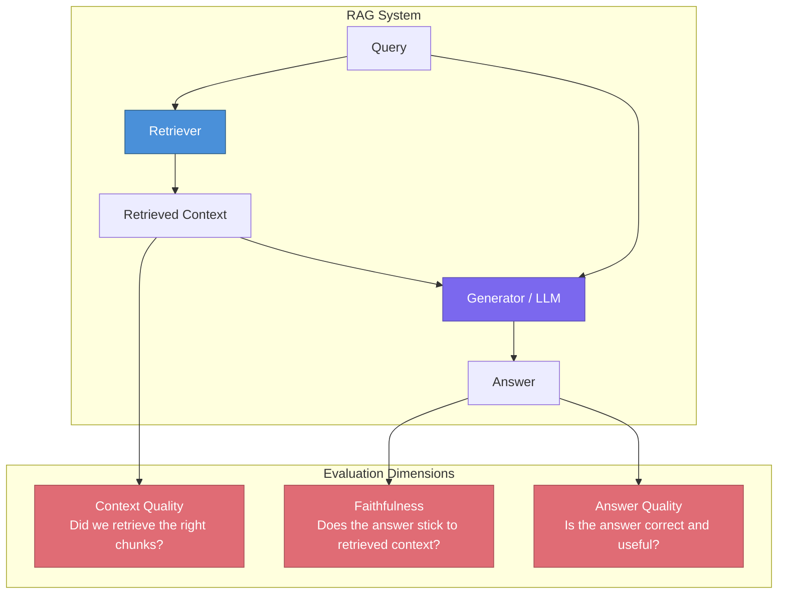
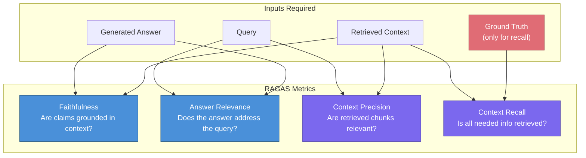
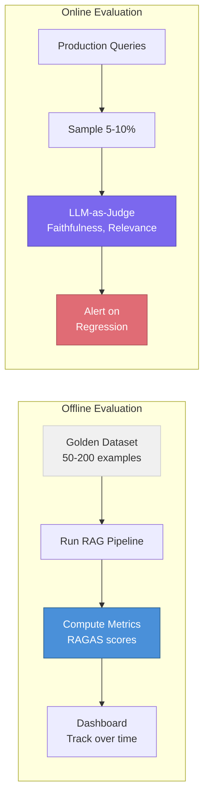

# RAG Evaluation

> **TL;DR:** RAG evaluation requires measuring both retrieval quality and generation quality independently. The RAGAS framework provides four core metrics — faithfulness, answer relevance, context precision, and context recall — that together reveal whether your system retrieves the right information and uses it correctly.

## Table of Contents

- [Why This Matters](#why-this-matters)
- [Why RAG Eval Differs from LLM Eval](#why-rag-eval-differs-from-llm-eval)
- [Component-Level Evaluation](#component-level-evaluation)
- [The RAGAS Framework](#the-ragas-framework)
- [Reference-Free vs Reference-Based Evaluation](#reference-free-vs-reference-based-evaluation)
- [Common Failure Modes](#common-failure-modes)
- [Evaluation Tools](#evaluation-tools)
- [Building an Evaluation Pipeline](#building-an-evaluation-pipeline)
- [Key Takeaways](#key-takeaways)
- [References](#references)

## Why This Matters

Without proper evaluation, RAG systems degrade silently. The LLM generates fluent, confident-sounding answers regardless of whether the retrieved context was relevant, complete, or even correct. Evaluation is the only way to detect retrieval failures, hallucinations grounded in wrong context, and quality regressions after pipeline changes.

## Why RAG Eval Differs from LLM Eval

Standard LLM evaluation measures the model's intrinsic capabilities — reasoning, factuality, instruction following. RAG evaluation must additionally measure the interaction between three components:

A RAG system can fail in ways an LLM alone cannot:

| Failure Type | LLM Eval Catches It? | RAG Eval Catches It? |
|---|---|---|
| Retrieved wrong documents | No | Yes (context precision) |
| Retrieved right docs but LLM ignored them | No | Yes (faithfulness) |
| Retrieved incomplete context | No | Yes (context recall) |
| Answer is correct but unsupported by context | No | Yes (faithfulness) |
| Retrieval pipeline regression after re-indexing | No | Yes (component-level eval) |

## Component-Level Evaluation

Effective RAG evaluation separates retrieval evaluation from generation evaluation. This isolation is critical for debugging — when answer quality drops, you need to know whether the retriever or the generator is at fault.

### Retrieval Metrics

| Metric | What It Measures | Formula Intuition |
|---|---|---|
| **Precision@K** | Fraction of top-K results that are relevant | relevant_in_top_k / k |
| **Recall@K** | Fraction of all relevant docs found in top-K | relevant_in_top_k / total_relevant |
| **MRR** | Reciprocal rank of the first relevant result | 1 / rank_of_first_relevant |
| **nDCG@K** | Quality of ranking, weighted by position | Higher-ranked relevant docs score more |
| **Hit Rate** | Whether any relevant doc appears in top-K | Binary: 1 if any relevant doc in top-K |

### Generation Metrics

| Metric | What It Measures |
|---|---|
| **Faithfulness** | Does the answer only contain claims supported by the context? |
| **Answer relevance** | Does the answer address the question? |
| **Correctness** | Is the answer factually correct (requires ground truth)? |
| **Completeness** | Does the answer cover all aspects of the question? |

## The RAGAS Framework

RAGAS (Retrieval-Augmented Generation Assessment) provides four core metrics that together cover the most important quality dimensions. Its key innovation is that three of its four metrics are **reference-free** — they do not require ground-truth answers.

### Faithfulness

Faithfulness measures whether every claim in the generated answer can be inferred from the retrieved context. RAGAS implements this by:

1. Extracting individual claims from the answer using an LLM
2. For each claim, asking the LLM whether it can be supported by the context
3. Computing the ratio of supported claims to total claims

A score of 1.0 means every claim is grounded in context. Low faithfulness indicates the LLM is hallucinating or drawing on parametric knowledge.

### Answer Relevance

Answer relevance measures whether the answer addresses the question asked. RAGAS implements this by generating hypothetical questions from the answer and measuring their similarity to the original question. Irrelevant or incomplete answers score low.

### Context Precision

Context precision measures whether the retrieved chunks are relevant to the question. High precision means the LLM is not being distracted by irrelevant context. This metric evaluates the retriever's precision.

### Context Recall

Context recall measures whether the retrieved context contains all the information needed to answer the question. This is the one RAGAS metric that requires a ground-truth answer — it checks whether each sentence in the ground truth can be attributed to the retrieved context.

## Reference-Free vs Reference-Based Evaluation

| Approach | Requires Ground Truth? | Scalability | Accuracy | Use Case |
|---|---|---|---|---|
| **Reference-free (LLM-as-judge)** | No | High — can run on any query | Moderate — depends on judge model | Continuous monitoring, regression testing |
| **Reference-based** | Yes | Low — requires manual annotation | High — objective comparison | Benchmark creation, model selection |
| **Human evaluation** | N/A | Very low | Highest | Final validation, edge case audits |

For most teams, the practical approach is:

1. Build a small golden dataset (50-200 examples) with ground-truth answers for reference-based evaluation
2. Use reference-free metrics (faithfulness, answer relevance, context precision) for continuous monitoring
3. Run human evaluation on a sample for periodic validation

## Common Failure Modes

| Failure Mode | Symptoms | Metric That Catches It | Root Cause |
|---|---|---|---|
| **Retrieval miss** | Answer says "I don't know" or halluccinates | Low context recall | Poor chunking, embedding mismatch, query-document gap |
| **Context pollution** | Answer contains irrelevant information | Low context precision | Top-K too large, poor re-ranking |
| **Unfaithful generation** | Answer contradicts retrieved context | Low faithfulness | Model ignores context, prompt not emphasizing grounding |
| **Answer drift** | Answer is tangential to the question | Low answer relevance | Retrieved context is related but not directly relevant |
| **Partial retrieval** | Answer is correct but incomplete | Low context recall | Important information split across chunks not all retrieved |

## Evaluation Tools

| Tool | Type | Key Features | Pricing |
|---|---|---|---|
| **RAGAS** | Open-source library | Four core metrics, LLM-as-judge, integrates with LangChain | Free |
| **DeepEval** | Open-source library | 14+ metrics, conversational eval, red-teaming, CI/CD integration | Free (self-hosted) |
| **LangSmith** | Platform (LangChain) | Tracing, annotation, dataset management, online evaluation | Freemium |
| **Arize Phoenix** | Open-source platform | Tracing, embedding visualization, retrieval eval | Free |
| **TruLens** | Open-source library | Feedback functions, app tracking, leaderboard | Free |

### Choosing a Tool

- **Starting out**: RAGAS is the simplest to integrate and provides the core metrics
- **Need CI/CD integration**: DeepEval has first-class support for running evaluations in test suites
- **Full observability**: LangSmith or Arize Phoenix for tracing + evaluation in one platform
- **Custom metrics**: TruLens provides the most flexibility for defining custom feedback functions

## Building an Evaluation Pipeline

Best practices:

1. **Version your golden dataset** alongside your code — it evolves as your domain evolves
2. **Run offline evaluation on every pipeline change** — embedding model swap, chunking strategy change, prompt update
3. **Sample production traffic for online evaluation** — 5-10% is sufficient for regression detection
4. **Set alert thresholds** — e.g., alert when average faithfulness drops below 0.85
5. **Separate retrieval and generation metrics** — this is the single most important debugging practice

## Key Takeaways

- RAG evaluation must measure retrieval and generation independently to isolate failures
- RAGAS provides four core metrics: faithfulness, answer relevance, context precision, and context recall
- Three of four RAGAS metrics are reference-free, making them practical for continuous monitoring
- Build a small golden dataset for rigorous benchmarking; use LLM-as-judge for scale
- Common failures include retrieval misses, context pollution, and unfaithful generation — each detectable by specific metrics
- Run offline evaluation on pipeline changes and sample-based online evaluation on production traffic

## References

- Es, S. et al. (2023). "RAGAS: Automated Evaluation of Retrieval Augmented Generation." [arXiv:2309.15217](https://arxiv.org/abs/2309.15217)
- Saad-Falcon, J. et al. (2023). "ARES: An Automated Evaluation Framework for Retrieval-Augmented Generation Systems." [arXiv:2311.09476](https://arxiv.org/abs/2311.09476)
- Chen, J. et al. (2023). "Benchmarking Large Language Models in Retrieval-Augmented Generation." [arXiv:2309.01431](https://arxiv.org/abs/2309.01431)
- Zheng, L. et al. (2023). "Judging LLM-as-a-Judge with MT-Bench and Chatbot Arena." [arXiv:2306.05685](https://arxiv.org/abs/2306.05685)
