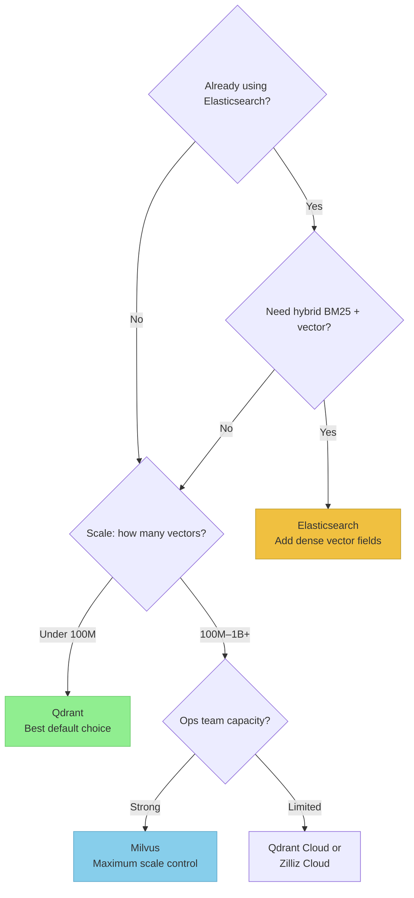

# Vector Databases

> **TL;DR:** Vector databases enable similarity search over embeddings — the backbone of RAG retrieval. Elasticsearch is best when you already have it and need hybrid keyword+vector search. Qdrant is the best pure vector database for most new projects. Milvus excels at massive scale (billions of vectors). Your choice depends on existing infrastructure, scale requirements, and whether you need hybrid search.

## Table of Contents
- [Why This Matters](#why-this-matters)
- [What Are Vector Databases?](#what-are-vector-databases)
- [How Vector Similarity Search Works](#how-vector-similarity-search-works)
- [Elasticsearch](#elasticsearch)
- [Qdrant](#qdrant)
- [Milvus](#milvus)
- [Comparison Table](#comparison-table)
- [When to Use Which](#when-to-use-which)
- [Key Takeaways](#key-takeaways)
- [References](#references)

## Why This Matters

Once you've chunked your documents and generated embeddings, you need somewhere to store them and a way to search them efficiently. The vector database you choose affects query latency, scaling costs, feature availability, and operational complexity. It's a foundational infrastructure decision that's expensive to change later.

## What Are Vector Databases?

A **vector database** is a specialized database optimized for storing and querying high-dimensional vectors (embeddings). Traditional databases search by exact matches or text patterns. Vector databases search by **similarity** — finding the vectors closest to a query vector in high-dimensional space.

In a RAG pipeline, this is the retrieval step: the user's query is embedded, and the vector database returns the most similar document chunks.

## How Vector Similarity Search Works

### Distance Metrics

Three common distance metrics are used to measure similarity between vectors:

| Metric | Formula | Best For | Range |
|---|---|---|---|
| **Cosine Similarity** | cos(θ) = (A·B) / (\|A\|\|B\|) | Normalized embeddings (most common) | -1 to 1 (1 = identical) |
| **Dot Product** | A·B = Σ(aᵢ × bᵢ) | When magnitude matters | -∞ to ∞ |
| **Euclidean (L2)** | √Σ(aᵢ - bᵢ)² | Spatial relationships | 0 to ∞ (0 = identical) |

**Cosine similarity** is the default choice for most RAG applications because embedding models typically normalize their output vectors, making cosine and dot product equivalent.

### Approximate Nearest Neighbor (ANN)

Exact nearest-neighbor search over millions of vectors is too slow (linear scan). Vector databases use **approximate** algorithms that trade a small amount of accuracy for dramatic speed improvements:

| Algorithm | Used By | Approach |
|---|---|---|
| **HNSW** (Hierarchical Navigable Small World) | Qdrant, Elasticsearch | Builds a multi-layer graph for greedy traversal |
| **IVF** (Inverted File Index) | Milvus | Clusters vectors, only searches relevant clusters |
| **Product Quantization** | Milvus, Elasticsearch | Compresses vectors to reduce memory and speed up comparison |

**HNSW** offers the best query latency and recall tradeoff for most workloads and is the default algorithm in most vector databases.

## Elasticsearch

**Elasticsearch** is a mature, widely-deployed search engine that added vector search capabilities (dense vector fields and kNN search) starting in version 8.0.

### Strengths
- **Hybrid search** — Combine vector similarity with traditional keyword search (BM25), metadata filters, and aggregations in a single query
- **Mature ecosystem** — Battle-tested at scale, extensive tooling, large community
- **Existing infrastructure** — If you already run Elasticsearch, adding vector search avoids introducing a new system
- **Rich filtering** — Complex metadata filters can be applied before or after vector search

### Limitations
- **Not vector-first** — Vector search is an addition to a text search engine, not its core design
- **Higher memory usage** — Stores vectors alongside full inverted indices
- **Configuration complexity** — Tuning HNSW parameters, shard sizing, and hybrid scoring requires expertise
- **Slower pure vector search** — Compared to purpose-built vector databases on equivalent hardware

### Best For
Teams that already use Elasticsearch and need to add semantic search without introducing new infrastructure, or applications that genuinely need hybrid keyword+vector search.

## Qdrant

**Qdrant** is a purpose-built vector database written in Rust, designed specifically for similarity search with advanced filtering.

### Strengths
- **Performance** — Rust implementation delivers excellent query latency and throughput
- **Filtering** — Payload (metadata) filtering is applied during search, not as a post-filter, maintaining result quality
- **Simple API** — Clean REST and gRPC APIs, good SDKs for Python, JavaScript, Go, Rust
- **Quantization** — Built-in scalar and product quantization to reduce memory usage with minimal recall loss
- **Easy operations** — Simple to deploy (single binary or Docker), straightforward configuration

### Limitations
- **Younger ecosystem** — Less battle-tested at extreme scale compared to Elasticsearch or Milvus
- **No native keyword search** — If you need BM25-style text search, you'll need a separate system
- **Clustering** — Distributed deployment is available but less mature than Elasticsearch's sharding

### Best For
New RAG projects that need a fast, easy-to-operate vector database. The best default choice for most teams.

## Milvus

**Milvus** is an open-source vector database designed for massive scale, capable of handling billions of vectors.

### Strengths
- **Scale** — Designed from the ground up for billion-vector datasets with distributed architecture
- **Multiple index types** — Supports HNSW, IVF, DiskANN, GPU indexes — choose based on your latency/memory/cost tradeoffs
- **GPU acceleration** — Native GPU support for index building and search
- **Mature distributed architecture** — Separation of storage, compute, and coordination layers
- **Hybrid search** — Supports sparse embeddings (BM25-style) alongside dense vectors

### Limitations
- **Operational complexity** — Distributed deployment requires etcd, MinIO/S3, and message queues. Significant ops burden
- **Overhead at small scale** — The distributed architecture adds unnecessary complexity for smaller datasets
- **Resource hungry** — Higher baseline resource requirements than Qdrant or Elasticsearch

### Best For
Teams operating at massive scale (hundreds of millions to billions of vectors) who need fine-grained control over index types and are willing to invest in operational complexity.

## Comparison Table

| Feature | Elasticsearch | Qdrant | Milvus |
|---|---|---|---|
| **Primary Design** | Text search + vector | Vector-first | Vector at scale |
| **Language** | Java | Rust | Go + C++ |
| **ANN Algorithm** | HNSW | HNSW | HNSW, IVF, DiskANN, GPU |
| **Hybrid Search** | BM25 + vector (native) | Metadata filtering | Sparse + dense vectors |
| **Filtering** | Pre/post filter | During search | Pre/post filter |
| **Quantization** | Product quantization | Scalar + product | Multiple options |
| **GPU Support** | No | No | Yes |
| **Max Scale** | Billions (with sharding) | Hundreds of millions | Billions (distributed) |
| **Operational Complexity** | Medium–High | Low | High |
| **Cloud Managed** | Elastic Cloud | Qdrant Cloud | Zilliz Cloud |
| **License** | SSPL / Elastic License | Apache 2.0 | Apache 2.0 |
| **Best Query Latency** | ~5–20ms | ~1–5ms | ~5–15ms |

## When to Use Which

| Scenario | Recommendation |
|---|---|
| New RAG project, under 100M vectors | **Qdrant** — fast, simple, great defaults |
| Already using Elasticsearch | **Elasticsearch** — add vector fields, avoid new infra |
| Need hybrid keyword + semantic search | **Elasticsearch** — native BM25 + vector fusion |
| Billion-scale vectors, GPU available | **Milvus** — designed for this exact case |
| Minimal ops capacity | **Qdrant Cloud** or **Zilliz Cloud** — managed services |
| Need maximum query latency control | **Qdrant** — Rust performance, during-search filtering |

## Key Takeaways

- Vector databases enable the retrieval step in RAG by finding the most similar embeddings to a query
- **Cosine similarity** with **HNSW** indexing is the standard combination for most applications
- **Elasticsearch** is best when you already have it or need native hybrid search
- **Qdrant** is the best default choice for new projects — fast, simple, well-designed
- **Milvus** is the choice for massive scale (billions of vectors) when you can invest in operations
- Choose based on your **existing infrastructure**, **scale requirements**, and **operational capacity** — not hype

## References

1. Elasticsearch Documentation, "Dense vector field type" and "kNN search." [elastic.co/guide](https://www.elastic.co/guide/en/elasticsearch/reference/current/dense-vector.html)
2. Qdrant Documentation. [qdrant.tech/documentation](https://qdrant.tech/documentation/)
3. Milvus Documentation. [milvus.io/docs](https://milvus.io/docs)
4. Malkov & Yashunin, "Efficient and Robust Approximate Nearest Neighbor Using Hierarchical Navigable Small World Graphs," 2018. [arXiv:1603.09320](https://arxiv.org/abs/1603.09320)
5. Ann-Benchmarks, "Benchmarking Nearest Neighbor Search." [ann-benchmarks.com](https://ann-benchmarks.com/)
