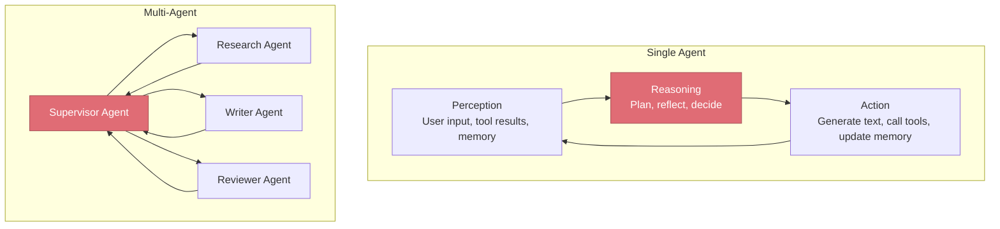

# AI Agents

> Moving beyond single-turn Q&A — how LLMs become autonomous agents that reason, plan, use tools, and collaborate.

## What This Section Covers

AI agents represent the next evolution in LLM applications. Instead of a single prompt-response cycle, agents operate in loops — observing, reasoning, acting, and learning from the results. This section covers the fundamental patterns for building individual agents and the architectural patterns for coordinating multiple agents.

## Agent Architecture Patterns

## Pages in This Section

| Page | What You'll Learn |
|---|---|
| [Agent Fundamentals](agent-fundamentals.md) | What makes an LLM an "agent," ReAct pattern, tool use, memory, and planning |
| [Multi-Agent Architectures](multi-agent-architectures.md) | Single vs. multi-agent tradeoffs, common patterns, LangChain, and LangGraph |

## Suggested Reading Order

1. Start with **Agent Fundamentals** to understand the core concepts: reasoning loops, tool use, and memory
2. Then read **Multi-Agent Architectures** to learn how to compose agents into systems
