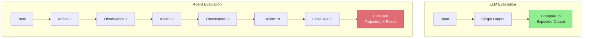
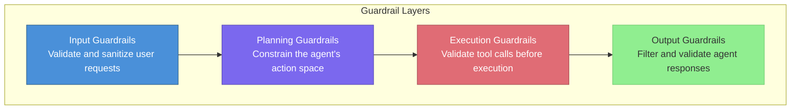
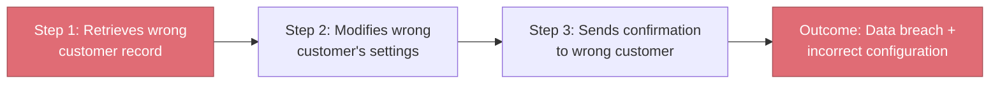

# Agent Evaluation and Safety

> **TL;DR:** Agent evaluation is harder than LLM evaluation because agents take sequences of actions with real-world consequences. Effective evaluation measures success, efficiency, safety, and cost across multi-step trajectories, while safety requires guardrails, sandboxing, and human-in-the-loop controls to prevent cascading failures.

## Table of Contents

- [Why This Matters](#why-this-matters)
- [Why Agent Evaluation Is Hard](#why-agent-evaluation-is-hard)
- [Evaluation Dimensions](#evaluation-dimensions)
- [Guardrails](#guardrails)
- [Sandboxing](#sandboxing)
- [Failure Modes](#failure-modes)
- [Human-in-the-Loop Patterns](#human-in-the-loop-patterns)
- [Monitoring and Observability](#monitoring-and-observability)
- [Key Takeaways](#key-takeaways)
- [References](#references)

## Why This Matters

An LLM that generates a bad answer wastes a user's time. An agent that takes a bad action can delete data, send incorrect emails, make unauthorized purchases, or enter infinite loops that burn compute. As agents gain access to more tools and autonomy, the stakes of evaluation and safety failures grow proportionally. Production agent systems require evaluation frameworks that go far beyond "did the answer look right."

## Why Agent Evaluation Is Hard

Agent evaluation differs from standard LLM evaluation in several fundamental ways:

| Challenge | Description |
|---|---|
| **Path dependence** | Multiple valid trajectories can reach the same goal; evaluating only the final answer misses efficiency and safety |
| **Non-determinism** | The same agent may take different paths on repeated runs due to LLM sampling |
| **Environment interaction** | Actions have side effects — you cannot evaluate an agent without an environment (or mock) |
| **Delayed feedback** | The consequence of an action may not be apparent until several steps later |
| **Compound errors** | A small mistake early in a trajectory can cascade into large failures |

## Evaluation Dimensions

Effective agent evaluation measures four dimensions:

### 1. Task Success

Did the agent accomplish the stated goal? This is the most straightforward dimension but requires careful definition of success criteria.

| Metric | Description | Example |
|---|---|---|
| **Binary success** | Did the agent complete the task? | File was created with correct contents |
| **Partial credit** | How much of the task was completed? | 3 of 5 required fields were filled correctly |
| **Quality score** | How good is the final result? | Generated report scored 4.2/5 by human raters |

### 2. Efficiency

Did the agent accomplish the goal without unnecessary steps?

| Metric | Description |
|---|---|
| **Step count** | Number of tool calls to complete the task |
| **Token usage** | Total tokens consumed (input + output) |
| **Latency** | Wall-clock time from task start to completion |
| **Redundant actions** | Number of repeated or unnecessary tool calls |

### 3. Safety

Did the agent avoid harmful, unauthorized, or unintended actions?

| Metric | Description |
|---|---|
| **Boundary violations** | Did the agent access resources outside its scope? |
| **Destructive actions** | Did the agent delete, modify, or send anything it should not have? |
| **Information leakage** | Did the agent expose sensitive data in its responses? |
| **Compliance** | Did the agent follow all specified constraints and policies? |

### 4. Cost

What resources did the agent consume?

| Metric | Description |
|---|---|
| **API cost** | Dollar cost of LLM API calls |
| **Tool cost** | Cost of external API calls made by tools |
| **Compute cost** | Infrastructure cost for agent execution |
| **Human cost** | Time humans spent reviewing or intervening |

## Guardrails

Guardrails are constraints that prevent agents from taking harmful actions. They operate at multiple levels:

### Input Guardrails

- **Prompt injection detection**: Classify inputs to detect attempts to override agent instructions
- **Scope validation**: Reject requests that fall outside the agent's intended domain
- **Rate limiting**: Prevent abuse by limiting request frequency per user

### Execution Guardrails

- **Tool call validation**: Check parameters against allowed ranges before executing
- **Action budgets**: Limit the total number of tool calls per session (e.g., max 25 actions)
- **Cost caps**: Set maximum dollar spend per task and abort if exceeded
- **Blocklists**: Prevent specific high-risk actions entirely (e.g., never call `drop_table`)

## Sandboxing

Sandboxing isolates the agent's execution environment to contain the impact of failures:

| Sandbox Level | Description | Use Case |
|---|---|---|
| **No sandbox** | Agent operates directly on production systems | Never recommended for autonomous agents |
| **Dry-run mode** | Agent plans actions but does not execute them | Testing and debugging |
| **Staging environment** | Agent operates on a copy of production data | Pre-deployment validation |
| **Container isolation** | Agent code runs in an isolated container with limited permissions | Code execution tools |
| **Full sandbox** | Agent operates in a completely isolated environment with mock APIs | Development and evaluation |

### Implementing Effective Sandboxes

- Use ephemeral environments that are created fresh for each agent session and destroyed after
- Mirror production data with anonymized PII for realistic testing
- Log every tool call and its result for post-hoc analysis
- Implement network-level controls to prevent unauthorized external access

## Failure Modes

Understanding common agent failure modes is essential for building robust systems:

### Infinite Loops

The agent repeats the same action or cycle of actions without making progress. Common triggers:

- Tool returns an unhelpful error and the agent retries indefinitely
- The agent's plan requires information it cannot obtain
- Two tools produce conflicting outputs, causing the agent to oscillate

**Mitigation**: Enforce maximum step limits, detect repeated tool calls, implement loop detection heuristics.

### Tool Misuse

The agent calls the right tool with wrong parameters, or the wrong tool entirely:

- Passing a customer name where a customer ID is expected
- Using a `delete` tool when a `update` tool was appropriate
- Calling an expensive tool when a cheaper alternative exists

**Mitigation**: Strict JSON Schema validation, clear tool descriptions, disambiguation in tool names.

### Cascading Failures

An early mistake propagates through subsequent actions, amplifying the error:

**Mitigation**: Validation checkpoints between steps, confirmation prompts for irreversible actions, transaction-style rollback capabilities.

### Excessive Resource Consumption

The agent completes the task but uses far more resources than necessary:

- Making 50 API calls when 5 would suffice
- Retrieving entire datasets instead of filtered subsets
- Generating verbose intermediate reasoning that inflates token costs

**Mitigation**: Cost monitoring with alerts, efficiency metrics in evaluation, budget caps per task.

## Human-in-the-Loop Patterns

Human oversight is the most reliable safety mechanism for high-stakes agent actions:

| Pattern | Description | When to Use |
|---|---|---|
| **Approval gates** | Agent pauses and requests human approval before executing specific actions | Destructive operations, financial transactions |
| **Confidence-based escalation** | Agent escalates to a human when its confidence is below a threshold | Ambiguous tasks, edge cases |
| **Periodic review** | Human reviews a sample of completed agent tasks for quality | Continuous quality assurance |
| **Intervention capability** | Human can pause, modify, or abort an agent mid-execution | All production deployments |
| **Feedback loops** | Human corrections are logged and used to improve the agent | Long-term agent improvement |

### Design Principles for HITL

1. **Default to requiring approval** for new tools and gradually relax as trust is established
2. **Make approval requests informative** — show the agent's reasoning, not just the action
3. **Set timeout policies** — if no human responds within N minutes, default to the safe action (usually: do nothing)
4. **Track approval rates** — a low approval rate signals that the agent needs better guardrails or training

## Monitoring and Observability

Production agents require comprehensive monitoring:

| Monitoring Layer | What to Track | Tools |
|---|---|---|
| **Trace-level** | Full trajectory of each agent session (actions, observations, decisions) | LangSmith, Arize Phoenix, Braintrust |
| **Metric-level** | Success rate, step count, latency, cost, error rate over time | Prometheus, Datadog, custom dashboards |
| **Alert-level** | Anomalous behavior: loops detected, budget exceeded, safety violations | PagerDuty, Opsgenie, custom alerting |
| **Audit-level** | Complete log of all tool calls and their effects for compliance | Structured logging, immutable audit trail |

### Key Metrics to Dashboard

- **Task success rate**: Percentage of tasks completed successfully (trending over time)
- **Mean steps per task**: Efficiency indicator; sudden increases suggest degradation
- **P95 latency**: Agent response time at the 95th percentile
- **Cost per task**: Average dollar cost, broken down by LLM and tool costs
- **Safety violation rate**: Number of guardrail triggers per 1000 tasks
- **Human escalation rate**: Percentage of tasks requiring human intervention

## Key Takeaways

- Agent evaluation must measure four dimensions: task success, efficiency, safety, and cost
- Path dependence and non-determinism make agent evaluation fundamentally harder than LLM evaluation
- Guardrails operate at input, planning, execution, and output layers — defense in depth is essential
- Sandbox agent environments during development and evaluation; never test on production directly
- Common failure modes include infinite loops, tool misuse, cascading failures, and resource overconsumption
- Human-in-the-loop is the most reliable safety mechanism; default to requiring approval for new capabilities
- Production agents require trace-level observability, metric dashboards, and automated alerting

## References

- Yao, S. et al. (2022). "ReAct: Synergizing Reasoning and Acting in Language Models." [arXiv:2210.03629](https://arxiv.org/abs/2210.03629)
- Ruan, Y. et al. (2023). "Identifying the Risks of LM Agents with an LM-Emulated Sandbox." [arXiv:2309.15817](https://arxiv.org/abs/2309.15817)
- Kinniment, M. et al. (2023). "Evaluating Language-Model Agents on Realistic Autonomous Tasks." ARC Evals. [arXiv:2312.11671](https://arxiv.org/abs/2312.11671)
- Weng, L. (2023). "LLM Powered Autonomous Agents." Lil'Log. [lilianweng.github.io](https://lilianweng.github.io/posts/2023-06-23-agent/)
- Anthropic. (2024). "Building Effective Agents." [anthropic.com](https://www.anthropic.com/engineering/building-effective-agents)
