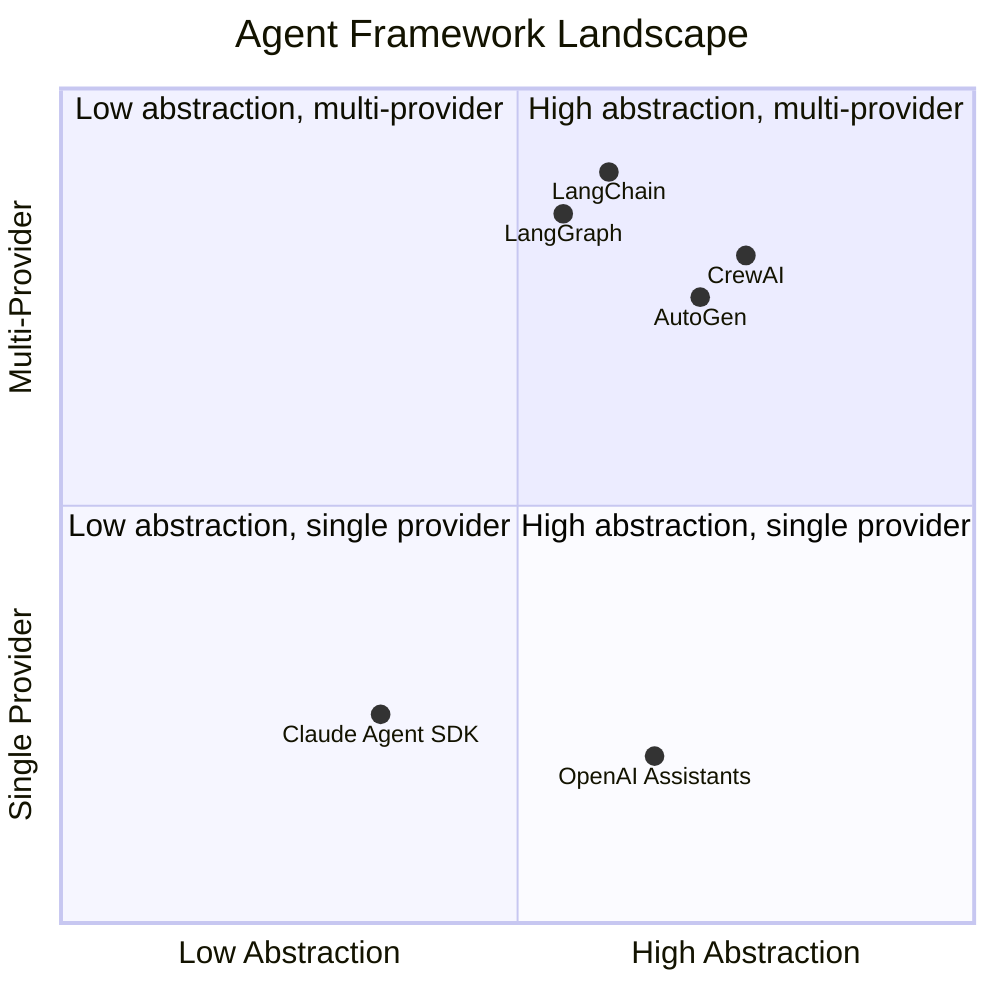
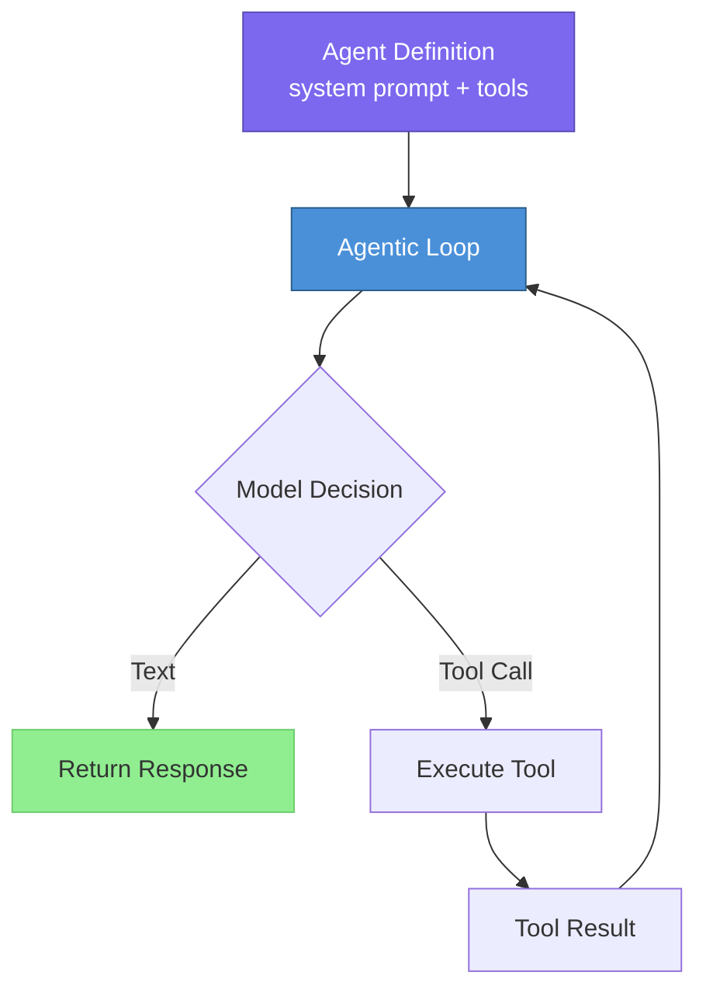
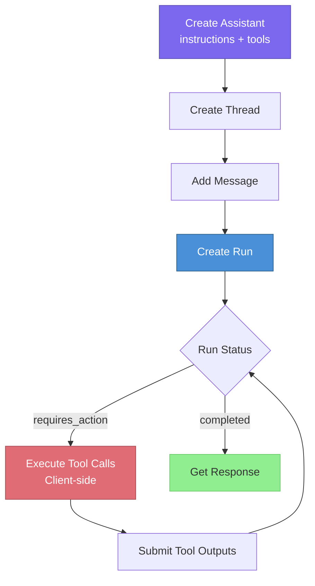
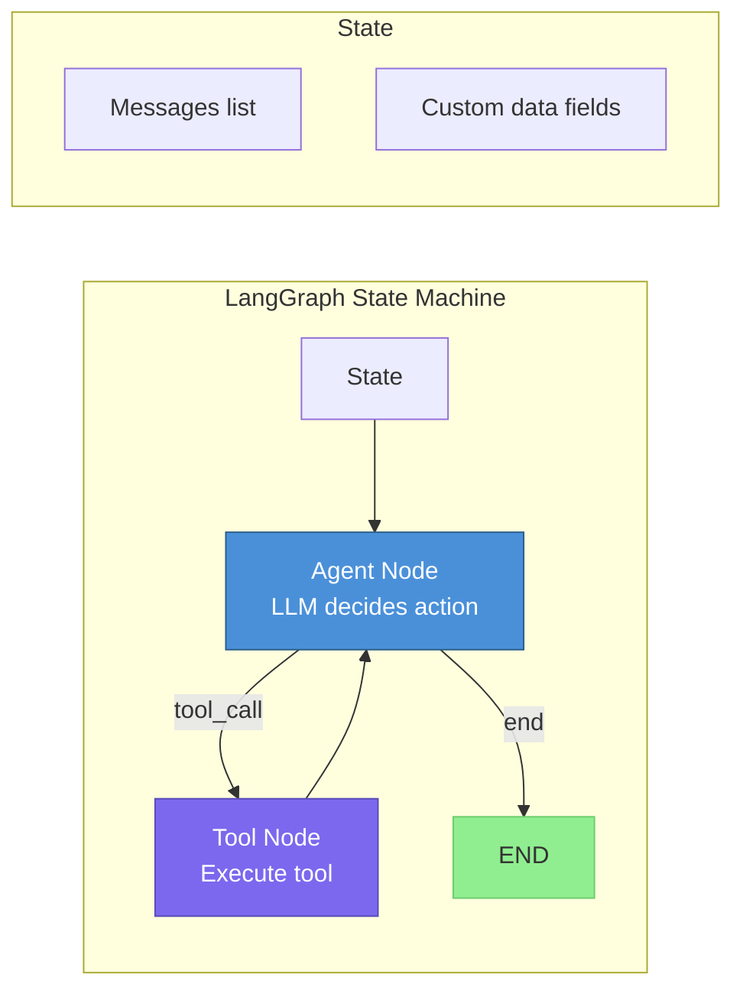
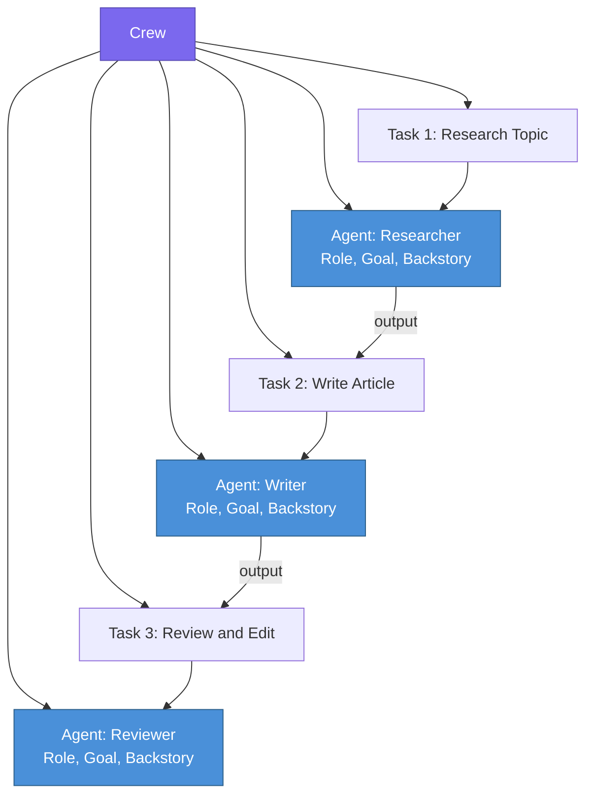
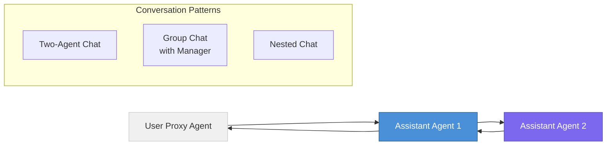
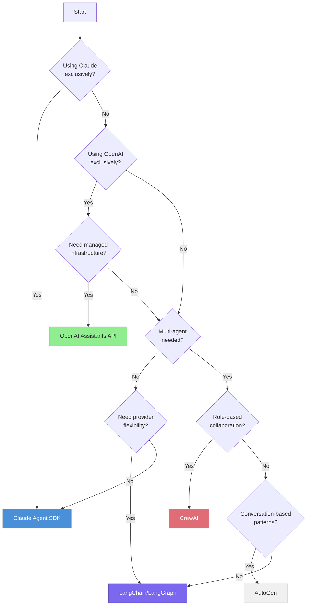

# Agent Frameworks

> **TL;DR:** Agent frameworks provide the scaffolding for building LLM-powered agents — tool integration, orchestration loops, memory, and multi-agent coordination. The landscape includes Claude Agent SDK, OpenAI Assistants API, LangChain/LangGraph, CrewAI, and AutoGen, each with distinct strengths and tradeoffs.

## Table of Contents

- [Why This Matters](#why-this-matters)
- [The Framework Landscape](#the-framework-landscape)
- [Claude Agent SDK](#claude-agent-sdk)
- [OpenAI Assistants API](#openai-assistants-api)
- [LangChain and LangGraph](#langchain-and-langgraph)
- [CrewAI](#crewai)
- [AutoGen](#autogen)
- [Framework Comparison](#framework-comparison)
- [How to Choose](#how-to-choose)
- [Key Takeaways](#key-takeaways)
- [References](#references)

## Why This Matters

Building an agent from scratch requires implementing tool calling, conversation management, error recovery, memory, and orchestration logic. Frameworks abstract these concerns, letting you focus on the agent's purpose rather than its plumbing. However, frameworks also impose architectural constraints and abstraction overhead. Choosing the right framework — or deciding to build without one — is one of the most consequential early decisions in an agent project.

## The Framework Landscape

The agent framework ecosystem can be organized by two axes: **abstraction level** (how much the framework manages for you) and **model flexibility** (whether it works with multiple LLM providers).

## Claude Agent SDK

Anthropic's Claude Agent SDK provides a minimal, opinionated framework for building agents with Claude models. Its design philosophy is "give the model a good system prompt and tools, then let it run in a loop."

### Architecture

### Key Features

- **Minimal abstraction**: Thin wrapper around Claude's tool use API with an agentic loop
- **First-class tool support**: Tools defined as Python functions with type annotations, automatically converted to JSON Schema
- **Guardrails**: Built-in support for input and output validation via guardrail functions
- **Handoffs**: Native support for transferring control between specialized agents
- **Tracing**: Built-in tracing for debugging and observability

### Strengths and Limitations

| Strengths | Limitations |
|---|---|
| Simple, easy to understand and debug | Claude-only — no other LLM providers |
| Minimal abstraction overhead | Newer framework with smaller ecosystem |
| Strong typing and guardrails built-in | Less built-in memory management |
| Designed by the model provider | Fewer pre-built integrations than LangChain |

## OpenAI Assistants API

OpenAI's Assistants API is a managed service that handles the agentic loop server-side. You define an assistant with instructions and tools, then create threads (conversations) that the API manages.

### Architecture

### Key Features

- **Managed conversation state**: Threads persist server-side, no need to manage message history
- **Built-in tools**: Code Interpreter (sandboxed Python execution), File Search (managed RAG), and custom function calling
- **File handling**: Upload files that the assistant can reference and search
- **Streaming**: Support for streaming partial responses and tool call events

### Strengths and Limitations

| Strengths | Limitations |
|---|---|
| Fully managed — no infrastructure to maintain | OpenAI-only — locked to GPT models |
| Built-in Code Interpreter and File Search | Less control over the orchestration loop |
| Persistent threads simplify multi-turn conversations | Pricing can be opaque (storage, retrieval costs) |
| Well-documented API | Debugging server-side runs is harder |

## LangChain and LangGraph

LangChain is the most widely adopted LLM framework, providing abstractions for chains, tools, memory, and retrieval. LangGraph extends LangChain with a graph-based orchestration layer for building stateful, multi-step agent workflows.

### LangChain Core Concepts

- **Chat Models**: Unified interface across providers (OpenAI, Anthropic, Google, local models)
- **Tools**: Standardized tool interface with hundreds of pre-built integrations
- **Chains**: Composable sequences of LLM calls and tool invocations
- **Retrievers**: Abstraction over vector stores, search engines, and other retrieval backends

### LangGraph Architecture

### Key Features

- **Provider-agnostic**: Works with any LLM provider through unified interfaces
- **Graph-based orchestration**: Define agent workflows as directed graphs with conditional edges
- **Checkpointing**: Built-in state persistence for pause/resume and human-in-the-loop workflows
- **Streaming**: First-class support for streaming tokens and intermediate events
- **LangSmith integration**: Tracing, evaluation, and monitoring platform

### Strengths and Limitations

| Strengths | Limitations |
|---|---|
| Largest ecosystem — hundreds of integrations | Abstraction layers add complexity and debugging difficulty |
| Provider-agnostic — switch models easily | Frequent API changes between versions |
| LangGraph enables complex multi-agent workflows | Learning curve is steep for LangGraph |
| Strong observability via LangSmith | Over-abstraction can obscure what the LLM actually sees |

## CrewAI

CrewAI is a framework for building multi-agent systems with a role-based metaphor. You define agents with roles, goals, and backstories, then compose them into crews that collaborate on tasks.

### Architecture

### Key Features

- **Role-based agents**: Define agents with natural language roles, goals, and backstories
- **Task delegation**: Agents can delegate sub-tasks to other agents
- **Sequential and parallel execution**: Crews can run tasks in sequence or in parallel
- **Process types**: Sequential, hierarchical (with a manager agent), or consensual
- **Built-in memory**: Short-term, long-term, and entity memory out of the box

### Strengths and Limitations

| Strengths | Limitations |
|---|---|
| Intuitive role-based metaphor | Less control over individual agent behavior |
| Easy to set up multi-agent workflows | Debugging multi-agent interactions is challenging |
| Good for content generation pipelines | Performance overhead from agent-to-agent communication |
| Active community and documentation | Less suitable for single-agent, tool-heavy workflows |

## AutoGen

AutoGen (Microsoft) is a framework for building multi-agent conversations. Its core concept is that agents communicate through messages, and complex behaviors emerge from structured conversations between agents.

### Architecture

### Key Features

- **Conversation-centric**: All agent interaction happens through message passing
- **Code execution**: Built-in Docker-based code execution for agents that write and run code
- **Flexible conversation patterns**: Two-agent, group chat, sequential chat, and nested chat topologies
- **Human-in-the-loop**: User proxy agents can inject human input at any point
- **Model agnostic**: Supports OpenAI, Anthropic, local models, and Azure OpenAI

### Strengths and Limitations

| Strengths | Limitations |
|---|---|
| Flexible conversation patterns | Conversation-based metaphor can feel indirect for tool-use agents |
| Strong code execution support | Configuration can be verbose |
| Good for research and experimentation | AutoGen v0.2 to v0.4 migration introduced breaking changes |
| Microsoft backing and active development | Less opinionated — requires more design decisions |

## Framework Comparison

| Feature | Claude Agent SDK | OpenAI Assistants | LangChain/LangGraph | CrewAI | AutoGen |
|---|---|---|---|---|---|
| **Model support** | Claude only | GPT only | Multi-provider | Multi-provider | Multi-provider |
| **Abstraction level** | Low | Medium-high | Medium-high | High | Medium |
| **Multi-agent** | Via handoffs | No (single assistant) | Yes (LangGraph) | Yes (core feature) | Yes (core feature) |
| **Memory management** | Manual | Managed (threads) | Checkpointing | Built-in | Conversation history |
| **Tool ecosystem** | Growing | Built-in + custom | Extensive (500+) | Moderate | Moderate |
| **Observability** | Built-in tracing | Run step API | LangSmith | Limited | AgentOps integration |
| **Learning curve** | Low | Low-medium | Medium-high | Low-medium | Medium |
| **Production readiness** | Maturing | Production | Production | Maturing | Maturing |
| **Open source** | Yes | No (API service) | Yes | Yes | Yes |
| **Best for** | Claude-native apps | Quick prototypes | Complex workflows | Multi-agent content | Research, code agents |

## How to Choose

### Decision Factors

| Factor | Recommendation |
|---|---|
| **Prototyping speed** | OpenAI Assistants or CrewAI — fastest time to first demo |
| **Production reliability** | Claude Agent SDK or LangGraph — most control over behavior |
| **Provider independence** | LangChain/LangGraph — unified interface across providers |
| **Multi-agent workflows** | LangGraph (complex), CrewAI (simple), AutoGen (conversational) |
| **Minimal dependencies** | Claude Agent SDK — thinnest abstraction layer |
| **Existing ecosystem** | LangChain — largest library of integrations and examples |
| **Code generation agents** | AutoGen — best built-in code execution support |

### When to Build Without a Framework

Consider avoiding frameworks when:

- Your agent is simple (single tool, single turn) and a framework adds unnecessary complexity
- You need very precise control over every aspect of the LLM interaction
- Framework abstractions hide behavior that is critical to debug in your domain
- You are building a highly specialized agent where the framework's assumptions do not apply

Anthropic's own guidance emphasizes starting with direct API calls and only adding framework abstractions when the complexity justifies them.

## Key Takeaways

- Agent frameworks handle orchestration, tool integration, memory, and multi-agent coordination
- Claude Agent SDK and OpenAI Assistants are provider-specific but offer tight model integration
- LangChain/LangGraph provides the broadest ecosystem but has a steep learning curve
- CrewAI excels at role-based multi-agent collaboration; AutoGen at conversation-based patterns
- Choose based on model requirements, multi-agent needs, ecosystem size, and desired abstraction level
- For simple agents, consider building without a framework — frameworks add value primarily for complex workflows

## References

- Anthropic. (2025). "Claude Agent SDK Documentation." [github.com/anthropics/claude-code-sdk](https://github.com/anthropics/claude-code-sdk)
- OpenAI. (2024). "Assistants API Documentation." [platform.openai.com/docs/assistants](https://platform.openai.com/docs/assistants)
- LangChain. (2024). "LangGraph Documentation." [langchain-ai.github.io/langgraph](https://langchain-ai.github.io/langgraph)
- CrewAI. (2024). "CrewAI Documentation." [docs.crewai.com](https://docs.crewai.com)
- Wu, Q. et al. (2023). "AutoGen: Enabling Next-Gen LLM Applications via Multi-Agent Conversation." [arXiv:2308.08155](https://arxiv.org/abs/2308.08155)
- Anthropic. (2024). "Building Effective Agents." [anthropic.com](https://www.anthropic.com/engineering/building-effective-agents)
