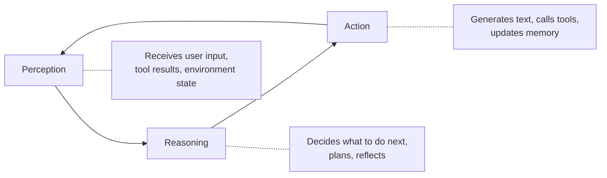
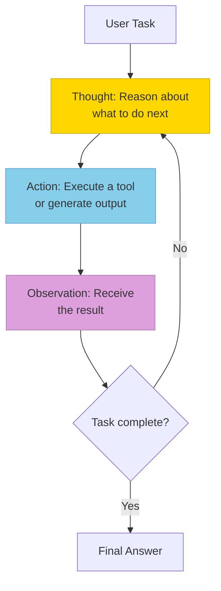
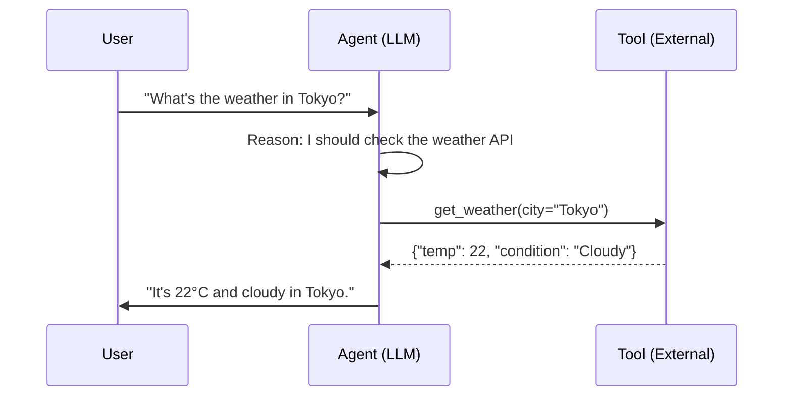
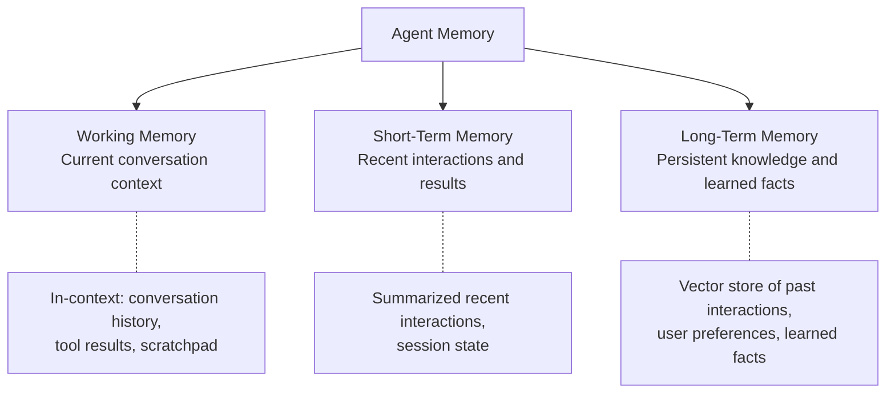
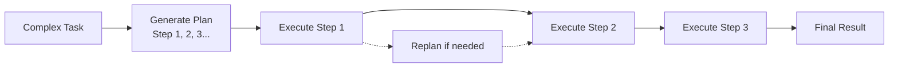
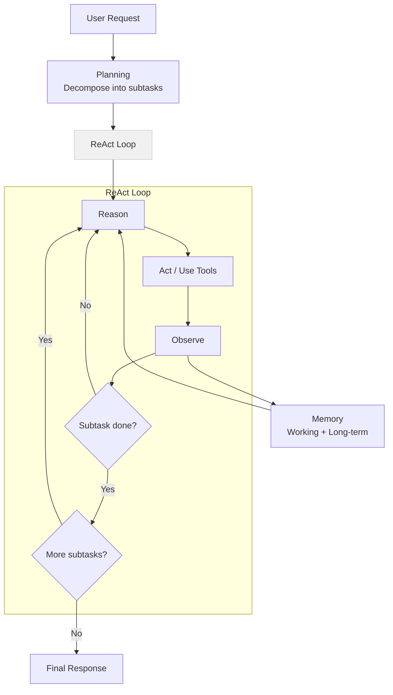

# Agent Fundamentals

> **TL;DR:** An AI agent is an LLM operating in a loop — perceiving its environment, reasoning about what to do, taking actions (including using tools), and observing results. The core patterns are ReAct (interleaving reasoning and acting), tool use (extending capabilities through function calling), memory (retaining information across steps), and planning (decomposing complex tasks). These building blocks combine to create systems that can autonomously accomplish multi-step goals.

## Table of Contents
- [Why This Matters](#why-this-matters)
- [What Makes an LLM an "Agent"?](#what-makes-an-llm-an-agent)
- [The ReAct Pattern](#the-react-pattern)
- [Tool Use and Function Calling](#tool-use-and-function-calling)
- [Memory Patterns](#memory-patterns)
- [Planning Strategies](#planning-strategies)
- [Putting It Together](#putting-it-together)
- [Key Takeaways](#key-takeaways)
- [References](#references)

## Why This Matters

A standard LLM call is stateless — you send a prompt, get a response, done. But many real-world tasks require multiple steps, tool use, and adaptive decision-making. Agents bridge this gap. Understanding agent patterns is essential for building applications that go beyond Q&A: research assistants, coding tools, data analysis pipelines, and autonomous workflows.

## What Makes an LLM an "Agent"?

An LLM becomes an agent when it operates in a **perception-reasoning-action loop** rather than a single prompt-response cycle. The three defining characteristics are:



| Component | LLM (Standard) | Agent |
|---|---|---|
| **Perception** | Single user prompt | User input + tool results + memory + environment state |
| **Reasoning** | Single forward pass | Multi-step: plan, decide, reflect, revise |
| **Action** | Generate text | Generate text, call tools, execute code, modify state |
| **State** | Stateless | Maintains working memory across steps |
| **Termination** | After one response | When the task is complete (or budget exhausted) |

The key shift: an agent **decides what to do next** based on what it has learned so far, rather than just responding to a static prompt.

## The ReAct Pattern

**ReAct** (Reason + Act) is the foundational pattern for LLM agents. Introduced by Yao et al. (2022), it interleaves **reasoning traces** (thinking about what to do) with **actions** (doing it) and **observations** (seeing the result).



### Example ReAct Trace

```
User: What's the population of the capital of France?

Thought: I need to find the capital of France, then look up its population.
Action: search("capital of France")
Observation: The capital of France is Paris.

Thought: Now I know the capital is Paris. I need to find its population.
Action: search("population of Paris 2024")
Observation: The population of Paris is approximately 2.1 million (city proper).

Thought: I have the answer now.
Final Answer: The population of Paris, the capital of France, is approximately
2.1 million (city proper) or 12.2 million (metropolitan area).
```

### Why ReAct Works

- **Reasoning traces** make the agent's decision-making transparent and debuggable
- **Interleaving** prevents the model from hallucinating answers it could verify with tools
- **Grounding** each step in real observations keeps the agent anchored in reality
- **Error recovery** — if an action fails, the reasoning step can adapt

### ReAct vs. Chain-of-Thought

| Approach | Reasoning | Grounding | Use Case |
|---|---|---|---|
| **Chain-of-Thought (CoT)** | Yes (think step by step) | No (pure reasoning) | Math, logic, analysis |
| **ReAct** | Yes | Yes (via tool use) | Tasks requiring external information |
| **Act-only** | No | Yes | Simple tool-use pipelines |

ReAct combines the strengths of CoT (structured reasoning) with the grounding of tool use, making it the default pattern for most agent implementations.

## Tool Use and Function Calling

**Tool use** extends an agent's capabilities beyond text generation. Instead of relying solely on the model's training data, the agent can call external functions to retrieve information, perform calculations, modify state, or interact with APIs.

### How Function Calling Works

Modern LLM APIs (OpenAI, Anthropic, Google) support structured **function calling**: you define available tools with their parameters, and the model generates structured calls when appropriate.



### Common Tool Categories

| Category | Examples | Purpose |
|---|---|---|
| **Information Retrieval** | Web search, database queries, RAG | Access current or private knowledge |
| **Computation** | Calculator, code interpreter, data analysis | Precise calculations the LLM can't do reliably |
| **State Modification** | File system, database writes, API calls | Change the world (create, update, delete) |
| **Communication** | Email, Slack, notifications | Interact with humans or other systems |
| **Code Execution** | Python interpreter, shell commands | Run arbitrary code for complex tasks |

### Tool Design Principles

1. **Clear descriptions** — The model selects tools based on their descriptions. Write them as you would for a new team member.
2. **Typed parameters** — Use JSON Schema to define expected inputs. The model generates better calls with clear types and constraints.
3. **Informative responses** — Return enough context for the model to interpret the result and decide next steps.
4. **Error handling** — Return clear error messages rather than cryptic failures. The agent needs to reason about what went wrong.
5. **Minimal side effects** — Prefer read-only tools where possible. Make destructive tools explicit and confirmable.

## Memory Patterns

Standard LLM calls are stateless — each call is independent. Agents need **memory** to maintain context across steps and conversations.



### Working Memory (Context Window)

The simplest form of memory: the current conversation context. Everything in the prompt — user messages, assistant responses, tool calls, and results — is working memory. Limited by the model's context window.

**Challenge:** Context windows are finite. As conversations grow, you need strategies to manage what stays in context.

### Short-Term Memory

Information retained within a session but managed to fit context limits:

- **Summarization** — Periodically summarize earlier parts of the conversation, replacing verbose history with compressed summaries
- **Sliding window** — Keep only the last N messages in full, summarizing older ones
- **Scratchpad** — A dedicated space for the agent to write notes, intermediate results, and plans

### Long-Term Memory

Information that persists across sessions:

- **Vector store** — Embed and store past interactions, facts, and preferences. Retrieve relevant memories when they might be useful.
- **Key-value store** — Store specific facts (user preferences, project context) for exact retrieval.
- **Structured knowledge** — Maintain a knowledge graph or database of learned facts and relationships.

### Memory Architecture Example

```
User: "Remember that I prefer Python over JavaScript for backend work."

Agent:
1. Working Memory: Conversation includes this preference
2. Long-Term Memory: Store {"user_preference": "backend_language", "value": "Python"}
3. Future Sessions: Retrieve this preference when relevant
```

## Planning Strategies

Complex tasks require **planning** — decomposing a goal into subtasks, ordering them, and adapting when things go wrong.

### Plan-and-Execute

Generate a full plan upfront, then execute each step:



**Pros:** Clear structure, easy to monitor progress
**Cons:** Upfront plan may not account for discoveries during execution

### Iterative Refinement

Execute one step at a time, replanning after each observation:

**Pros:** Highly adaptive, handles unexpected results
**Cons:** Can lose focus, more expensive (replans at every step)

### Hierarchical Planning

Break complex tasks into subtasks, each handled by a specialized sub-agent or subroutine:

**Pros:** Manages complexity, enables specialization
**Cons:** Coordination overhead, potential for miscommunication between levels

### When to Use Each

| Strategy | Best For |
|---|---|
| **Plan-and-Execute** | Well-defined tasks with predictable steps (data pipeline, report generation) |
| **Iterative (ReAct)** | Exploratory tasks where each step informs the next (research, debugging) |
| **Hierarchical** | Complex tasks requiring diverse skills (code review + testing + documentation) |

## Putting It Together

A complete agent combines all these patterns:



Real agent frameworks (LangChain, LangGraph, CrewAI) implement variations of this pattern. The next page, [Multi-Agent Architectures](multi-agent-architectures.md), covers how to compose multiple agents into collaborative systems.

## Key Takeaways

- An agent is an LLM in a **perception-reasoning-action loop**, not a single prompt-response
- **ReAct** (Reason + Act) is the foundational pattern — interleave thinking with tool use and observation
- **Tool use** extends agent capabilities beyond the model's training data to real-world actions
- **Memory** comes in three tiers: working (context window), short-term (session), and long-term (persistent)
- **Planning** strategies range from upfront plans to iterative refinement to hierarchical decomposition
- These building blocks compose into systems that can autonomously handle multi-step, real-world tasks

## References

1. Yao et al., "ReAct: Synergizing Reasoning and Acting in Language Models," 2022. [arXiv:2210.03629](https://arxiv.org/abs/2210.03629)
2. Schick et al., "Toolformer: Language Models Can Teach Themselves to Use Tools," 2023. [arXiv:2302.04761](https://arxiv.org/abs/2302.04761)
3. Park et al., "Generative Agents: Interactive Simulacra of Human Behavior," 2023. [arXiv:2304.03442](https://arxiv.org/abs/2304.03442)
4. Wei et al., "Chain-of-Thought Prompting Elicits Reasoning in Large Language Models," 2022. [arXiv:2201.11903](https://arxiv.org/abs/2201.11903)
5. Wang et al., "A Survey on Large Language Model Based Autonomous Agents," 2023. [arXiv:2308.11432](https://arxiv.org/abs/2308.11432)
