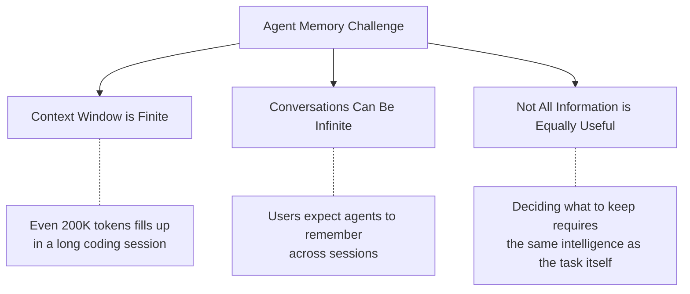
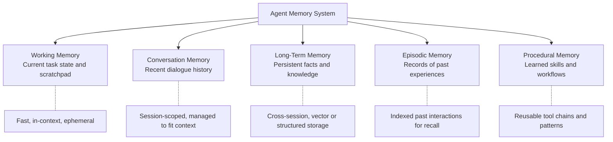
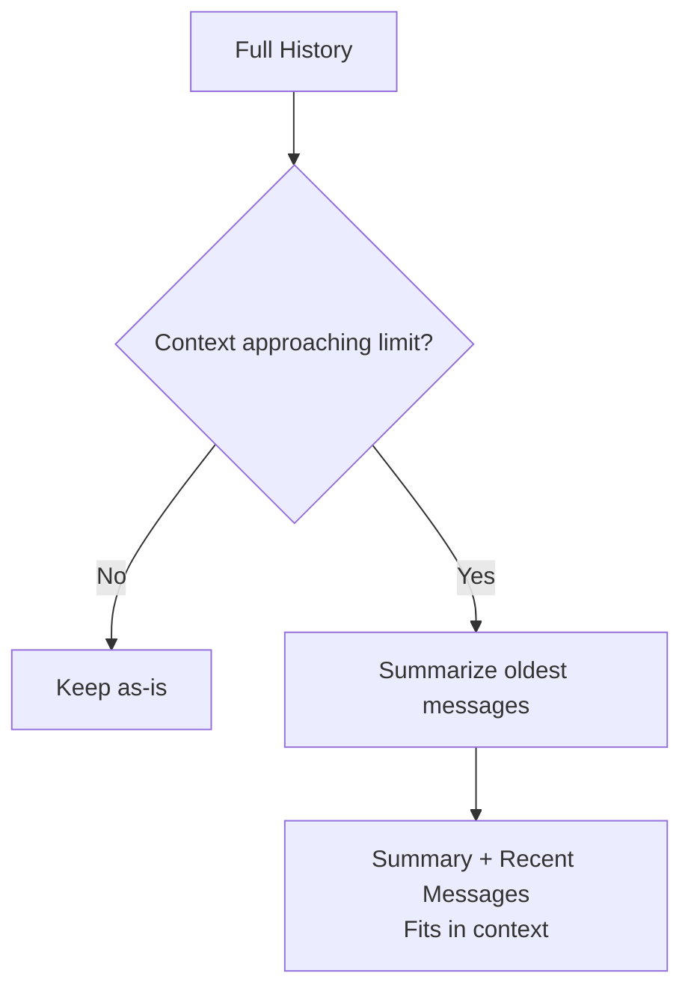
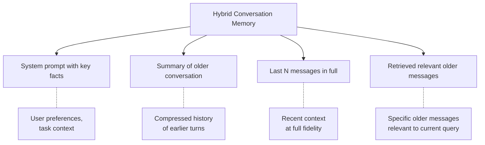
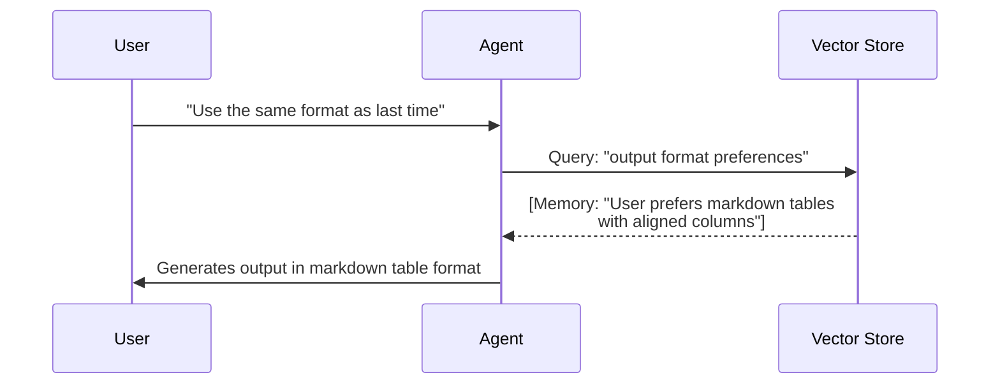
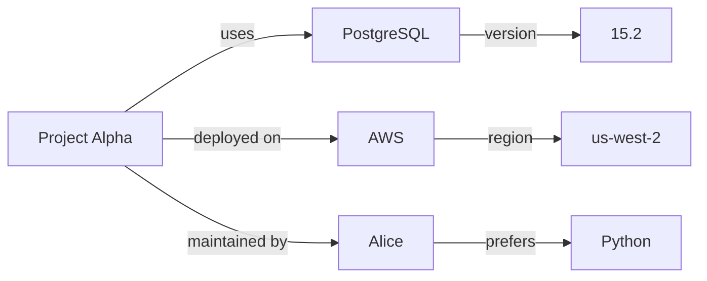
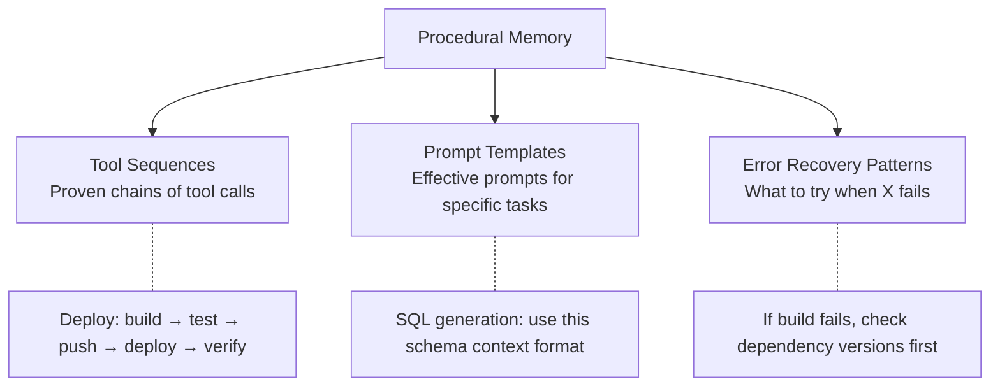
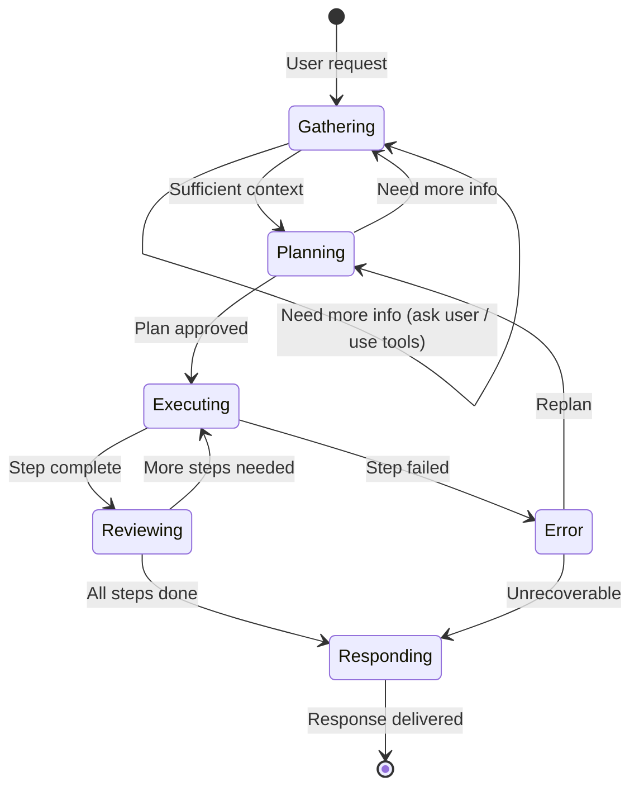
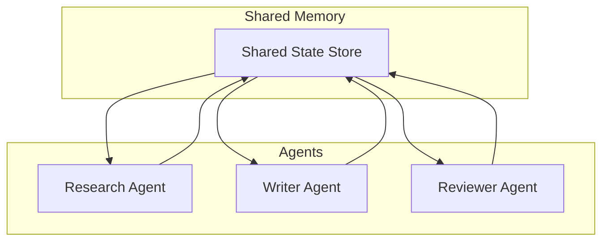
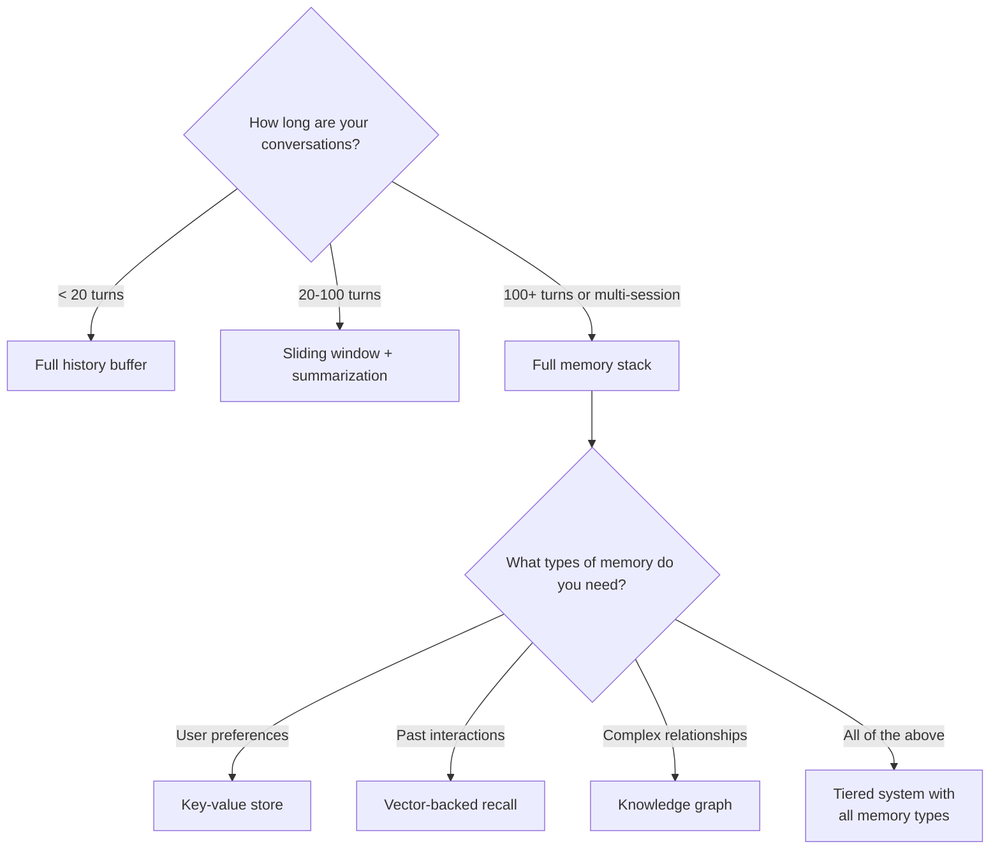

# Memory and State Management

> **TL;DR:** Agent memory is the bridge between stateless LLM calls and persistent, context-aware behavior. Effective memory systems combine multiple tiers — conversation buffers, summarization, vector-backed recall, and structured stores — each with distinct trade-offs in fidelity, cost, and latency. The architecture you choose determines whether your agent can handle 5-turn conversations or 5-month relationships.

## Table of Contents
- [Why This Matters](#why-this-matters)
- [The Memory Problem](#the-memory-problem)
- [Memory Architecture Overview](#memory-architecture-overview)
- [Conversation Memory](#conversation-memory)
  - [Full History Buffer](#full-history-buffer)
  - [Sliding Window](#sliding-window)
  - [Summarization Memory](#summarization-memory)
  - [Hybrid Approaches](#hybrid-approaches)
- [Long-Term Memory](#long-term-memory)
  - [Vector-Backed Recall](#vector-backed-recall)
  - [Key-Value Stores](#key-value-stores)
  - [Knowledge Graphs](#knowledge-graphs)
- [Episodic Memory](#episodic-memory)
- [Procedural Memory](#procedural-memory)
- [Working Memory and Scratchpads](#working-memory-and-scratchpads)
- [State Management Patterns](#state-management-patterns)
  - [Checkpointing](#checkpointing)
  - [State Machines for Agents](#state-machines-for-agents)
  - [Rollback and Recovery](#rollback-and-recovery)
- [Memory in Multi-Agent Systems](#memory-in-multi-agent-systems)
- [Evaluation and Failure Modes](#evaluation-and-failure-modes)
- [Practical Guidelines](#practical-guidelines)
- [Key Takeaways](#key-takeaways)
- [References](#references)

## Why This Matters

An LLM without memory is like a person with amnesia — brilliant in the moment but unable to learn from experience, recall prior context, or maintain coherent long-term behavior. For agents operating over multiple turns, sessions, or tasks, memory is what transforms a stateless text generator into a useful assistant.

Memory is also one of the hardest problems in agent design. The context window is finite and expensive, retrieval is imperfect, and deciding what to remember — and what to forget — requires judgment the LLM itself must provide.

## The Memory Problem

Every agent faces a fundamental tension:



The naive approach — stuff the entire conversation history into every prompt — fails for three reasons:

| Problem | Why It Matters |
|---|---|
| **Context overflow** | Conversations exceed the context window, causing truncation or failure |
| **Context rot** | Performance degrades as context grows, even within the window (see [Context Engineering](../02-retrieval-augmented-generation/context-engineering.md)) |
| **Cost** | Sending the full history with every request multiplies token costs linearly with conversation length |

## Memory Architecture Overview

A well-designed agent memory system mirrors the tiers found in human cognition and computer architecture:



| Tier | Scope | Storage | Latency | Fidelity |
|---|---|---|---|---|
| **Working memory** | Current step | In-context | None | Perfect |
| **Conversation memory** | Current session | In-context (managed) | None | High (may summarize) |
| **Long-term memory** | Cross-session | Vector DB / KV store | Retrieval time | Varies by implementation |
| **Episodic memory** | Cross-session | Indexed store | Retrieval time | Compressed |
| **Procedural memory** | Cross-session | Prompt library / tools | Lookup time | Encoded |

## Conversation Memory

Managing dialogue history within a single session is the most fundamental memory challenge.

### Full History Buffer

The simplest approach: include every message in every prompt.

```
System: You are a helpful assistant.
User: What's the weather in Paris?
Assistant: It's 22°C and sunny in Paris today.
User: What about London?
Assistant: London is 16°C with light rain.
User: Compare the two.        ← All prior messages included
```

**Pros:** Perfect fidelity, no information loss, trivial to implement
**Cons:** Context window fills up, cost scales linearly, performance degrades at long contexts

**When to use:** Short conversations (< 20 turns), prototyping, when fidelity is critical.

### Sliding Window

Keep the last N messages in full, discard older ones.


**Pros:** Bounded context size, simple to implement, predictable cost
**Cons:** Abrupt information loss — the agent suddenly forgets earlier context, which can cause confusion if the user references something outside the window

**Window size selection:**

| Turn Count | Typical Token Budget | Good For |
|---|---|---|
| Last 5 turns | ~2K–5K tokens | Quick Q&A, simple tool use |
| Last 20 turns | ~10K–20K tokens | Extended problem-solving |
| Last 50 turns | ~25K–50K tokens | Long coding sessions (requires large context model) |

### Summarization Memory

Periodically compress older messages into summaries, keeping recent messages in full.



**Implementation:**

```
System: You are a helpful assistant.

[Summary of earlier conversation]:
The user asked about weather in Paris (22°C, sunny) and London (16°C, rain).
They are planning a weekend trip and prefer warm weather.

User: What about Barcelona?
Assistant: Barcelona is 28°C and sunny — warmer than both Paris and London.
```

**Summarization strategies:**

| Strategy | Description | Trade-off |
|---|---|---|
| **Rolling summary** | Summarize after every N turns, append to running summary | Can accumulate distortion over many summaries |
| **Hierarchical summary** | Summarize blocks of turns, then summarize summaries | Better compression, more information loss at lower levels |
| **Incremental update** | Update a structured summary document (key facts, decisions, open questions) | Preserves structure, requires good extraction |

**The summarization paradox:** Creating summaries requires an LLM call, which adds cost and latency. For conversations that are already short, the overhead exceeds the savings. Summarization pays off for long conversations where the alternative is context overflow.

### Hybrid Approaches

The most effective conversation memory combines multiple strategies:



This mirrors how human conversation works: you remember the overall context of a discussion, the last few things said in detail, and can recall specific earlier points when they become relevant.

## Long-Term Memory

Information that persists across sessions requires external storage and retrieval.

### Vector-Backed Recall

Store embeddings of past interactions, facts, and preferences in a vector database. Retrieve relevant memories when they might inform the current task.



**What to store:**

| Memory Type | Example | Embedding Strategy |
|---|---|---|
| **User preferences** | "Prefers Python over JavaScript" | Embed the preference statement |
| **Factual context** | "Project uses PostgreSQL 15" | Embed as a fact |
| **Interaction summaries** | "Session on 2024-03-15: debugged auth flow" | Embed session summary |
| **Decisions and rationale** | "Chose Redis for caching because of latency requirements" | Embed decision + reasoning |

**Retrieval challenges:**

- **Relevance scoring:** Not all memories are equally useful. A preference stated 6 months ago may no longer apply.
- **Temporal decay:** Recent memories should generally be weighted higher, but some facts (like user preferences) remain relevant indefinitely.
- **Contradiction resolution:** If the user said "I prefer tabs" in January and "I prefer spaces" in March, the system must handle the conflict.

### Key-Value Stores

For structured facts that need exact retrieval rather than semantic similarity:

```json
{
  "user_name": "Alice",
  "preferred_language": "Python",
  "project_database": "PostgreSQL 15",
  "timezone": "US/Pacific",
  "code_style": "black formatter, 88 char line width"
}
```

**Pros:** Exact retrieval, no embedding drift, easy to update and inspect
**Cons:** Requires explicit extraction and categorization, doesn't scale to unstructured knowledge

**Best for:** User preferences, configuration, facts that change rarely and need exact recall.

### Knowledge Graphs

Represent relationships between entities as a graph, enabling multi-hop reasoning about stored knowledge.



**Pros:** Rich relational queries ("What database does Alice's project use?"), supports multi-hop reasoning
**Cons:** Complex to build and maintain, entity extraction is error-prone, overkill for most applications

**When to use:** Agents that manage complex domains with many interconnected entities — enterprise knowledge bases, multi-project development environments, research assistants tracking papers and citations.

## Episodic Memory

Episodic memory stores **records of past experiences** — not just facts, but the context in which they occurred. This allows the agent to learn from past successes and failures.

```
Episode: 2024-03-15 debugging session
- Task: Fix authentication timeout
- Actions taken: Checked logs → Found connection pool exhaustion → Increased pool size
- Outcome: Resolved. Root cause was connection leak in middleware.
- Lesson: Check connection pool metrics when seeing intermittent timeouts.
```

**Implementation approaches:**

| Approach | Description |
|---|---|
| **Session summaries** | Summarize each session and store with metadata (task, outcome, duration) |
| **Trajectory logging** | Store the full sequence of thought-action-observation steps |
| **Outcome-indexed** | Index episodes by task type and outcome (success/failure) for retrieval during similar future tasks |

**Value of episodic memory:** When an agent encounters a problem similar to one it has solved before, retrieving the relevant episode can dramatically improve performance — especially for rare or complex failure modes that aren't well-represented in the base model's training data.

## Procedural Memory

Procedural memory captures **how to do things** — learned workflows, tool chains, and multi-step procedures that the agent has successfully used before.



**How it differs from episodic memory:** Episodic memory answers "What happened last time?" Procedural memory answers "What should I do?"

**Implementation:** Typically stored as reusable prompt fragments, tool chain definitions, or few-shot examples that are injected when the agent encounters a matching task type.

## Working Memory and Scratchpads

Working memory is the agent's in-context thinking space for the current task — intermediate results, plans, and notes.

### The Scratchpad Pattern

Give the agent an explicit scratchpad section in the prompt where it can write notes, track progress, and store intermediate results:

```
[Scratchpad]
- Searched for user authentication files: found auth.py, middleware.py
- auth.py uses JWT tokens with 30-minute expiry
- middleware.py has a connection pool size of 5 (seems low)
- TODO: Check if connection pool size is configurable
- TODO: Look at error logs for connection exhaustion
```

**Why scratchpads help:**

- **Externalized reasoning:** The agent can organize its thoughts without consuming the conversation thread
- **Persistent across steps:** Unlike chain-of-thought, scratchpad content persists across tool calls
- **Inspectable:** Developers can read the scratchpad to understand the agent's reasoning

### State Tracking

For multi-step tasks, maintain explicit state that the agent updates at each step:

```json
{
  "task": "Refactor authentication module",
  "status": "in_progress",
  "completed_steps": ["Read existing code", "Identified dependencies"],
  "current_step": "Write new token validation logic",
  "remaining_steps": ["Update tests", "Run test suite"],
  "key_findings": ["3 files depend on auth.py", "No existing tests for token refresh"]
}
```

## State Management Patterns

Beyond memory content, agents need robust patterns for managing execution state.

### Checkpointing

Save the agent's complete state at intervals so execution can be resumed after interruptions.


**What to checkpoint:**
- Conversation history
- Tool call results
- Scratchpad / working memory
- Current plan and progress

**When to checkpoint:**
- After each successful tool call (for recovery)
- Before expensive or irreversible operations (for rollback)
- At natural task boundaries (for resume)

### State Machines for Agents

Model complex agent workflows as explicit state machines, where each state defines the available actions and transitions.



**Benefits of explicit state machines:**
- Prevent the agent from skipping steps or going in circles
- Make the agent's behavior predictable and testable
- Enable structured error handling at each state
- Provide clear hooks for human oversight

LangGraph is built around this pattern — see [Agent Frameworks](agent-frameworks.md) for details.

### Rollback and Recovery

When an agent takes an action that produces an unexpected result, it needs to decide whether to continue, retry, or undo.

| Strategy | When to Use |
|---|---|
| **Retry** | Transient errors (API timeouts, rate limits) |
| **Replan** | Action succeeded but result was unexpected |
| **Rollback** | Action had side effects that need to be undone (file changes, API calls) |
| **Escalate** | Agent cannot resolve the issue autonomously; ask the user |

**Key principle:** Agents should prefer reversible actions and maintain enough state to undo recent changes. This is especially important for agents that modify code, databases, or external systems.

## Memory in Multi-Agent Systems

When multiple agents collaborate (see [Multi-Agent Architectures](multi-agent-architectures.md)), memory introduces additional coordination challenges.



### Memory Sharing Patterns

| Pattern | Description | Trade-off |
|---|---|---|
| **Shared blackboard** | All agents read/write to a common state store | Simple but can create conflicts |
| **Message passing** | Agents communicate through explicit messages; each maintains own memory | Clean boundaries but higher overhead |
| **Hierarchical** | Supervisor agent manages shared state; sub-agents have local memory only | Clear ownership but supervisor is a bottleneck |
| **Event log** | Append-only log of all agent actions; each agent reads what it needs | Full audit trail but agents must filter relevance |

**The coordination problem:** If Agent A discovers a fact and updates shared memory, Agent B needs to be aware of the update — but re-reading all of shared memory at every step is expensive. This is analogous to cache coherence in computer architecture.

## Evaluation and Failure Modes

### Common Memory Failures

| Failure | Symptom | Cause |
|---|---|---|
| **Amnesia** | Agent forgets something said 5 turns ago | Sliding window too small, no summarization |
| **Hallucinated memory** | Agent "remembers" something that never happened | Memory retrieval returned a semantically similar but wrong result |
| **Stale memory** | Agent uses outdated information | No temporal decay or update mechanism |
| **Context confusion** | Agent mixes up context from different sessions or users | Shared memory without proper scoping |
| **Summary drift** | Summarized information becomes progressively less accurate | Repeated summarization compounds distortion |

### Testing Memory Systems

1. **Multi-turn consistency:** Ask the agent to recall information from earlier in the conversation at increasing distances.
2. **Cross-session recall:** Close and reopen a session, then reference prior context.
3. **Contradiction handling:** Provide conflicting information at different points and verify the agent uses the most recent.
4. **Distractor robustness:** Fill memory with many entries and verify the agent retrieves the right one.
5. **Graceful degradation:** Exceed the memory system's capacity and verify the agent degrades gracefully rather than failing silently.

## Practical Guidelines

### Choosing a Memory Architecture



### Implementation Recommendations

1. **Start simple.** Full history buffer for short conversations, sliding window + summary for longer ones. Add complexity only when you hit limits.
2. **Separate concerns.** Don't mix conversation memory with long-term facts. Use distinct stores with clear interfaces.
3. **Make memory inspectable.** Log what the agent remembers and retrieves. Memory bugs are hard to diagnose without visibility.
4. **Handle failures gracefully.** If memory retrieval fails, the agent should proceed with what it has rather than crash.
5. **Scope memory per user.** Never leak one user's memory into another user's session.
6. **Implement forgetting.** Without explicit forgetting mechanisms (TTL, relevance decay, capacity limits), memory stores grow unbounded and retrieval quality degrades.

## Key Takeaways

- Agent memory is a multi-tier system: working memory (in-context), conversation memory (session-scoped), and long-term memory (persistent across sessions).
- **Conversation memory** management — full buffer, sliding window, summarization, or hybrid — is the most impactful architectural choice for most agent applications.
- **Long-term memory** options include vector-backed recall (flexible, semantic), key-value stores (exact, structured), and knowledge graphs (relational, complex).
- **Episodic memory** (past experiences) and **procedural memory** (learned workflows) enable agents to improve over time.
- **State management** — checkpointing, state machines, and rollback — provides resilience for multi-step agent tasks.
- Multi-agent systems introduce memory coordination challenges analogous to distributed systems.
- Start with the simplest memory architecture that works for your conversation length, and add tiers only when you hit concrete limits.

## References

1. Park, J. S. et al. (2023). "Generative Agents: Interactive Simulacra of Human Behavior." [arXiv:2304.03442](https://arxiv.org/abs/2304.03442)
2. Wang, L. et al. (2023). "A Survey on Large Language Model Based Autonomous Agents." [arXiv:2308.11432](https://arxiv.org/abs/2308.11432)
3. Zhang, Z. et al. (2024). "A Survey on the Memory Mechanism of Large Language Model Based Agents." [arXiv:2404.13501](https://arxiv.org/abs/2404.13501)
4. Packer, C. et al. (2023). "MemGPT: Towards LLMs as Operating Systems." [arXiv:2310.08560](https://arxiv.org/abs/2310.08560)
5. Modarressi, A. et al. (2023). "RET-LLM: Towards a General Read-Write Memory for Large Language Models." [arXiv:2305.14322](https://arxiv.org/abs/2305.14322)
6. Liu, N. F. et al. (2023). "Lost in the Middle: How Language Models Use Long Contexts." [arXiv:2307.03172](https://arxiv.org/abs/2307.03172)
