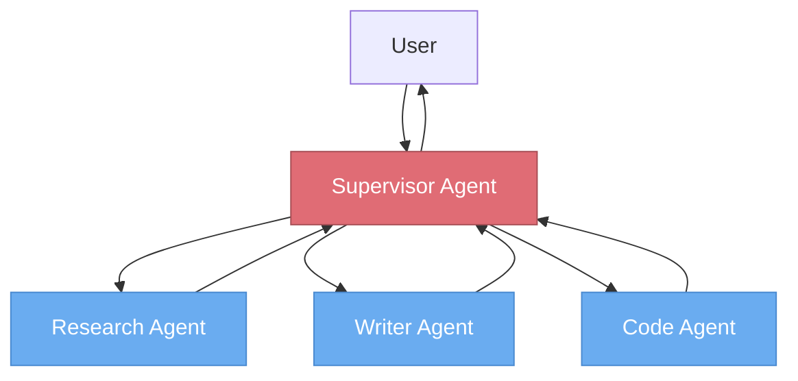
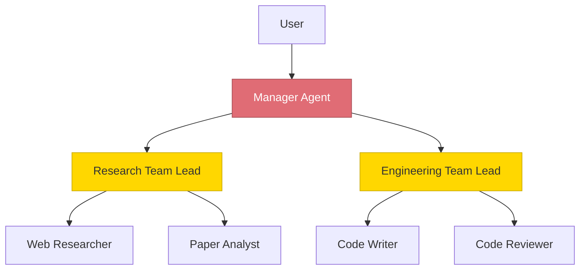
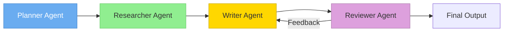
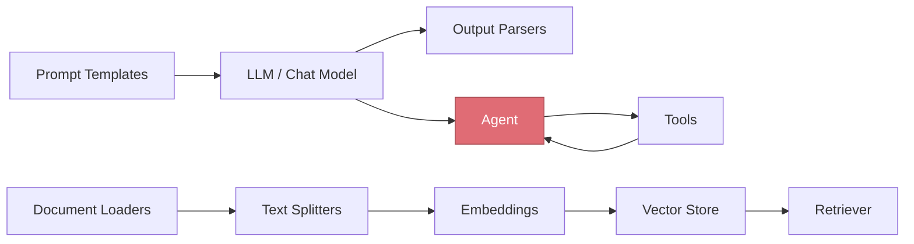
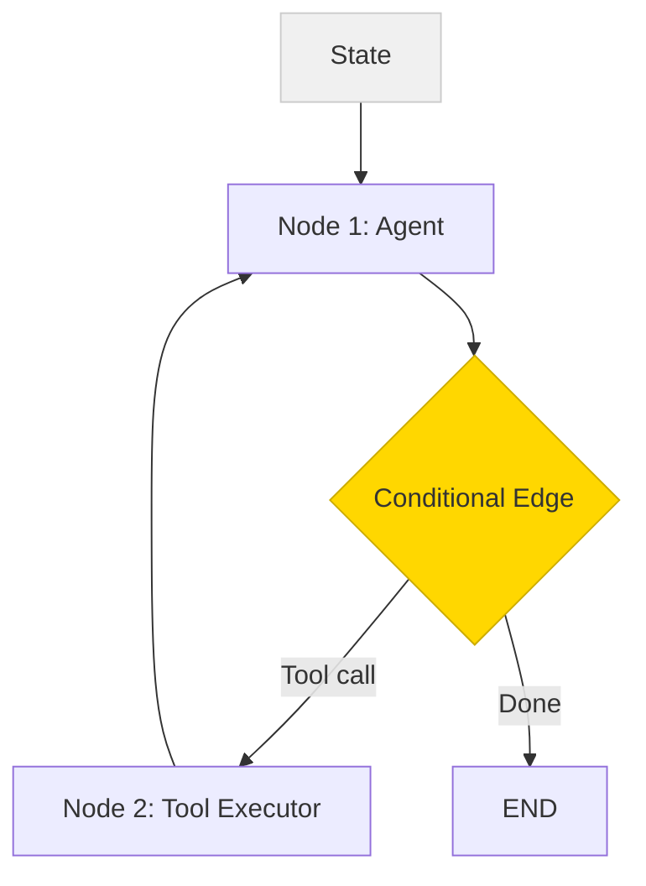
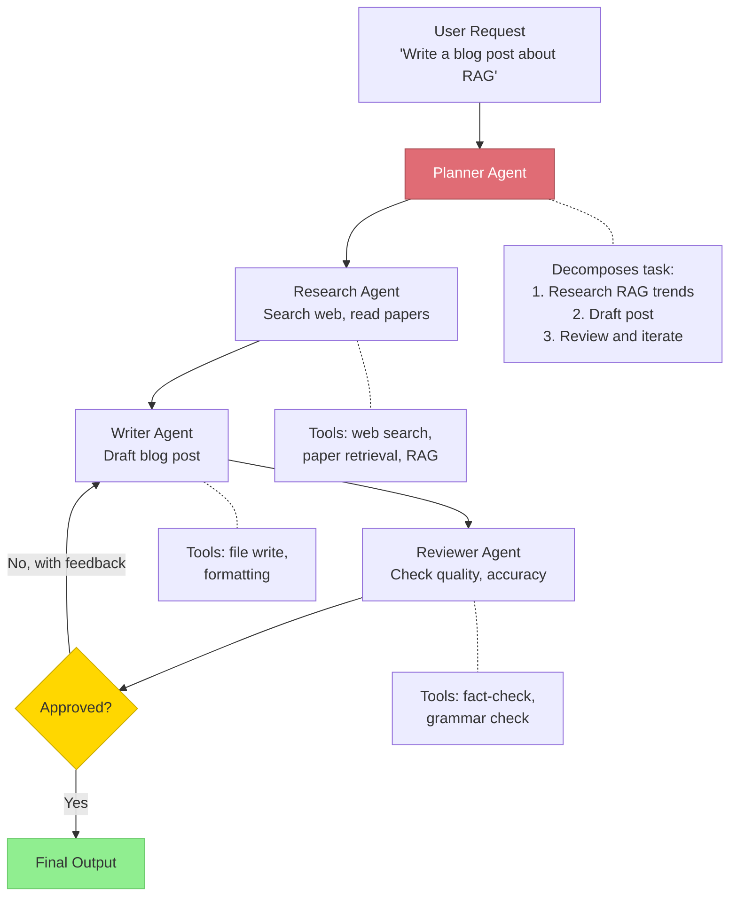
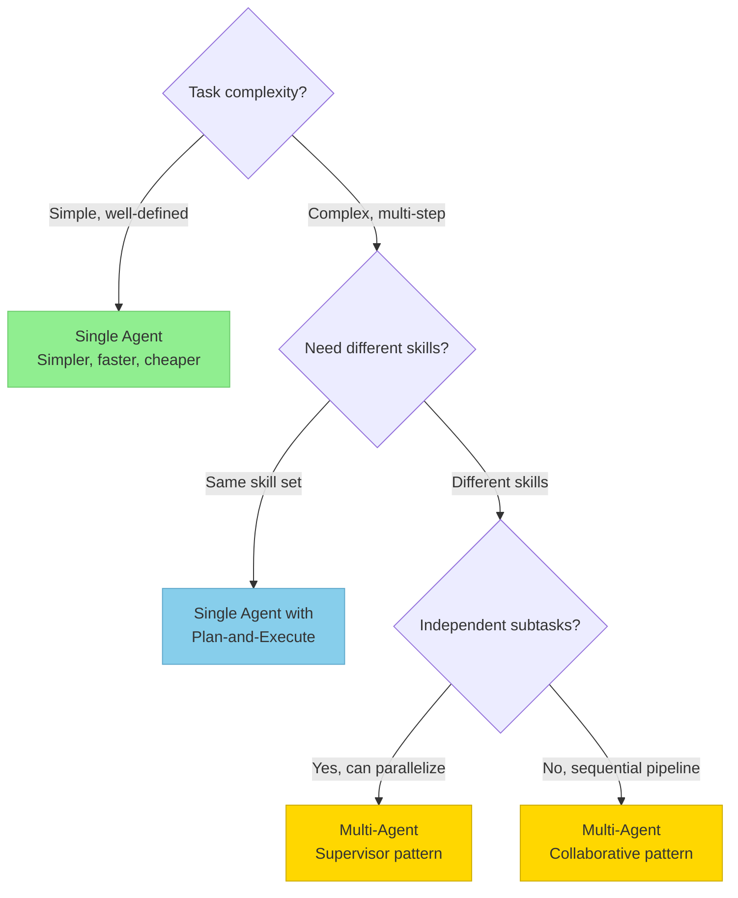

# Multi-Agent Architectures

> **TL;DR:** Multi-agent systems coordinate multiple specialized LLM agents to handle complex tasks that a single agent can't do well alone. The main patterns are supervisor (one agent delegates), hierarchical (layered delegation), and collaborative (peer agents working together). LangChain provides the building blocks (chains, tools, agents), while LangGraph adds stateful graph orchestration with conditional edges and cycles — essential for production multi-agent systems.

## Table of Contents
- [Why This Matters](#why-this-matters)
- [Single vs. Multi-Agent Tradeoffs](#single-vs-multi-agent-tradeoffs)
- [Common Architectural Patterns](#common-architectural-patterns)
- [LangChain Overview](#langchain-overview)
- [LangGraph Overview](#langgraph-overview)
- [Multi-Agent Workflow Example](#multi-agent-workflow-example)
- [When to Use Single vs. Multi-Agent](#when-to-use-single-vs-multi-agent)
- [Key Takeaways](#key-takeaways)
- [References](#references)

## Why This Matters

Single agents hit practical limits. As task complexity grows, a single agent's context window fills up, its decision-making becomes less reliable, and its tool set becomes unwieldy. Multi-agent architectures address this by decomposing complex workflows into specialized agents — each focused on one aspect of the problem, coordinated by an orchestration layer.

## Single vs. Multi-Agent Tradeoffs

| Dimension | Single Agent | Multi-Agent |
|---|---|---|
| **Complexity** | Simple to build and debug | More moving parts, harder to debug |
| **Context management** | One context window fills up fast | Each agent has its own focused context |
| **Specialization** | One agent does everything (jack of all trades) | Each agent is optimized for its role |
| **Reliability** | Single point of failure | Can isolate and retry individual agents |
| **Cost** | Fewer LLM calls | More LLM calls (coordination overhead) |
| **Latency** | Lower (fewer round-trips) | Higher (inter-agent communication) |
| **Scalability** | Limited by single context | Can parallelize independent agents |

**Rule of thumb:** Start with a single agent. Move to multi-agent only when you hit concrete limitations in context management, specialization, or reliability.

## Common Architectural Patterns

### 1. Supervisor Pattern

A single **supervisor agent** receives tasks, decides which worker agent to delegate to, and synthesizes results.



**How it works:** The supervisor has access to worker agents as "tools." It decides which worker to invoke, what instructions to give, and how to combine the results.

**Pros:** Centralized control, clear responsibility, easy to add new workers
**Cons:** Supervisor is a bottleneck and single point of failure; all context flows through one agent

**Best for:** Task routing, customer support, document processing pipelines

### 2. Hierarchical Pattern

Multiple layers of supervisors and workers, forming a tree structure. High-level supervisors delegate to mid-level coordinators, who delegate to specialized workers.



**How it works:** Each level of the hierarchy handles a different level of abstraction. The manager decomposes the overall goal, team leads coordinate their specialties, and workers execute specific tasks.

**Pros:** Scales to complex tasks, clear separation of concerns
**Cons:** Deep hierarchies add latency and can lose context between levels

**Best for:** Complex projects requiring diverse expertise (e.g., research → analysis → writing → review)

### 3. Collaborative (Peer) Pattern

Agents communicate directly with each other without a central supervisor. Each agent handles part of the workflow and passes results to the next.



**How it works:** Agents form a pipeline or graph, with each agent's output flowing to the next. Feedback loops allow iteration (e.g., reviewer sends feedback to writer).

**Pros:** No single bottleneck, natural workflow mapping
**Cons:** Coordination is implicit — harder to debug when things go wrong

**Best for:** Well-defined workflows with clear handoff points (content creation, CI/CD pipelines)

## LangChain Overview

**LangChain** is the most widely-used framework for building LLM applications. It provides composable building blocks for chains, tools, and agents.

### Core Abstractions



| Abstraction | Purpose |
|---|---|
| **Prompt Templates** | Reusable, parameterized prompts with variable substitution |
| **LLM / Chat Models** | Unified interface to OpenAI, Anthropic, local models, etc. |
| **Output Parsers** | Structure LLM outputs into typed objects (JSON, Pydantic) |
| **Tools** | Wrappers around external functions with descriptions for the LLM |
| **Agents** | LLMs that dynamically decide which tools to call |
| **Chains** | Composable sequences of operations (prompt → LLM → parse → tool → ...) |
| **Retrievers** | Interface to vector stores and other retrieval systems |

### LangChain Strengths
- **Ecosystem breadth** — Integrations with hundreds of LLM providers, vector stores, tools, and data sources
- **Rapid prototyping** — Pre-built chains and agents get you to a working prototype fast
- **LCEL (LangChain Expression Language)** — Pipe syntax for composing chains declaratively

### LangChain Limitations
- **Abstraction overhead** — Can be opaque; debugging through multiple abstraction layers is challenging
- **Changing APIs** — Rapid development means breaking changes between versions
- **Runtime limitations** — Basic chains are linear; complex control flow (loops, conditionals, state) requires LangGraph

## LangGraph Overview

**LangGraph** extends LangChain with **stateful, graph-based orchestration**. Where LangChain chains are linear sequences, LangGraph enables cycles, conditional branching, and persistent state — essential for agents and multi-agent systems.

### Core Concepts



| Concept | Description |
|---|---|
| **State** | A typed object (typically TypedDict or Pydantic model) that persists across the graph execution. Contains messages, intermediate results, and agent scratchpad. |
| **Nodes** | Functions that receive the current state and return updates. Each node is a step in the workflow — an agent call, tool execution, or custom logic. |
| **Edges** | Connections between nodes. Can be **static** (always go to the next node) or **conditional** (route based on state). |
| **Conditional Edges** | Functions that inspect the state and return the name of the next node. This enables branching logic and agent decision-making. |
| **Cycles** | Unlike chains, graphs can loop. An agent can call a tool, observe the result, and decide to call another tool — repeating until done. |
| **Checkpointing** | Built-in persistence of graph state, enabling human-in-the-loop, time-travel debugging, and crash recovery. |

### Why LangGraph for Agents

The agent loop (reason → act → observe → repeat) is fundamentally a **cycle**, not a chain. LangGraph makes this natural:

```python
from langgraph.graph import StateGraph, END
from typing import TypedDict, Annotated
import operator

class AgentState(TypedDict):
    messages: Annotated[list, operator.add]

def agent_node(state: AgentState) -> dict:
    """Call the LLM to decide what to do."""
    response = llm.invoke(state["messages"])
    return {"messages": [response]}

def tool_node(state: AgentState) -> dict:
    """Execute the tool call from the agent's response."""
    tool_result = execute_tool(state["messages"][-1])
    return {"messages": [tool_result]}

def should_continue(state: AgentState) -> str:
    """Route: if the agent called a tool, execute it. Otherwise, end."""
    last_message = state["messages"][-1]
    if last_message.tool_calls:
        return "tools"
    return END

# Build the graph
graph = StateGraph(AgentState)
graph.add_node("agent", agent_node)
graph.add_node("tools", tool_node)
graph.set_entry_point("agent")
graph.add_conditional_edges("agent", should_continue, {"tools": "tools", END: END})
graph.add_edge("tools", "agent")  # After tools, go back to agent

app = graph.compile()
```

### LangGraph for Multi-Agent Systems

LangGraph enables multi-agent architectures by treating each agent as a **subgraph** or node within a larger graph:

```python
# Each agent is a compiled subgraph
research_agent = create_research_agent()  # Returns compiled graph
writing_agent = create_writing_agent()

# Supervisor graph routes to the appropriate agent
supervisor_graph = StateGraph(SupervisorState)
supervisor_graph.add_node("supervisor", supervisor_node)
supervisor_graph.add_node("researcher", research_agent)
supervisor_graph.add_node("writer", writing_agent)
supervisor_graph.add_conditional_edges("supervisor", route_to_agent)
```

## Multi-Agent Workflow Example

Here's a complete example of a multi-agent content creation workflow:



This workflow demonstrates:
- **Planning** — The planner decomposes the task into steps
- **Specialization** — Each agent has its own tools and system prompt
- **Iteration** — The reviewer can send work back to the writer
- **Conditional routing** — The graph branches based on review results

## When to Use Single vs. Multi-Agent



| Scenario | Recommendation |
|---|---|
| Single-domain Q&A with tools | Single agent (ReAct) |
| Research + writing + review | Multi-agent (collaborative or supervisor) |
| Customer support routing | Multi-agent (supervisor with specialized workers) |
| Data pipeline: extract → transform → analyze | Multi-agent (collaborative pipeline) |
| Complex project with multiple teams | Multi-agent (hierarchical) |
| Quick prototype / MVP | Single agent — migrate to multi-agent when you hit limits |

## Key Takeaways

- **Start simple** — Use a single agent until you hit concrete limitations in context, specialization, or reliability
- Three main patterns: **supervisor** (centralized delegation), **hierarchical** (layered delegation), **collaborative** (peer-to-peer pipeline)
- **LangChain** provides building blocks (chains, tools, agents) for LLM applications — great for prototyping but linear
- **LangGraph** adds stateful graph orchestration — cycles, conditional edges, and persistent state that agents need
- Multi-agent systems trade **simplicity and cost** for **specialization and scalability**
- The right architecture depends on task complexity, required skills, and whether subtasks are independent

## References

1. LangChain Documentation. [docs.langchain.com](https://docs.langchain.com)
2. LangGraph Documentation. [langchain-ai.github.io/langgraph](https://langchain-ai.github.io/langgraph/)
3. Wu et al., "AutoGen: Enabling Next-Gen LLM Applications via Multi-Agent Conversation," 2023. [arXiv:2308.08155](https://arxiv.org/abs/2308.08155)
4. Hong et al., "MetaGPT: Meta Programming for Multi-Agent Collaborative Framework," 2023. [arXiv:2308.00352](https://arxiv.org/abs/2308.00352)
5. Yao et al., "ReAct: Synergizing Reasoning and Acting in Language Models," 2022. [arXiv:2210.03629](https://arxiv.org/abs/2210.03629)
