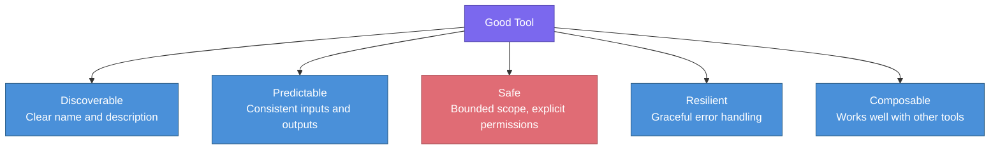
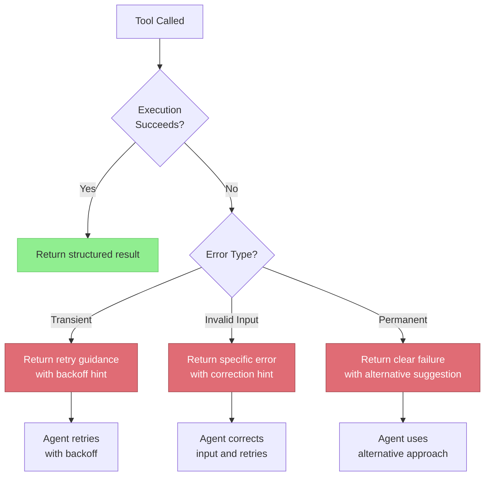
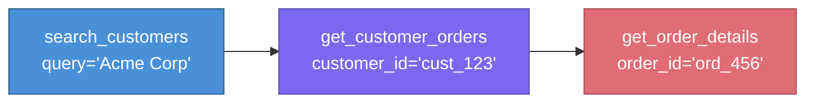
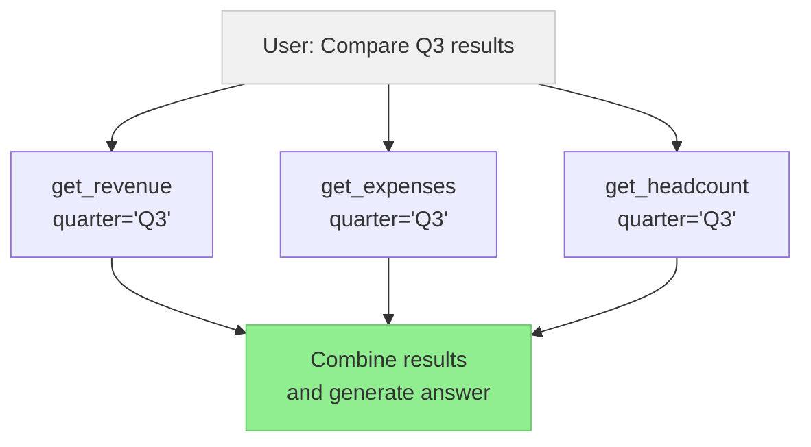

# Tool Design Patterns

> **TL;DR:** The quality of an agent's tools determines the ceiling of its capabilities. Well-designed tools have clear names, precise JSON Schema definitions, robust error handling, and explicit safety constraints. Poor tool design is the most common cause of agent failures in production.

## Table of Contents

- [Why This Matters](#why-this-matters)
- [What Makes a Good Tool](#what-makes-a-good-tool)
- [API Wrapping](#api-wrapping)
- [JSON Schema Best Practices](#json-schema-best-practices)
- [Error Handling and Retry](#error-handling-and-retry)
- [Tool Composition](#tool-composition)
- [Permission and Safety Patterns](#permission-and-safety-patterns)
- [Anti-Patterns](#anti-patterns)
- [Key Takeaways](#key-takeaways)
- [References](#references)

## Why This Matters

An agent is only as capable as the tools it can use. When tools are poorly named, underspecified, or return confusing outputs, the LLM wastes tokens on retries, calls the wrong tool, or produces incorrect results. In contrast, well-designed tools make agents more reliable, efficient, and predictable. Tool design is an underinvested area — most teams spend 80% of their effort on prompt engineering and 20% on tools, when the ratio should often be reversed.

## What Makes a Good Tool

A well-designed tool satisfies five properties:



| Property | Good Example | Bad Example |
|---|---|---|
| **Discoverable** | `search_knowledge_base` with "Searches internal docs by semantic query" | `tool_1` with no description |
| **Predictable** | Always returns `{"results": [...], "count": N}` | Sometimes returns a list, sometimes a string |
| **Safe** | Read-only by default, explicit `confirm: true` for writes | Deletes records without confirmation |
| **Resilient** | Returns `{"error": "Rate limited", "retry_after_seconds": 30}` | Throws unhandled exception |
| **Composable** | Output of `search` can be passed directly to `summarize` | Requires manual data transformation between tools |

## API Wrapping

Most tools are wrappers around existing APIs. The key principle is to **simplify the API surface for the LLM** — expose only what the agent needs, with sensible defaults.

### Wrapping Principles

1. **Reduce parameters**: If an API has 15 parameters, expose only the 3-5 the agent actually needs
2. **Add defaults**: Set pagination size, timeout, and format defaults so the agent does not have to specify them
3. **Normalize outputs**: Transform API responses into a consistent, minimal format
4. **Handle authentication**: Never expose API keys or tokens to the agent

### Example: Wrapping a REST API

Instead of exposing the raw GitHub API:
```
GET /repos/{owner}/{repo}/issues?state={state}&labels={labels}&sort={sort}&direction={dir}&per_page={n}&page={p}
```

Wrap it as a tool:
```
search_github_issues(repo: string, query: string, state?: "open"|"closed"|"all") -> {issues: [{number, title, state, author, created_at}], total_count: int}
```

The wrapper handles pagination, authentication, field selection, and response normalization internally.

## JSON Schema Best Practices

LLMs generate tool call arguments as JSON. Clear schemas reduce malformed calls and improve first-attempt accuracy.

### Schema Design Rules

1. **Use descriptive property names**: `customer_email` not `email` or `e`
2. **Add descriptions to every property**: The LLM reads these to understand what to pass
3. **Use enums for constrained values**: `"status": {"enum": ["active", "inactive"]}` prevents invalid inputs
4. **Mark required vs optional explicitly**: Do not rely on the LLM to infer which fields are required
5. **Use specific types**: `"type": "integer"` not `"type": "string"` for numeric values
6. **Provide examples in descriptions**: "The customer ID (e.g., 'cust_12345')"

### Schema Anti-Patterns

| Anti-Pattern | Problem | Fix |
|---|---|---|
| `"query": {"type": "string"}` with no description | LLM guesses what format to use | Add description with format example |
| Nested objects 3+ levels deep | LLMs struggle with deep nesting | Flatten or split into multiple tools |
| `additionalProperties: true` | LLM may invent spurious fields | Set `additionalProperties: false` |
| Free-form JSON string parameters | `"filters": {"type": "string"}` expecting JSON | Use a proper object schema |

## Error Handling and Retry

Tools will fail — APIs go down, rate limits trigger, inputs are invalid. How errors are communicated to the agent determines whether it recovers or spirals.



### Error Response Design

Always return errors as structured data, not stack traces:

```json
{
  "success": false,
  "error": {
    "type": "invalid_input",
    "message": "Date must be in YYYY-MM-DD format, received '03/15/2024'",
    "suggestion": "Use date='2024-03-15' instead"
  }
}
```

### Retry Strategy

- **Client-side retry for transient errors**: Implement exponential backoff in the tool wrapper, not in the agent
- **Agent-level retry for input errors**: Return the error to the agent so it can correct its input
- **Maximum retry limits**: Cap retries at 2-3 to prevent infinite loops
- **Never retry permanent failures**: Authentication errors, 404s, and permission denials should not be retried

## Tool Composition

Complex operations often require combining multiple tools. Two patterns dominate:

### Sequential Composition

The agent calls tools in sequence, using the output of one as input to the next:



### Parallel Composition

The agent calls multiple independent tools simultaneously:



### Design for Composition

- **Consistent ID formats**: Use the same ID format across tools so outputs can be chained
- **Return IDs in results**: Every `search` or `create` should return the IDs needed for follow-up tool calls
- **Avoid tools that do too much**: A `search_and_update` tool is harder to compose than separate `search` and `update` tools

## Permission and Safety Patterns

Tools that modify state or access sensitive data require explicit safety controls.

### Read-Write Separation

Separate read and write operations into distinct tools. This enables granting agents read-only access by default and requiring explicit authorization for writes.

| Pattern | Description | Example |
|---|---|---|
| **Read-only default** | Agent can read freely but needs approval for writes | `list_users` (auto-approved), `delete_user` (requires confirmation) |
| **Confirmation step** | Write tools require a `confirm: true` parameter | Agent must explicitly confirm destructive actions |
| **Dry-run mode** | Tool previews the effect without executing | `transfer_funds(dry_run=true)` returns what would happen |
| **Scope limitation** | Tool can only operate on specific resources | Agent can only access its own project's data |
| **Rate limiting** | Tool enforces per-session or per-user limits | Maximum 10 write operations per agent session |

### Sensitive Data Handling

- Never return raw PII, credentials, or secrets in tool results
- Mask or redact sensitive fields before returning to the agent
- Log tool calls with arguments for audit trails, but redact sensitive values in logs
- Implement row-level and column-level access controls in data tools

## Anti-Patterns

| Anti-Pattern | Why It Fails | Better Approach |
|---|---|---|
| **God tool** | One tool that does everything via a `action` parameter | Split into focused, single-purpose tools |
| **No descriptions** | LLM cannot distinguish between tools | Write descriptions as if explaining to a new engineer |
| **Returning raw HTML/XML** | Wastes tokens, LLM struggles to parse | Parse and return structured data |
| **Unbounded results** | `search` returns 10,000 results | Paginate, default to top 10-20 |
| **Stateful tools** | Tool behavior depends on hidden state | Make tools stateless; pass all needed context as parameters |
| **Ambiguous tool names** | `process_data` could mean anything | Use verb-noun naming: `calculate_invoice_total` |
| **Missing error context** | Tool returns `"error": true` | Return error type, message, and recovery suggestion |
| **Exposing internal IDs** | Agent sees database primary keys | Use stable, human-readable identifiers |

## Key Takeaways

- Tool quality is the single biggest lever for agent reliability — invest heavily in tool design
- Simplify API surfaces: expose only what the agent needs, with sensible defaults and clear descriptions
- JSON Schema definitions should include descriptions, examples, and enums for every property
- Return structured errors with correction hints so agents can self-recover
- Separate read and write tools; require explicit confirmation for state-changing operations
- Design tools for composition: consistent IDs, minimal scope, stateless interfaces
- Avoid god tools, unbounded results, raw markup, and missing descriptions

## References

- Schick, T. et al. (2023). "Toolformer: Language Models Can Teach Themselves to Use Tools." [arXiv:2302.04761](https://arxiv.org/abs/2302.04761)
- Qin, Y. et al. (2023). "ToolLLM: Facilitating Large Language Models to Master 16000+ Real-world APIs." [arXiv:2307.16789](https://arxiv.org/abs/2307.16789)
- Patil, S. et al. (2023). "Gorilla: Large Language Model Connected with Massive APIs." [arXiv:2305.15334](https://arxiv.org/abs/2305.15334)
- Anthropic. (2024). "Tool Use Documentation." [docs.anthropic.com](https://docs.anthropic.com/en/docs/build-with-claude/tool-use)
