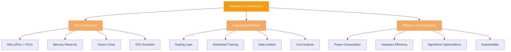

# Hardware & Infrastructure

> Understanding why LLM training and inference demands massive computational infrastructure — GPU architecture, scaling challenges, and the engineering required to make generative AI practical.

## What This Section Covers

Training and deploying modern LLMs is one of the most computationally demanding tasks in computer science. A 70B parameter model requires weeks of training on thousands of GPUs and tens of millions of dollars in infrastructure. But why? This section explains the fundamental **why** behind these requirements by diving into GPU architecture, distributed systems challenges, and the infrastructure arms race.

Most developers don't build training infrastructure — you'll use cloud GPUs or fine-tune existing models. But understanding how GPUs excel at LLM workloads, what makes scaling so hard, and the energy costs involved will inform every decision you make: which model to use, where to train it, how to optimize inference, and what trade-offs are acceptable.

## Concept Map

## Pages in This Section

| Page | What You'll Learn |
|---|---|
| [GPU Architecture for LLMs](gpu-architecture-for-llms.md) | Why GPUs dominate ML/AI compute, SIMD execution, tensor cores, memory hierarchy, and the evolution of GPU architectures (Volta → Ampere → Hopper) |
| [Infrastructure & Scaling](infrastructure-and-scaling.md) | Scaling laws, why companies build massive data centers, distributed training challenges, cost analysis, and the competitive dynamics of model training |
| [Energy Efficiency](energy-efficiency.md) | Power consumption at scale, environmental impact, hardware and software optimization techniques, and the trade-offs between model capability and sustainability |

## Suggested Reading Order

1. Start with **GPU Architecture for LLMs** to understand the hardware fundamentals — why GPUs are so effective and what architectural features matter most
2. Then read **Infrastructure & Scaling** to understand why training large models requires massive investment and what makes scaling so difficult
3. Finally, **Energy Efficiency** to appreciate the environmental costs and explore optimization strategies

## Key Concepts

### Why This Matters

- **Model size scales exponentially** — A 70B model needs 2000x more FLOPs than a 70M model. This isn't a linear increase; it's exponential.
- **Bandwidth is often the bottleneck** — GPUs have incredible compute density, but memory bandwidth limits how fast data flows. Inference is bandwidth-bound; training is compute-bound.
- **Distributed training is hard** — Communication overhead, fault tolerance, and checkpointing strategies make multi-GPU training complex and error-prone.
- **Energy dominates cost** — For large-scale training, energy costs can exceed $10 million. Optimization matters.
- **Hardware is a competitive advantage** — Companies that invest early in infrastructure (Meta, Google, Microsoft) gain a multi-year head start on model capability.

## How This Section Connects

- **From Foundations** — Understanding Transformer architecture and scaling laws (from Section 1) is essential context. This section explains *how* those models physically run.
- **To Applications** — RAG and Agent sections assume you understand inference requirements. This section explains memory and latency constraints.
- **Complement to Resources** — The [Hardware for LLMs](../../resources/hardware-for-llms.md) resource provides a practical GPU price/performance guide. This section explains the architectural *why* behind those trade-offs.
