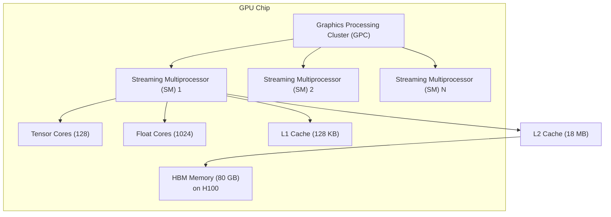

# GPU Architecture for LLMs

> **TL;DR:** GPUs are 10–100x faster than CPUs for LLM training and inference because they're designed for massive parallelism. Modern GPU architectures (NVIDIA Hopper, AMD MI300X) include specialized tensor cores that multiply matrices in FP16/BF16 with extreme efficiency. Understanding this architecture explains why GPU memory bandwidth, tensor core availability, and chip cooling are the real limits on model size and speed.

## Table of Contents
- [Why This Matters](#why-this-matters)
- [CPUs vs. GPUs: The Fundamental Difference](#cpus-vs-gpus-the-fundamental-difference)
- [GPU Architecture Fundamentals](#gpu-architecture-fundamentals)
- [Memory Hierarchy: The Critical Bottleneck](#memory-hierarchy-the-critical-bottleneck)
- [Matrix Multiplication: The Core Operation](#matrix-multiplication-the-core-operation)
- [Training vs. Inference Bottlenecks](#training-vs-inference-bottlenecks)
- [GPU Architecture Evolution](#gpu-architecture-evolution)
- [Emerging Architectures](#emerging-architectures)
- [Key Takeaways](#key-takeaways)
- [References](#references)

## Why This Matters

LLM workloads are dominated by matrix multiplication. A forward pass through a 70B parameter Transformer involves trillions of floating-point operations. CPUs are optimized for low-latency, single-threaded execution. GPUs are optimized for throughput — processing thousands of operations in parallel. This is why a single GPU (like an H100) can outperform a CPU by 50–100x on LLM inference.

But GPU performance isn't magic. Understanding the architecture tells you:
- **Why memory bandwidth matters more than raw compute power** — Most inference is bandwidth-bound, not compute-bound
- **What makes certain chips better for training vs. inference** — Different bottlenecks require different optimizations
- **How to predict performance** — Using the roofline model to understand which operations will be fast or slow
- **What limits scale** — Physical constraints (chip area, power, cooling) that determine maximum model size

## CPUs vs. GPUs: The Fundamental Difference

### CPU Architecture (Traditional Compute)

CPUs optimize for **low latency** on single operations:
- Few cores (8–16 on most processors)
- Large caches (L3 caches up to 100 MB)
- Complex control logic and out-of-order execution
- Good for branching, irregular memory access
- Design goal: Minimize time for one operation to complete

Optimal for: Sequential algorithms, database queries, web servers.

**Peak compute:** ~300 GFLOPS on modern CPUs

### GPU Architecture (Parallel Compute)

GPUs optimize for **throughput** across thousands of parallel operations:
- Thousands of small cores (10,000+ on modern GPUs)
- Minimal cache (per-core caches in the KB range)
- Simple control logic, in-order execution
- Assumes regular, predictable memory access patterns
- Design goal: Maximize throughput across parallel threads

Optimal for: Matrix operations, convolutions, simulations.

**Peak compute:** ~1,500 TFLOPS on an H100 (5000x higher than CPUs)

### Why This Matters for LLMs

LLM inference is **embarrassingly parallel** — you're computing attention scores for thousands of token pairs simultaneously, multiplying matrices with thousands of rows and columns. A GPU's 10,000 cores can work on different pieces of the problem in parallel. A CPU's 8 cores can't compete.

```
H100 vs CPU (Intel Xeon):
- Peak compute: 1,500 TFLOPS (GPU) vs. 0.3 TFLOPS (CPU) = 5000x
- Memory bandwidth: 3,350 GB/s (GPU) vs. 100 GB/s (CPU) = 33x
- For LLM matrix multiply: ~100x faster on GPU
```

## GPU Architecture Fundamentals

Modern GPUs (NVIDIA H100, AMD MI300X) follow this architecture:



### Key Components

**1. Streaming Multiprocessors (SMs)**
- A GPU has 100+ SMs (H100 has 132)
- Each SM is an independent processor with its own cores, cache, and control logic
- All SMs run the same program in lockstep (SIMT — Single Instruction Multiple Threads)
- One SM can handle 1000s of threads waiting for memory or other resources

**2. Tensor Cores**
- Specialized hardware for matrix multiplication
- H100: 128 tensor cores per SM × 132 SMs = ~17,000 tensor cores total
- Can multiply 16×16 (or 8×32) matrices in one clock cycle
- Supports FP32 (32-bit float), FP16 (16-bit float), TF32 (19-bit format), and INT8
- This is where the magic happens for LLMs — matrix operations complete 10x faster than with float cores

**3. Memory Hierarchy**
- **Registers:** ~65,000 per SM (ultra-fast, local to each thread)
- **L1 Cache:** 128 KB per SM (very fast, shared within SM)
- **L2 Cache:** 18 MB (slower than L1, shared across chip)
- **HBM (High-Bandwidth Memory):** 80 GB on H100 (slow relative to L1/L2, but huge capacity)

**4. Memory Bandwidth**
- **Register → Registers:** Essentially free (one cycle)
- **L1 Cache:** ~10 TB/s per SM (internal bandwidth)
- **L2 Cache → HBM:** 3,350 GB/s on H100
- **PCIe:** 32 GB/s (CPU ↔ GPU communication, very slow)

This hierarchy is critical — if you need data from HBM, you wait 100+ cycles. GPUs are designed so most data lives in registers or L1 cache while computing.

## Memory Hierarchy: The Critical Bottleneck

Here's the uncomfortable truth: **GPU compute power is wasted if data can't reach the cores fast enough.**

### The Roofline Model

The roofline model helps predict maximum performance for a given operation:

```
Peak Performance = min(Peak Compute, Peak Bandwidth × Arithmetic Intensity)

Arithmetic Intensity = (Total FLOPs) / (Bytes of Memory Traffic)
```

**Example: Matrix Multiplication C = A × B**
- Multiplying two 1000×1000 matrices (A and B)
- FLOPs: 2 × 1000³ = 2 billion operations
- Memory: Need to load A (4MB) + B (4MB) once, store C (4MB)
- Arithmetic Intensity: 2B FLOPs / 12 MB = ~167 FLOP/byte

On H100:
- Peak compute: 1,500 TFLOPS
- Peak bandwidth: 3,350 GB/s = 3,350 TFLOP/GB
- Max performance: min(1,500, 3,350 × 167) = min(1,500, 558,950) = **1,500 TFLOPS** ✓

This operation is **compute-bound** — we can use all the GPU's compute power. Good news for training!

### Inference: Bandwidth-Bound

Autoregressive generation (inferring one token at a time) is different:

- Input: 1 prompt token (128 floats)
- Model weights: 70B parameters
- Output: 1 prediction

To generate one token, you:
1. Load all 70B parameters from HBM to compute attention, matmuls, etc. (~280 GB)
2. Perform relatively little computation per byte loaded (~1 FLOP/byte)
3. Arithmetic intensity: ~1 FLOP/byte

Max performance: min(1,500, 3,350 × 1) = **3,350 TFLOPS... but we hit the bandwidth limit first!**

In practice, inference achieves ~100 TFLOPS (3% of peak) on large models because of memory bandwidth constraints.

**This is why inference latency is dominated by memory, not compute.**

## Matrix Multiplication: The Core Operation

Transformers are matrix-multiplication machines. Approximately 95% of compute in a forward pass is matrix multiplication. This is why tensor cores — specialized hardware for matmul — dominate GPU design.

### Standard Matrix Multiplication (matmul)

```
C[i,j] = Σ_k A[i,k] × B[k,j]
```

For a 10,000 × 10,000 matrix multiply:
- 2 trillion floating-point operations
- Without tensor cores (using float cores): 1-2 ms on H100
- With tensor cores: 0.1-0.2 ms on H100 (**10x faster**)

### Tensor Cores: Specialized Matmul Hardware

Tensor cores compute small matrix multiplies in parallel:

```
TensorCore: [16×16 FP16] × [16×16 FP16] → [16×16 FP32]  (1 clock cycle)
```

Key features:
- Can perform 16×16 or 8×32 matrix multiplies per cycle
- Accumulate results in higher precision (FP32) to avoid overflow
- H100: 128 tensor cores per SM → 17,000 total tensor cores across GPU

### Mixed Precision: Maximizing Tensor Core Efficiency

Modern training uses **mixed precision** to use tensor cores while maintaining numerical stability:

1. **Compute matmuls in FP16 (16-bit float)**
   - Tensor cores operate here — fast and energy efficient
   - 10x faster and lower power than FP32

2. **Accumulate results in FP32 (32-bit float)**
   - Prevent numerical underflow/overflow
   - Store master weights in FP32

3. **Result: 10x speedup with minimal accuracy loss**

Example (training a 70B model with mixed precision):
- Same accuracy as FP32-only training
- 10x faster (weeks instead of months)
- 2x less GPU memory needed
- Widely adopted (PyTorch's `torch.cuda.amp`, DeepSpeed, Megatron)

## Training vs. Inference Bottlenecks

### Training: Compute-Bound

During training, you process large batches of tokens:

- **Batch size:** 512–4096 tokens (or more in distributed training)
- **Operation:** Forward pass + backward pass + gradient updates
- **Arithmetic intensity:** High (lots of compute per byte loaded)
- **Bottleneck:** Compute cores, not memory bandwidth

GPU utilization on training: **60–80%** of peak compute. We're mostly limited by how fast we can do matrix multiplies, synchronize across GPUs, and update weights.

Implications:
- Training scales almost linearly with GPU count (up to a point)
- Bandwidth improvements matter less than compute density
- Tensor core utilization is critical

### Inference: Bandwidth-Bound

Autoregressive generation processes one token at a time:

- **Batch size:** 1 token (or a small batch of independent requests)
- **Operation:** Single forward pass
- **Arithmetic intensity:** Low (mostly loading weights, little computation)
- **Bottleneck:** Memory bandwidth, not compute

GPU utilization on inference: **5–15%** of peak compute. The GPU is waiting for data.

Implications:
- Throughput (tokens/second) is limited by memory bandwidth
- Adding more GPUs doesn't help single-user inference (only batch processing)
- Quantization (4-bit, 8-bit) is critical — reduces memory bandwidth needed
- Inference accelerators (specialized chips) can be more efficient than general-purpose GPUs

**Key insight:** This is why inference is fundamentally harder to optimize than training. You can't just throw more compute at it.

## GPU Architecture Evolution

### NVIDIA V100 (Volta, 2017)
- Memory: 32 GB HBM2
- Bandwidth: 900 GB/s
- Tensor cores: 5,120 (8×mixed precision)
- Peak compute: 125 TFLOPS FP32, 250 TFLOPS mixed

**Significance:** First tensor core GPU, enabled large-scale training. Dominated for 3 years.

### NVIDIA A100 (Ampere, 2020)
- Memory: 40 GB HBM2e
- Bandwidth: 1,555 GB/s
- Tensor cores: 6,912
- Peak compute: 312 TFLOPS FP32, 1,248 TFLOPS mixed

**Improvement:** 2.5x bandwidth, 5x better compute. Enabled training of 100B+ models practically.

### NVIDIA H100 (Hopper, 2023)
- Memory: 80 GB HBM3
- Bandwidth: 3,350 GB/s (2.1x A100)
- Tensor cores: 17,920 (with FP8 support)
- Peak compute: 990 TFLOPS FP32, 1,980 TFLOPS mixed (in FP8: 3,960 TFLOPS)

**Improvement:** 2x bandwidth, 1.6x peak compute. FP8 tensor cores enable 4-bit equivalent training. Transformer engine optimizes attention patterns.

**Generations ahead:** H200 (2024) — increased bandwidth to 4,800 GB/s for better inference throughput.

### AMD MI300X (CDNA 3, 2024)
- Memory: 192 GB HBM3 (largest on market)
- Bandwidth: 5,600 GB/s (60% faster than H100)
- Tensor cores: 19,456
- Peak compute: Similar to H100

**Significance:** Higher bandwidth and more memory. Better for inference and large batch training. Direct competition to NVIDIA.

### Apple Neural Engine (Mobile)
- Integrated in M-series chips
- 16-core GPU (M1/M2) to 20-core (M3 Max)
- Optimized for inference only
- Energy efficient but limited for training

## Emerging Architectures

### Specialized LLM Accelerators

**Cerebras WSE-3** (Wafer-Scale Engine)
- Single-wafer design: 5.13B transistors on one chip (huge!)
- No memory bandwidth bottleneck — compute and memory integrated
- 900 TFLOPS sustained on LLM workloads
- Use case: Training very large models, focused on compute-to-communication ratio

**Groq LPU** (Language Processing Unit)
- Designed specifically for LLM inference
- Deterministic latency (no cache misses, no preemption)
- 288 TFLOPS at FP32
- Use case: Low-latency LLM inference at scale

**SambaNova SN40L**
- Dataflow architecture (novel control flow)
- High memory bandwidth for its compute level
- Focus on inference with streaming capabilities

### Why Specialized Hardware Hasn't Won (Yet)

Despite advantages, NVIDIA GPUs still dominate because:
1. **Programmability** — NVIDIA has CUDA (30-year investment), superior ecosystem
2. **Flexibility** — GPUs work for training, inference, and many other tasks
3. **Scale** — Massive R&D, competitive market driving down costs
4. **Ecosystem** — Frameworks (PyTorch, TensorFlow) heavily optimized for NVIDIA
5. **Supply chain** — Established manufacturing, fast iteration

Specialized hardware excels at narrow tasks (e.g., inference only) but struggles with the broader ML ecosystem.

## Key Takeaways

1. **GPUs are 50–100x faster than CPUs for LLMs** because they're designed for parallel matrix operations, not sequential execution.

2. **Tensor cores are the real power** — Modern GPUs include specialized matmul hardware that makes mixed-precision training 10x faster.

3. **Memory hierarchy is critical** — Performance depends on arithmetic intensity. Inference is bandwidth-bound; training is compute-bound.

4. **Architecture evolution matters** — H100 vs. A100 differences (bandwidth, tensor cores, FP8) directly translate to faster training and better inference throughput.

5. **Inference is harder than training** — Low arithmetic intensity means memory bandwidth, not compute, is the bottleneck. This is why quantization and specialized accelerators are important for inference.

6. **Bandwidth will become the main constraint** — As models grow, feeding data to compute becomes the limiting factor. Future architectures will focus on bandwidth improvements.

7. **Emerging architectures are coming** — Specialized chips (Cerebras, Groq, SambaNova) may eventually displace GPUs for specific tasks, but NVIDIA's ecosystem advantage is substantial.

## References

### GPU Architecture
1. [NVIDIA H100 Tensor GPU Architecture Whitepaper](https://resources.nvidia.com/en-us-hopper-architecture) — Authoritative source on H100 design, tensor cores, and performance features
2. [NVIDIA Ampere GA102 GPU Architecture Whitepaper](https://www.nvidia.com/content/dam/en-us/Solutions/Data-Center/nvidia-ampere-ga-102-gpu-architecture-whitepaper-v2.pdf) — Detailed A100 architecture
3. Jia, Z., Tillman, B., Maggioni, M., Scarpazza, D. P. (2020). "Dissecting the NVIDIA Volta GPU Architecture via Microbenchmarking" — Detailed performance modeling of GPU internals

### Memory and Performance
4. Williams, S., Waterman, A., Patterson, D. (2009). "Roofline: An Insightful Visual Performance Model for Floating-Point Programs" — Framework for understanding compute vs. bandwidth bottlenecks
5. [NVIDIA Mixed Precision Training Guide](https://docs.nvidia.com/deeplearning/performance/mixed-precision-training/) — Practical guide to FP16/FP32 training

### Specialized Hardware
6. [Cerebras WSE-3 Whitepaper](https://www.cerebras.net/) — Wafer-scale computing approach
7. [Groq LPU Technical Overview](https://wow.groq.com/groq-lpu-language-processing/) — Deterministic inference acceleration

### Tensor Core Utilization
8. Dao, T., Fu, D. Y., Ermon, S., Rudra, A., Ré, C. (2022). "FlashAttention: Fast and Memory-Efficient Exact Attention with IO-Awareness" — How to optimize attention to achieve near-peak GPU utilization
9. Zhou, Z., Luo, Y., Jiang, Y., Zhang, H., Feng, X., Ma, S., ... & Wang, Y. (2023). "DeepSeek-LLM: Scaling Open-Source Language Models with Longtermism" — Practical insights on training efficiency and GPU utilization

### Evolution and Comparison
10. [AMD MI300X Whitepaper](https://www.amd.com/en/products/accelerators/instinct/mi300x) — Competitive architecture with focus on bandwidth and memory
11. Patterson, D., Hennessy, J. (2017). "Computer Organization and Design" (5th ed.) — GPU chapters provide foundational architecture knowledge
