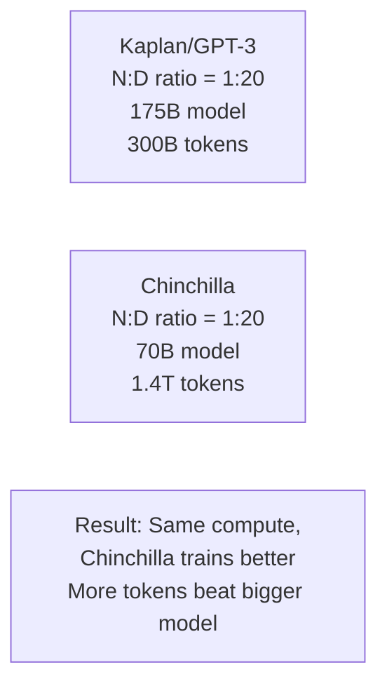
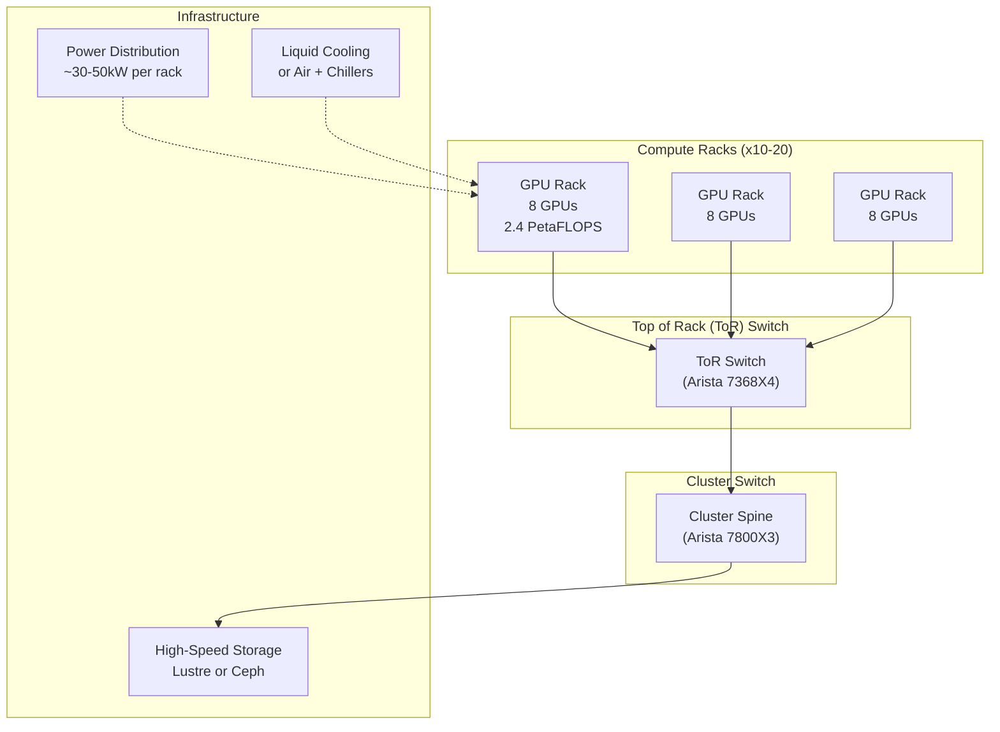

# Infrastructure & Scaling

> **TL;DR:** Training a competitive LLM costs $50–300 million in infrastructure alone. This isn't about raw compute power — modern data centers must manage thousands of GPUs working together, handle frequent failures, optimize communication bandwidth, and solve the distributed training puzzle. Understanding these challenges explains why model development is increasingly dominated by well-funded companies and research labs.

## Table of Contents
- [Why This Matters](#why-this-matters)
- [Scaling Laws and Compute Requirements](#scaling-laws-and-compute-requirements)
- [The Computational Challenge](#the-computational-challenge)
- [Data Centers for Generative AI](#data-centers-for-generative-ai)
- [Distributed Training Fundamentals](#distributed-training-fundamentals)
- [Communication Overhead and Scaling Efficiency](#communication-overhead-and-scaling-efficiency)
- [Fault Tolerance and Checkpointing](#fault-tolerance-and-checkpointing)
- [Cloud vs. On-Premises Infrastructure](#cloud-vs-on-premises-infrastructure)
- [The Infrastructure Arms Race](#the-infrastructure-arms-race)
- [Key Takeaways](#key-takeaways)
- [References](#references)

## Why This Matters

The era of training LLMs in a research lab on consumer hardware is over. Modern models require:
- **Thousands of GPUs** working in perfect synchronization
- **Tens of millions of dollars** in infrastructure investment
- **Specialized software** (Megatron, DeepSpeed) for distributed training
- **Teams of hardware engineers** managing clusters at scale

Understanding why this is necessary helps you:
- Evaluate whether to train from scratch vs. fine-tune existing models
- Understand the competitive advantages of companies with massive infrastructure (Meta, Google, OpenAI, Anthropic)
- Reason about model release timelines and capabilities (more compute → stronger models)
- Estimate costs for your own training or deployment scenarios

## Scaling Laws and Compute Requirements

### Chinchilla Optimal Compute

In 2022, DeepMind published "Training Compute-Optimal Large Language Models" (Hoffmann et al.), showing that **compute should be roughly equally split between model size and training tokens**.

The formula for optimal compute allocation:

```
Optimal Model Size: N = C^(3/4) / 20.5
Optimal Training Tokens: D = 20 × N = C^(3/4) / 1.025

Where C = total compute (in FLOPs)
```

**Practical example:**

For $1 billion compute budget:
- Compute: 10^18 FLOPs (1 exaFLOP-second)
- Optimal model: ~70 billion parameters
- Optimal training tokens: 1.4 trillion tokens
- Training time on 1,000 GPUs: ~10 weeks

### Chinchilla vs. Scaling Laws

Earlier research (Kaplan et al., GPT-3) suggested models should be much larger relative to compute. Chinchilla showed this was inefficient:



**Key insight:** Token diversity matters more than pure model size. A 70B model trained on 1.4 trillion diverse tokens outperforms a 175B model trained on 300B tokens, even with identical compute budgets.

This explains why Llama 2 70B (trained on 2 trillion tokens) is competitive with much larger models.

### Scaling Laws Across Model Families

```
Loss(N, D) ≈ E + A/N^α + B/D^β

Where:
- E = irreducible loss
- N = number of parameters
- D = number of training tokens
- α ≈ 0.07 (parameters matter less)
- β ≈ 0.16 (tokens matter more)
```

**Doubling compute, you have two options:**
1. Double model size → ~7% loss improvement
2. Double training tokens → ~12% loss improvement

This is why recent trends emphasize token diversity and longer training rather than ever-larger models.

## The Computational Challenge

### Floating-Point Operations Required

Training a model involves:
1. **Forward pass** — One matrix multiply per layer for each token
2. **Backward pass** — Two matrix multiplies per layer for gradients
3. **Optimizer step** — Weight updates (less compute-intensive)

Total FLOPs: **6 × parameters × tokens** (approximately)

**Example: Training a 70B model on 1.4 trillion tokens**

```
FLOPs = 6 × (70B) × (1.4T) = 5.88 × 10^20 FLOPs = 588 exaFLOP-seconds

On 1,000 H100 GPUs:
- H100 peak: 1,980 TFLOPS = 1.98 × 10^12 FLOPS
- Total cluster: 1,000 × 1.98 × 10^12 = 1.98 × 10^15 FLOPS
- Time to 50% utilization: 588 × 10^18 / (1.98 × 10^15 × 0.5) ≈ 600,000 seconds ≈ 7 days

At ~60% GPU utilization (realistic): 11-12 days of wall-clock training time
```

### Why Utilization is Hard to Achieve

Achieving 60% GPU utilization on 1,000 GPUs is actually quite good. Typical challenges:

1. **Communication overhead** — All-reduce (gradient synchronization) takes 10–30% of time
2. **Load imbalance** — Some GPUs finish ahead of others, idle waiting
3. **I/O bottlenecks** — Reading training data from storage can't keep up with GPU throughput
4. **Gradient accumulation** — Often train in smaller batches and accumulate gradients (introduces synchronization overhead)

At scale, **communication becomes the main bottleneck**, not compute.

## Data Centers for Generative AI

### Why Companies Build Dedicated AI Data Centers

For large-scale training, companies must invest in dedicated infrastructure:

**Cost of renting vs. buying:**

| Component | Cloud (per GPU/month) | Owned (upfront) |
|---|---|---|
| H100 GPU | $20–40k | $40k (amortized) |
| 1,000 GPUs cloud | $20–40M/month | $40M upfront |
| 10-month training | $200–400M | $40M + staff + power |

**Cloud is more expensive**, but companies still use it for:
- Short experiments (proof-of-concept)
- Bursting (temporary overload)
- Avoiding upfront capex

For production training, major labs (Meta, Google, Microsoft) build their own data centers.

### Data Center Architecture

A modern AI data center for LLM training looks like this:



### Key Infrastructure Components

**1. GPU Racks**
- 8 A100s or H100s per rack (top-of-rack configuration)
- Each GPU: 80 GB memory, 3,350 GB/s bandwidth
- Total per rack: 640 GB GPU memory
- Total per rack compute: ~16,000 TFLOPS

**2. Networking**
- **InfiniBand (200 Gbps)** connecting racks within cluster
- **Distributed switches** (Arista, Mellanox) for all-to-all communication
- **NVLink switches** (NVIDIA BlueField) for GPU-to-GPU communication (higher bandwidth than Ethernet)

Communication bandwidth is critical. For a 1,000 GPU cluster:
- Total network capacity: ~100 Petabits/sec aggregate
- All-reduce (synchronizing gradients): Must reach every GPU
- At scale: Communication is 20–30% of training time

**3. Power & Cooling**
- 30–50 kW per GPU rack
- 1,000 GPUs = ~5 MW data center
- Liquid cooling (direct-to-chip or immersion) reduces space and power
- Cost: $10–20 per kW annually (electricity + cooling)

**4. Storage**
- Training data: 100s of TB to petabytes
- Distributed filesystem (Lustre, Ceph) for parallel I/O
- NVMe SSDs for checkpoints and distributed checkpointing
- Must support high throughput (10–100 GB/s) to avoid I/O bottleneck

### Cost Breakdown (1,000 GPU Cluster)

```
Capital Costs:
- GPUs (H100, $40k each):                    $40M
- Networking (switches, NVLink, cables):      $2M
- Storage (SSDs, filesystems):                $2M
- Racks, cooling, power distribution:         $3M
- Setup and installation:                     $3M
Total Capex:                                 ~$50M

Operating Costs (annual):
- Electricity (5 MW × $0.10/kWh × 8,760h):  $4.4M
- Maintenance and staff (50 people):          $5M
- Replacement (GPUs degrade, fail):           $2M
Total OpEx:                                  ~$11M/year
```

**To train a state-of-the-art model (12 months on 1,000 GPUs):**
- Capex: $50M (one-time)
- OpEx: $11M (12 months)
- **Total: ~$61M minimum**

Larger clusters (10,000 GPUs) cost proportionally less per GPU due to economies of scale.

## Distributed Training Fundamentals

### Why Distributed Training is Complex

A 70B parameter model requires 280 GB of weights (FP32) or 140 GB (FP16). Single GPUs have 40–80 GB memory. You must distribute the model across multiple GPUs.

Three main approaches:

### 1. Data Parallelism

Each GPU has a full copy of the model. Different GPUs process different batches of data.

```
GPU 1: Batch A (2,048 tokens) → Forward → Backward → Gradients
GPU 2: Batch B (2,048 tokens) → Forward → Backward → Gradients
GPU 3: Batch C (2,048 tokens) → Forward → Backward → Gradients

All-Reduce: Synchronize gradients across GPUs
GPU 1: Average_Gradients → Update weights
GPU 2: Average_Gradients → Update weights
GPU 3: Average_Gradients → Update weights
```

**Pros:**
- Simple to implement
- Good GPU utilization (each GPU does useful work)
- Works with standard frameworks (PyTorch DDP)

**Cons:**
- Memory per GPU: 140 GB (full model) + 30 GB (batch) = 170 GB > 80 GB capacity
- Must reduce batch size if model doesn't fit
- All-reduce overhead grows with number of GPUs

**Use case:** Moderate scaling (up to ~100 GPUs), when model fits in GPU memory with reasonable batch size.

### 2. Tensor Parallelism (Intra-Layer Parallelism)

Split individual layers across GPUs. Each GPU holds part of the weights.

Example: Split a 70B model's 70 layers across 4 GPUs (each holds 17.5 layers):

```
Token Input → GPU 1 (Layers 1-17) → GPU 2 (Layers 18-35) →
GPU 3 (Layers 36-52) → GPU 4 (Layers 53-70) → Output
```

Alternative: Split matrix operations within a single layer:

```
Matrix Multiply C = A × B

GPU 1: A × B[:, :1750]  →  C[:, :1750]
GPU 2: A × B[:, 1750:3500]  →  C[:, 1750:3500]
...
```

**Pros:**
- Memory per GPU: 140 GB / 4 = 35 GB (fits comfortably)
- Can use larger batches

**Cons:**
- More complex to implement
- Higher communication overhead (frequent all-reduce)
- Harder to load-balance

**Use case:** Very large models (100B+), where model partitioning is necessary.

### 3. Pipeline Parallelism (Inter-Layer Parallelism)

Split the model by layers across GPUs. Process batches in stages.

```
GPU 1: Layers 1-20 → Batch A, then Batch B, then Batch C
GPU 2: Layers 21-40 → Receives output from GPU 1
GPU 3: Layers 41-60 → Receives output from GPU 2
GPU 4: Layers 61-70 → Receives output from GPU 3
```

**Pros:**
- Lower communication overhead between GPUs
- Can use large batches across the pipeline
- Natural fit for autoregressive models (sequential layer-by-layer processing)

**Cons:**
- Pipeline bubbles: GPUs idle while waiting for previous stage to complete
- Harder to synchronize gradients

**Use case:** Very deep models, or when communication bandwidth is limited.

### Practical Hybrid Approach

Modern training uses **3D parallelism** (combining all three):

```
8 GPUs on a node → Data parallelism
Multiple nodes → Tensor parallelism (across nodes)
Layers split → Pipeline parallelism
```

For a 70B model on 1,000 GPUs:
- Data parallelism: 8 copies (8 nodes)
- Tensor parallelism: 32-way (split model across 32 GPUs)
- Pipeline: 4 stages (split across 4 layers each)
- Total: 8 × 32 × 4 ≈ 1,000 GPUs

This is what frameworks like Megatron-LM and DeepSpeed implement.

## Communication Overhead and Scaling Efficiency

### All-Reduce Operation

After each backward pass, gradients must be synchronized across all GPUs. This is an **all-reduce** operation:

```
GPU 1: gradient g1
GPU 2: gradient g2
GPU 3: gradient g3
GPU 4: gradient g4

All-Reduce: Each GPU receives sum(g1, g2, g3, g4) / 4
```

Time complexity of all-reduce on N GPUs:

```
Time = O(log N) with tree reduction
     = O(number_of_parameters / bandwidth_per_gpu) + latency_overhead
```

**Example: 70B parameter model on 1,000 GPUs**

- Gradient size: 70B × 4 bytes (FP32) = 280 GB
- Bandwidth per GPU: 3,350 GB/s
- Minimum time: 280 GB / 3,350 = 0.084 seconds
- With latency overhead: ~0.1–0.2 seconds per synchronization
- Synchronization frequency: Every 100–200 gradient steps
- **Communication time: 20–30% of training time**

### Weak Scaling Efficiency

As you add more GPUs, throughput increases, but efficiency decreases:

```
Throughput(N GPUs) ≈ Throughput(1 GPU) × (N - overhead)

Scaling efficiency = Actual throughput / (Ideal throughput)
                   = 1 / (1 + overhead_time / compute_time)
```

**Typical scaling curves:**

| Number of GPUs | Throughput (tokens/sec) | Efficiency |
|---|---|---|
| 1 | 400 | 100% |
| 8 | 2,800 | 87.5% |
| 64 | 20,000 | 78% |
| 256 | 70,000 | 68% |
| 1,000 | 250,000 | 62% |

At 1,000 GPUs, you lose ~38% of potential throughput to communication overhead, synchronization, and load imbalance.

**Why companies push for larger batches:** Larger batches amortize communication overhead. If you double the batch size, communication is 50% of the time instead of 80%.

## Fault Tolerance and Checkpointing

### GPU Failures at Scale

With 1,000 GPUs running 24/7, failures are **expected**, not exceptional:

```
Typical GPU failure rate: 1 failure per 10,000 GPU-days
1,000 GPUs running 12 days: Expected failures = 1.2 GPUs fail during training
```

A single GPU failure can cause the entire training to crash. Solutions:

### 1. Distributed Checkpointing

Save model weights periodically (every 1,000 steps, ~1 hour):

```
Step 1000: Save weights to distributed storage (Ceph, Lustre)
Step 1500: GPU failure
Step 1500: Detect failure, restart from checkpoint at step 1000
Step 1500: Warmstart, synchronize state across GPUs
Step 1550: Resume training
```

**Checkpoint overhead:**
- Save 280 GB (70B model): Takes 5–10 minutes
- Restore from checkpoint: 3–5 minutes
- 1-hour checkpoint interval: 10–15 minutes per hour lost = 2.5–4% overhead

### 2. Asynchronous Checkpointing

Save weights while training continues (to separate storage system):

**Time saved:** Checkpoint doesn't block training
**Complexity:** Must ensure checkpoint is consistent (not partially updated)

### 3. Gradient Checkpointing

Recompute activations during backward pass instead of storing them:

- **Trade-off:** Extra compute for less memory
- **Benefit:** Reduces GPU memory by 30–40%, enables larger batches
- **Cost:** 10–20% slower training
- **When to use:** When memory is the bottleneck, not compute

## Cloud vs. On-Premises Infrastructure

### When to Use Cloud GPUs

**Advantages:**
- No upfront capex
- Elasticity (scale up/down quickly)
- Access to latest hardware immediately
- Pay-as-you-go

**Disadvantages:**
- 2–3x higher cost per GPU-hour
- Limited availability of high-end GPUs
- Network latency between data centers
- Noisy neighbors (other workloads)

**Best for:**
- Short experiments (hours/days)
- Sudden scaling needs (bursting)
- Small teams without infrastructure expertise
- Prototyping models before production

### When to Build On-Premises

**Advantages:**
- Lower cost per GPU-hour (by 50–70% after 1–2 years)
- Full control over hardware and networking
- Lower latency (local InfiniBand)
- Predictable cost structure

**Disadvantages:**
- Large upfront capex ($50M+)
- Staffing (hardware engineers, DevOps)
- Utilization risk (GPUs idle if not fully used)
- Inflexible (hard to pivot to new hardware)

**Best for:**
- Large-scale production training
- Multiple projects amortizing infrastructure
- Companies with growth trajectory justifying investment

### Hybrid Approach

Most large companies use hybrid:

1. **Training:** On-premises (lower cost)
2. **Inference:** Cloud + on-premises (burst capacity)
3. **Development:** Cloud (experimentation, no commitment)
4. **Occasional overload:** Cloud for bursting

## The Infrastructure Arms Race

### Who's Building What?

**Meta**
- Llama 2 training: ~2,000 H100s
- Planned cluster: 600,000+ GPU cluster (targeting 2024–2025)
- Estimate: ~$20B infrastructure investment over 5 years

**OpenAI**
- Estimated 10,000+ H100s (as of 2023)
- Microsoft partnership for exclusive Azure cloud capacity
- Estimate: $5–10B infrastructure through 2024

**Google/DeepMind**
- PaLM training: ~6,144 TPU v4 chips (>10,000 equivalent GPUs)
- Estimate: $500M–$1B per major model release

**Anthropic/xAI**
- Claude training: Unknown exact cluster size (estimated 5,000–15,000 GPUs)
- Estimate: $1–5B infrastructure investment

### Why This Matters

**Competitive Advantage:**
- More compute → Stronger models → Market dominance
- Multi-year lead over well-funded competitors
- Unfeasible for startups/small labs to compete on scale

**Model Capability Correlation:**
- GPT-3 (175B, ~$1–5B compute): Impressive few-shot learning
- GPT-4 (estimated 1.7T MoE): Strong reasoning, multimodal
- Correlation: More compute usually = stronger models

**Scaling Threshold:**
- To train competitive LLMs: $100M+ infrastructure minimum
- To train frontier models: $1B+ infrastructure minimum
- To stay competitive: Continuous investment in new hardware

### Open Questions

1. **Has scaling plateaued?** Some argue further compute scaling shows diminishing returns
2. **Will alternatives emerge?** Neuromorphic, analog, or quantum computing?
3. **Is the arms race sustainable?** Environmental and energy costs are rising
4. **Will decentralized training work?** Could federated learning reduce infrastructure needs?

## Key Takeaways

1. **Compute requirements scale roughly with model size × tokens.** Doubling model size roughly doubles required compute.

2. **Token diversity matters more than raw model size.** Chinchilla showed 70B models trained on more tokens outperform 175B models.

3. **Data centers are the new competitive battleground.** Companies winning on model capability often win because they can afford more infrastructure.

4. **Communication overhead becomes the primary bottleneck at scale.** All-reduce synchronization costs 20–30% of training time on 1,000 GPUs.

5. **Distributed training is hard.** Data, tensor, and pipeline parallelism each have trade-offs. Hybrid 3D approaches are standard.

6. **Fault tolerance requires checkpointing strategy.** GPU failures are expected; plan for recovery.

7. **Cloud GPUs are expensive for long-term training.** On-premises data centers pay for themselves within 1–2 years at scale.

8. **The infrastructure arms race favors well-funded players.** Training a competitive LLM now requires $100M+ investment, raising barriers to entry.

## References

### Scaling Laws
1. Kaplan, J., McCandlish, S., Henighan, T., Brown, T. B., Chess, B., Child, R., ... & Amodei, D. (2020). "Scaling Laws for Neural Language Models." arXiv:2001.08361 — Foundational work on compute scaling
2. Hoffmann, J., Borgeaud, S., Mensch, A., Perez, E., Ashukha, A., Cassirer, A., ... & Sifre, L. (2022). "Training Compute-Optimal Large Language Models." arXiv:2203.15556 — Chinchilla optimal compute allocation
3. Bahri, Y., Dyer, E., Kaplan, J., Lee, J., & Sharma, U. (2021). "Explaining Neural Scaling Laws" — Information-theoretic perspective on scaling

### Distributed Training
4. Shoeybi, M., Patwary, M., Puri, R., LeGresley, P., Casper, J., & Catanzaro, B. (2019). "Megatron-LM: Training Multi-Billion Parameter Language Models Using Model Parallelism." arXiv:1909.08053 — Tensor parallelism implementation
5. Rajbhandari, S., Rasley, J., Ruwase, O., & He, Y. (2020). "ZeRO: Memory Optimizations Toward Training Trillion Parameter Models." arXiv:1910.02054 — Memory-efficient distributed training
6. Xie, S., Rasley, J., Yu, Z., Rajbhandari, S., Ruwase, O., Ritter, K., & He, Y. (2021). "DeepSpeed-Inference: A Serving Engine for Transformer based Language Models." — Production inference at scale

### Infrastructure and Cost
7. [NVIDIA Data Center GPU Manager Documentation](https://developer.nvidia.com/dcgm) — Tools and best practices for GPU cluster management
8. Strubell, E., Ganesh, A., & McCallum, A. (2019). "Energy and Policy Considerations for Deep Learning in NLP." arXiv:1910.09788 — Cost and environmental analysis
9. Fentress, D., & Prabakaran, B. (2023). "Total Cost of Ownership for Large Language Models" — Practical infrastructure cost analysis

### Emerging Hardware
10. [Cerebras System Whitepaper](https://www.cerebras.net) — Wafer-scale distributed training
11. [Groq LPU Technical Documentation](https://wow.groq.com) — Specialized LLM inference hardware
