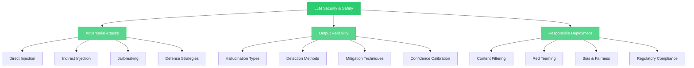

# LLM Security & Safety

> Defending against adversarial attacks, reducing hallucinations, and deploying LLMs responsibly — the security mindset every engineer building with generative AI needs.

## What This Section Covers

LLMs introduce an entirely new class of security vulnerabilities. Traditional software has well-understood attack surfaces: SQL injection, XSS, buffer overflows. LLMs add **prompt injection**, **jailbreaking**, **hallucinated outputs**, and **data leakage** — attacks that exploit the model's natural language interface rather than code-level bugs. These aren't theoretical concerns; they're actively exploited in production systems today.

This section covers the three pillars of LLM security: defending against adversarial inputs (prompt injection), ensuring output reliability (hallucination mitigation), and building responsible deployment practices (content filtering, bias detection, regulatory compliance). Whether you're building a customer-facing chatbot or an internal knowledge assistant, understanding these risks will shape your architecture, testing, and monitoring strategies.

## Concept Map

## Pages in This Section

| Page | What You'll Learn |
|---|---|
| [Prompt Injection](prompt-injection.md) | Direct and indirect injection attacks, jailbreaking techniques, defense strategies (input sanitization, instruction hierarchy, system prompt hardening), and the OWASP Top 10 for LLMs |
| [Hallucination Mitigation](hallucination-mitigation.md) | Types of hallucinations, detection methods (self-consistency, retrieval verification), mitigation techniques (RAG grounding, chain-of-verification, constrained decoding), and confidence calibration |
| [Responsible Deployment](responsible-deployment.md) | Content filtering and moderation APIs, red teaming methodologies, bias detection, privacy and PII handling, and the regulatory landscape (EU AI Act, NIST AI RMF) |

## Suggested Reading Order

1. Start with **Prompt Injection** to understand the most common and dangerous attack vector against LLM applications — this shapes how you design every system prompt and input pipeline
2. Then read **Hallucination Mitigation** to learn how to detect and reduce fabricated outputs, which is critical for any application where accuracy matters
3. Finally, **Responsible Deployment** to understand the broader organizational and regulatory requirements for putting LLMs into production safely
