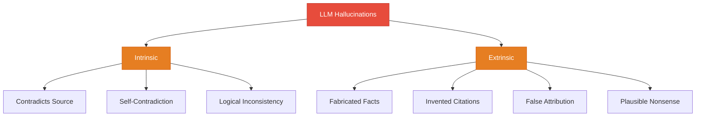

# Hallucination Mitigation

> **TL;DR:** LLM hallucinations — confident but incorrect outputs — are a fundamental limitation of generative models. They occur because LLMs generate statistically plausible text, not verified facts. Mitigation strategies include grounding with retrieval (RAG), chain-of-verification, constrained decoding, self-consistency checks, and confidence calibration. No single technique eliminates hallucinations, but layered approaches can reduce them to acceptable levels for most applications.

## Table of Contents
- [Why This Matters](#why-this-matters)
- [Types of Hallucinations](#types-of-hallucinations)
- [Why LLMs Hallucinate](#why-llms-hallucinate)
- [Detection Methods](#detection-methods)
- [Mitigation Techniques](#mitigation-techniques)
- [Confidence Calibration](#confidence-calibration)
- [When Hallucinations Are Dangerous](#when-hallucinations-are-dangerous)
- [Key Takeaways](#key-takeaways)
- [References](#references)

## Why This Matters

Hallucinations are not bugs — they are a consequence of how LLMs work. LLMs generate text by predicting the most likely next token given the preceding context. They have no internal fact-checking mechanism, no database of verified truths, and no concept of "knowing" versus "guessing." When the training data is sparse, contradictory, or absent for a given topic, the model fills in gaps with plausible-sounding but fabricated content.

This matters because:
- **Legal liability** — A legal chatbot that hallucinated case citations led to sanctions against attorneys (Mata v. Avianca, 2023)
- **Medical risk** — Hallucinated medical advice could lead to patient harm
- **Financial impact** — Incorrect financial data in automated reports can drive wrong decisions
- **Trust erosion** — Users who discover hallucinations lose confidence in the entire system

## Types of Hallucinations



### Intrinsic Hallucinations

The output contradicts information available in the provided context or the model's own statements.

| Type | Example |
|---|---|
| **Source contradiction** | Given a document saying revenue was $5M, the model reports $50M |
| **Self-contradiction** | States "Python was created in 1991" then later says "Python was created in 1989" |
| **Logical inconsistency** | Claims "all mammals lay eggs" then correctly identifies whales as mammals |

These are often detectable because the contradiction exists within the available context.

### Extrinsic Hallucinations

The output introduces information not grounded in any provided source — the model fabricates content.

| Type | Example |
|---|---|
| **Fabricated facts** | Invents a historical event that never happened |
| **Invented citations** | Creates realistic-looking but nonexistent paper titles, authors, and DOIs |
| **False attribution** | Attributes a real quote to the wrong person |
| **Plausible nonsense** | Generates a technically-sounding but scientifically meaningless explanation |

These are harder to detect because they require external knowledge to verify.

## Why LLMs Hallucinate

### Statistical Pattern Matching, Not Knowledge Retrieval

LLMs are next-token predictors. Given the prompt "The capital of Australia is," the model assigns probabilities:

```
"Canberra"   → 0.72
"Sydney"     → 0.18
"Melbourne"  → 0.06
"Brisbane"   → 0.02
...
```

The model outputs "Canberra" not because it "knows" it, but because that token sequence appeared most frequently in similar training contexts. For obscure facts, the probability distribution is flatter, and the model is more likely to select an incorrect but plausible token.

### Contributing Factors

1. **Training data gaps** — Topics with limited or contradictory training data produce unreliable outputs
2. **Knowledge cutoff** — Events after the training cutoff date cannot be accurately represented
3. **Sycophancy** — Models are trained to be helpful, which can bias them toward providing an answer rather than saying "I don't know"
4. **Exposure bias** — During training, models see correct sequences. During inference, they condition on their own (potentially wrong) prior outputs, compounding errors
5. **Compression artifacts** — Billions of facts compressed into model weights inevitably lose precision on rare or specific facts

## Detection Methods

### 1. Self-Consistency Checking

Generate multiple responses to the same query and check for agreement:

```python
def self_consistency_check(query: str, model, n_samples: int = 5) -> dict:
    """Generate multiple answers and measure agreement."""
    responses = [model.generate(query, temperature=0.7) for _ in range(n_samples)]
    # Extract key claims from each response
    claims = [extract_claims(r) for r in responses]
    # Measure agreement across samples
    agreement_score = calculate_agreement(claims)
    return {
        "responses": responses,
        "agreement": agreement_score,
        "likely_hallucinated": agreement_score < 0.6
    }
```

**Principle:** If the model produces different answers each time, it is less confident and more likely hallucinating. Consistent answers across samples are more likely correct.

### 2. Retrieval-Based Verification

Cross-reference LLM claims against a knowledge base:

```python
def verify_against_sources(claim: str, knowledge_base) -> dict:
    """Check if a claim is supported by retrieved documents."""
    relevant_docs = knowledge_base.search(claim, top_k=5)
    verification_prompt = f"""
    Claim: {claim}
    Evidence: {relevant_docs}
    Is the claim supported, contradicted, or not addressed by the evidence?
    """
    verdict = verifier_model.generate(verification_prompt)
    return {"claim": claim, "verdict": verdict, "sources": relevant_docs}
```

This is the basis of retrieval-augmented verification — using a separate retrieval step to fact-check model outputs.

### 3. Uncertainty Estimation

Use model internals to estimate confidence:

| Method | How It Works | Limitation |
|---|---|---|
| **Token-level probability** | Low probability tokens indicate uncertainty | Requires logit access (not available from all APIs) |
| **Entropy measurement** | High entropy in token distribution means less certainty | Same access requirement |
| **Verbalized confidence** | Ask the model "How confident are you? (0-100%)" | Models are poorly calibrated by default |
| **Semantic entropy** | Cluster responses by meaning, measure spread | Computationally expensive (multiple generations) |

### 4. Claim Decomposition

Break complex responses into atomic claims and verify each:

```
Original response: "Albert Einstein published his theory of general
relativity in 1915, which built on his special relativity paper
published in Nature in 1905."

Decomposed claims:
1. Einstein published general relativity in 1915 → SUPPORTED
2. General relativity built on special relativity → SUPPORTED
3. Special relativity was published in Nature → HALLUCINATED (it was published in Annalen der Physik)
4. Special relativity was published in 1905 → SUPPORTED
```

## Mitigation Techniques

### 1. Grounding with RAG

Retrieval-Augmented Generation is the most widely used hallucination mitigation:


Key implementation practices:
- **Require inline citations** — Instruct the model to cite specific passages from retrieved documents
- **"Only use provided context" instructions** — Explicitly tell the model not to use its parametric knowledge
- **Abstain when unsupported** — Train/instruct the model to say "I don't have enough information" rather than guessing
- **Chunk quality matters** — Poor retrieval leads to poor grounding. Invest in chunking strategy and embedding quality

### 2. Chain-of-Verification (CoVe)

A multi-step process where the model verifies its own output:

```
Step 1 - Generate: Produce initial response
Step 2 - Plan verification: Generate questions to fact-check the response
Step 3 - Execute verification: Answer each verification question independently
Step 4 - Revise: Update the original response based on verification results
```

Example:
```
Initial: "The Eiffel Tower was built in 1887 for the World's Fair."
Verification Q: "When was the Eiffel Tower construction completed?"
Verification A: "Construction began in 1887 and completed in 1889."
Revised: "The Eiffel Tower was built between 1887 and 1889 for the
1889 World's Fair."
```

### 3. Constrained Decoding

Limit the model's output space to prevent fabrication:

- **Structured output** — Force JSON schema compliance, reducing free-text hallucination
- **Grounded generation** — Restrict the model to only output text that appears in the source documents (extractive rather than abstractive)
- **Controlled vocabulary** — For domain-specific applications, limit outputs to known terms and entities
- **Grammar-guided decoding** — Use formal grammars to constrain token selection during generation

### 4. Retrieval-Augmented Fine-Tuning

Fine-tune models to be better at:
- Refusing to answer when context is insufficient
- Citing sources accurately
- Distinguishing between high-confidence and low-confidence claims
- Generating "I don't know" instead of plausible fabrications

### 5. Multi-Agent Verification

Use separate LLM instances for generation and verification:

```python
def generate_and_verify(query: str) -> dict:
    # Generator produces the answer
    response = generator.generate(query)
    claims = decompose_claims(response)

    # Verifier checks each claim
    verified_claims = []
    for claim in claims:
        evidence = retriever.search(claim)
        verdict = verifier.evaluate(claim, evidence)
        verified_claims.append({"claim": claim, "verdict": verdict})

    # Synthesizer produces final response using only verified claims
    final = synthesizer.generate(query, verified_claims)
    return final
```

## Confidence Calibration

### The Calibration Problem

LLMs are often poorly calibrated — they express high confidence even when wrong. A well-calibrated model should be correct 80% of the time when it says it's "80% confident."

### Calibration Techniques

| Technique | Description |
|---|---|
| **Temperature scaling** | Post-hoc adjustment of output probabilities to improve calibration |
| **Verbalized confidence with examples** | Provide few-shot examples of appropriate confidence levels |
| **Confidence bins** | Map model outputs to calibrated bins (High/Medium/Low) based on empirical accuracy |
| **Selective prediction** | Only output answers above a confidence threshold; abstain otherwise |

### Practical Implementation

```python
def calibrated_response(query: str, model, threshold: float = 0.7) -> dict:
    response = model.generate(query)
    confidence = estimate_confidence(query, response, model)

    if confidence < threshold:
        return {
            "response": "I'm not confident enough to answer this accurately. "
                       "Please verify with a reliable source.",
            "confidence": confidence,
            "abstained": True
        }
    return {
        "response": response,
        "confidence": confidence,
        "abstained": False
    }
```

## When Hallucinations Are Dangerous

Not all hallucinations carry equal risk. Consider this risk matrix:

| Domain | Hallucination Impact | Required Mitigation Level |
|---|---|---|
| **Creative writing** | Low — may be desirable | Minimal |
| **Customer support** | Medium — wrong answers frustrate users | Moderate (RAG + citations) |
| **Legal research** | High — fabricated case law has real consequences | Aggressive (multi-source verification + human review) |
| **Medical advice** | Critical — could cause patient harm | Maximum (constrained to verified sources + mandatory disclaimers) |
| **Financial reporting** | Critical — could trigger regulatory violations | Maximum (structured output + external validation) |
| **Autonomous agents** | Critical — hallucinated reasoning leads to wrong actions | Maximum (verification before action + human-in-the-loop) |

### Design Principles for High-Stakes Applications

1. **Never trust, always verify** — Treat LLM output as a draft that requires validation
2. **Require citations** — Force the model to reference specific sources for every factual claim
3. **Human-in-the-loop** — For critical decisions, require human review before acting on LLM output
4. **Fail safely** — When uncertain, abstain rather than guess
5. **Monitor continuously** — Track hallucination rates in production and alert on anomalies

## Key Takeaways

1. **Hallucinations are inherent** — LLMs generate statistically plausible text, not verified facts. This is a feature of the architecture, not a bug that can be fully patched.

2. **Grounding with RAG is the primary defense** — Providing relevant context and instructing the model to cite sources dramatically reduces hallucinations.

3. **Detection is cheaper than prevention** — Self-consistency checks, retrieval verification, and claim decomposition can catch hallucinations before they reach users.

4. **Confidence calibration matters** — Teaching models to express appropriate uncertainty (and abstain when uncertain) is more valuable than trying to eliminate all errors.

5. **Risk determines mitigation level** — Creative writing tolerates hallucinations; medical and legal applications cannot. Match your mitigation strategy to your risk profile.

6. **Layer your defenses** — Combine RAG grounding, chain-of-verification, output validation, and human review for high-stakes applications.

## References

### Foundational Research
1. Ji, Z., Lee, N., Frieske, R., et al. (2023). "Survey of Hallucination in Natural Language Generation" — Comprehensive taxonomy and survey of hallucination types
2. Huang, L., Yu, W., Ma, W., et al. (2023). "A Survey on Hallucination in Large Language Models" — Updated survey covering modern LLMs

### Detection Methods
3. Manakul, P., Liusie, A., Gales, M. (2023). "SelfCheckGPT: Zero-Resource Black-Box Hallucination Detection for Generative Large Language Models" — Self-consistency approach to hallucination detection
4. Kuhn, L., Gal, Y., Farquhar, S. (2023). "Semantic Entropy Probes for Hallucination Detection" — Using semantic clustering to measure uncertainty

### Mitigation Techniques
5. Dhuliawala, S., Komeili, M., Xu, J., et al. (2023). "Chain-of-Verification Reduces Hallucination in Large Language Models" — CoVe methodology for self-verification
6. Lewis, P., Perez, E., Piktus, A., et al. (2020). "Retrieval-Augmented Generation for Knowledge-Intensive NLP Tasks" — Foundational RAG paper
7. Kadavath, S., Conerly, T., Askell, A., et al. (2022). "Language Models (Mostly) Know What They Know" — Study of LLM self-knowledge and calibration

### Real-World Impact
8. Mata v. Avianca, Inc. (2023). Case No. 22-cv-1461 — Legal case where AI-hallucinated citations led to court sanctions
9. [Vectara Hallucination Leaderboard](https://github.com/vectara/hallucination-leaderboard) — Benchmark tracking hallucination rates across models
