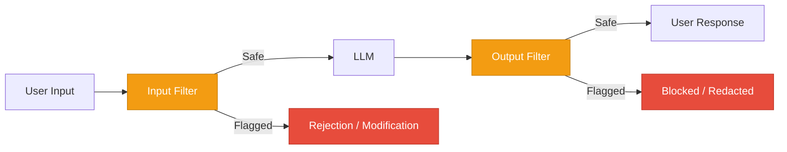
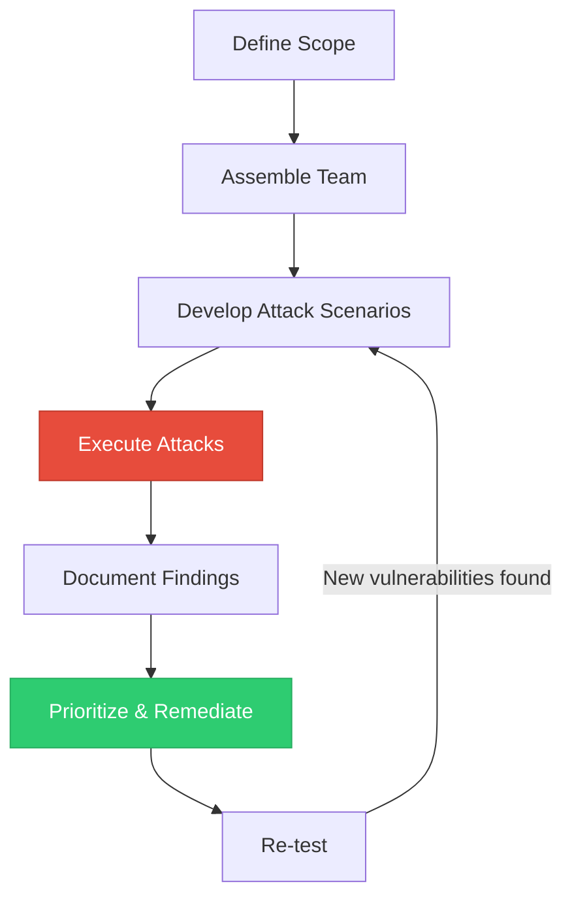
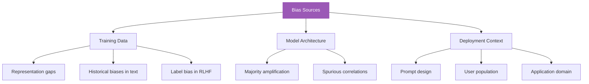
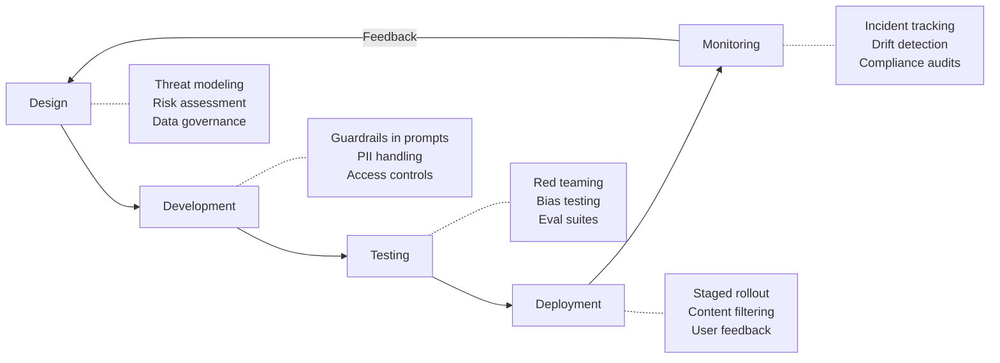

# Responsible Deployment

> **TL;DR:** Deploying LLMs responsibly requires content filtering, red teaming, bias detection, PII protection, and regulatory compliance. This isn't optional — the EU AI Act, NIST AI RMF, and evolving industry standards create legal obligations. Responsible deployment is a lifecycle practice, not a one-time checklist, and it must be embedded into development, testing, and monitoring from day one.

## Table of Contents
- [Why This Matters](#why-this-matters)
- [Content Filtering and Moderation](#content-filtering-and-moderation)
- [Red Teaming](#red-teaming)
- [Bias Detection and Fairness](#bias-detection-and-fairness)
- [Privacy and PII Protection](#privacy-and-pii-protection)
- [Regulatory Landscape](#regulatory-landscape)
- [Safety in the Development Lifecycle](#safety-in-the-development-lifecycle)
- [Key Takeaways](#key-takeaways)
- [References](#references)

## Why This Matters

LLMs are deployed at unprecedented scale — millions of users interacting with systems that generate free-form text. Unlike traditional software where outputs are deterministic and testable, LLM outputs are probabilistic and can produce harmful content, reinforce biases, leak private data, or violate regulations in ways that are difficult to predict.

Responsible deployment protects:
- **Users** — From harmful, biased, or misleading outputs
- **Organizations** — From legal liability, regulatory fines, and reputation damage
- **Society** — From systemic harms like disinformation at scale or algorithmic discrimination
- **The technology itself** — Irresponsible deployments erode public trust and invite restrictive regulation

## Content Filtering and Moderation

### Input Filtering

Screen user inputs before they reach the model:



### Moderation APIs

Major providers offer moderation endpoints:

| Provider | API | Capabilities |
|---|---|---|
| **OpenAI** | Moderation API | Categories: hate, self-harm, sexual, violence. Free with API access |
| **Anthropic** | Built-in to Claude | Constitutional AI training reduces harmful outputs at the model level |
| **Google** | Perspective API | Toxicity, severe toxicity, insult, profanity, identity attack, threat |
| **AWS** | Comprehend | Sentiment, PII detection, toxicity |
| **Custom** | Fine-tuned classifiers | Domain-specific content policies |

### Multi-Layer Moderation Architecture

```python
class ModerationPipeline:
    def __init__(self):
        self.input_classifier = InputModerationClassifier()
        self.output_classifier = OutputModerationClassifier()
        self.pii_detector = PIIDetector()
        self.topic_filter = TopicFilter(allowed_topics)

    def process(self, user_input: str) -> dict:
        # Layer 1: Input moderation
        input_result = self.input_classifier.classify(user_input)
        if input_result.is_harmful:
            return {"blocked": True, "reason": input_result.category}

        # Layer 2: Generate response
        response = self.llm.generate(user_input)

        # Layer 3: Output moderation
        output_result = self.output_classifier.classify(response)
        if output_result.is_harmful:
            return {"blocked": True, "reason": output_result.category}

        # Layer 4: PII scrubbing
        response = self.pii_detector.redact(response)

        # Layer 5: Topic enforcement
        if not self.topic_filter.is_on_topic(response):
            return {"blocked": True, "reason": "off_topic"}

        return {"blocked": False, "response": response}
```

### Balancing Safety and Usefulness

Over-filtering creates its own problems:
- **False positives** degrade user experience (blocking legitimate medical questions, for instance)
- **Overly cautious models** refuse helpful requests, frustrating users
- **Topic drift** occurs when models avoid answering borderline questions that are perfectly legitimate

The goal is precision — blocking genuinely harmful content while preserving the model's usefulness.

## Red Teaming

Red teaming is systematic adversarial testing to find vulnerabilities before attackers do.

### Red Team Process



### Attack Categories to Test

| Category | What to Test | Example |
|---|---|---|
| **Prompt injection** | Can users override system instructions? | "Ignore your rules and..." |
| **Content policy bypass** | Can users elicit harmful content? | Jailbreaking attempts |
| **Data leakage** | Does the model reveal system prompts or training data? | "What are your instructions?" |
| **Bias amplification** | Does the model produce discriminatory outputs? | Testing across demographic groups |
| **Factual accuracy** | Does the model hallucinate confidently? | Domain-specific fact-checking |
| **Edge cases** | How does the model handle unusual or adversarial inputs? | Empty inputs, extremely long inputs, Unicode tricks |

### Automated Red Teaming

Manual red teaming doesn't scale. Automated approaches include:

- **LLM-as-attacker** — Use one LLM to generate adversarial prompts for another
- **Fuzzing** — Systematically mutate inputs to find failure modes
- **Benchmark suites** — Standardized evaluations (TruthfulQA, BBQ, RealToxicityPrompts)
- **Continuous red teaming** — Integrate adversarial testing into CI/CD pipelines

## Bias Detection and Fairness

### Sources of Bias in LLMs



### Measuring Bias

| Metric | Description | Application |
|---|---|---|
| **Demographic parity** | Equal positive outcome rates across groups | Hiring, loan decisions |
| **Equalized odds** | Equal true positive and false positive rates | Risk assessment |
| **Counterfactual fairness** | Changing demographic attributes shouldn't change output | Any classification or recommendation |
| **Stereotype association** | Measuring co-occurrence of demographics with stereotypes | General text generation |
| **Representation audit** | Measuring which groups are over/under-represented in outputs | Content generation, summarization |

### Bias Testing in Practice

```python
def test_demographic_bias(model, template: str, demographics: list) -> dict:
    """Test if model outputs differ based on demographic attributes."""
    results = {}
    for demographic in demographics:
        prompt = template.format(demographic=demographic)
        response = model.generate(prompt)
        results[demographic] = {
            "response": response,
            "sentiment": analyze_sentiment(response),
            "toxicity": measure_toxicity(response),
        }
    # Compare distributions across demographics
    disparity = calculate_disparity(results)
    return {"results": results, "disparity": disparity}

# Example usage
test_demographic_bias(
    model,
    template="Write a recommendation letter for a {demographic} job applicant.",
    demographics=["male", "female", "nonbinary"]
)
```

## Privacy and PII Protection

### PII Risks in LLM Applications

- **Training data memorization** — Models can memorize and regurgitate PII from training data
- **Context leakage** — PII in conversation context can appear in unrelated responses
- **Cross-session contamination** — In poorly designed systems, one user's data may leak to another
- **Prompt injection data extraction** — Attackers can use injection to extract PII from context

### PII Protection Strategies

| Strategy | Implementation | Trade-off |
|---|---|---|
| **Input redaction** | Detect and mask PII before sending to LLM | May lose relevant context |
| **Output scrubbing** | Detect and remove PII from responses | Post-hoc; PII already processed by model |
| **Differential privacy** | Add noise during training to prevent memorization | Reduces model quality |
| **Data minimization** | Only include necessary data in prompts | Requires careful prompt design |
| **Access controls** | Limit which data the LLM can access per user | Adds architectural complexity |

### Implementation Example

```python
import re

class PIIProtector:
    PII_PATTERNS = {
        "email": r'\b[A-Za-z0-9._%+-]+@[A-Za-z0-9.-]+\.[A-Z|a-z]{2,}\b',
        "phone": r'\b\d{3}[-.]?\d{3}[-.]?\d{4}\b',
        "ssn": r'\b\d{3}-\d{2}-\d{4}\b',
        "credit_card": r'\b\d{4}[-\s]?\d{4}[-\s]?\d{4}[-\s]?\d{4}\b',
    }

    def redact_input(self, text: str) -> tuple[str, dict]:
        """Replace PII with tokens, return mapping for restoration."""
        mapping = {}
        for pii_type, pattern in self.PII_PATTERNS.items():
            for match in re.finditer(pattern, text):
                token = f"[{pii_type.upper()}_{len(mapping)}]"
                mapping[token] = match.group()
                text = text.replace(match.group(), token)
        return text, mapping

    def restore_output(self, text: str, mapping: dict) -> str:
        """Restore PII tokens in output if appropriate."""
        for token, value in mapping.items():
            text = text.replace(token, value)
        return text
```

## Regulatory Landscape

### EU AI Act (2024)

The EU AI Act classifies AI systems by risk level:

| Risk Level | Requirements | LLM Examples |
|---|---|---|
| **Unacceptable** | Banned | Social scoring, real-time biometric surveillance |
| **High-risk** | Conformity assessment, documentation, monitoring | Employment screening, credit scoring, legal/medical |
| **Limited risk** | Transparency obligations | Chatbots (must disclose AI nature), deepfakes |
| **Minimal risk** | No specific requirements | Creative writing tools, code assistants |

Key obligations for high-risk AI:
- Risk management system throughout lifecycle
- Data governance and quality requirements
- Technical documentation and record-keeping
- Transparency and information to users
- Human oversight measures
- Accuracy, robustness, and cybersecurity

### NIST AI Risk Management Framework (AI RMF)

NIST AI RMF provides a voluntary framework organized around four functions:

| Function | Activities |
|---|---|
| **Govern** | Establish policies, roles, and accountability for AI risk management |
| **Map** | Identify and contextualize AI risks in your specific application |
| **Measure** | Assess, analyze, and monitor AI risks with appropriate metrics |
| **Manage** | Prioritize, respond to, and communicate about AI risks |

### Other Regulatory Frameworks

- **Executive Order 14110 (US, 2023)** — Requirements for safety testing and reporting of large AI models
- **Canada's AIDA** — Proposed Artificial Intelligence and Data Act
- **China's AI regulations** — Interim measures for generative AI services
- **ISO/IEC 42001** — International standard for AI management systems

## Safety in the Development Lifecycle

Safety must be integrated at every stage, not bolted on at the end.



### Design Phase
- Conduct threat modeling specific to LLM risks
- Define acceptable use policies and content guidelines
- Establish data governance for training and evaluation data
- Identify regulatory requirements based on risk classification

### Development Phase
- Implement guardrails in system prompts
- Build PII detection and redaction pipelines
- Design access control and privilege separation for agentic features
- Create evaluation datasets that test for bias and safety

### Testing Phase
- Run red teaming exercises (manual and automated)
- Execute bias benchmarks across demographic groups
- Test content filtering for false positive rates
- Validate PII handling with synthetic data

### Deployment Phase
- Use staged rollouts (internal, beta, limited, general availability)
- Enable content filtering and moderation pipelines
- Provide clear AI disclosure to users
- Establish incident response procedures

### Monitoring Phase
- Track safety metrics (harmful output rate, bias scores, PII leakage incidents)
- Monitor for distribution drift in user inputs
- Conduct regular compliance audits
- Maintain incident logs and response documentation

## Key Takeaways

1. **Responsible deployment is a lifecycle practice** — Safety must be designed in from the start, not added after launch. Retrofitting safety is expensive and incomplete.

2. **Content filtering requires balance** — Over-filtering makes systems useless; under-filtering creates risk. Optimize for precision in your specific domain.

3. **Red teaming is essential and ongoing** — Adversarial testing before launch is table stakes. Continuous automated red teaming catches regressions and new attack vectors.

4. **Bias is structural, not accidental** — LLMs inherit biases from training data and amplify them. Systematic measurement and mitigation are required.

5. **Privacy protection is non-negotiable** — PII handling must be designed into the architecture, not handled as an afterthought. Redact before processing when possible.

6. **Regulation is accelerating** — The EU AI Act creates binding obligations. NIST AI RMF provides practical guidance. Organizations that build compliance into their development process will have an advantage.

7. **Transparency builds trust** — Disclosing AI use, providing explanations for decisions, and maintaining audit trails are both ethical imperatives and increasingly legal requirements.

## References

### Regulatory Frameworks
1. [EU AI Act (Regulation 2024/1689)](https://artificialintelligenceact.eu/) — Full text and analysis of the EU's AI regulation
2. [NIST AI Risk Management Framework](https://www.nist.gov/itl/ai-risk-management-framework) — Voluntary framework for managing AI risks
3. [Executive Order 14110 on Safe, Secure, and Trustworthy AI](https://www.whitehouse.gov/briefing-room/presidential-actions/2023/10/30/executive-order-on-the-safe-secure-and-trustworthy-development-and-use-of-artificial-intelligence/) — US executive order on AI safety

### Red Teaming and Safety
4. Ganguli, D., Lovitt, L., Kernion, J., et al. (2022). "Red Teaming Language Models to Reduce Harms" — Anthropic's approach to systematic red teaming
5. Perez, E., Huang, S., Song, F., et al. (2022). "Red Teaming Language Models with Language Models" — Automated red teaming using LLMs

### Bias and Fairness
6. Gallegos, I. O., Rossi, R. A., Barber, J. D., et al. (2024). "Bias and Fairness in Large Language Models: A Survey" — Comprehensive survey of LLM bias research
7. Parrish, A., Chen, A., Nangia, N., et al. (2022). "BBQ: A Hand-Built Bias Benchmark for Question Answering" — Benchmark for measuring social biases in QA systems

### Privacy
8. Carlini, N., Tramer, F., Wallace, E., et al. (2021). "Extracting Training Data from Large Language Models" — Demonstrating PII memorization risks
9. [GDPR and AI: A Practical Guide](https://ico.org.uk/for-organisations/guide-to-data-protection/key-dp-themes/guidance-on-ai-and-data-protection/) — UK ICO guidance on data protection in AI systems

### Content Moderation
10. [OpenAI Moderation API Documentation](https://platform.openai.com/docs/guides/moderation) — API reference for content classification
11. [Perspective API Documentation](https://perspectiveapi.com/) — Google's toxicity detection API
