# Production & MLOps

> Taking LLMs from prototype to production — model serving infrastructure, observability, caching strategies, and CI/CD practices that make LLM applications reliable, cost-effective, and maintainable at scale.

## What This Section Covers

Building an LLM demo is easy. Running one in production is hard. The gap between "it works on my laptop" and "it serves 10,000 concurrent users reliably" is filled with infrastructure challenges unique to LLMs: managing GPU memory, optimizing inference latency, tracking costs that scale with token usage, testing outputs that are non-deterministic, and caching responses for models that are expensive to call.

This section covers the operational side of LLM applications. You'll learn how modern serving frameworks handle the unique demands of autoregressive generation, how to build observability into LLM pipelines, how caching can dramatically reduce costs and latency, and how to adapt CI/CD practices for systems whose outputs can't be verified with simple assertions.

## Concept Map

```mermaid
graph TD
    A[Production & MLOps] --> B[Model Serving]
    A --> C[Observability]
    A --> D[Caching]
    A --> E[CI/CD for LLMs]

    B --> B1[Serving Frameworks]
    B --> B2[Performance Metrics]
    B --> B3[Deployment Patterns]
    B --> B4[Model Formats]

    C --> C1[Tracing & Logging]
    C --> C2[Cost Tracking]
    C --> C3[Quality Monitoring]
    C --> C4[Observability Tools]

    D --> D1[Exact Match]
    D --> D2[Semantic Caching]
    D --> D3[Prompt Caching]
    D --> D4[KV Cache Reuse]

    E --> E1[LLM Testing]
    E --> E2[Eval-Driven Dev]
    E --> E3[Prompt Versioning]
    E --> E4[Regression Testing]

    style A fill:#1abc9c,stroke:#16a085,color:#fff
    style B fill:#48c9b0,stroke:#1abc9c,color:#fff
    style C fill:#48c9b0,stroke:#1abc9c,color:#fff
    style D fill:#48c9b0,stroke:#1abc9c,color:#fff
    style E fill:#48c9b0,stroke:#1abc9c,color:#fff
```

## Pages in This Section

| Page | What You'll Learn |
|---|---|
| [Model Serving](model-serving.md) | Serving frameworks (vLLM, TGI, Triton, Ollama), key metrics (TTFT, TPS), PagedAttention, continuous batching, model formats (ONNX, TensorRT, GGUF), and deployment patterns |
| [Observability](observability.md) | LLM observability vs traditional monitoring, tracing and logging for LLM pipelines, cost tracking, quality monitoring, and tools (LangSmith, Langfuse, Phoenix, OpenLLMetry) |
| [Caching Strategies](caching-strategies.md) | Exact match caching, semantic caching, prompt caching (Anthropic/OpenAI), KV cache reuse, invalidation strategies, and when NOT to cache |
| [LLM CI/CD](llm-ci-cd.md) | Testing LLM outputs, eval-driven development, A/B testing, prompt versioning, regression testing, and CI/CD pipeline integration |

## Suggested Reading Order

1. Start with **Model Serving** to understand the infrastructure that runs LLM inference — this is the foundation everything else builds on
2. Then read **Observability** to learn how to monitor, trace, and debug LLM applications in production
3. Next, **Caching Strategies** to understand how to reduce costs and latency with intelligent caching at multiple levels
4. Finally, **LLM CI/CD** to learn how to test, version, and deploy LLM applications with confidence
