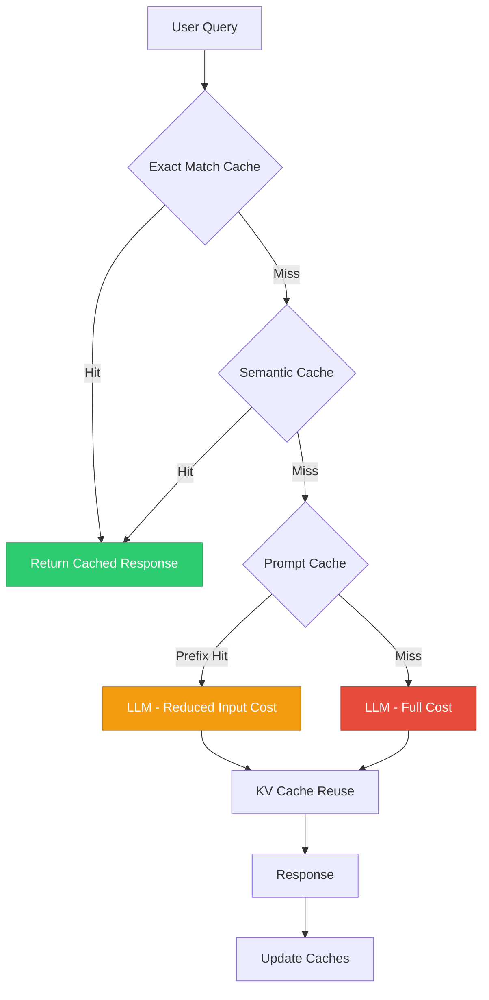
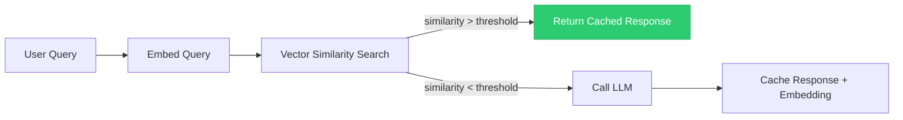

# Caching Strategies

> **TL;DR:** Caching can reduce LLM costs by 50-90% and cut latency dramatically, but it requires strategies tailored to LLMs. Exact match caching is simple but limited. Semantic caching handles paraphrased queries. Provider-level prompt caching (Anthropic, OpenAI) reduces input token costs for repeated prefixes. KV cache reuse optimizes inference at the serving layer. The key is knowing when NOT to cache — personalized, time-sensitive, or safety-critical responses should bypass the cache.

## Table of Contents
- [Why This Matters](#why-this-matters)
- [Caching Layers for LLMs](#caching-layers-for-llms)
- [Exact Match Caching](#exact-match-caching)
- [Semantic Caching](#semantic-caching)
- [Prompt Caching (Provider-Level)](#prompt-caching-provider-level)
- [KV Cache Reuse](#kv-cache-reuse)
- [Invalidation Strategies](#invalidation-strategies)
- [When NOT to Cache](#when-not-to-cache)
- [Key Takeaways](#key-takeaways)
- [References](#references)

## Why This Matters

LLM API calls are expensive and slow relative to traditional compute. A single GPT-4o call costs fractions of a cent but at 100,000 calls/day, that adds up to thousands of dollars monthly. More importantly, LLM latency (1-5 seconds) is orders of magnitude slower than a cache lookup (1-10 milliseconds).

Many LLM applications see significant query repetition:
- **Customer support** — The same 50 questions account for 80% of traffic
- **Search augmentation** — Popular queries are searched repeatedly
- **Code assistants** — Common patterns and boilerplate generate identical requests
- **Content generation** — Template-based generation with minor variations

Intelligent caching exploits this repetition to reduce both cost and latency.

## Caching Layers for LLMs



Each layer catches different types of repetition:
- **Exact match** — Identical queries (fastest, narrowest)
- **Semantic** — Paraphrased queries with the same intent
- **Prompt caching** — Shared system prompt prefixes across requests
- **KV cache** — Reusing computed attention states at the inference layer

## Exact Match Caching

The simplest approach: hash the complete input (system prompt + user message + parameters) and cache the response.

### Implementation

```python
import hashlib
import json
from redis import Redis

class ExactMatchCache:
    def __init__(self, redis_client: Redis, ttl: int = 3600):
        self.redis = redis_client
        self.ttl = ttl

    def _cache_key(self, prompt: str, model: str, temperature: float) -> str:
        content = json.dumps({
            "prompt": prompt,
            "model": model,
            "temperature": temperature,
        }, sort_keys=True)
        return f"llm:exact:{hashlib.sha256(content.encode()).hexdigest()}"

    def get(self, prompt: str, model: str, temperature: float) -> str | None:
        key = self._cache_key(prompt, model, temperature)
        cached = self.redis.get(key)
        return cached.decode() if cached else None

    def set(self, prompt: str, model: str, temperature: float, response: str):
        key = self._cache_key(prompt, model, temperature)
        self.redis.setex(key, self.ttl, response)
```

### When Exact Match Works

| Scenario | Hit Rate | Effectiveness |
|---|---|---|
| FAQ chatbot | 60-80% | Excellent |
| Code completion (boilerplate) | 30-50% | Good |
| Search with fixed query templates | 40-60% | Good |
| Open-ended conversation | <5% | Poor |
| Creative writing | <1% | Useless |

### Limitations

- **Fragile** — A single character difference means a cache miss
- **Temperature sensitivity** — Only valid for temperature=0 (deterministic) outputs; higher temperatures produce different valid outputs
- **Context sensitivity** — If any part of the prompt changes (e.g., current date injection), the cache misses

## Semantic Caching

Cache based on query meaning rather than exact text. Two queries with the same intent hit the same cache entry.

### How It Works



1. Embed the incoming query into a vector
2. Search the cache for semantically similar queries
3. If similarity exceeds a threshold (e.g., 0.95), return the cached response
4. Otherwise, call the LLM and cache the new query-response pair

### Implementation

```python
class SemanticCache:
    def __init__(self, embedding_model, vector_store, threshold: float = 0.95):
        self.embedder = embedding_model
        self.store = vector_store
        self.threshold = threshold

    def get(self, query: str) -> str | None:
        query_embedding = self.embedder.embed(query)
        results = self.store.search(query_embedding, top_k=1)
        if results and results[0].score >= self.threshold:
            return results[0].metadata["response"]
        return None

    def set(self, query: str, response: str):
        query_embedding = self.embedder.embed(query)
        self.store.upsert(
            embedding=query_embedding,
            metadata={"query": query, "response": response}
        )
```

### Threshold Tuning

| Threshold | Behavior | Risk |
|---|---|---|
| **0.99** | Very strict — nearly exact matches only | Low false positives, low hit rate |
| **0.95** | Balanced — catches close paraphrases | Good balance for most applications |
| **0.90** | Aggressive — catches broader variations | Higher false positive risk |
| **0.85** | Very aggressive — different questions may match | Significant false positive risk |

The right threshold depends on your domain. Customer support queries are more repetitive (lower threshold works). Technical questions require precision (higher threshold needed).

### Overhead Considerations

Semantic caching adds latency for the embedding computation and vector search:
- **Embedding** — 5-20ms for a typical query
- **Vector search** — 1-10ms for small-to-medium indexes
- **Total overhead** — 10-30ms per request

This is worthwhile when it avoids a 1-5 second LLM call, but for very fast LLM responses (small models, short outputs), the overhead may not justify the complexity.

## Prompt Caching (Provider-Level)

Anthropic and OpenAI offer prompt caching that reduces costs for repeated prompt prefixes, handling it at the API layer.

### How Provider Prompt Caching Works

```
Request 1: [System prompt (2000 tokens)] + [User message A (100 tokens)]
  → Full price for all 2100 input tokens

Request 2: [System prompt (2000 tokens)] + [User message B (150 tokens)]
  → Cached price for 2000 prefix tokens + full price for 150 new tokens
```

The provider recognizes that the prefix (system prompt) is identical and reuses the computed KV cache from the previous request.

### Anthropic Prompt Caching

- Automatic for prompts with shared prefixes
- Cached input tokens priced at 90% discount
- Cache lifetime: 5 minutes (extended on each hit)
- Minimum cacheable prefix: 1024 tokens (Claude Sonnet), 2048 tokens (Claude Haiku)

### OpenAI Prompt Caching

- Automatic for prompts with shared prefixes
- Cached input tokens priced at 50% discount
- Cache lifetime varies by usage
- Minimum prefix: 1024 tokens

### Maximizing Cache Hits

Structure your prompts so the static content comes first:

```
GOOD (cacheable prefix is long):
  [System prompt - 2000 tokens]
  [Few-shot examples - 500 tokens]
  [Instructions - 300 tokens]
  [User query - 100 tokens]          ← Only this changes

BAD (prefix changes often):
  [Current date: March 8, 2026]      ← Changes daily, busts cache
  [System prompt - 2000 tokens]
  [User query - 100 tokens]
```

Move dynamic content (dates, user-specific data) to the end of the prompt to maximize the cacheable prefix.

## KV Cache Reuse

At the inference layer (when self-hosting), you can reuse computed KV caches across requests.

### Prefix Caching in vLLM

vLLM supports automatic prefix caching:

```bash
# Enable prefix caching in vLLM
python -m vllm.entrypoints.openai.api_server \
    --model meta-llama/Llama-3-70B-Instruct \
    --enable-prefix-caching
```

When multiple requests share the same prompt prefix, vLLM reuses the computed KV cache for that prefix, skipping redundant prefill computation.

### Multi-Turn Conversation Caching

For chat applications, each turn shares the entire conversation history as prefix:

```
Turn 1: [System + User1]                    → Compute full KV cache
Turn 2: [System + User1 + Asst1 + User2]    → Reuse KV cache for prefix
Turn 3: [System + User1 + Asst1 + User2 + Asst2 + User3] → Reuse longer prefix
```

Each subsequent turn only needs to compute the KV cache for the new tokens, dramatically reducing TTFT.

### Prefix Tree Optimization

For applications with many shared prefixes (e.g., same system prompt across all users), a prefix tree efficiently manages KV cache sharing:

```
Root: [System Prompt KV Cache]
├── Branch A: [System + Few-shot Set A]
│   ├── Leaf: [+ User Query 1]
│   └── Leaf: [+ User Query 2]
└── Branch B: [System + Few-shot Set B]
    └── Leaf: [+ User Query 3]
```

## Invalidation Strategies

### Time-Based (TTL)

```python
# Simple TTL - good for most cases
cache.setex(key, ttl=3600, value=response)  # Expire after 1 hour
```

| Content Type | Suggested TTL | Rationale |
|---|---|---|
| Static FAQ answers | 24 hours | Content rarely changes |
| Search results | 1 hour | Underlying data may update |
| Personalized responses | 15 minutes | User context may change |
| Real-time data queries | No cache | Data changes too frequently |

### Event-Based Invalidation

Invalidate cache when underlying data changes:

```python
def on_knowledge_base_update(updated_doc_ids: list[str]):
    """Invalidate cached responses that used updated documents."""
    for doc_id in updated_doc_ids:
        affected_keys = cache.get_keys_by_source(doc_id)
        for key in affected_keys:
            cache.delete(key)
```

### Version-Based Invalidation

Include prompt version in cache key so prompt changes automatically invalidate old entries:

```python
def cache_key(query: str, prompt_version: str, model: str) -> str:
    content = f"{prompt_version}:{model}:{query}"
    return hashlib.sha256(content.encode()).hexdigest()
```

When you update your system prompt (new version), all old cache entries are automatically bypassed.

## When NOT to Cache

Not all responses should be cached. Caching the wrong things creates subtle bugs and safety issues.

| Scenario | Why Not to Cache |
|---|---|
| **Personalized responses** | User-specific context makes cached responses wrong for other users |
| **Time-sensitive queries** | "What's the weather?" or "What happened today?" require fresh data |
| **Safety-critical outputs** | Medical, legal, or financial advice should always be freshly generated with latest guardrails |
| **High-temperature generation** | Creative outputs should vary; caching defeats the purpose |
| **Agentic tool calls** | Actions should be deliberated fresh, not replayed from cache |
| **PII-containing responses** | Cached PII could leak to other users |
| **Low-repetition queries** | Cache overhead without hit rate wastes resources |

### Cache Bypass Pattern

```python
def should_cache(request) -> bool:
    if request.temperature > 0.5:
        return False
    if request.contains_pii:
        return False
    if request.is_time_sensitive:
        return False
    if request.requires_tool_calls:
        return False
    return True
```

## Key Takeaways

1. **Layer your caches** — Exact match for identical queries, semantic for paraphrases, prompt caching for shared prefixes, KV cache for inference optimization. Each layer catches different repetition patterns.

2. **Semantic caching is powerful but risky** — Threshold tuning is critical. Too aggressive and you return wrong answers; too conservative and you miss valid cache hits.

3. **Provider prompt caching is free performance** — Structure prompts with static content first to maximize Anthropic/OpenAI prompt caching. This requires no code changes.

4. **Invalidation is harder than caching** — Use TTL as a baseline, event-based invalidation for data-driven applications, and version-based invalidation for prompt changes.

5. **Know when NOT to cache** — Personalized, time-sensitive, safety-critical, and high-temperature responses should bypass the cache. Getting this wrong creates subtle and dangerous bugs.

6. **Measure cache economics** — Track hit rate, cost savings, and latency improvement. A cache with a 5% hit rate is not worth the operational complexity.

7. **Cache at temperature 0** — Deterministic outputs are cache-friendly. Non-deterministic outputs (temperature > 0) may produce different valid responses, making cached results feel stale or inappropriate.

## References

### Semantic Caching
1. [GPTCache](https://github.com/zilliztech/GPTCache) — Open-source semantic caching library for LLM applications
2. Bang, J., Kim, S., Lee, S. (2023). "GPTCache: An Open-Source Semantic Cache for LLM Applications" — Design and evaluation of semantic caching approaches

### Provider Caching
3. [Anthropic Prompt Caching Documentation](https://docs.anthropic.com/en/docs/build-with-claude/prompt-caching) — Official guide to Anthropic's prompt caching feature
4. [OpenAI Prompt Caching Documentation](https://platform.openai.com/docs/guides/prompt-caching) — Official guide to OpenAI's automatic prompt caching

### KV Cache Optimization
5. Kwon, W., Li, Z., Zhuang, S., et al. (2023). "Efficient Memory Management for Large Language Model Serving with PagedAttention" — KV cache management techniques in vLLM
6. Zheng, L., Yin, L., Xie, Z., et al. (2023). "SGLang: Efficient Execution of Structured Language Model Programs" — RadixAttention for automatic KV cache reuse

### Caching Architecture
7. [Redis Documentation](https://redis.io/docs/) — Reference for cache infrastructure
8. Zhu, B., Wang, X., Yao, Y., et al. (2024). "CacheBlend: Fast Large Language Model Serving for RAG with Cached Knowledge Fusion" — Advanced caching for RAG pipelines
