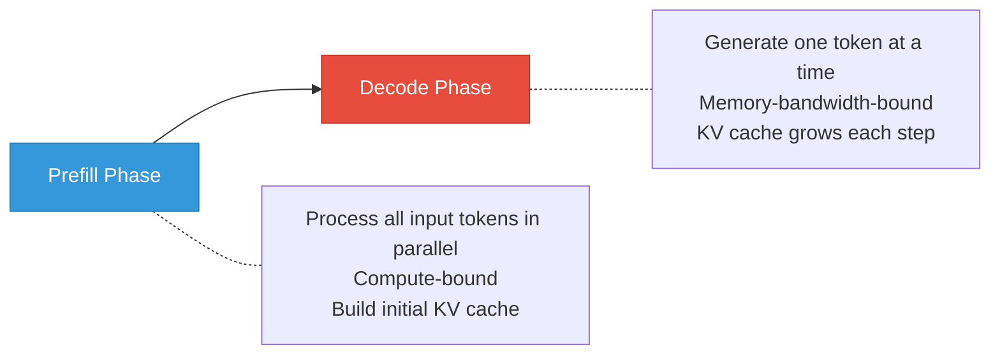
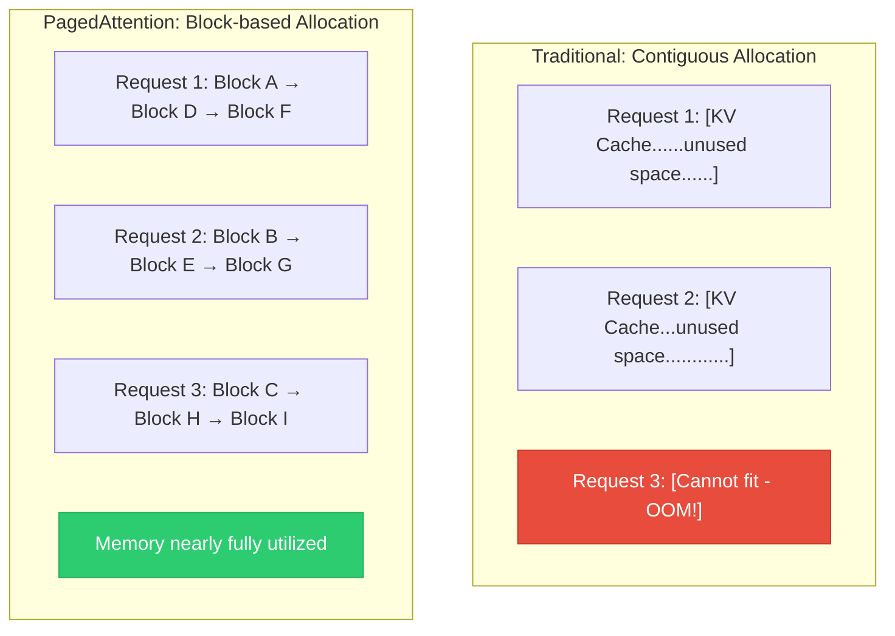
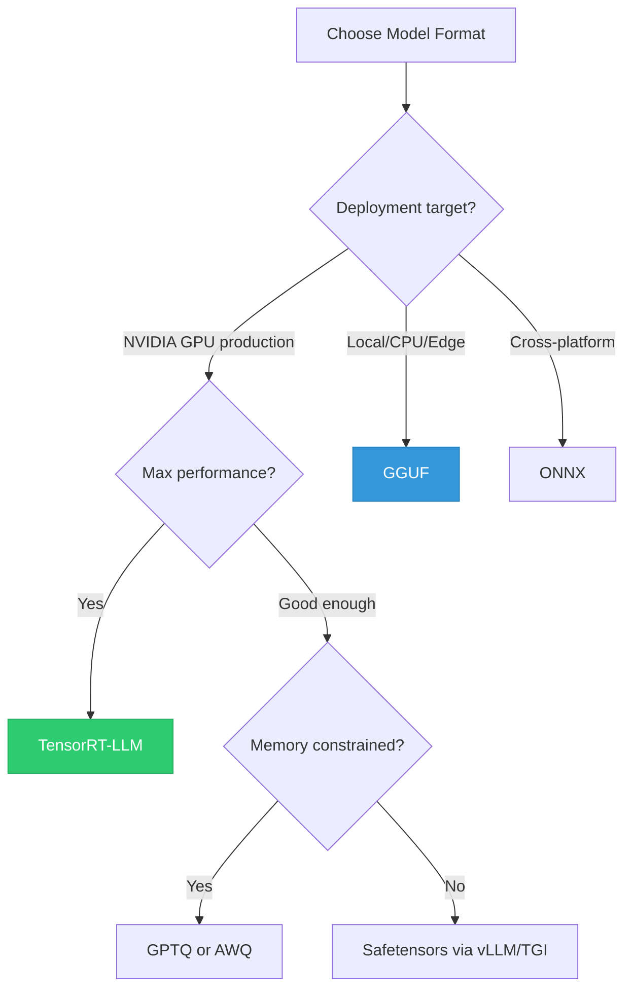
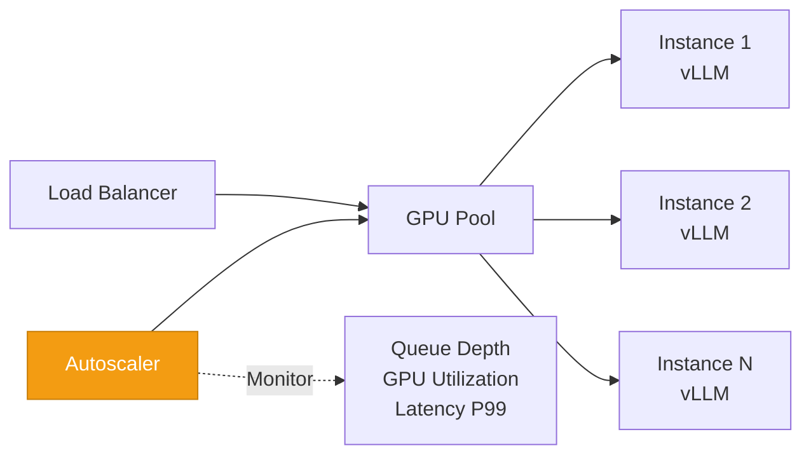

# Model Serving

> **TL;DR:** LLM serving is fundamentally different from traditional ML serving because autoregressive generation is memory-bandwidth-bound and requires managing dynamic KV caches. Modern frameworks like vLLM (PagedAttention), TGI, and Triton solve this with continuous batching, efficient memory management, and optimized model formats. Key metrics are Time to First Token (TTFT), Tokens Per Second (TPS), and throughput under concurrent load.

## Table of Contents
- [Why This Matters](#why-this-matters)
- [LLM Serving vs Traditional ML Serving](#llm-serving-vs-traditional-ml-serving)
- [Key Performance Metrics](#key-performance-metrics)
- [Core Optimization Techniques](#core-optimization-techniques)
- [Serving Frameworks](#serving-frameworks)
- [Model Formats](#model-formats)
- [Deployment Patterns](#deployment-patterns)
- [Framework Comparison](#framework-comparison)
- [Key Takeaways](#key-takeaways)
- [References](#references)

## Why This Matters

Serving LLMs is the single largest operational cost for most AI applications. A single H100 GPU costs $2-3/hour in the cloud. An inefficient serving setup might use 4 GPUs where an optimized one needs 1. At scale, this is the difference between a viable product and one that bleeds money.

Beyond cost, serving performance directly impacts user experience:
- **Chatbots** need sub-second time-to-first-token or users perceive lag
- **Real-time applications** need high tokens-per-second for responsive streaming
- **Batch processing** needs maximum throughput to process millions of requests cost-effectively
- **Agentic systems** make multiple LLM calls per task — each call's latency compounds

## LLM Serving vs Traditional ML Serving

| Aspect | Traditional ML | LLM Serving |
|---|---|---|
| **Request pattern** | Single forward pass | Autoregressive: N sequential forward passes for N tokens |
| **Memory** | Fixed per request | Dynamic KV cache grows with sequence length |
| **Compute bottleneck** | Usually compute-bound | Usually memory-bandwidth-bound |
| **Batching** | Static batches | Continuous batching (requests start/end independently) |
| **Response time** | Milliseconds | Seconds to minutes |
| **Output size** | Fixed (classification, embedding) | Variable (1 to thousands of tokens) |
| **Streaming** | Not needed | Essential for user experience |

### The Autoregressive Challenge



The **prefill phase** processes the entire prompt in one parallel forward pass — this is fast and compute-bound. The **decode phase** generates tokens one at a time, each requiring a full model weight read from memory — this is slow and bandwidth-bound. Most of a request's wall-clock time is spent in the decode phase.

## Key Performance Metrics

| Metric | Definition | Why It Matters |
|---|---|---|
| **TTFT (Time to First Token)** | Latency from request to first token generated | User-perceived responsiveness; dominated by prefill time |
| **TPS (Tokens Per Second)** | Output token generation rate per request | Streaming speed; determines how fast text appears |
| **Throughput** | Total tokens/second across all concurrent requests | Cost efficiency; more throughput = fewer GPUs needed |
| **P50/P95/P99 Latency** | Percentile distribution of end-to-end response time | Tail latency affects worst-case user experience |
| **GPU Utilization** | Percentage of GPU compute and memory actively used | Higher utilization = better cost efficiency |
| **Cost per Token** | Total infrastructure cost divided by tokens served | The ultimate business metric |

### Measuring What Matters

```
Scenario: Chatbot serving 1000 concurrent users

Without optimization:
  TTFT: 2.5s | TPS: 25 | Throughput: 5,000 tok/s | GPUs: 8
  Cost: $24/hour

With vLLM + continuous batching:
  TTFT: 0.8s | TPS: 30 | Throughput: 18,000 tok/s | GPUs: 3
  Cost: $9/hour (62% reduction)
```

## Core Optimization Techniques

### PagedAttention

The breakthrough behind vLLM's performance. Traditional serving pre-allocates contiguous GPU memory for the maximum possible sequence length per request. This wastes 60-80% of GPU memory on empty space.

PagedAttention borrows from OS virtual memory:



- KV cache is stored in non-contiguous memory blocks (like pages in an OS)
- Blocks are allocated on demand as sequences grow
- Memory utilization goes from ~20% to ~95%
- Result: **2-4x more concurrent requests** on the same hardware

### Continuous Batching

Traditional batching waits for a full batch of requests, processes them together, and waits for all to complete. This wastes GPU time on padding and waiting.

Continuous batching (also called iteration-level batching):
- New requests join the batch at any decode step
- Completed requests leave immediately, freeing their resources
- The batch is always full, maximizing GPU utilization

```
Traditional batching:
  [Req1 Req2 Req3 pad pad] → wait for all → [next batch]
  GPU idle between batches

Continuous batching:
  Step 1: [Req1 Req2 Req3]
  Step 2: [Req1 Req2 Req3 Req4]  ← Req4 joins
  Step 3: [Req1 Req3 Req4]       ← Req2 finishes, leaves
  Step 4: [Req1 Req3 Req4 Req5]  ← Req5 joins
  GPU always busy
```

### Speculative Decoding

Use a small, fast "draft" model to generate candidate tokens, then verify them in parallel with the large model:

1. Draft model generates K candidate tokens quickly
2. Large model verifies all K tokens in one forward pass
3. Accept verified tokens, reject incorrect ones
4. Net effect: 2-3x speedup with identical output quality

### Quantization for Serving

Reduce model precision to decrease memory and bandwidth requirements:

| Precision | Memory (70B model) | Speed Impact | Quality Impact |
|---|---|---|---|
| **FP16** | 140 GB | Baseline | Baseline |
| **INT8** | 70 GB | 1.5-2x faster | Minimal (<1% quality loss) |
| **INT4 (GPTQ/AWQ)** | 35 GB | 2-3x faster | Small (1-3% quality loss) |
| **GGUF Q4_K_M** | ~40 GB | 2-3x faster | Small (1-3% quality loss) |

## Serving Frameworks

### vLLM

The most popular open-source LLM serving framework, built around PagedAttention.

**Strengths:**
- PagedAttention for efficient KV cache management
- Continuous batching built-in
- Excellent throughput (often 2-4x faster than naive serving)
- OpenAI-compatible API server
- Broad model support (LLaMA, Mistral, Qwen, Gemma, etc.)
- Active development and community

**Best for:** Production serving where throughput and cost efficiency are priorities.

```bash
# Start vLLM server
python -m vllm.entrypoints.openai.api_server \
    --model meta-llama/Llama-3-70B-Instruct \
    --tensor-parallel-size 4 \
    --gpu-memory-utilization 0.9
```

### Text Generation Inference (TGI)

Hugging Face's serving framework, widely used in production.

**Strengths:**
- Production-proven (powers Hugging Face Inference Endpoints)
- Flash Attention and PagedAttention support
- Continuous batching
- Token streaming via Server-Sent Events
- Built-in safeguards (watermarking, stop sequences)
- Docker-first deployment

**Best for:** Teams already in the Hugging Face ecosystem.

### NVIDIA Triton Inference Server

Enterprise-grade serving platform supporting multiple model types.

**Strengths:**
- Multi-framework support (PyTorch, TensorFlow, TensorRT, ONNX)
- Advanced scheduling and batching
- Model ensembles (chain multiple models)
- Metrics and monitoring built-in
- TensorRT-LLM backend for maximum NVIDIA GPU performance

**Best for:** Enterprise deployments with mixed model types and strict SLA requirements.

### Ollama

Local-first LLM serving focused on simplicity.

**Strengths:**
- One-command model download and serving
- Runs on consumer hardware (Mac, Linux, Windows)
- GGUF format for CPU and GPU inference
- Simple REST API
- Model library with pre-quantized models

**Best for:** Local development, prototyping, and edge deployment.

```bash
# Pull and run a model
ollama pull llama3
ollama run llama3 "Explain PagedAttention in one paragraph"
```

## Model Formats

| Format | Framework | Optimization Level | Use Case |
|---|---|---|---|
| **PyTorch (.pt/.bin)** | PyTorch | None (raw weights) | Development, fine-tuning |
| **Safetensors** | Hugging Face | Safe loading, fast | Default for HF models |
| **ONNX** | ONNX Runtime | Graph optimization | Cross-platform inference |
| **TensorRT** | NVIDIA TensorRT | Kernel fusion, quantization | Maximum NVIDIA GPU performance |
| **GGUF** | llama.cpp / Ollama | CPU-friendly quantization | Local/edge deployment |
| **GPTQ** | AutoGPTQ / vLLM | GPU-optimized quantization | Production GPU serving |
| **AWQ** | AutoAWQ / vLLM | Activation-aware quantization | Production GPU serving |

### Choosing a Format



## Deployment Patterns

### Single GPU Serving

For models that fit in one GPU (7B-13B models, or quantized 70B):
- Simplest deployment
- No inter-GPU communication overhead
- Use vLLM or TGI with a single GPU

### Tensor Parallelism

Split model layers across multiple GPUs on the same node:
- Required for models too large for one GPU
- Fast inter-GPU communication via NVLink
- Linear increase in memory, sub-linear increase in throughput
- Typical: 2-8 GPUs on one node

### Pipeline Parallelism

Split model into sequential stages across GPUs (possibly across nodes):
- Each GPU handles a subset of layers
- Enables serving very large models across multiple nodes
- Higher latency than tensor parallelism due to sequential dependencies

### Autoscaling



Key autoscaling considerations for LLMs:
- **Cold start time** — Loading a 70B model takes 30-60 seconds; pre-warm instances
- **Scale-down lag** — GPU instances are expensive; scale down aggressively but keep a warm pool
- **Request routing** — Route to instances with available KV cache capacity, not just CPU utilization
- **Spot instances** — Use spot/preemptible GPUs for batch workloads (not real-time serving)

## Framework Comparison

| Feature | vLLM | TGI | Triton | Ollama |
|---|---|---|---|---|
| **PagedAttention** | Yes | Yes | Via TensorRT-LLM | No |
| **Continuous Batching** | Yes | Yes | Yes | No |
| **Streaming** | Yes | Yes | Yes | Yes |
| **Multi-GPU** | Yes (TP) | Yes (TP) | Yes (TP + PP) | Limited |
| **Quantization** | GPTQ, AWQ, INT8 | GPTQ, AWQ | TensorRT quantization | GGUF |
| **OpenAI-compatible API** | Yes | Yes | No (custom) | Yes |
| **Ease of setup** | Medium | Medium | Complex | Simple |
| **Best throughput** | Excellent | Very good | Excellent (with TRT) | Moderate |
| **Community** | Large, active | Large (HF) | Enterprise | Growing |
| **Primary use case** | Production serving | Production serving | Enterprise/mixed | Local development |

### Decision Guide

- **Highest throughput, production GPU serving** — vLLM or TGI
- **Enterprise with mixed models and strict SLAs** — Triton with TensorRT-LLM
- **Local development and prototyping** — Ollama
- **Maximum NVIDIA performance** — Triton + TensorRT-LLM
- **Simplest production deployment** — vLLM with Docker

## Key Takeaways

1. **LLM serving is memory-bandwidth-bound** — Unlike traditional ML, autoregressive generation requires reading all model weights for each output token. Memory bandwidth, not compute, is the bottleneck.

2. **PagedAttention is transformative** — By managing KV cache like virtual memory pages, vLLM achieves 2-4x higher throughput than naive approaches.

3. **Continuous batching is essential** — Static batching wastes GPU time. Continuous batching keeps the GPU busy by dynamically adding and removing requests.

4. **Quantization is a pragmatic trade-off** — INT4/INT8 quantization halves memory requirements with minimal quality loss. For most applications, the trade-off is overwhelmingly positive.

5. **TTFT and TPS are your primary metrics** — Time to First Token determines perceived responsiveness. Tokens Per Second determines streaming quality. Optimize for your application's priority.

6. **Choose frameworks based on your constraints** — vLLM for throughput, Triton for enterprise, Ollama for local development. There is no universal best choice.

7. **Autoscaling LLMs is different** — Long cold starts, expensive GPUs, and variable request sizes make LLM autoscaling more nuanced than web server autoscaling.

## References

### Serving Frameworks
1. Kwon, W., Li, Z., Zhuang, S., et al. (2023). "Efficient Memory Management for Large Language Model Serving with PagedAttention" — The paper behind vLLM
2. [vLLM Documentation](https://docs.vllm.ai/) — Official vLLM docs and performance benchmarks
3. [Text Generation Inference (TGI)](https://huggingface.co/docs/text-generation-inference/) — Hugging Face's serving framework documentation
4. [NVIDIA Triton Inference Server](https://developer.nvidia.com/triton-inference-server) — Enterprise serving platform documentation
5. [Ollama](https://ollama.com/) — Local LLM serving documentation

### Optimization Techniques
6. Leviathan, Y., Kalman, M., Matias, Y. (2023). "Fast Inference from Transformers via Speculative Decoding" — Speculative decoding methodology
7. Dao, T. (2023). "FlashAttention-2: Faster Attention with Better Parallelism and Work Partitioning" — Optimized attention computation
8. Frantar, E., Ashkboos, S., Hoefler, T., Alistarh, D. (2023). "GPTQ: Accurate Post-Training Quantization for Generative Pre-Trained Transformers" — GPU quantization method
9. Lin, J., Tang, J., Tang, H., et al. (2024). "AWQ: Activation-aware Weight Quantization for LLM Compression and Acceleration" — Improved quantization approach

### Model Formats
10. [GGUF Format Specification](https://github.com/ggerganov/ggml/blob/master/docs/gguf.md) — CPU-friendly model format used by llama.cpp
11. [ONNX Runtime](https://onnxruntime.ai/) — Cross-platform inference engine
12. [TensorRT-LLM](https://github.com/NVIDIA/TensorRT-LLM) — NVIDIA's high-performance LLM inference library
