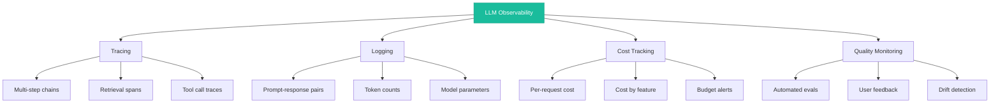
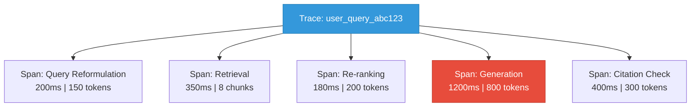

# Observability

> **TL;DR:** LLM observability goes beyond traditional application monitoring. You need to trace multi-step LLM chains, log prompt-response pairs, track per-request costs, and monitor output quality over time. Tools like LangSmith, Langfuse, Phoenix, and OpenLLMetry provide purpose-built solutions, but the principles matter more than the tooling — instrument everything, measure quality continuously, and alert on cost anomalies.

## Table of Contents
- [Why This Matters](#why-this-matters)
- [LLM Observability vs Traditional Observability](#llm-observability-vs-traditional-observability)
- [The Four Pillars of LLM Observability](#the-four-pillars-of-llm-observability)
- [Tracing LLM Pipelines](#tracing-llm-pipelines)
- [Logging Best Practices](#logging-best-practices)
- [Cost Tracking](#cost-tracking)
- [Quality Monitoring](#quality-monitoring)
- [Observability Tools](#observability-tools)
- [Tool Comparison](#tool-comparison)
- [Key Takeaways](#key-takeaways)
- [References](#references)

## Why This Matters

When a traditional web application fails, you get a stack trace, an error code, and a clear path to diagnosis. When an LLM application fails, the model returns a 200 OK with a confident, perfectly formatted, completely wrong answer. There is no error. There is no stack trace. The failure is semantic, not structural.

This makes LLM observability fundamentally different:
- **Silent failures** — Wrong answers look identical to right answers at the HTTP level
- **Non-determinism** — The same input can produce different outputs across calls
- **Cost opacity** — Token-based pricing means costs vary wildly per request
- **Multi-step complexity** — RAG pipelines, agent loops, and chain-of-thought involve many LLM calls per user request
- **Quality drift** — Model updates, prompt changes, or data drift can silently degrade quality

## LLM Observability vs Traditional Observability

| Dimension | Traditional | LLM-Specific |
|---|---|---|
| **Error detection** | HTTP status codes, exceptions | Semantic evaluation of outputs |
| **Latency** | Request-response time | TTFT, TPS, per-step latency in chains |
| **Cost** | Compute/bandwidth (predictable) | Token usage (variable per request) |
| **Quality** | Functional correctness (tests pass/fail) | Relevance, accuracy, hallucination rate |
| **Debugging** | Stack traces, log lines | Prompt-response pairs, retrieval context, chain steps |
| **Monitoring** | Uptime, error rates, P95 latency | Output quality scores, cost per query, hallucination alerts |
| **Tracing** | Request through microservices | Request through retrieval, prompting, generation, tool calls |

## The Four Pillars of LLM Observability



## Tracing LLM Pipelines

### Why Traces Matter

A single user query in a RAG-based agent might involve:
1. Query reformulation (LLM call 1)
2. Retrieval from vector database
3. Re-ranking retrieved documents (LLM call 2)
4. Answer generation with context (LLM call 3)
5. Citation verification (LLM call 4)
6. Output formatting

Without tracing, you see the final response and total latency. With tracing, you see each step's inputs, outputs, latency, and token usage.

### Trace Structure



Each span captures:
- **Inputs** — The prompt or query sent to that step
- **Outputs** — The response or result from that step
- **Metadata** — Model name, temperature, token counts, latency
- **Parent/child relationships** — Which steps depend on which

### Implementation Pattern

```python
from opentelemetry import trace

tracer = trace.get_tracer("llm-pipeline")

async def handle_query(user_query: str):
    with tracer.start_as_current_span("user_query") as root_span:
        root_span.set_attribute("user.query", user_query)

        # Step 1: Reformulate
        with tracer.start_as_current_span("reformulate") as span:
            reformulated = await llm.generate(reformulate_prompt(user_query))
            span.set_attribute("tokens.input", count_tokens(reformulate_prompt))
            span.set_attribute("tokens.output", count_tokens(reformulated))

        # Step 2: Retrieve
        with tracer.start_as_current_span("retrieve") as span:
            docs = await vector_db.search(reformulated, top_k=10)
            span.set_attribute("docs.retrieved", len(docs))

        # Step 3: Generate
        with tracer.start_as_current_span("generate") as span:
            response = await llm.generate(build_prompt(user_query, docs))
            span.set_attribute("tokens.input", count_tokens(build_prompt))
            span.set_attribute("tokens.output", count_tokens(response))

        return response
```

## Logging Best Practices

### What to Log

| Data Point | Why | Privacy Consideration |
|---|---|---|
| **Full prompt** (system + user) | Debug prompt engineering issues | May contain PII; redact or hash |
| **Full response** | Quality analysis, eval datasets | May contain generated PII |
| **Token counts** (input + output) | Cost tracking, optimization | No privacy concern |
| **Model and parameters** | Reproducibility, A/B testing | No privacy concern |
| **Latency breakdown** | Performance debugging | No privacy concern |
| **Retrieved context** | RAG debugging, relevance scoring | May contain sensitive data |
| **User feedback** (thumbs up/down) | Ground truth for quality | Anonymize user identity |
| **Error states** | Debugging failures | No privacy concern |

### Log Structure

```json
{
  "trace_id": "abc123",
  "timestamp": "2026-03-08T14:30:00Z",
  "step": "generation",
  "model": "claude-sonnet-4-20250514",
  "temperature": 0.3,
  "input_tokens": 2450,
  "output_tokens": 380,
  "latency_ms": 1200,
  "ttft_ms": 280,
  "cost_usd": 0.0089,
  "prompt_hash": "sha256:...",
  "retrieval_scores": [0.92, 0.87, 0.81],
  "user_feedback": null
}
```

### Privacy-Safe Logging

Never log raw PII in production. Use these strategies:
- **Hash sensitive fields** — Store prompt hashes instead of raw text for matching
- **Redact before logging** — Remove PII before writing to log stores
- **Tiered access** — Full logs accessible only to authorized personnel
- **Retention policies** — Auto-delete logs with PII after defined periods

## Cost Tracking

### Per-Request Cost Calculation

```python
# Token pricing (example rates, check current pricing)
PRICING = {
    "claude-sonnet-4-20250514": {"input": 3.00 / 1_000_000, "output": 15.00 / 1_000_000},
    "gpt-4o": {"input": 2.50 / 1_000_000, "output": 10.00 / 1_000_000},
    "claude-haiku": {"input": 0.25 / 1_000_000, "output": 1.25 / 1_000_000},
}

def calculate_cost(model: str, input_tokens: int, output_tokens: int) -> float:
    rates = PRICING[model]
    return (input_tokens * rates["input"]) + (output_tokens * rates["output"])
```

### Cost Monitoring Dashboard Metrics

| Metric | Alert Threshold | Action |
|---|---|---|
| **Daily spend** | Budget limit | Throttle or queue requests |
| **Cost per query (average)** | 2x baseline | Investigate prompt bloat or retrieval issues |
| **Cost per query (P99)** | 5x baseline | Identify outlier requests |
| **Cost by feature** | Disproportionate allocation | Optimize high-cost features |
| **Token waste ratio** | >30% of context unused | Reduce retrieval chunk count |

### Cost Optimization Signals

Observability data reveals optimization opportunities:
- **Long prompts with short responses** — System prompt may be too verbose
- **High retrieval token count with low relevance** — Chunking or retrieval needs tuning
- **Repeated identical queries** — Caching opportunity
- **High retry rate** — Model or prompt reliability issue

## Quality Monitoring

### Automated Evaluation

Run evaluations continuously against production traffic:

```python
class QualityMonitor:
    def evaluate(self, query: str, response: str, context: list[str]) -> dict:
        return {
            "relevance": self.score_relevance(query, response),
            "groundedness": self.score_groundedness(response, context),
            "coherence": self.score_coherence(response),
            "harmfulness": self.score_harmfulness(response),
        }

    def score_groundedness(self, response: str, context: list[str]) -> float:
        """Score how well the response is supported by retrieved context."""
        prompt = f"""Rate how well this response is supported by the context.
        Context: {context}
        Response: {response}
        Score (0-1):"""
        return float(self.evaluator_llm.generate(prompt))
```

### Quality Metrics to Track

| Metric | Measurement Method | Frequency |
|---|---|---|
| **Relevance** | LLM-as-judge on query-response pairs | Per-request (sampled) |
| **Groundedness** | Check response claims against retrieved context | Per-request (sampled) |
| **Hallucination rate** | Claim verification against knowledge base | Daily batch |
| **User satisfaction** | Thumbs up/down, explicit ratings | Continuous |
| **Task completion** | Did the user achieve their goal? | Session-level |
| **Refusal rate** | How often does the model decline to answer? | Daily aggregate |

### Drift Detection

Monitor for quality degradation over time:

```
Week 1 baseline: Relevance 0.85 | Groundedness 0.90 | Satisfaction 78%
Week 4 actual:   Relevance 0.72 | Groundedness 0.82 | Satisfaction 65%
                              ↓ Alert: Quality regression detected
```

Common drift causes:
- **Model provider updates** — Underlying model changes without notice
- **Data drift** — User queries shift to topics outside retrieval coverage
- **Prompt drift** — Accumulation of prompt changes without evaluation
- **Index staleness** — RAG knowledge base becomes outdated

## Observability Tools

### LangSmith

LangChain's observability platform.

- **Tracing** — Automatic trace capture for LangChain, LangGraph, and custom code
- **Evaluation** — Built-in eval framework with LLM-as-judge and custom metrics
- **Datasets** — Create evaluation datasets from production traces
- **Comparison** — A/B test prompt versions with side-by-side results
- **Integration** — Tight integration with LangChain ecosystem

### Langfuse

Open-source LLM observability platform.

- **Tracing** — Framework-agnostic trace capture via SDK or API
- **Cost tracking** — Automatic per-request cost calculation
- **Evaluation** — Score traces with manual annotations or automated evals
- **Prompt management** — Version and deploy prompts from the platform
- **Self-hosted** — Can run on your own infrastructure for data sovereignty

### Arize Phoenix

Open-source observability focused on evaluation and experimentation.

- **Trace visualization** — Rich UI for exploring multi-step traces
- **Embeddings analysis** — Visualize embedding drift and retrieval quality
- **Evaluation** — Built-in eval functions for RAG (relevance, groundedness)
- **Experiments** — Run prompt experiments and compare results
- **Local-first** — Runs as a notebook companion or standalone server

### OpenLLMetry

OpenTelemetry-based instrumentation for LLM applications.

- **Standards-based** — Built on OpenTelemetry, integrates with existing observability stacks
- **Auto-instrumentation** — Automatic tracing for OpenAI, Anthropic, Cohere, and other SDKs
- **Vendor-neutral** — Export traces to any OpenTelemetry-compatible backend
- **Lightweight** — Minimal overhead, production-ready

## Tool Comparison

| Feature | LangSmith | Langfuse | Phoenix | OpenLLMetry |
|---|---|---|---|---|
| **Tracing** | Excellent | Excellent | Good | Excellent |
| **Cost tracking** | Yes | Yes | Limited | Via backend |
| **Evaluation** | Built-in | Built-in | Built-in | External |
| **Prompt management** | Yes | Yes | No | No |
| **Self-hosted** | No (SaaS) | Yes | Yes | Yes |
| **Framework lock-in** | LangChain-centric | Framework-agnostic | Framework-agnostic | Framework-agnostic |
| **OpenTelemetry** | Limited | Via export | Via export | Native |
| **Pricing** | Freemium | Open-source + cloud | Open-source | Open-source |
| **Best for** | LangChain teams | Full-featured self-host | Research/experimentation | OTel-native stacks |

### Decision Guide

- **Using LangChain?** LangSmith provides the tightest integration
- **Need self-hosted?** Langfuse is the most complete self-hosted option
- **Research and experimentation?** Phoenix excels at embedding analysis and experiments
- **Existing OTel infrastructure?** OpenLLMetry integrates natively with your stack

## Key Takeaways

1. **LLM failures are silent** — Models return 200 OK with wrong answers. You need semantic evaluation, not just status codes, to detect problems.

2. **Trace everything** — Multi-step LLM pipelines require distributed tracing. Capture inputs, outputs, latency, and token counts at every step.

3. **Cost tracking is essential** — Token-based pricing creates variable costs that can spike unexpectedly. Monitor per-request costs and set budget alerts.

4. **Quality monitoring is continuous** — Run automated evaluations on production traffic. Track relevance, groundedness, and user satisfaction over time.

5. **Drift is inevitable** — Model updates, data shifts, and prompt changes will degrade quality. Detect drift early with baseline comparisons and automated alerts.

6. **Privacy-safe logging is non-negotiable** — Prompts and responses may contain PII. Hash, redact, or encrypt sensitive data before logging.

7. **Choose tools based on your stack** — LangSmith for LangChain teams, Langfuse for self-hosted, Phoenix for research, OpenLLMetry for OTel-native environments.

## References

### Observability Platforms
1. [LangSmith Documentation](https://docs.smith.langchain.com/) — LangChain's observability and evaluation platform
2. [Langfuse Documentation](https://langfuse.com/docs) — Open-source LLM observability
3. [Arize Phoenix Documentation](https://docs.arize.com/phoenix) — Open-source LLM observability and evaluation
4. [OpenLLMetry](https://github.com/traceloop/openllmetry) — OpenTelemetry-based LLM instrumentation

### Standards and Practices
5. [OpenTelemetry Specification](https://opentelemetry.io/docs/specs/) — The standard for distributed tracing and observability
6. Shankar, S., Zamfirescu-Pereira, J.D., Hartmann, B., et al. (2024). "Who Validates the Validators? Aligning LLM-Assisted Evaluation of LLM Outputs with Human Preferences" — Research on LLM-as-judge evaluation reliability

### Cost and Quality
7. Chen, L., Zaharia, M., Zou, J. (2023). "FrugalGPT: How to Use Large Language Models While Reducing Cost and Improving Performance" — Strategies for cost-efficient LLM usage
8. [Anthropic API Pricing](https://www.anthropic.com/pricing) — Reference for token-based pricing models
9. [OpenAI API Pricing](https://openai.com/api/pricing/) — Reference for token-based pricing models
