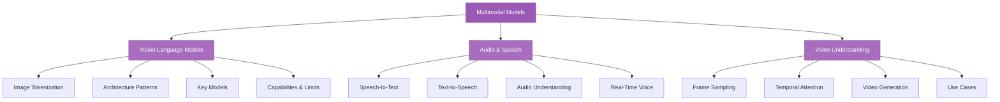

# Multimodal Models

> Moving beyond text: how modern LLMs process images, audio, and video alongside language -- the architectures that unify perception and reasoning across modalities.

## What This Section Covers

The most capable AI systems are no longer text-only. Models like GPT-4o, Gemini, and Claude can see images, hear audio, and process video. But how? These models don't just bolt a vision system onto a language model -- they learn shared representations across modalities, enabling reasoning that combines what they see, hear, and read.

This section explains the architectural patterns behind multimodal models, from vision-language systems that interpret images to audio models that transcribe and generate speech to video understanding systems that reason over temporal sequences. You'll learn what makes each modality challenging, which models lead in each area, and where the field is heading.

## Concept Map

## Pages in This Section

| Page | What You'll Learn |
|---|---|
| [Vision-Language Models](vision-language-models.md) | How models process images alongside text, architecture patterns (CLIP, Flamingo, LLaVA), image tokenization via patch embeddings, and the capabilities and limitations of current systems |
| [Audio & Speech](audio-and-speech.md) | Speech-to-text architectures (Whisper, Deepgram), text-to-speech approaches, real-time voice APIs, audio understanding, and latency considerations for production use |
| [Video Understanding](video-understanding.md) | Why video is harder than images, frame sampling strategies, temporal attention, key models (Gemini, GPT-4o), video generation (Sora, Runway), and current limitations |

## Suggested Reading Order

1. Start with **Vision-Language Models** to understand the foundational architecture patterns -- most multimodal concepts build on how images and text are unified
2. Then read **Audio & Speech** to see how similar principles apply to a very different modality with unique latency and streaming requirements
3. Finally, **Video Understanding** to explore the hardest multimodal problem: reasoning over sequences of frames with temporal context
