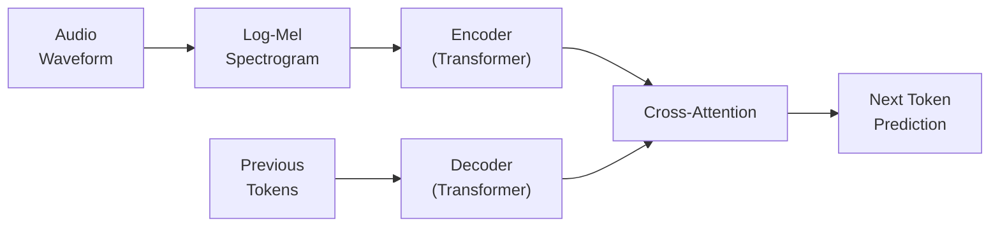
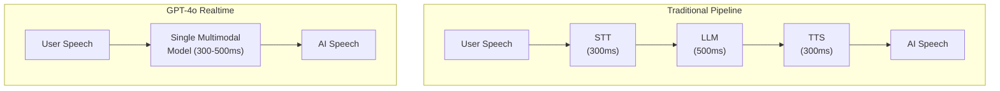

# Audio and Speech

> **TL;DR:** Modern LLMs are gaining the ability to hear and speak. Speech-to-text has been transformed by Whisper's encoder-decoder architecture, while commercial APIs (Deepgram, AssemblyAI) offer production-ready transcription with low latency. Text-to-speech has evolved from robotic synthesis to near-human quality. The frontier is real-time voice interaction (GPT-4o Realtime API), where a single model handles listening, reasoning, and speaking simultaneously -- but latency, cost, and reliability remain significant engineering challenges.

## Table of Contents
- [Why This Matters](#why-this-matters)
- [Speech-to-Text: Transcription and Understanding](#speech-to-text-transcription-and-understanding)
- [Text-to-Speech: Generating Voice](#text-to-speech-generating-voice)
- [Audio Understanding Beyond Speech](#audio-understanding-beyond-speech)
- [Real-Time Voice Interaction](#real-time-voice-interaction)
- [Latency Considerations](#latency-considerations)
- [Speech-to-Text Comparison](#speech-to-text-comparison)
- [Key Takeaways](#key-takeaways)
- [References](#references)

## Why This Matters

Voice is the most natural human interface. We speak 3-4x faster than we type, and audio carries emotional tone, emphasis, and nuance that text cannot. Integrating audio capabilities into LLMs unlocks:

- **Voice assistants** that actually understand context and reason about queries
- **Meeting transcription** with speaker diarization and summarization
- **Accessibility** -- enabling users who cannot type or read to interact with AI
- **Call center automation** that handles complex conversations naturally
- **Content creation** -- podcast generation, audiobook narration, voice cloning for localization

The engineering challenge is latency. Human conversation expects responses within 200-500ms. Achieving this while running transcription, LLM inference, and speech synthesis in sequence is extremely difficult.

## Speech-to-Text: Transcription and Understanding

### Whisper (OpenAI)

Whisper is an open-source encoder-decoder Transformer trained on 680,000 hours of multilingual audio data scraped from the web. It handles transcription, translation, and language identification in a single model.

**How Whisper works:**
1. **Audio preprocessing** -- Raw audio is converted to an 80-channel log-Mel spectrogram (a visual representation of frequency content over time)
2. **Encoder** -- A Transformer encoder processes the spectrogram, producing a sequence of audio embeddings
3. **Decoder** -- An autoregressive Transformer decoder generates text tokens, using cross-attention to attend to encoder outputs
4. **Multitask training** -- The same model handles transcription, translation (any language to English), timestamp prediction, and language identification

**Model sizes:**

| Model | Parameters | English WER | Relative Speed | VRAM |
|---|---|---|---|---|
| tiny | 39M | ~8% | 32x | ~1 GB |
| base | 74M | ~6% | 16x | ~1 GB |
| small | 244M | ~4.5% | 6x | ~2 GB |
| medium | 769M | ~3.5% | 2x | ~5 GB |
| large-v3 | 1.5B | ~2.5% | 1x | ~10 GB |

**Strengths:** Open-source, multilingual (99 languages), robust to noise, handles accents well. Community has built fast inference variants (faster-whisper, whisper.cpp).

**Limitations:** Not designed for real-time streaming (processes 30-second chunks). Hallucination on silence or background noise. High latency for the large model.

### Deepgram

Commercial speech-to-text API built on custom end-to-end deep learning models (not Whisper-based).

**Strengths:** Very low latency (~300ms for streaming), speaker diarization, custom vocabulary, high accuracy on telephony audio, good at domain-specific terms.

**Best for:** Real-time applications, call center transcription, applications where latency is critical.

### AssemblyAI

Commercial API offering both batch and real-time transcription with a suite of audio intelligence features.

**Strengths:** Built-in summarization, sentiment analysis, content moderation, topic detection. Strong real-time streaming support. PII redaction.

**Best for:** Applications needing audio intelligence beyond raw transcription -- content analysis, compliance, and meeting analytics.

### Google Cloud Speech-to-Text

Enterprise speech recognition with Chirp (Universal Speech Model) architecture.

**Strengths:** 125+ language support, strong enterprise integration, medical and telephony-optimized models. Chirp model delivers state-of-the-art accuracy.

**Best for:** Enterprise deployments requiring compliance, scale, and broad language coverage.

## Text-to-Speech: Generating Voice

### Evolution of TTS

Text-to-speech has evolved through several generations:

1. **Concatenative synthesis** (1990s-2010s) -- Splicing recorded speech fragments. Intelligible but robotic.
2. **Parametric synthesis** (2010s) -- Statistical models generating speech parameters. More natural but still artificial.
3. **Neural TTS** (2017+) -- Deep learning models generating waveforms directly. Near-human quality.
4. **Zero-shot voice cloning** (2023+) -- Clone a voice from seconds of audio. Indistinguishable from real speech.

### Current Approaches

**Autoregressive models (e.g., VALL-E, XTTS)**
- Generate speech tokens left-to-right, similar to how LLMs generate text
- High quality but higher latency (sequential generation)
- Natural prosody and emotion

**Non-autoregressive models (e.g., FastSpeech, VITS)**
- Generate the entire utterance in parallel
- Much faster but can sound less natural
- Good for applications where speed matters more than expressiveness

**Diffusion-based models (e.g., NaturalSpeech 2/3)**
- Apply diffusion denoising process to generate speech
- Very high quality, especially for zero-shot voice cloning
- Computationally expensive

### Key TTS Providers

| Provider | Approach | Latency | Voice Quality | Voice Cloning | Notable Feature |
|---|---|---|---|---|---|
| ElevenLabs | Neural, proprietary | Low | Excellent | Yes (seconds of audio) | Best quality/latency trade-off |
| OpenAI TTS | Neural | Low | Very good | No | Simple API, 6 voices |
| Azure Neural TTS | Neural | Low | Very good | Yes (enterprise) | 400+ voices, SSML support |
| Google Cloud TTS | WaveNet/Neural | Low | Good | Limited | Broad language support |
| Coqui/XTTS | Open-source neural | Medium | Good | Yes | Self-hostable, customizable |
| Bark (Suno) | Autoregressive | High | Very good | Limited | Open-source, expressive |

## Audio Understanding Beyond Speech

Modern multimodal models are beginning to understand audio content beyond transcription:

### Environmental Sound Classification
- Identifying sounds: glass breaking, dog barking, sirens, music genres
- Applications: security monitoring, accessibility, content tagging
- Models like Audio Spectrogram Transformer (AST) achieve strong classification accuracy

### Music Understanding
- Genre classification, instrument identification, mood detection
- Beat tracking and rhythm analysis
- Models: MusicLM (Google), MusicGen (Meta) handle both understanding and generation

### Speaker Analysis
- **Speaker diarization** -- Identifying who spoke when in multi-speaker audio
- **Speaker verification** -- Confirming speaker identity
- **Emotion recognition** -- Detecting sentiment from vocal patterns (tone, pitch, pace)

### Audio Captioning
- Generating natural language descriptions of audio content
- "A dog barking in the distance while rain falls on a metal roof"
- Useful for accessibility and content indexing

## Real-Time Voice Interaction

### The GPT-4o Realtime API

OpenAI's Realtime API represents a paradigm shift: instead of chaining speech-to-text, LLM, and text-to-speech as separate steps, a single model handles all three simultaneously.

**Traditional pipeline latency:** 1,100ms+ (noticeable delay)
**GPT-4o Realtime latency:** 300-500ms (conversational)

**How it works:**
- WebSocket connection streams audio bidirectionally
- The model processes audio input tokens and generates audio output tokens directly
- No intermediate text representation required (though text transcripts are available)
- Supports interruption -- the model stops speaking when the user starts

**Challenges:**
- **Cost** -- Significantly more expensive than text-only API calls (audio tokens are priced higher)
- **Reliability** -- WebSocket connections can drop; handling reconnection gracefully is complex
- **Hallucination** -- Audio-native generation can produce speech artifacts or hallucinated words
- **Control** -- Less fine-grained control over responses compared to text-based pipelines

### Building Voice Applications

For production voice applications, consider the architecture trade-offs:

| Approach | Latency | Cost | Control | Quality |
|---|---|---|---|---|
| Cascaded (STT + LLM + TTS) | High (~1.1s) | Lower | High | Good |
| Realtime API (single model) | Low (~400ms) | Higher | Lower | Very good |
| Hybrid (Realtime + fallback) | Low-Medium | Medium | Medium | Good |

Most production systems use a hybrid: the Realtime API for latency-critical interactions with a cascaded fallback for reliability.

## Latency Considerations

In voice applications, latency is the primary engineering constraint. Human conversation has strict timing expectations:

- **<200ms** -- Feels instantaneous. Overlap with natural speech pauses.
- **200-500ms** -- Acceptable for conversation. Most users don't notice delay.
- **500-1000ms** -- Noticeable delay. Users start to feel the system is "thinking."
- **>1000ms** -- Frustrating. Users repeat themselves or lose patience.

### Where Latency Hides

1. **Audio capture and buffering** -- Microphones buffer audio in chunks (typically 20-100ms)
2. **Network round-trip** -- Cloud-based systems add 20-100ms per direction
3. **Voice Activity Detection (VAD)** -- Determining when the user has finished speaking (200-500ms of silence threshold)
4. **Transcription** -- Converting speech to text (100-500ms depending on model)
5. **LLM inference** -- Generating a response (200-2000ms depending on model and length)
6. **Speech synthesis** -- Converting text to audio (100-500ms for first chunk)
7. **Audio playback buffering** -- Initial buffer before playback starts (50-200ms)

**Total realistic latency:** 700-3800ms for a cascaded pipeline

### Latency Optimization Strategies

- **Streaming at every stage** -- Stream audio in, stream transcription out, stream LLM tokens, stream TTS audio
- **Speculative processing** -- Start TTS on partial LLM output before the full response is generated
- **Edge deployment** -- Run VAD and initial processing on-device to reduce network hops
- **Warm connections** -- Maintain persistent WebSocket connections to avoid connection setup latency
- **Chunked TTS** -- Generate and play audio in small chunks rather than waiting for the full utterance

## Speech-to-Text Comparison

| Feature | Whisper (large-v3) | Deepgram | AssemblyAI | Google Chirp |
|---|---|---|---|---|
| Architecture | Encoder-Decoder | End-to-end neural | End-to-end neural | Universal Speech Model |
| Open Source | Yes | No | No | No |
| Streaming | Limited | Yes (native) | Yes | Yes |
| Languages | 99 | 36 | 19 | 125+ |
| Diarization | No (add-on) | Yes | Yes | Yes |
| Latency (streaming) | ~1s+ | ~300ms | ~400ms | ~300ms |
| Self-Hostable | Yes | No | No | No |
| Best For | Batch processing, multilingual | Real-time, telephony | Audio intelligence | Enterprise, multilingual |

## Key Takeaways

1. **Whisper democratized speech-to-text** -- An open-source model matching commercial accuracy made STT accessible to everyone. But it's not designed for real-time streaming.

2. **The latency budget is tight** -- Human conversation expects sub-500ms responses. Every component in the pipeline (capture, transcription, inference, synthesis) must be optimized.

3. **TTS quality has crossed the uncanny valley** -- Modern neural TTS (ElevenLabs, OpenAI TTS) is nearly indistinguishable from human speech. Voice cloning raises important ethical concerns.

4. **Real-time voice is a paradigm shift** -- The GPT-4o Realtime API eliminates the cascaded pipeline, but at higher cost and lower control. Most production systems use hybrid approaches.

5. **Audio understanding goes beyond transcription** -- Modern models can classify sounds, detect emotions, identify speakers, and understand music -- opening applications well beyond dictation.

6. **Cost and latency are inversely related** -- Lower latency generally means higher cost (faster models, persistent connections, edge compute). Production systems must find the right trade-off for their use case.

## References

### Speech-to-Text
1. Radford, A., Kim, J. W., Xu, T., Brockman, G., McLeavey, C., Sutskever, I. (2023). "Robust Speech Recognition via Large-Scale Weak Supervision" (Whisper) -- Encoder-decoder architecture trained on 680K hours of web audio
2. Zhang, Y., et al. (2023). "Google USM: Scaling Automatic Speech Recognition Beyond 100 Languages" (Chirp) -- Universal speech model for multilingual recognition

### Text-to-Speech
3. Wang, C., Chen, S., Wu, Y., et al. (2023). "Neural Codec Language Models are Zero-Shot Text to Speech Synthesizers" (VALL-E) -- Autoregressive TTS from codec tokens
4. Shen, K., et al. (2024). "NaturalSpeech 3: Zero-Shot Speech Synthesis with a Factorized Codec and Diffusion Models" -- Diffusion-based high-quality TTS
5. Ren, Y., Hu, C., Tan, X., et al. (2022). "FastSpeech 2: Fast and High-Quality End-to-End Text to Speech" -- Non-autoregressive parallel synthesis

### Real-Time Voice
6. OpenAI (2024). "GPT-4o Realtime API Documentation" -- Architecture and usage for real-time audio interaction
7. Défossez, A., Copet, J., Synnaeve, G., Adi, Y. (2023). "High Fidelity Neural Audio Compression" (EnCodec) -- Audio tokenization enabling LLM-style audio generation

### Audio Understanding
8. Gong, Y., Chung, Y.-A., Glass, J. (2021). "AST: Audio Spectrogram Transformer" -- Transformer-based audio classification
9. Agostinelli, A., Denk, T. I., et al. (2023). "MusicLM: Generating Music From Text" -- Text-conditioned music generation
