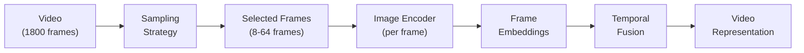
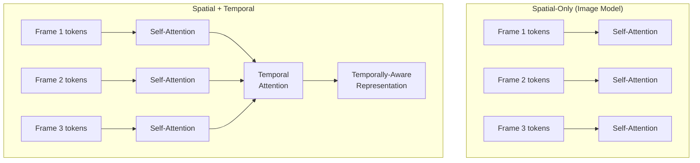

# Video Understanding

> **TL;DR:** Video understanding is the hardest multimodal challenge because it combines the complexity of image understanding with temporal reasoning across thousands of frames. Current approaches use frame sampling, video encoders, and temporal attention to handle this scale. Models like Gemini and GPT-4o can answer questions about short videos, but long-form video understanding, action reasoning, and real-time processing remain open problems. Video generation (Sora, Runway) is advancing rapidly but still struggles with physics consistency and long-form coherence.

## Table of Contents
- [Why This Matters](#why-this-matters)
- [Why Video Is Harder Than Images](#why-video-is-harder-than-images)
- [Technical Approaches](#technical-approaches)
- [Key Models](#key-models)
- [Use Cases](#use-cases)
- [Video Generation](#video-generation)
- [Limitations and Open Problems](#limitations-and-open-problems)
- [Key Takeaways](#key-takeaways)
- [References](#references)

## Why This Matters

Video is the dominant medium of the internet. YouTube hosts over 800 million videos. Surveillance systems generate petabytes of footage daily. Medical procedures, manufacturing processes, and educational content are all recorded as video. Yet until recently, AI could barely process this content beyond simple classification.

Video understanding matters for:
- **Content moderation** -- Detecting harmful content at scale across platforms
- **Surveillance and security** -- Automated monitoring, anomaly detection, forensic analysis
- **Education** -- Generating summaries, searchable transcripts, and interactive Q&A from lecture videos
- **Accessibility** -- Audio descriptions for visually impaired users, sign language interpretation
- **Manufacturing** -- Quality inspection, process monitoring, defect detection
- **Autonomous systems** -- Self-driving cars, robotics, drone navigation

## Why Video Is Harder Than Images

A single image might produce 196-1,024 visual tokens. A 1-minute video at 30fps contains 1,800 frames -- potentially millions of visual tokens. This creates fundamental challenges:

### The Scale Problem

```
Image:    1 frame   x 576 tokens  =      576 tokens
10s video: 300 frames x 576 tokens  =  172,800 tokens
1m video: 1,800 frames x 576 tokens = 1,036,800 tokens
1h video: 108,000 frames x 576 tokens = 62,208,000 tokens
```

No current model can process 62 million tokens. Even a 1-minute video exceeds most context windows. Video understanding requires aggressive compression.

### Additional Challenges

- **Temporal reasoning** -- Understanding cause and effect, action sequences, and temporal ordering requires reasoning across frames, not just understanding individual frames
- **Redundancy** -- Adjacent frames are 95%+ identical. Processing every frame wastes compute on redundant information
- **Motion and dynamics** -- Tracking objects across frames, understanding movement patterns, and recognizing activities require explicit temporal modeling
- **Audio-visual alignment** -- Video includes audio that provides critical context. Integrating both modalities adds complexity
- **Memory** -- Maintaining information from early in a video while processing later content requires long-range memory mechanisms

## Technical Approaches

### Frame Sampling

The most common strategy: instead of processing every frame, select a representative subset.



**Uniform sampling:** Select frames at regular intervals (e.g., 1 frame per second). Simple and effective for understanding overall content. Misses brief events.

**Keyframe extraction:** Use scene change detection or visual difference metrics to select frames that represent distinct moments. Better for varied content but computationally expensive.

**Adaptive sampling:** Use a lightweight model to identify important segments, then sample densely from those regions. Best quality but adds pipeline complexity.

**Token merging:** Process many frames but merge similar tokens across time, reducing the total token count while preserving temporal information.

| Strategy | Frames Selected | Token Count | Temporal Coverage | Best For |
|---|---|---|---|---|
| Uniform (1fps) | 60/min | ~34K | Good | General understanding |
| Uniform (0.5fps) | 30/min | ~17K | Moderate | Summarization |
| Keyframe | 10-30/min | ~6-17K | Variable | Scene-based content |
| Dense (all frames) | 1800/min | ~1M | Complete | Action recognition |

### Video Encoders

Specialized architectures for extracting temporal features from video:

**TimeSformer** -- Extends ViT with divided space-time attention. Each token attends to spatial neighbors within its frame and temporal neighbors across frames. Efficient factorization avoids the quadratic cost of full spatiotemporal attention.

**Video Swin Transformer** -- Applies shifted window attention in 3D (height, width, time). Processes video as a 3D volume rather than a sequence of 2D frames.

**ViViT (Video Vision Transformer)** -- Factorizes video into spatial and temporal components. Spatial encoder processes individual frames; temporal encoder captures cross-frame dynamics.

### Temporal Attention Mechanisms



**Causal temporal attention** -- Each frame can only attend to previous frames. Natural for streaming/real-time applications. Used when temporal ordering matters.

**Bidirectional temporal attention** -- Each frame attends to all other frames. Better for offline video understanding where you have the full video available.

**Hierarchical temporal attention** -- Attend to nearby frames with fine granularity and distant frames with coarse granularity. Balances local detail with global context.

## Key Models

### Gemini (Google DeepMind)

- **Approach:** Natively multimodal. Processes video frames, audio, and text in a unified architecture
- **Context:** Up to 1M tokens -- can process approximately 1 hour of video
- **Capabilities:** Video QA, temporal reasoning, audio-visual understanding, scene description
- **Strengths:** Longest context window for video. Handles audio and visual tracks together. Native multimodality means better cross-modal reasoning
- **Limitations:** Still struggles with precise temporal localization and complex action sequences

### GPT-4o (OpenAI)

- **Approach:** Accepts video as a sequence of frames extracted at specified intervals
- **Capabilities:** Video QA, content description, action recognition, scene understanding
- **Strengths:** Strong reasoning about video content. Good at describing complex scenes
- **Limitations:** Frame-based approach means temporal granularity depends on sampling rate. No native audio-visual alignment from video input

### Video-LLaMA (Open Source)

- **Approach:** Extends LLaMA with video and audio branches. Uses a Video Q-Former to aggregate frame-level features and an Audio Q-Former for audio features
- **Capabilities:** Video QA, video-grounded dialogue, audio-visual understanding
- **Strengths:** Open-source, modular architecture. Demonstrates that video understanding can be added to existing LLMs
- **Limitations:** Limited temporal reasoning compared to proprietary models. Struggles with long videos

### VideoChat / VideoChat2

- **Approach:** Chat-centric video understanding with instruction tuning
- **Capabilities:** Conversational video understanding, temporal grounding
- **Strengths:** Open-source, good at multi-turn conversation about video content
- **Limitations:** Quality gap with proprietary models on complex reasoning tasks

### InternVideo2

- **Approach:** Progressive training from masked video modeling to multimodal alignment
- **Capabilities:** Video classification, retrieval, captioning, QA
- **Strengths:** Strong on benchmarks. Scalable architecture with progressive training strategy
- **Limitations:** Primarily research-focused, less optimized for production deployment

## Use Cases

### Content Moderation
Platforms process millions of video uploads daily. Video understanding models can flag potentially harmful content (violence, harassment, dangerous activities) for human review, dramatically reducing the volume moderators must screen.

### Video Search and Retrieval
Instead of relying on metadata and titles, video understanding enables semantic search: "Find the moment where the speaker discusses quarterly revenue" or "Show me clips of the red car turning left."

### Meeting and Lecture Summarization
Process recorded meetings to generate structured summaries, action items, and searchable transcripts. Combine video understanding (slide content, whiteboard notes) with audio transcription for comprehensive notes.

### Sports Analytics
Track player movements, analyze formations, detect events (goals, fouls, substitutions). Generate automated highlight reels from full-game footage.

### Autonomous Driving and Robotics
Understanding dynamic scenes is essential for navigation. Video models process continuous camera feeds to detect obstacles, predict pedestrian behavior, and plan paths.

## Video Generation

### Sora (OpenAI)

Sora generates videos from text prompts using a diffusion transformer architecture operating on spatiotemporal patches.

**Architecture:** Treats video as a 3D grid of patches (space + time) and applies a diffusion process to generate coherent sequences. This approach handles variable resolutions and durations.

**Capabilities:** Up to 60 seconds of video. Multiple camera angles, character consistency, realistic motion.

**Limitations:** Still produces physics errors (objects passing through each other, gravity inconsistencies). Character consistency degrades over longer sequences. Computationally extremely expensive.

### Runway Gen-3

- Commercial video generation platform with rapid iteration
- Text-to-video and image-to-video generation
- Strong on stylistic consistency and short clips (4-10 seconds)
- Production use cases in advertising and creative industries

### Kling (Kuaishou)

- Competitive video generation from Chinese tech company
- Strong on motion dynamics and character animation
- Up to 2 minutes of generated video

### Limitations of Current Video Generation

- **Physics consistency** -- Generated videos often violate basic physics (objects float, liquids behave unnaturally, shadows are inconsistent)
- **Temporal coherence** -- Characters and objects can change appearance across frames
- **Long-form generation** -- Quality degrades significantly beyond 10-30 seconds
- **Fine control** -- Difficult to specify precise actions, timing, or camera movements
- **Compute cost** -- Generating a single minute of video can cost hundreds of dollars in compute

## Limitations and Open Problems

### What Current Models Cannot Do

- **Long-form understanding** -- Processing and reasoning over full-length movies or multi-hour recordings remains beyond current capabilities
- **Precise temporal localization** -- "At exactly what timestamp does X happen?" is unreliable
- **Causal reasoning** -- Understanding why something happened based on prior events is weak
- **Multi-object tracking** -- Following many objects simultaneously across frames
- **Real-time processing** -- Most models cannot process video at real-time speeds (30fps)
- **Fine-grained action recognition** -- Distinguishing subtle action differences (e.g., "stirring" vs. "whisking")

### Open Research Questions

- **Efficient temporal representations** -- How to compress hours of video into manageable token sequences without losing critical temporal information
- **Streaming video understanding** -- Processing video in real-time as it arrives, without waiting for the full clip
- **World models** -- Can video understanding lead to models that truly understand physics, causality, and spatial relationships?
- **Unified generation and understanding** -- Models that can both watch and create video with a shared understanding of the visual world

## Key Takeaways

1. **Video is fundamentally harder than images** -- The token count scales linearly with duration, and temporal reasoning adds a dimension that image models don't address.

2. **Frame sampling is essential** -- No current model can process every frame of a video. The sampling strategy determines what information is preserved and what is lost.

3. **Proprietary models lead significantly** -- Gemini's 1M-token context window gives it a substantial advantage for video understanding. The gap between proprietary and open-source models is larger for video than for images or text.

4. **Video generation is impressive but unreliable** -- Sora and similar models produce visually stunning results but cannot consistently maintain physics, character consistency, or temporal coherence.

5. **Audio-visual integration matters** -- The audio track provides critical context that pure visual processing misses. Models that process both modalities together outperform those that treat them separately.

6. **Real-time video understanding is unsolved** -- Processing video at the speed it arrives (30fps) while maintaining reasoning quality is an open engineering and research challenge.

7. **The compute cost is prohibitive** -- Both video understanding and generation require orders of magnitude more compute than text or image tasks, limiting practical applications.

## References

### Video Understanding Architectures
1. Bertasius, G., Wang, H., Torresani, L. (2021). "Is Space-Time Attention All You Need for Video Understanding?" (TimeSformer) -- Divided space-time attention for video
2. Arnab, A., Dehghani, M., Heigold, G., et al. (2021). "ViViT: A Video Vision Transformer" -- Factorized spatial-temporal transformers
3. Liu, Z., Ning, J., Cao, Y., et al. (2022). "Video Swin Transformer" -- 3D shifted window attention for video

### Multimodal Video Models
4. Zhang, H., Li, X., Bing, L. (2023). "Video-LLaMA: An Instruction-tuned Audio-Visual Language Model for Video Understanding" -- Adding video/audio branches to LLMs
5. Li, K., He, Y., Wang, Y., et al. (2024). "InternVideo2: Scaling Foundation Models for Multimodal Video Understanding" -- Progressive training for video understanding
6. Team Gemini (2024). "Gemini: A Family of Highly Capable Multimodal Models" -- Native multimodal architecture including video

### Video Generation
7. Brooks, T., Peebles, B., et al. (2024). "Video Generation Models as World Simulators" (Sora) -- Diffusion transformer for video generation
8. Blattmann, A., Dockhorn, T., Kulal, S., et al. (2023). "Stable Video Diffusion: Scaling Latent Video Diffusion Models to Large Datasets" -- Open-source video generation

### Surveys
9. Tang, Y., Bi, J., Xu, S., et al. (2024). "Video Understanding with Large Language Models: A Survey" -- Comprehensive overview of video-LLM approaches
10. Xing, Z., Feng, Q., Chen, H., et al. (2024). "A Survey on Video Diffusion Models" -- Overview of diffusion-based video generation
