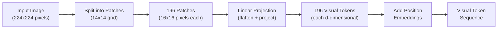
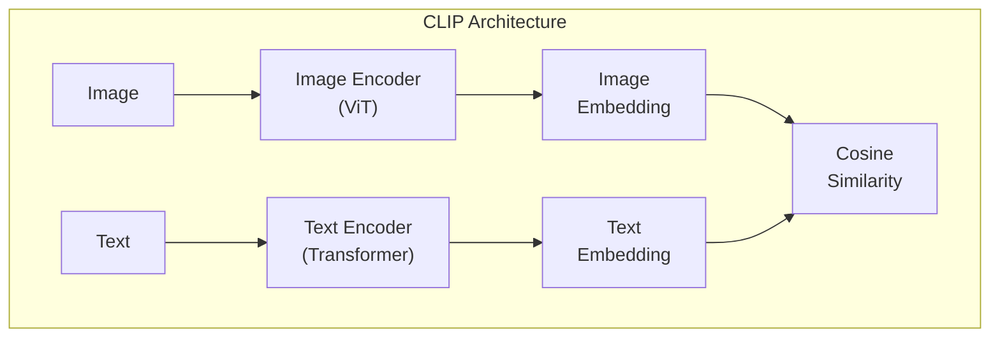
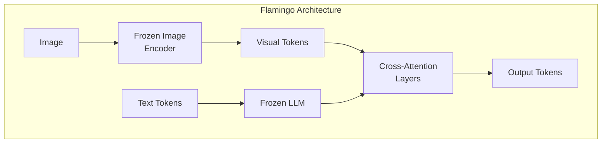
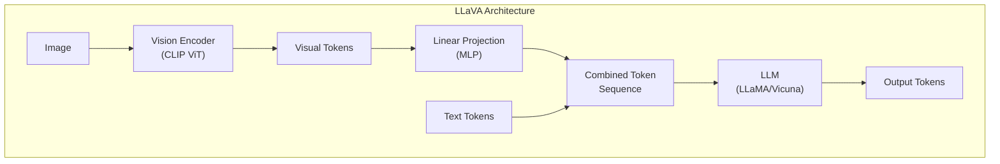

# Vision-Language Models

> **TL;DR:** Vision-language models (VLMs) combine image encoders with LLMs to enable reasoning over visual content. Three dominant architecture patterns exist: contrastive (CLIP-style), cross-attention (Flamingo-style), and projection (LLaVA-style). Images are converted into token sequences via patch embeddings, then processed alongside text tokens. Current VLMs can describe images, answer visual questions, read documents, and generate code from screenshots -- but still struggle with spatial reasoning, counting, and fine-grained detail.

## Table of Contents
- [Why This Matters](#why-this-matters)
- [Image Tokenization: Turning Pixels into Tokens](#image-tokenization-turning-pixels-into-tokens)
- [Architecture Patterns](#architecture-patterns)
- [Key Models](#key-models)
- [Capabilities and Limitations](#capabilities-and-limitations)
- [Use Cases](#use-cases)
- [Model Comparison](#model-comparison)
- [Key Takeaways](#key-takeaways)
- [References](#references)

## Why This Matters

Text-only LLMs are blind. They can reason about the world, write code, and answer questions -- but they cannot look at a chart, read a handwritten note, or interpret a medical scan. Vision-language models solve this by giving LLMs the ability to see.

This matters practically because:
- **Document understanding** -- Extracting structured data from invoices, receipts, and forms without OCR pipelines
- **Visual reasoning** -- Answering questions about diagrams, charts, and screenshots
- **Accessibility** -- Describing images for visually impaired users
- **Code generation** -- Converting UI mockups into working code
- **Scientific analysis** -- Interpreting microscopy images, satellite imagery, and medical scans

The architecture pattern you choose determines cost, latency, and capability trade-offs.

## Image Tokenization: Turning Pixels into Tokens

LLMs operate on sequences of tokens. To process images, you need to convert pixel data into a token-like representation. The dominant approach is **patch embeddings**.

### Patch Embedding Pipeline

**How it works:**

1. **Divide the image into patches** -- A 224x224 image is split into a grid of 16x16 pixel patches, producing 196 patches (14 x 14 grid)
2. **Flatten each patch** -- Each 16x16x3 patch becomes a 768-dimensional vector
3. **Project to model dimension** -- A learned linear layer maps each patch vector to the model's hidden dimension
4. **Add positional embeddings** -- 2D position information is encoded so the model knows where each patch was in the original image
5. **Result** -- The image is now a sequence of 196 tokens, compatible with Transformer processing

### Resolution and Token Count

Higher resolution means more tokens, which means more compute:

| Resolution | Patch Size | Token Count | Compute Cost |
|---|---|---|---|
| 224x224 | 16x16 | 196 | Baseline |
| 336x336 | 14x14 | 576 | ~3x |
| 448x448 | 14x14 | 1,024 | ~5x |
| 768x768 | 14x14 | 3,025 | ~15x |

Modern VLMs use **dynamic resolution** strategies -- processing small images at low resolution and large or detailed images at higher resolution to balance quality and cost.

## Architecture Patterns

### Pattern 1: Contrastive (CLIP-Style)

CLIP (Contrastive Language-Image Pre-training) learns a shared embedding space for images and text by training on 400M image-text pairs from the internet.

**How it works:**
- Image encoder (Vision Transformer) and text encoder are trained jointly
- Objective: Matching image-text pairs should have high cosine similarity; non-matching pairs should have low similarity
- After training, both encoders map to the same embedding space

**Strengths:** Zero-shot classification, image search, retrieval. Very efficient -- no autoregressive generation needed.

**Limitations:** Cannot generate text. Only computes similarity -- no reasoning or conversation.

**Used by:** CLIP, SigLIP, OpenCLIP, ALIGN

### Pattern 2: Cross-Attention (Flamingo-Style)

Flamingo inserts visual information into a frozen LLM using cross-attention layers, where text tokens attend to visual tokens at specific layers.

**How it works:**
- A frozen vision encoder extracts visual features
- A frozen LLM handles text processing
- Newly initialized cross-attention layers (inserted between existing LLM layers) allow text tokens to attend to visual tokens
- Only the cross-attention layers are trained -- both the vision encoder and LLM remain frozen

**Strengths:** Preserves LLM capabilities. Few-shot visual learning. Handles interleaved image-text sequences naturally.

**Limitations:** More complex architecture. Cross-attention layers add parameters and latency. Requires careful training of the bridge layers.

**Used by:** Flamingo, IDEFICS, Otter

### Pattern 3: Projection (LLaVA-Style)

LLaVA (Large Language and Vision Assistant) uses a simple linear projection to map visual tokens directly into the LLM's input space.

**How it works:**
- A pre-trained vision encoder (usually CLIP ViT) extracts visual features
- A simple MLP projects visual tokens into the same embedding space as text tokens
- Visual and text tokens are concatenated into a single sequence
- The LLM processes the combined sequence with standard self-attention

**Strengths:** Simple architecture. Easy to train (two-stage: alignment then instruction tuning). Strong performance relative to complexity.

**Limitations:** Visual tokens consume context window. Large images produce many tokens. No special mechanism for multiple images.

**Used by:** LLaVA, LLaVA-1.5, LLaVA-NeXT, ShareGPT4V, InternVL

## Key Models

### GPT-4V / GPT-4o (OpenAI)

- **Architecture:** Proprietary, likely a hybrid approach with dense visual token integration
- **Capabilities:** Image understanding, chart/diagram interpretation, OCR, spatial reasoning, multi-image comparison
- **GPT-4o advancement:** Natively multimodal -- vision, text, and audio processed in a single model rather than separate pipelines
- **Strengths:** Strongest general-purpose visual reasoning. Handles complex scenes, long documents, and nuanced questions
- **Access:** API only. Image input costs vary by resolution (low: ~85 tokens, high: ~765 tokens per tile)

### Claude Vision (Anthropic)

- **Architecture:** Proprietary multimodal architecture
- **Capabilities:** Document analysis, chart interpretation, image description, code generation from screenshots
- **Strengths:** Strong at structured document understanding. Careful handling of uncertain or ambiguous visual content
- **Access:** API and web interface. Supports multiple images per conversation

### Gemini (Google DeepMind)

- **Architecture:** Natively multimodal from pre-training -- not a bolted-on vision module
- **Capabilities:** Image, video, and audio understanding. Long-context multimodal reasoning (up to 1M tokens)
- **Strengths:** Native multimodality. Long context window enables processing entire documents or videos. Strong on interleaved image-text
- **Access:** API (Gemini Pro, Flash, Ultra variants)

### LLaVA (Open Source)

- **Architecture:** CLIP ViT-L/14 + linear projection + LLaMA/Vicuna
- **Capabilities:** Visual question answering, image description, visual reasoning
- **Strengths:** Open-source, reproducible, community-maintained. Good performance for its simplicity
- **Versions:** LLaVA-1.5 (improved resolution), LLaVA-NeXT (dynamic resolution, video support)

### CogVLM (Tsinghua University)

- **Architecture:** Deep fusion with visual expert modules in every layer
- **Capabilities:** Visual grounding (bounding box output), OCR, visual QA
- **Strengths:** Strong on grounding tasks -- can point to specific image regions. Competitive with proprietary models on benchmarks
- **Open source:** Yes, weights available

## Capabilities and Limitations

### What VLMs Can Do Well

- **Image description** -- Generating accurate, detailed captions for photographs and illustrations
- **Document OCR** -- Reading printed and handwritten text from documents, forms, and signs
- **Chart/graph interpretation** -- Extracting data and trends from bar charts, line graphs, and tables
- **Visual question answering** -- Answering specific questions about image content
- **Code from screenshots** -- Converting UI mockups and screenshots into HTML/CSS/code
- **Multi-image comparison** -- Comparing differences between two or more images

### Where VLMs Still Struggle

- **Spatial reasoning** -- Understanding precise spatial relationships ("Is the red box above or below the blue circle?")
- **Counting** -- Accurately counting objects, especially when there are many (>10)
- **Fine-grained text reading** -- Small text, unusual fonts, or low contrast remain challenging
- **Hallucination** -- VLMs confidently describe objects that aren't in the image
- **3D understanding** -- Reasoning about depth, occlusion, and 3D structure
- **Temporal reasoning** -- Understanding sequences or cause-and-effect in single images

## Use Cases

### Document Processing
Extract structured data from invoices, receipts, contracts, and forms. VLMs handle layout-aware extraction better than traditional OCR pipelines because they understand document structure, not just character recognition.

### Visual Accessibility
Generate image descriptions for screen readers, describe charts for data analysis, provide visual content summaries for visually impaired users.

### UI/UX Development
Convert wireframes and mockups into code. Review screenshots for design consistency. Generate automated UI tests from visual specifications.

### Scientific and Medical Imaging
Analyze microscopy images, classify satellite imagery, interpret medical scans (with appropriate validation). Note: medical applications require rigorous validation and regulatory compliance.

### Retail and E-Commerce
Product image analysis, visual search, automated catalog tagging, quality inspection from product photos.

## Model Comparison

| Model | Architecture | Open Source | Max Resolution | Multi-Image | Video | Strengths |
|---|---|---|---|---|---|---|
| GPT-4o | Proprietary | No | High (tiled) | Yes | Yes | Best general reasoning |
| Claude Vision | Proprietary | No | High | Yes | No | Document understanding |
| Gemini Pro | Native multimodal | No | High | Yes | Yes | Long context, native multimodal |
| LLaVA-NeXT | Projection (MLP) | Yes | Dynamic | Limited | Yes | Simple, reproducible |
| CogVLM | Deep fusion | Yes | 490x490 | Limited | No | Visual grounding |
| InternVL 2 | Projection + scaling | Yes | Dynamic | Yes | Yes | Strong open-source option |
| Qwen-VL | Cross-attention | Yes | Dynamic | Yes | No | Multilingual vision |

## Key Takeaways

1. **Images become token sequences** -- Patch embeddings convert images into sequences of visual tokens that Transformers can process alongside text. Higher resolution means more tokens and higher cost.

2. **Three architecture patterns dominate** -- Contrastive (CLIP) for retrieval, cross-attention (Flamingo) for preserving frozen LLM capabilities, and projection (LLaVA) for simplicity and strong performance.

3. **Proprietary models lead, but open source is closing the gap** -- GPT-4o, Claude, and Gemini offer the strongest visual reasoning, but LLaVA-NeXT and InternVL are competitive on many benchmarks.

4. **VLMs are not infallible** -- Spatial reasoning, counting, and hallucination remain significant weaknesses. Always validate VLM outputs for critical applications.

5. **Native multimodality is the future** -- Models trained from scratch on mixed-modality data (like Gemini and GPT-4o) outperform those that bolt vision onto a text-only LLM.

6. **Resolution and cost are directly linked** -- Dynamic resolution strategies are essential for balancing image quality with token budget and inference cost.

## References

### Foundational Models
1. Radford, A., Kim, J. W., Hallacy, C., et al. (2021). "Learning Transferable Visual Models From Natural Language Supervision" (CLIP) -- Contrastive learning for image-text alignment
2. Alayrac, J.-B., Donahue, J., Luc, P., et al. (2022). "Flamingo: a Visual Language Model for Few-Shot Learning" -- Cross-attention architecture for interleaved image-text
3. Liu, H., Li, C., Wu, Q., Lee, Y. J. (2023). "Visual Instruction Tuning" (LLaVA) -- Simple projection-based visual instruction following

### Architecture and Training
4. Dosovitskiy, A., Beyer, L., Kolesnikov, A., et al. (2021). "An Image is Worth 16x16 Words: Transformers for Image Recognition at Scale" (ViT) -- Patch embedding approach for vision Transformers
5. Wang, W., Lv, Q., Yu, W., et al. (2023). "CogVLM: Visual Expert for Pretrained Language Models" -- Deep fusion with visual expert modules

### Multimodal Systems
6. OpenAI (2023). "GPT-4V(ision) System Card" -- Capabilities and limitations of GPT-4V
7. Team Gemini (2024). "Gemini: A Family of Highly Capable Multimodal Models" -- Native multimodal architecture
8. Liu, H., Li, C., Li, Y., Lee, Y. J. (2024). "LLaVA-NeXT: Improved Reasoning, OCR, and World Knowledge" -- Dynamic resolution and improved training

### Surveys
9. Yin, S., Fu, C., Zhao, S., et al. (2024). "A Survey on Multimodal Large Language Models" -- Comprehensive overview of VLM architectures and benchmarks
10. Zhang, Y., Chen, S., et al. (2024). "Vision-Language Models for Vision Tasks: A Survey" -- Taxonomy of VLM approaches and applications
