# Fine-Tuning in Practice

> A practical guide to customizing LLMs for specific tasks -- when fine-tuning is the right approach, how to do it efficiently, how to prepare data, and how to evaluate whether it actually worked.

## What This Section Covers

Fine-tuning is one of the most powerful but most misunderstood tools in the LLM toolkit. Many teams jump to fine-tuning when prompting or RAG would solve their problem more cheaply. Others avoid it entirely, missing cases where a small fine-tuned model outperforms a large general-purpose one.

This section gives you a practical framework for the entire fine-tuning lifecycle: deciding whether to fine-tune, choosing the right method, preparing high-quality data, and rigorously evaluating results. The focus is on parameter-efficient methods (LoRA, QLoRA) that make fine-tuning accessible without massive GPU clusters.

## Concept Map

```mermaid
graph TD
    A[Fine-Tuning in Practice] --> B[When to Fine-Tune]
    A --> C[Parameter-Efficient Methods]
    A --> D[Dataset Preparation]
    A --> E[Evaluation]

    B --> B1[Decision Framework]
    B --> B2[Prompting vs RAG vs FT]
    B --> B3[Cost-Benefit Analysis]
    B --> B4[Common Misconceptions]

    C --> C1[LoRA / QLoRA]
    C --> C2[Adapter Methods]
    C --> C3[Prefix / Prompt Tuning]
    C --> C4[Memory vs Quality Trade-offs]

    D --> D1[Data Quality]
    D --> D2[Formats & Templates]
    D --> D3[Collection Strategies]
    D --> D4[Cleaning & Dedup]

    E --> E1[Training Metrics]
    E --> E2[Task-Specific Eval]
    E --> E3[Human Evaluation]
    E --> E4[Catastrophic Forgetting]

    style A fill:#e67e22,stroke:#d35400,color:#fff
    style B fill:#eb984e,stroke:#d68e4a,color:#fff
    style C fill:#eb984e,stroke:#d68e4a,color:#fff
    style D fill:#eb984e,stroke:#d68e4a,color:#fff
    style E fill:#eb984e,stroke:#d68e4a,color:#fff
```

## Pages in This Section

| Page | What You'll Learn |
|---|---|
| [When to Fine-Tune](when-to-fine-tune.md) | A decision framework for choosing between prompting, RAG, and fine-tuning. Cost-benefit analysis, combining approaches, and common misconceptions that lead teams astray |
| [Parameter-Efficient Methods](parameter-efficient-methods.md) | How LoRA, QLoRA, adapters, and prefix tuning work. Trade-offs between memory usage, training speed, and model quality. Practical guidance on choosing rank, alpha, and target modules |
| [Dataset Preparation](dataset-preparation.md) | Why data quality matters more than quantity. Data formats, collection strategies (manual, synthetic, distillation), cleaning pipelines, and tools for annotation and curation |
| [Fine-Tuning Evaluation](fine-tuning-evaluation.md) | How to know if fine-tuning actually worked. Training metrics, loss curves, overfitting detection, task-specific evaluation, human evaluation, A/B testing, and handling catastrophic forgetting |

## Suggested Reading Order

1. Start with **When to Fine-Tune** to build a decision framework -- this prevents wasted effort on fine-tuning when simpler approaches would work
2. Then read **Parameter-Efficient Methods** to understand the practical techniques for fine-tuning without massive compute budgets
3. Next, **Dataset Preparation** to learn how to build the training data that determines fine-tuning success or failure
4. Finally, **Fine-Tuning Evaluation** to learn how to rigorously assess whether your fine-tuned model is actually better
