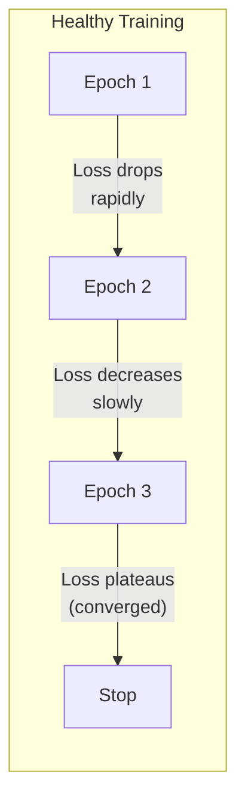

# Fine-Tuning Evaluation

> **TL;DR:** Training loss going down does not mean your fine-tuned model is good. Rigorous evaluation requires task-specific metrics, comparison against baselines (base model, larger models, prompt-only approaches), human evaluation, and testing for catastrophic forgetting. The most common fine-tuning failure is a model that performs well on training examples but poorly on real-world inputs. Always hold out a representative test set, evaluate on multiple dimensions, and run A/B tests before deploying.

## Table of Contents
- [Why This Matters](#why-this-matters)
- [Training Metrics and Loss Curves](#training-metrics-and-loss-curves)
- [Detecting Overfitting](#detecting-overfitting)
- [Task-Specific Evaluation](#task-specific-evaluation)
- [Human Evaluation](#human-evaluation)
- [Comparing Against Baselines](#comparing-against-baselines)
- [A/B Testing in Production](#ab-testing-in-production)
- [Catastrophic Forgetting](#catastrophic-forgetting)
- [When Fine-Tuning Hasn't Worked](#when-fine-tuning-hasnt-worked)
- [Key Takeaways](#key-takeaways)
- [References](#references)

## Why This Matters

Fine-tuning creates a false sense of confidence. The training loss decreases, the model generates fluent text, and spot checks look good. Then you deploy and discover the model fails on edge cases, hallucinates in new ways, or has forgotten capabilities the base model had.

Evaluation is where most fine-tuning efforts fall short. Teams invest weeks in data collection and training, then spend an afternoon on evaluation before deploying. This is backwards -- evaluation should be designed before training begins, and it should be at least as rigorous as the training process itself.

## Training Metrics and Loss Curves

### What to Monitor During Training

**Training loss** -- Cross-entropy loss on the training set. Should decrease steadily. A flat loss curve indicates the model isn't learning (check learning rate, data format, or template issues).

**Validation loss** -- Cross-entropy loss on a held-out validation set. The most important metric during training. When validation loss stops decreasing (or starts increasing), training should stop.

**Learning rate** -- Track the learning rate schedule to correlate with loss behavior. Loss spikes often correspond to learning rate transitions.

**Gradient norm** -- Unusually large gradient norms indicate training instability. Consider gradient clipping if norms spike.

### Interpreting Loss Curves

**Healthy curve:** Training and validation loss decrease together, validation loss plateaus, small gap between training and validation loss.

**Overfitting curve:** Training loss continues to decrease while validation loss increases. The gap between them widens with each epoch.

**Underfitting curve:** Both losses plateau at a high value. The model isn't learning enough from the data.

**Unstable curve:** Loss oscillates wildly or spikes. Usually indicates learning rate too high, data issues, or numerical instability.

## Detecting Overfitting

Overfitting is the most common fine-tuning failure mode, especially with small datasets.

### Warning Signs

- **Validation loss increases** while training loss decreases (the classic signal)
- **High accuracy on training examples** but poor performance on new inputs
- **Model outputs resemble training examples too closely** -- near-verbatim reproduction of training responses
- **Reduced diversity** in outputs -- the model generates the same patterns regardless of input
- **Performance degrades on general tasks** -- the model has memorized training data at the cost of general capability

### Prevention Strategies

| Strategy | How It Helps | Implementation |
|---|---|---|
| Early stopping | Stops training when validation loss plateaus | Monitor eval loss every N steps; stop after K steps without improvement |
| Lower rank (LoRA) | Reduces model capacity, limiting memorization | Use r=8 or r=16 instead of r=64+ |
| Dropout | Randomly disables connections, forcing generalization | LoRA dropout 0.05-0.1 |
| More diverse data | Broader examples prevent narrow memorization | Augment with paraphrases and variations |
| Fewer epochs | Less exposure to training data | 1-2 epochs for large datasets, 2-3 for small |
| Larger base model | More robust to overfitting due to existing knowledge | Use 13B instead of 7B if feasible |

### Measuring Generalization

Don't just evaluate on held-out examples from the same distribution. Test on:
- **In-distribution** -- Examples similar to training data (should perform well)
- **Near-distribution** -- Variations of training tasks (tests robustness)
- **Out-of-distribution** -- Related but novel tasks (tests generalization)
- **Adversarial** -- Deliberately tricky inputs (tests failure modes)

## Task-Specific Evaluation

### Classification Tasks

| Metric | What It Measures | When to Use |
|---|---|---|
| Accuracy | Overall correctness | Balanced classes |
| Precision | Of predicted positives, how many are correct | When false positives are costly |
| Recall | Of actual positives, how many were found | When false negatives are costly |
| F1 Score | Harmonic mean of precision and recall | Imbalanced classes |
| Confusion matrix | Per-class error patterns | Understanding failure modes |

### Generation Tasks

| Metric | What It Measures | Limitations |
|---|---|---|
| BLEU | N-gram overlap with reference | Penalizes valid paraphrases |
| ROUGE | Recall-oriented n-gram overlap | Doesn't measure fluency or factuality |
| BERTScore | Semantic similarity via embeddings | Computationally expensive |
| Perplexity | Model confidence in generating text | Lower isn't always better (overconfident model) |

### Structured Output Tasks (JSON, SQL, Code)

- **Format validity** -- Does the output parse correctly? (JSON validation, SQL execution, code compilation)
- **Schema compliance** -- Does the output match the expected schema? (correct fields, types, constraints)
- **Semantic correctness** -- Is the output functionally correct? (SQL returns correct results, code passes tests)
- **Edge case handling** -- Does the model handle nulls, empty inputs, special characters?

### Domain-Specific Metrics

Design metrics that measure what actually matters for your application:
- **Customer support:** Resolution rate, escalation rate, response appropriateness
- **Code generation:** Pass@k (percentage of generated code samples that pass test cases)
- **Summarization:** Information coverage, factual consistency, conciseness
- **Medical/Legal:** Factual accuracy, omission of critical information, appropriate disclaimers

## Human Evaluation

Automated metrics cannot fully capture generation quality. Human evaluation is essential, especially for open-ended generation tasks.

### Evaluation Frameworks

**Side-by-side comparison:** Show evaluators outputs from two models (randomized, blind) and ask which is better. More reliable than absolute scoring.

**Likert scale rating:** Rate outputs on a 1-5 scale across dimensions (accuracy, helpfulness, tone, format). Useful for tracking improvement over time.

**Error categorization:** Instead of overall quality, evaluators identify specific error types (factual errors, formatting issues, incomplete responses, hallucinations).

### Best Practices

- **Blind evaluation** -- Evaluators should not know which model produced which output
- **Multiple evaluators** -- Use 3+ evaluators per example and measure inter-annotator agreement
- **Clear rubric** -- Define exactly what "good" means with examples of each quality level
- **Representative samples** -- Evaluate on 100-200 examples spanning the full input distribution
- **Include baselines** -- Always compare against the base model and a prompted-only approach

### LLM-as-Judge

Using a strong LLM (GPT-4, Claude) to evaluate fine-tuned model outputs:

**Pros:** Fast, scalable, consistent. Good for relative comparisons.
**Cons:** Biased toward its own style. Cannot catch domain-specific errors. Should complement, not replace, human evaluation.

**Best practice:** Calibrate LLM-as-judge against human evaluations on a subset. Track correlation and adjust the evaluation prompt until agreement is high.

## Comparing Against Baselines

Never evaluate a fine-tuned model in isolation. Always compare against:

### Essential Baselines

1. **Base model + zero-shot prompt** -- What does the unmodified model produce with a good prompt? This is the minimum bar your fine-tuned model must beat.

2. **Base model + few-shot prompt** -- Include 3-5 examples in the prompt. If few-shot prompting matches your fine-tuned model, fine-tuning wasn't worth the effort.

3. **Larger model + prompting** -- Can a larger model (e.g., GPT-4) with good prompting outperform your fine-tuned smaller model? If so, consider whether the fine-tuning cost is justified by the inference savings.

4. **Previous fine-tuned version** -- If you're iterating, compare against the previous version to ensure you're actually improving.

### Comparison Framework

| Model | Task Accuracy | Latency | Cost per 1K requests | Maintenance |
|---|---|---|---|---|
| GPT-4 + prompt | 92% | 2.1s | $15.00 | Low |
| Base 7B + prompt | 71% | 0.3s | $0.50 | Low |
| Base 7B + few-shot | 78% | 0.5s | $0.80 | Low |
| Fine-tuned 7B | 88% | 0.3s | $0.50 | High |

In this example, the fine-tuned 7B model is worthwhile: it approaches GPT-4 accuracy at 1/30th the cost per request. But if the fine-tuned model only reached 73%, it would barely beat few-shot prompting and the investment wouldn't be justified.

## A/B Testing in Production

Lab evaluation is necessary but insufficient. Real-world performance often differs from benchmark results.

### Setting Up A/B Tests

1. **Define success metrics** -- Click-through rate, task completion, user satisfaction, escalation rate
2. **Randomize assignment** -- Users are randomly assigned to the control (current model) or treatment (fine-tuned model)
3. **Sufficient sample size** -- Calculate the required sample size for statistical significance before starting
4. **Monitor for regressions** -- Watch for increases in error rates, user complaints, or unexpected behavior
5. **Run for sufficient duration** -- Account for temporal patterns (weekday vs. weekend, seasonal variation)

### Gradual Rollout

- **1% traffic** -- Smoke test. Watch for crashes, errors, and obvious failures.
- **5-10% traffic** -- Statistical testing. Compare metrics between control and treatment.
- **25-50% traffic** -- Confidence building. Confirm results hold at larger scale.
- **100% traffic** -- Full deployment with monitoring.

## Catastrophic Forgetting

Fine-tuning can cause the model to lose capabilities it had before training. This is called catastrophic forgetting.

### What Gets Forgotten

- **General knowledge** -- The model may lose factual knowledge unrelated to the fine-tuning task
- **Instruction following** -- Aggressive fine-tuning on one format can break the model's ability to follow other instructions
- **Multilingual capability** -- Fine-tuning on English data can degrade performance in other languages
- **Safety training** -- Fine-tuning can override safety guardrails present in the base model

### Detection

- **Benchmark before and after** -- Run the base model and fine-tuned model on general benchmarks (MMLU, HellaSwag, ARC) to quantify knowledge loss
- **Task diversity testing** -- Test the fine-tuned model on tasks unrelated to fine-tuning
- **Safety testing** -- Verify that safety guardrails still function after fine-tuning

### Mitigation

- **Parameter-efficient methods** -- LoRA modifies fewer parameters, reducing forgetting risk compared to full fine-tuning
- **Lower learning rate** -- Smaller updates preserve more of the base model's knowledge
- **Replay buffer** -- Mix a small percentage (5-10%) of general instruction-following data into your training set
- **Shorter training** -- Fewer epochs means less deviation from the base model
- **Regularization** -- L2 penalty toward original weights keeps the model close to its starting point

## When Fine-Tuning Hasn't Worked

Sometimes fine-tuning fails. Recognizing failure early saves time and resources.

### Signs of Failure

- **Evaluation metrics don't beat few-shot prompting** -- If adding examples to the prompt achieves similar results, the fine-tuning isn't learning anything the model couldn't do with better context
- **Model outputs are repetitive or generic** -- The model has overfit to common patterns in the training data and lost diversity
- **Performance on new inputs is much worse than on training-like inputs** -- The model memorized rather than generalized
- **Catastrophic forgetting is severe** -- The fine-tuned model is worse at general tasks without being sufficiently better at the target task

### Diagnostic Checklist

1. **Data quality** -- Review 50 random training examples. Are they correct, consistent, and representative?
2. **Data quantity** -- Do you have enough examples for the complexity of the task?
3. **Base model choice** -- Is the base model appropriate? A code-focused base model won't fine-tune well for creative writing.
4. **Hyperparameters** -- Try different learning rates (2x higher, 2x lower), ranks, and epoch counts
5. **Template issues** -- Is the chat template correct? Mismatched templates are a common silent failure
6. **Distribution mismatch** -- Does the training data match the real-world input distribution?

### When to Abandon Fine-Tuning

- After 3+ iterations of data cleaning and hyperparameter tuning with no improvement
- When a larger model with prompting consistently outperforms the fine-tuned model and inference cost isn't a constraint
- When the task requires knowledge the base model doesn't have (use RAG instead)
- When requirements change too frequently to justify the retraining cycle

## Key Takeaways

1. **Training loss is not evaluation.** A decreasing training loss tells you the model is fitting the data, not that it will perform well on new inputs. Always use held-out evaluation sets.

2. **Compare against baselines, always.** Your fine-tuned model must demonstrably outperform both the base model with prompting and few-shot approaches to justify the investment.

3. **Design evaluation before training.** Define success metrics, build evaluation sets, and establish baselines before you start fine-tuning. This prevents post-hoc rationalization.

4. **Human evaluation is irreplaceable.** Automated metrics miss nuances that matter in production -- tone, helpfulness, safety, and appropriateness. Budget for human review.

5. **Test for catastrophic forgetting.** Run general benchmarks before and after fine-tuning to quantify what was lost. Use LoRA, replay buffers, and shorter training to minimize forgetting.

6. **A/B test before full deployment.** Lab results don't always transfer to production. Gradual rollout with statistical testing catches issues that offline evaluation misses.

7. **Know when to stop.** If fine-tuning doesn't beat prompting after multiple iterations of data improvement and hyperparameter tuning, the approach may not be right for your task.

## References

### Evaluation Methodology
1. Liang, P., Bommasani, R., Lee, T., et al. (2023). "Holistic Evaluation of Language Models (HELM)" -- Comprehensive evaluation framework covering multiple dimensions of model quality
2. Zheng, L., Chiang, W.-L., Sheng, Y., et al. (2023). "Judging LLM-as-a-Judge with MT-Bench and Chatbot Arena" -- Using LLMs for scalable evaluation and benchmarking

### Catastrophic Forgetting
3. Kirkpatrick, J., Pascanu, R., Rabinowitz, N., et al. (2017). "Overcoming Catastrophic Forgetting in Neural Networks" -- Foundational work on elastic weight consolidation
4. Luo, Y., Yang, Z., Meng, F., et al. (2024). "An Empirical Study of Catastrophic Forgetting in Large Language Models During Continual Fine-Tuning" -- Quantifying forgetting in modern LLMs

### Fine-Tuning Evaluation
5. Zhou, C., Liu, P., Xu, P., et al. (2023). "LIMA: Less Is More for Alignment" -- Evaluation methodology comparing data quality approaches
6. Dettmers, T., Pagnoni, A., Holtzman, A., Zettlemoyer, L. (2023). "QLoRA: Efficient Finetuning of Quantized Language Models" -- Evaluation of parameter-efficient methods across benchmarks

### Production Evaluation
7. Shankar, S., Garcia, R., Hellerstein, J. M., Parameswaran, A. (2024). "Who Validates the Validators? Aligning LLM-Assisted Evaluation of LLM Outputs with Human Preferences" -- Calibrating automated evaluation against human judgment
8. Ribeiro, M. T., Wu, T., Guestrin, C., Singh, S. (2020). "Beyond Accuracy: Behavioral Testing of NLP Models with CheckList" -- Systematic testing methodology for NLP models

### Benchmarks
9. Hendrycks, D., Burns, C., Basart, S., et al. (2021). "Measuring Massive Multitask Language Understanding" (MMLU) -- Standard benchmark for measuring general knowledge retention
10. Clark, P., Cowhey, I., Etzioni, O., et al. (2018). "Think you have Solved Question Answering? Try ARC" -- Benchmark for reasoning evaluation
