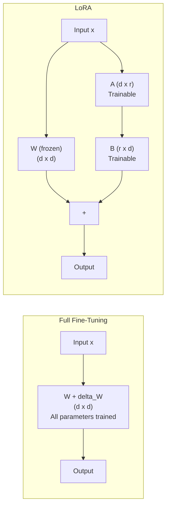
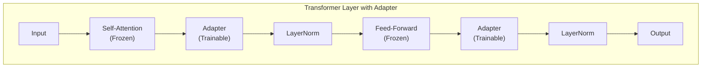

# Parameter-Efficient Methods

> **TL;DR:** Full fine-tuning updates all model parameters and requires massive GPU memory -- impractical for most teams. Parameter-efficient fine-tuning (PEFT) methods update only a small fraction of parameters (0.1-10%) while achieving comparable quality. LoRA is the dominant approach: it injects small trainable matrices into frozen model layers, reducing memory requirements by 3-10x. QLoRA goes further by quantizing the base model to 4-bit, enabling fine-tuning of a 70B model on a single 48GB GPU.

## Table of Contents
- [Why This Matters](#why-this-matters)
- [The Problem with Full Fine-Tuning](#the-problem-with-full-fine-tuning)
- [LoRA: Low-Rank Adaptation](#lora-low-rank-adaptation)
- [QLoRA: Quantized LoRA](#qlora-quantized-lora)
- [Other PEFT Methods](#other-peft-methods)
- [Choosing Hyperparameters](#choosing-hyperparameters)
- [Method Comparison](#method-comparison)
- [Practical Recommendations](#practical-recommendations)
- [Key Takeaways](#key-takeaways)
- [References](#references)

## Why This Matters

A 7B parameter model requires ~28 GB of memory just to store weights in FP32. Full fine-tuning needs 4-6x that for gradients, optimizer states, and activations -- around 112-168 GB. For a 70B model, you need a cluster of 8+ high-end GPUs. Most teams don't have this infrastructure.

Parameter-efficient methods make fine-tuning accessible:
- **LoRA** a 7B model on a single 24GB GPU
- **QLoRA** a 70B model on a single 48GB GPU
- Train in hours instead of days
- Store multiple fine-tuned variants as small adapter files (~100MB each) rather than full model copies (~14GB each for 7B)

The quality trade-off is surprisingly small. On most tasks, LoRA achieves 95-100% of full fine-tuning performance.

## The Problem with Full Fine-Tuning

Full fine-tuning updates every parameter in the model. For a 7B model in mixed precision:

| Component | Memory (FP16) |
|---|---|
| Model weights | 14 GB |
| Gradients | 14 GB |
| Optimizer states (Adam) | 28 GB (2x for m and v) |
| Activations (batch size 1) | 4-8 GB |
| **Total** | **~60-64 GB** |

For a 70B model: **~600+ GB** -- requiring 8x A100 80GB GPUs minimum.

Beyond memory, full fine-tuning creates practical problems:
- **Storage:** Each fine-tuned variant is a complete model copy
- **Catastrophic forgetting:** Updating all parameters risks destroying general capabilities
- **Overfitting:** With all parameters trainable, the model can memorize small datasets
- **Cost:** Multi-GPU training with high-bandwidth interconnects is expensive

## LoRA: Low-Rank Adaptation

### Core Insight

Weight updates during fine-tuning have low intrinsic rank. Instead of updating a full weight matrix W (dimensions d x d), LoRA decomposes the update into two small matrices: a down-projection A (d x r) and an up-projection B (r x d), where r is much smaller than d.



### How It Works

1. **Freeze the pre-trained model** -- All original parameters remain fixed
2. **Inject low-rank matrices** -- For each target layer (typically attention projections), add matrices A and B
3. **Forward pass:** `output = W(x) + B(A(x))` -- Original computation plus the low-rank update
4. **Training:** Only A and B receive gradients -- dramatically fewer parameters

**Parameter reduction example (7B model):**

| | Full Fine-Tuning | LoRA (r=16) |
|---|---|---|
| Trainable parameters | 7,000,000,000 | ~17,000,000 |
| Percentage of total | 100% | ~0.24% |
| Training memory | ~60 GB | ~18 GB |
| Adapter file size | 14 GB | ~35 MB |

### Key Parameters

**Rank (r):** The dimension of the low-rank decomposition. Higher rank = more expressiveness but more parameters.
- r=4: Minimal, good for simple style changes
- r=8-16: Good default for most tasks
- r=32-64: Higher capacity for complex tasks
- r=128+: Approaching full fine-tuning capacity

**Alpha:** A scaling factor applied to the LoRA update. The actual scaling is `alpha/r`. Common practice is to set `alpha = 2 * r` (e.g., alpha=32 when r=16). This means the LoRA update contributes proportionally regardless of rank.

**Target modules:** Which layers receive LoRA adapters. Options include:
- `q_proj, v_proj` -- Attention query and value projections (default, most common)
- `q_proj, k_proj, v_proj, o_proj` -- All attention projections (better quality)
- `q_proj, k_proj, v_proj, o_proj, gate_proj, up_proj, down_proj` -- Attention + MLP (best quality, more parameters)

**Dropout:** Applied to the LoRA layers during training to prevent overfitting. Typical values: 0.05-0.1.

### Merging LoRA Weights

After training, LoRA weights can be merged back into the base model:

```
W_merged = W + (alpha/r) * B @ A
```

**Benefits of merging:**
- Zero inference overhead (no separate adapter computation)
- Single model file for deployment
- Same inference speed as the original model

**Benefits of keeping separate:**
- Swap adapters for different tasks without reloading the base model
- Store multiple task-specific adapters efficiently (~35MB each)
- Easy rollback to the base model

## QLoRA: Quantized LoRA

QLoRA combines LoRA with aggressive base model quantization, enabling fine-tuning of much larger models on limited hardware.

### How It Works

1. **Quantize the base model to 4-bit** using NF4 (NormalFloat4) -- a data type optimized for normally-distributed neural network weights
2. **Double quantization** -- Quantize the quantization constants themselves, saving additional memory
3. **Paged optimizers** -- Use CPU RAM as overflow when GPU memory is exhausted
4. **LoRA adapters in BF16/FP16** -- The trainable adapters remain in higher precision for stable training

**Memory comparison (70B model):**

| Approach | GPU Memory Required | Minimum Hardware |
|---|---|---|
| Full fine-tuning (FP16) | ~600 GB | 8x A100 80GB |
| LoRA (FP16 base) | ~150 GB | 2x A100 80GB |
| QLoRA (4-bit base) | ~36 GB | 1x A100 40GB or 1x A6000 48GB |

### Quality Impact

QLoRA's quantization introduces a small quality penalty compared to full-precision LoRA:
- On most benchmarks, QLoRA achieves 97-99% of full LoRA quality
- The gap narrows with larger models (70B QLoRA often matches 7B full fine-tuning)
- For most practical applications, the quality difference is negligible

### When to Use QLoRA vs. LoRA

- **Use QLoRA** when GPU memory is the constraint and you want to fine-tune the largest possible model
- **Use LoRA (full precision)** when you have sufficient GPU memory and want maximum quality
- **Rule of thumb:** A QLoRA 70B model typically outperforms a LoRA 7B model despite the quantization penalty

## Other PEFT Methods

### Adapter Methods

Adapters insert small trainable modules between frozen Transformer layers, rather than modifying existing weight matrices.



**Architecture:** Each adapter is a bottleneck MLP: down-projection (d to r), nonlinearity, up-projection (r to d), residual connection.

**Trade-offs vs. LoRA:**
- Adapters add sequential computation (increased latency)
- LoRA can be merged into base weights (zero latency overhead)
- Adapters are slightly more expressive per parameter (nonlinearity)
- LoRA is more widely supported in tooling (Hugging Face PEFT, Axolotl)

### Prefix Tuning

Prepend learnable "virtual tokens" to the key and value sequences in each attention layer.

**How it works:** Instead of optimizing real text tokens in the prompt, prefix tuning learns continuous embeddings that are prepended to the attention computation. These virtual tokens influence attention patterns without modifying model weights.

**Trade-offs:**
- Very few parameters (only the prefix embeddings)
- No modification to model architecture
- Slightly reduces effective context length (prefix tokens consume positions)
- Generally lower quality than LoRA on complex tasks

### Prompt Tuning

A simpler variant of prefix tuning: learn a small set of continuous embeddings prepended to the input embedding layer only (not every attention layer).

**Trade-offs:**
- Fewest trainable parameters of any PEFT method
- Works better on larger models (100B+) where the model can compensate
- On smaller models (<10B), often underperforms LoRA significantly
- Conceptually simple but less expressive

## Choosing Hyperparameters

### LoRA Rank Selection

| Rank | Trainable Params (7B) | Best For |
|---|---|---|
| 4 | ~4M | Simple style/format changes |
| 8 | ~8M | Moderate behavior shifts |
| 16 | ~17M | General-purpose fine-tuning (recommended default) |
| 32 | ~34M | Complex tasks, specialized domains |
| 64 | ~67M | Approaching full fine-tuning expressiveness |
| 128 | ~134M | Maximum quality, diminishing returns |

**Practical advice:** Start with r=16, alpha=32. If underfitting (training loss plateaus high), increase rank. If overfitting (validation loss increases while training loss decreases), decrease rank or add dropout.

### Learning Rate

LoRA typically requires higher learning rates than full fine-tuning:
- **Full fine-tuning:** 1e-5 to 5e-5
- **LoRA:** 1e-4 to 3e-4
- **QLoRA:** 1e-4 to 2e-4

Use a cosine schedule with warmup (3-10% of total steps).

### Batch Size and Gradient Accumulation

With limited GPU memory, use gradient accumulation to simulate larger batch sizes:
- **Effective batch size = micro_batch_size x gradient_accumulation_steps x num_GPUs**
- Target effective batch size: 32-128 for most tasks
- Micro batch size: Whatever fits in GPU memory (often 1-4 with QLoRA)

### Number of Epochs

- **1-3 epochs** for most fine-tuning tasks
- **1 epoch** if dataset is large (>10K examples) or diverse
- **2-3 epochs** if dataset is small (<1K examples) and high quality
- Watch validation loss carefully -- overfitting happens fast with small datasets

## Method Comparison

| Method | Trainable Params | Memory Savings | Quality vs. Full FT | Inference Overhead | Tooling Support |
|---|---|---|---|---|---|
| Full Fine-Tuning | 100% | None | Baseline | None | Universal |
| LoRA | 0.1-1% | 3-5x | 95-100% | None (if merged) | Excellent |
| QLoRA | 0.1-1% | 6-10x | 93-99% | Quantization overhead | Excellent |
| Adapters | 1-5% | 2-4x | 95-100% | Small (sequential) | Good |
| Prefix Tuning | 0.01-0.1% | 4-6x | 85-95% | None | Moderate |
| Prompt Tuning | 0.001-0.01% | 5-7x | 80-90% (small models) | None | Moderate |

## Practical Recommendations

### For Most Teams: Start with QLoRA

1. Pick the largest model that fits in your GPU memory with 4-bit quantization
2. Use LoRA with r=16, alpha=32, targeting all attention projections
3. Train for 1-3 epochs with learning rate 2e-4 and cosine schedule
4. Evaluate on a held-out test set after each epoch

### Tool Recommendations

- **Hugging Face PEFT** -- The standard library for LoRA/QLoRA. Well-documented, widely used
- **Axolotl** -- Higher-level wrapper that simplifies configuration for common fine-tuning scenarios
- **Unsloth** -- Optimized training kernels that speed up LoRA/QLoRA by 2-5x with lower memory usage
- **LLaMA-Factory** -- Web UI for fine-tuning with extensive model and method support
- **TRL (Transformer Reinforcement Learning)** -- For RLHF and DPO fine-tuning with PEFT support

### Common Pitfalls

- **Rank too high** -- Using r=256 on a small dataset leads to overfitting and wastes memory
- **Wrong target modules** -- Only targeting q_proj leaves significant capacity on the table
- **Learning rate too low** -- Using full fine-tuning learning rates (1e-5) with LoRA causes underfitting
- **Forgetting to evaluate** -- Training loss alone is misleading. Always use a held-out validation set
- **Ignoring base model choice** -- The base model matters more than the PEFT method. A well-chosen base with simple LoRA beats a poor base with complex methods

## Key Takeaways

1. **LoRA is the default choice** -- It offers the best balance of quality, memory efficiency, and tooling support. Start here unless you have a specific reason not to.

2. **QLoRA enables fine-tuning models you couldn't otherwise touch** -- 4-bit quantization of the base model makes 70B fine-tuning possible on consumer hardware.

3. **Rank 16 is a good default** -- Start with r=16 and adjust based on training dynamics. Most tasks don't benefit from ranks above 64.

4. **LoRA can be merged for zero overhead** -- After training, merge adapters into the base model for deployment with no inference latency penalty.

5. **Full fine-tuning is rarely necessary** -- For most practical tasks, LoRA achieves 95%+ of full fine-tuning quality at a fraction of the cost. Reserve full fine-tuning for foundational model training.

6. **The base model matters most** -- No amount of PEFT sophistication compensates for choosing the wrong base model. Pick the best base model for your domain, then apply LoRA.

7. **Tooling has matured** -- Libraries like PEFT, Axolotl, and Unsloth make parameter-efficient fine-tuning accessible without deep infrastructure expertise.

## References

### LoRA
1. Hu, E. J., Shen, Y., Wallis, P., Allen-Zhu, Z., Li, Y., Wang, S., Wang, L., Chen, W. (2022). "LoRA: Low-Rank Adaptation of Large Language Models" -- The foundational paper introducing low-rank adaptation for efficient fine-tuning

### QLoRA
2. Dettmers, T., Pagnoni, A., Holtzman, A., Zettlemoyer, L. (2023). "QLoRA: Efficient Finetuning of Quantized Language Models" -- 4-bit quantization with LoRA enabling 70B fine-tuning on a single GPU

### Adapter Methods
3. Houlsby, N., Giampiccolo, A., Morber, N., et al. (2019). "Parameter-Efficient Transfer Learning for NLP" -- Original adapter architecture for Transformers
4. He, J., Zhou, C., Ma, X., Berg-Kirkpatrick, T., Neubig, G. (2022). "Towards a Unified View of Parameter-Efficient Transfer Learning" -- Unifying framework comparing adapters, prefix tuning, and LoRA

### Prefix and Prompt Tuning
5. Li, X. L., Liang, P. (2021). "Prefix-Tuning: Optimizing Continuous Prompts for Generation" -- Learnable prefixes for each attention layer
6. Lester, B., Al-Rfou, R., Constant, N. (2021). "The Power of Scale for Parameter-Efficient Prompt Tuning" -- Prompt tuning scales with model size

### Practical Guides
7. Hugging Face (2024). "PEFT Documentation" -- Library documentation for parameter-efficient fine-tuning implementation
8. Dettmers, T. (2023). "Making LLMs Even More Accessible with bitsandbytes, 4-bit Quantization and QLoRA" -- Practical guide to QLoRA implementation

### Comparative Studies
9. Ding, N., Qin, Y., Yang, G., et al. (2023). "Parameter-Efficient Fine-Tuning of Large-Scale Pre-Trained Language Models" -- Survey comparing PEFT methods across tasks and model sizes
10. Biderman, S., Schoelkopf, H., et al. (2024). "LoRA vs Full Fine-Tuning: An Illusion of Equivalence" -- Analysis of when LoRA does and does not match full fine-tuning
