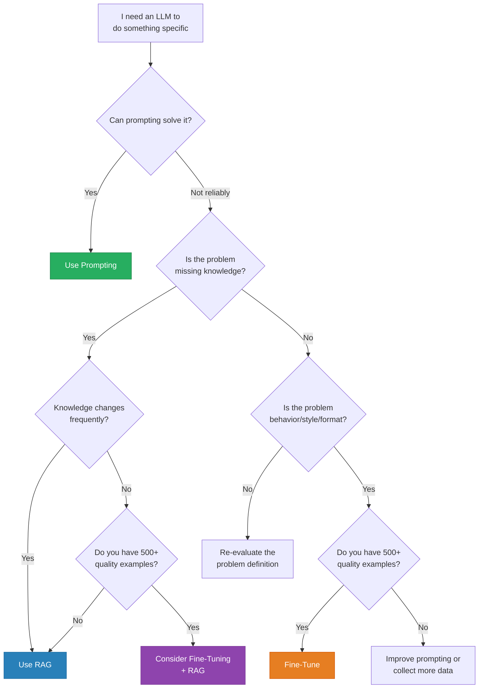

# When to Fine-Tune

> **TL;DR:** Fine-tuning is not the first tool to reach for. Prompting engineering solves most problems cheaply. RAG handles knowledge gaps. Fine-tuning shines when you need to change a model's behavior, style, or format consistency -- when you have hundreds of high-quality examples of the exact output you want, and prompting alone cannot reliably reproduce it. The decision framework: try prompting first, add RAG for knowledge, and fine-tune only when behavior change is the bottleneck.

## Table of Contents
- [Why This Matters](#why-this-matters)
- [The Three Approaches](#the-three-approaches)
- [Decision Framework](#decision-framework)
- [When Each Approach Wins](#when-each-approach-wins)
- [Cost-Benefit Analysis](#cost-benefit-analysis)
- [Combining Approaches](#combining-approaches)
- [Common Misconceptions](#common-misconceptions)
- [Key Takeaways](#key-takeaways)
- [References](#references)

## Why This Matters

Teams waste months and thousands of dollars fine-tuning models when better prompting would have solved their problem. Others struggle with unreliable prompt-based systems when a small fine-tuned model would deliver consistent, fast results at lower inference cost. Making the right choice upfront saves time, money, and frustration.

The decision is not binary. These approaches exist on a spectrum and can be combined. Understanding when each approach excels -- and when it fails -- is the most important practical skill in applied LLM engineering.

## The Three Approaches

### Prompting (Including Few-Shot)
Craft instructions and examples in the prompt to guide model behavior. No model modification needed.

**Investment:** Minutes to hours. Zero training cost.
**Flexibility:** Change behavior instantly by editing the prompt.
**Limitation:** Constrained by context window. Output consistency varies.

### Retrieval-Augmented Generation (RAG)
Retrieve relevant documents at query time and include them in the context. The model's knowledge is augmented without retraining.

**Investment:** Days to weeks (building retrieval pipeline). No training cost.
**Flexibility:** Update knowledge by updating the document store.
**Limitation:** Retrieval quality bounds generation quality. Adds latency.

### Fine-Tuning
Update model weights on task-specific examples. The model learns new behaviors, styles, or capabilities.

**Investment:** Days to weeks. Requires training data, compute, and evaluation.
**Flexibility:** Locked to training data distribution. Updates require retraining.
**Limitation:** Risk of overfitting, catastrophic forgetting, and dataset bias.

## Decision Framework

### Key Questions to Ask

1. **Have you exhausted prompting?** -- Most teams underestimate what good prompting can do. Try few-shot examples, chain-of-thought, structured output formatting, and system prompts before considering fine-tuning.

2. **Is the problem knowledge or behavior?** -- If the model lacks information (company docs, product catalog, recent events), RAG is the answer. If the model has the knowledge but expresses it wrong (wrong tone, format, or style), fine-tuning is the answer.

3. **Do you have enough quality data?** -- Fine-tuning with fewer than 100 high-quality examples rarely works well. 500-1000 examples is a practical minimum for meaningful behavior change.

4. **Can you afford the maintenance?** -- Fine-tuned models need retraining when requirements change. Base models with prompting are easier to iterate.

## When Each Approach Wins

### Prompting Wins When...
- You need rapid iteration (testing different approaches in minutes)
- The task is well-specified and the model mostly gets it right
- You have fewer than 100 examples of desired behavior
- Requirements change frequently
- You need to support many different tasks with one model
- Budget is limited and inference volume is low

### RAG Wins When...
- The model lacks domain-specific knowledge
- Knowledge changes frequently (daily product updates, news, documentation)
- You need attributable, verifiable answers with source citations
- The knowledge base is large (too much for a prompt, too dynamic for training)
- Accuracy on factual questions is critical

### Fine-Tuning Wins When...
- You need consistent output format, style, or tone across thousands of requests
- Latency matters and you want to avoid long prompts (fine-tuned models need shorter prompts)
- You want a smaller, cheaper model to match a larger model's performance on a specific task
- The task requires specialized reasoning the base model cannot learn from examples alone
- You have 500+ high-quality training examples
- Inference cost is a priority (fine-tuned 7B can replace prompted 70B for narrow tasks)

## Cost-Benefit Analysis

### Direct Costs

| Factor | Prompting | RAG | Fine-Tuning |
|---|---|---|---|
| Setup cost | Very low | Medium (retrieval pipeline) | Medium-High (data + compute) |
| Training compute | None | None | $10-$10,000+ depending on model size |
| Data requirements | 0-20 examples | Document corpus | 500-10,000+ labeled examples |
| Infrastructure | None | Vector DB + retrieval | GPU for training |
| Time to first result | Minutes | Days | Days-weeks |
| Iteration speed | Minutes | Hours | Days |

### Ongoing Costs

| Factor | Prompting | RAG | Fine-Tuning |
|---|---|---|---|
| Inference cost per request | Higher (long prompts) | Medium (retrieval + generation) | Lower (shorter prompts) |
| Maintenance | Low (edit prompts) | Medium (update docs, tune retrieval) | High (retrain on new data) |
| Model updates | Free (use latest model) | Free (use latest model) | Must retrain for new base model |
| Scaling | Linear with requests | Linear + retrieval overhead | Linear with requests |

### Break-Even Analysis

Fine-tuning becomes cost-effective when:
- **High volume** -- Processing >10,000 requests/day, where shorter prompts reduce per-request cost
- **Narrow task** -- A fine-tuned 8B model at $0.10/1K tokens replaces a 70B model at $1.00/1K tokens
- **Stable requirements** -- The task definition doesn't change monthly

## Combining Approaches

The most effective production systems combine approaches:

### Fine-Tuning + RAG
Fine-tune a model to follow your output format and style, then use RAG to provide current knowledge. The fine-tuned model knows *how* to answer; RAG provides *what* to answer with.

**Example:** A customer support bot fine-tuned on your company's tone and response format, with RAG retrieving relevant help articles and product documentation.

### Fine-Tuning + Prompting
Fine-tune for base behavior, then use prompts for task-specific variations. The fine-tuned model provides consistent defaults; prompts handle edge cases and customization.

**Example:** A fine-tuned model that writes in your brand voice, with prompts specifying whether to generate a tweet, blog post, or email.

### RAG + Prompting
Use RAG for knowledge retrieval and prompting for output formatting and reasoning instructions. This is the most common production pattern because it requires no training.

**Example:** A legal research assistant that retrieves relevant case law (RAG) and follows specific citation formatting rules (prompting).

## Common Misconceptions

### "Fine-tuning teaches the model new knowledge"
**Reality:** Fine-tuning is better at changing behavior than injecting knowledge. If you fine-tune on your company's FAQ, the model may memorize answers but won't generalize to new questions about the same topics. RAG is better for knowledge injection because it provides information at inference time.

### "More data always helps"
**Reality:** Data quality matters far more than quantity. 500 carefully curated examples often outperform 50,000 noisy ones. Duplicate, contradictory, or low-quality examples degrade performance.

### "Fine-tuning is always better than prompting"
**Reality:** For many tasks, a well-crafted prompt with few-shot examples matches or exceeds fine-tuned performance. Fine-tuning adds complexity, cost, and maintenance burden. Only fine-tune when prompting demonstrably cannot achieve the required consistency or performance.

### "You need thousands of examples"
**Reality:** With parameter-efficient methods (LoRA), meaningful behavior change is possible with 200-500 high-quality examples for narrow tasks. The minimum depends on task complexity and how different the desired behavior is from the base model.

### "Fine-tuning a smaller model is always cheaper than using a larger model"
**Reality:** The total cost includes data collection, training, evaluation, and maintenance -- not just inference. If your volume is low, the upfront investment in fine-tuning may never pay off compared to using a larger model with better prompting.

### "Once fine-tuned, the model is done"
**Reality:** Fine-tuned models drift as requirements evolve. You need ongoing data collection, periodic retraining, and continuous evaluation. Budget for maintenance from the start.

## Key Takeaways

1. **Try prompting first, always.** Most problems that seem to require fine-tuning can be solved with better prompts, few-shot examples, or structured output formatting.

2. **RAG for knowledge, fine-tuning for behavior.** If the model doesn't know something, give it documents. If the model knows but doesn't behave correctly, fine-tune it.

3. **Data quality is the bottleneck.** The success of fine-tuning is almost entirely determined by the quality of your training data. Invest in curation, not volume.

4. **Combine approaches for best results.** The strongest production systems use fine-tuning for behavior, RAG for knowledge, and prompting for task-specific customization.

5. **Account for total cost of ownership.** Fine-tuning's upfront investment (data collection, training, evaluation) and ongoing maintenance (retraining, monitoring) often exceed the inference savings.

6. **Start small and validate.** Fine-tune on a small dataset first, evaluate rigorously, and only scale data collection if the approach shows promise.

## References

### Decision Frameworks
1. OpenAI (2024). "Fine-Tuning Guide" -- Practical recommendations on when and how to fine-tune OpenAI models
2. Anthropic (2024). "Prompt Engineering Guide" -- Techniques for maximizing prompt-based performance before considering fine-tuning

### Comparative Studies
3. Liu, N. F., Lin, K., Hewitt, J., Paranjape, A., Bevilacqua, M., Petroni, F., Liang, P. (2024). "Lost in the Middle: How Language Models Use Long Contexts" -- Context window limitations relevant to prompting vs. fine-tuning decisions
4. Gao, Y., Xiong, Y., Garg, A., et al. (2024). "Retrieval-Augmented Generation for Large Language Models: A Survey" -- Comprehensive RAG overview and comparison with fine-tuning

### Fine-Tuning Best Practices
5. Dettmers, T., Pagnoni, A., Holtzman, A., Zettlemoyer, L. (2023). "QLoRA: Efficient Finetuning of Quantized Language Models" -- Practical fine-tuning with minimal resources
6. Zhou, C., Liu, P., Xu, P., et al. (2023). "LIMA: Less Is More for Alignment" -- Demonstrating that 1,000 high-quality examples can match much larger datasets
