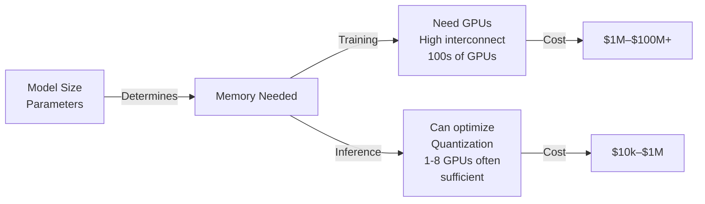
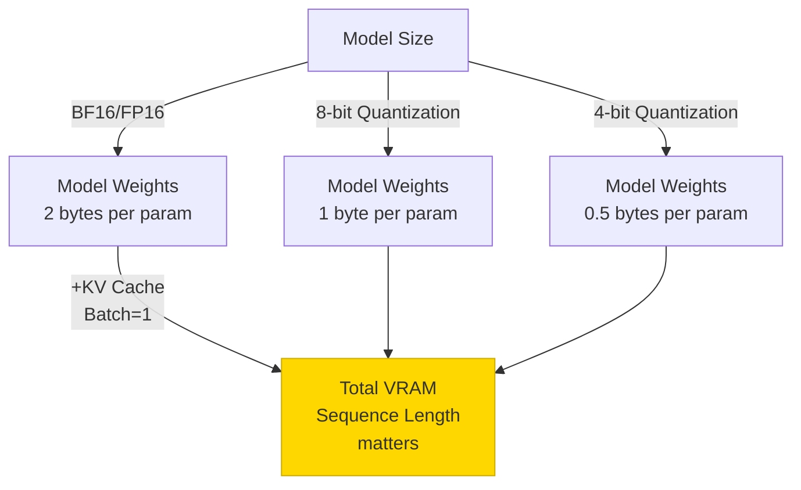
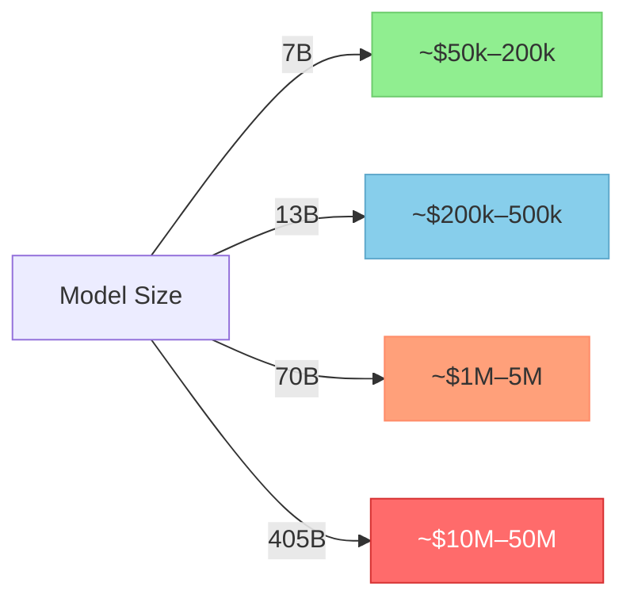
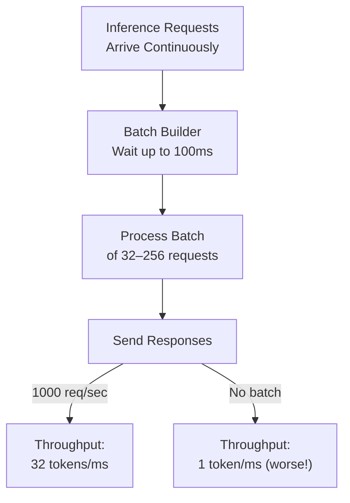

# Hardware for Training & Deploying LLMs

> **TL;DR:** Training and deploying LLMs requires specialized hardware. GPUs are essential for both training and inference — high-bandwidth interconnect for training clusters, but even a single GPU or CPU can serve inference for smaller models. Budget $100k–$10M+ for pre-training, $10k–$1M for fine-tuning, or start with API services. For inference, use quantization and batching to reduce costs. Understanding hardware constraints is critical for choosing between self-hosting, cloud, and managed APIs.

## Table of Contents
- [Why Hardware Matters](#why-hardware-matters)
- [Hardware Fundamentals](#hardware-fundamentals)
- [GPU Choices for Training](#gpu-choices-for-training)
- [GPU Choices for Inference](#gpu-choices-for-inference)
- [Memory & Storage Requirements](#memory--storage-requirements)
- [Networking & Distributed Training](#networking--distributed-training)
- [Cost Analysis](#cost-analysis)
- [Reference Configurations](#reference-configurations)
- [Optimization Techniques](#optimization-techniques)
- [Cloud Providers & Managed Services](#cloud-providers--managed-services)
- [Key Takeaways](#key-takeaways)
- [References](#references)

---

## Why Hardware Matters

The scale of LLMs makes hardware not just an optimization concern—it's the core constraint:

- **Training a 7B model** requires weeks of compute on high-end GPUs
- **Training a 70B model** costs $1M+ in GPU hours alone
- **Deploying at scale** (millions of requests) requires load balancing, GPUs or specialized inference hardware, and careful resource allocation

Understanding hardware is essential for:
- **Evaluating TCO** — Training vs. fine-tuning vs. using APIs
- **Choosing deployment strategies** — Self-hosted, cloud, or managed services
- **Optimizing costs** — Quantization, batching, distillation, inference acceleration
- **Scaling inference** — Handling millions of requests efficiently

---

## Hardware Fundamentals

### Key Metrics for LLM Compute

| Metric | Definition | Why It Matters |
|---|---|---|
| **FLOPS (Floating Point Operations Per Second)** | Raw compute throughput, measured in TFLOPS (trillion) or PFLOPS (quadrillion) | Determines how fast matrix multiplications happen during training and inference |
| **Memory Bandwidth** | Speed at which data moves to/from GPU VRAM, measured in GB/s | Bottleneck for inference (I/O bound) — more bandwidth = more tokens/second |
| **VRAM (Video RAM)** | GPU on-device memory. 24GB–80GB typical for training, 16GB–48GB for inference | Must fit model weights + activations + gradients (training) or weights + KV cache (inference) |
| **HBM (High Bandwidth Memory)** | Expensive, fast memory on modern GPUs (AMD MI300, NVIDIA H100). 120GB/s+ bandwidth | Accelerates LLM workloads significantly vs. standard GDDR memory |
| **NVLink / IB (InfiniBand)** | High-speed interconnects between GPUs, 400GB/s+ aggregate throughput | Enables efficient distributed training across multiple GPUs |

### The Training vs. Inference Trade-off

---

## GPU Choices for Training

Training LLMs is compute-intensive and GPU-limited. The most popular choices:

### NVIDIA GPUs (Market Leader)

| Model | VRAM | Memory BW | Peak TFLOPS | Cost | Best For |
|---|---|---|---|---|---|
| **H100 SXM** | 80GB | 3.35 TB/s | 989 TF | $35k–45k/GPU | State-of-the-art training. Gold standard for 70B+ models. Best NVLink integration. |
| **H100 PCIe** | 80GB | 2.01 TB/s | 989 TF | $25k–35k/GPU | Training when NVLink not needed. Cheaper than SXM variant. |
| **A100 SXM** | 80GB | 2.04 TB/s | 312 TF | $15k–25k/GPU | Previous generation. Still excellent for 13B–70B models. Lower cost than H100. |
| **L40S** | 48GB | 864 GB/s | 568 TF | $12k–18k/GPU | Good for fine-tuning, mixed training/inference. Cheaper than H100. |
| **L40** | 48GB | 864 GB/s | 568 TF | $10k–15k/GPU | Budget fine-tuning. Lower throughput than H100. |
| **RTX 6000 Ada** | 48GB | 576 GB/s | 568 TF | $8k–12k/GPU | High-end consumer/prosumer. Good price/performance for fine-tuning. Limited scaling. |

**Key insight:** H100 is the standard for large-scale training due to superior NVLink integration, but A100 and L40S offer better cost/performance for smaller projects.

### AMD MI300 & MI250X

| Model | VRAM | Memory BW | Peak TFLOPS | Cost | Best For |
|---|---|---|---|---|---|
| **MI300X** | 192GB | 5.3 TB/s | 1,457 TF | $30k–40k/GPU | Training large models. HBM memory is exceptional. Better than H100 in some benchmarks. |
| **MI250X** | 128GB | 3.2 TB/s | 715 TF | $15k–25k/GPU | Alternative to A100. Growing ecosystem support (ROCm). |

**Considerations:** ROCm ecosystem is smaller than CUDA, but improving. AMD offers better memory bandwidth at competitive prices. Growing vendor support (Meta, Databricks, etc.).

### TPU (Google Cloud)

| Version | Type | Memory | TFLOPS | Cost | Best For |
|---|---|---|---|---|---|
| **TPUv5e** | Cloud-only | 16GB (shared) | 197 TF | $4–8/hour | Cost-effective pretraining. Used for PaLM, Gemini training. |
| **TPUv4** | Cloud-only | 32GB | 432 TF | $8–15/hour | Large-scale training. Optimized for JAX/TensorFlow. |

**Considerations:** Only available on Google Cloud. Excellent for teams already using GCP. Requires JAX/TensorFlow (not PyTorch-friendly). Pricing includes all interconnect.

---

## GPU Choices for Inference

Inference has different requirements: smaller batches, lower memory needs, emphasis on throughput (tokens/second) over raw compute.

### Consumer-Grade GPUs (Cost-Effective for Small Scale)

| Model | VRAM | Throughput | Cost | Best For |
|---|---|---|---|---|
| **RTX 4090** | 24GB | 83 TFLOPS | $1.6k–2k | Hobby projects, research, small services. Can serve 7B–13B models. |
| **RTX 4080** | 16GB | 49 TFLOPS | $1.2k–1.5k | Fine-tuning, inference of smaller models (7B). Limited by VRAM. |
| **RTX 4070 Ti** | 12GB | 32 TFLOPS | $700–900 | Local development, LoRA inference. |

**Limitations:** Small VRAM, no NVLink, intended for single-machine workloads.

### Professional Inference GPUs

| Model | VRAM | Memory BW | Cost | Best For |
|---|---|---|---|---|
| **H100 SXM** | 80GB | 3.35 TB/s | $35k–45k | Ultra-high throughput inference. Overkill for most cases but scales to millions of concurrent tokens. |
| **A100 SXM** | 80GB | 2.04 TB/s | $15k–25k | Medium–large scale inference. Excellent value. |
| **L40S** | 48GB | 864 GB/s | $12k–18k | **Best general choice for inference.** Balances memory, bandwidth, and cost. |
| **RTX 6000 Ada** | 48GB | 576 GB/s | $8k–12k | Solid inference GPU. Narrower than L40S. |

**Key insight:** L40S is often the sweet spot for inference — better memory bandwidth than H100 for token generation (which is bandwidth-limited), and 40% cheaper.

### Specialized Inference Hardware

| Hardware | Throughput | Cost | Best For |
|---|---|---|---|
| **Cerebras Wafer Scale Engine** | 200+ PETAFLOPS | $2M+ | Extreme scale inference for hyperscalers. Pre-training capable. |
| **Graphcore IPU** | 61 TFLOPS (dual) | $150k–300k | Custom ML workloads. Limited LLM optimization. |
| **AWS Trainium / Inferentia** | Varies | $10k–100k | AWS-optimized inference. Good for specific frameworks. |
| **Groq LPU** | 580 TFLOPS | Custom pricing | Single-token latency focus. Not yet widely available. |

---

## Memory & Storage Requirements

### VRAM Requirements for Inference

**KV Cache Memory:** For autoregressive inference, VRAM usage grows with batch size and sequence length:
- **Per token in KV cache:** `2 * num_layers * batch_size * seq_length * hidden_dim * bytes_per_value`
- For a 70B model, batch=1, seq_len=2k: ~40GB KV cache alone

| Model Size | FP16 Weights | 8-bit Quantized | 4-bit Quantized | Inference VRAM (batch=1) |
|---|---|---|---|---|
| **7B** | 14GB | 7GB | 4GB | 16–20GB total |
| **13B** | 26GB | 13GB | 7GB | 20–30GB total |
| **70B** | 140GB | 70GB | 35GB | 80–100GB total (even with quantization) |
| **405B** | 810GB | 405GB | 202GB | 500GB+ (requires multi-GPU) |

### Storage for Model Weights & Datasets

| Use Case | Size | Storage |
|---|---|---|
| **7B model** (FP16) | 14GB | 1–2 SSD drives |
| **70B model** (FP16) | 140GB | 1 large NVMe or 2 SSDs |
| **405B model** | 810GB | Enterprise storage, multiple disks |
| **Pre-training dataset** (Common Crawl, cleaned) | 1–5TB | RAID/NVMe array or S3 |
| **Fine-tuning dataset** | 100GB–1TB | Local NVMe or cloud storage |

---

## Networking & Distributed Training

### Inter-GPU Communication

For training clusters with 8+ GPUs, communication becomes a bottleneck:

| Technology | Bandwidth | Typical Setup | Cost Impact |
|---|---|---|---|
| **PCIe Gen 4** | 64 GB/s | Single machine, 8 GPUs | Baseline (no extra cost) |
| **NVLink (NVIDIA)** | 400 GB/s per link | 8 H100 GPUs per node | +$20k per node |
| **NVLink-C2C** | 900 GB/s aggregate | Multi-node H100 clusters | Requires special topology |
| **InfiniBand HDR** | 200 GB/s | Multi-node clusters | +$10k–50k per node |
| **InfiniBand NDR** | 400 GB/s | Cutting-edge clusters | +$50k+ per node |
| **Ethernet (10GbE)** | 1.25 GB/s | Budget multi-node setups | Slowest option |

**Rule of thumb:** Use NVLink for single-node training (8 GPUs). Use InfiniBand + NVLink for multi-node clusters (16+ GPUs).

### Distributed Training Strategies

| Strategy | When to Use | Communication Overhead |
|---|---|---|
| **Data Parallel** | Most common. Each GPU processes different batch. | Synchronize gradients across GPUs every step (10–20% overhead) |
| **Tensor Parallel** | Model doesn't fit on single GPU. Shard weights across GPUs. | High communication per forward/backward pass (20–40% overhead) |
| **Pipeline Parallel** | Extremely large models (405B+). Each GPU handles layers. | Bubbles in pipeline reduce GPU utilization (10–30% overhead) |
| **Expert Parallel (MoE)** | For mixture-of-experts models. Each GPU handles expert subset. | Synchronization when all-to-all routing needed (variable) |

---

## Cost Analysis

### Pre-training Cost Estimates

**Factors affecting cost:**
- **Cluster efficiency:** 60–80% utilization typical (due to communication, debugging, restarts)
- **Checkpoint overhead:** Save every N steps, re-run computation on failure
- **Data preparation:** 5–10% of training time before training starts
- **Cloud markup:** 20–50% higher than on-premises

### Fine-Tuning Cost Estimates

| Approach | Dataset Size | GPU Hours | Cost (on H100) |
|---|---|---|---|
| **LoRA (4-bit)** | 10k examples | 2–10 hours | $50–250 |
| **Full fine-tuning (70B model)** | 10k examples | 50–100 hours | $1.5k–3k |
| **DPO alignment (10k comparisons)** | 10k pairs | 20–40 hours | $600–1.2k |
| **RLHF pipeline** | Full 3-stage | 100–500 hours | $3k–15k |

**Why LoRA is popular:** 50–100x cheaper than full fine-tuning with 95%+ of the quality in most cases.

### Inference Cost Estimates (API)

| Provider | Model | Cost per 1M input tokens | Cost per 1M output tokens |
|---|---|---|---|
| **OpenAI** | gpt-4o | $5 | $15 |
| **Anthropic** | Claude 3.5 Sonnet | $3 | $15 |
| **Google** | Gemini 2.0 Flash | $0.075 | $0.30 |
| **Meta (via AWS Bedrock)** | LLaMA 3 70B | $0.30 | $1.35 |
| **Together AI** | LLaMA 3 70B | $0.30 | $0.90 |

**For comparison:** Running inference on-premises with an H100 costs ~$0.001–$0.01 per 1k tokens at scale (assuming full cluster utilization).

### TCO: API vs. Self-Hosted

| Scenario | Monthly API Cost | Self-Hosted Infrastructure | Payoff |
|---|---|---|---|
| **50M tokens/month** | $500–2k | Not economical | Use API |
| **1B tokens/month** | $10k–40k | 1 H100 + infra ($50k/year) | ~6 months |
| **10B tokens/month** | $100k–400k | 8–16 H100s ($500k/year) | ~1.5 years |
| **100B tokens/month** | $1M–4M | 100+ H100s ($5M/year) | ~1.5–2 years |

---

## Reference Configurations

### Configuration 1: Research Lab / Proof of Concept

**Goal:** Fine-tune existing models, experiment with new techniques

| Component | Spec | Cost |
|---|---|---|
| **GPU** | 2x H100 SXM or 4x A100 SXM | $60k–80k |
| **Interconnect** | NVLink (included with SXM) | Included |
| **CPU** | 64-core Xeon / EPYC | $10k |
| **RAM** | 256GB | $5k |
| **Storage** | 10TB NVMe RAID | $5k |
| **Network** | 100Gbps Ethernet | $2k |
| **Cooling/Power** | Dual 10kW PSUs + cooling | $5k |
| **Total** | | **~$90k–110k** |

**Throughput:** 100–300 tokens/second for 70B inference, or weeks to fine-tune a 70B model on 100k examples.

### Configuration 2: Production Inference Service

**Goal:** Serve 70B model to 100+ concurrent users

| Component | Spec | Cost |
|---|---|---|
| **GPUs** | 8x L40S (for bandwidth efficiency) | $100k–150k |
| **Interconnect** | 200Gbps InfiniBand | $20k |
| **CPU** | 256-core dual-socket EPYC | $30k |
| **RAM** | 1TB | $20k |
| **Storage** | 50TB SSD + NVMe | $15k |
| **Network** | 400Gbps Ethernet | $10k |
| **Load Balancer** | Redundant switches & NICs | $10k |
| **Power & Cooling** | 50kW capacity + cooling | $20k |
| **Total** | | **~$225k–250k** |

**Capacity:** ~500–1000 tokens/second throughput with low latency. Can serve millions of monthly tokens.

### Configuration 3: Distributed Training Cluster

**Goal:** Train 70B model from scratch

| Component | Spec | Cost |
|---|---|---|
| **GPUs** | 64x H100 SXM (8 nodes, 8 GPUs each) | $2.8M–3.6M |
| **Interconnect** | Full InfiniBand NDR fabric | $200k–400k |
| **CPUs** | 8x dual-socket EPYC per node | $300k |
| **RAM** | 8TB total (1TB per node) | $150k |
| **Storage** | 500TB NVMe + 100TB archival | $100k |
| **Network** | Redundant 400Gbps Ethernet | $50k |
| **Racks/PDU/Cooling** | Hosting infrastructure | $200k |
| **Total** | | **~$4M–5M** |

**Training time:** 6–12 weeks for 70B model pre-training. Efficiency: 50–70% of peak compute due to communication overhead.

---

## Optimization Techniques

### Reducing Memory Usage Without Sacrificing Speed

| Technique | Memory Savings | Inference Impact | Complexity |
|---|---|---|---|
| **Quantization (4-bit)** | 75% | ~5–10% slower | Low — use frameworks like bitsandbytes, GPTQ |
| **KV Cache Quantization** | 50% (KV cache) | Minimal (~1–2%) | Medium — requires custom kernel |
| **Flash Attention** | No memory savings | 10–20% faster | Low — built into modern frameworks |
| **Paged Attention** | 30–50% (KV cache) | Faster batch processing | Medium — requires vLLM or similar |
| **Distillation** | 50–75% (smaller model) | Trade: larger latency | High — requires training |
| **LoRA fine-tuning** | 80–90% | None (weights still needed) | Low — popular frameworks support it |

### Inference Optimization Tools

| Tool | What It Does | Best For |
|---|---|---|
| **vLLM** | Dynamic batching, Paged Attention, continuous batching. | Production inference. Best throughput. |
| **TensorRT-LLM** | NVIDIA's inference optimization. Kernel fusion, quantization. | NVIDIA hardware, maximum speed. |
| **Ollama** | Local LLM runner with easy quantization. | Development, hobby use. |
| **llama.cpp** | CPU-optimized inference in C++. Quantization support. | Running on CPU, edge devices. |
| **Ray Serve** | Distributed serving framework. Multi-model, auto-scaling. | Deploying multiple models at scale. |
| **NVIDIA Triton** | General inference serving platform. Supports LLMs, traditional ML. | Multi-model production deployments. |
| **BentoML** | Model serving framework. Simple deployment. | Quick prototyping to production. |

### Batching & Scheduling

Batching increases throughput but increases latency. Critical for inference efficiency:

**Optimal batch size depends on:**
- Model size (70B needs batch 4–16, 7B can handle 64+)
- GPU memory (larger batches = more KV cache)
- Acceptable latency (larger batches = higher latency)

---

## Cloud Providers & Managed Services

### GPU Availability & Pricing

| Provider | Best GPU Options | Price (H100/hr) | Specialization |
|---|---|---|---|
| **AWS SageMaker** | H100, A100, T4 | $12–40 | Integrated ML ops, easy scaling |
| **Google Cloud Vertex AI** | TPUv4, A100, H100 | $10–35 + TPU savings | TPU ecosystem, Vertex integration |
| **Azure ML** | A100, H100, MI250X | $10–40 | Enterprise integration, Microsoft stack |
| **Lambda Labs** | H100, A100 (bare metal) | $12–24 | Dedicated clusters, no overhead |
| **Paperspace** | H100, A100 | $9–20 | Developer-friendly, notebooks |
| **OVH** | A100, limited H100 | $8–15 | Budget option, European data |
| **CoreWeave** | H100, MI300X | $10–20 | Crypto/AI focus, growing availability |

### Managed Inference Services

| Service | Best For | Cost Model |
|---|---|---|
| **OpenAI API** | Production reliability, cutting-edge models | Per-token pricing ($3–15 per 1M output tokens) |
| **Anthropic Claude** | Long context, reasoning-heavy tasks | Per-token pricing ($3–15 per 1M output tokens) |
| **Together AI** | Open models, affordable fine-tuning | Per-token + compute hours |
| **Replicate** | Custom fine-tuned models, API simplicity | Per-second GPU time |
| **Modal** | Serverless GPU functions, scaling | Per-GPU-second + function calls |
| **Hugging Face Inference API** | Community models, easy deployment | Pay-as-you-go or subscription |
| **AWS Bedrock** | Multi-model managed service | Per-token pricing ($0.0001–$0.04+) |

---

## Key Takeaways

1. **Training is expensive; inference can be optimized.** Training a 70B model costs $1M+. Running inference at scale is more economical with quantization and optimized serving.

2. **H100 for training, L40S for inference.** H100 dominates training with superior NVLink. L40S offers best memory bandwidth per dollar for inference.

3. **GPUs are not the only cost.** Interconnect (NVLink, InfiniBand), storage, cooling, and redundancy add 30–50% to hardware costs. Cloud pricing includes these but charges 20–50% markup.

4. **Distributed training is hard.** Each additional GPU adds communication overhead. Aim for efficiency 50–70% (not 100%) in multi-node clusters.

5. **Start with APIs or fine-tuning.** Only invest in large clusters if you have concrete workloads justifying $1M+ spend. Fine-tuning on 1–2 GPUs is often sufficient.

6. **Memory bandwidth matters more than raw compute for inference.** LLM inference is bandwidth-limited, not compute-limited. L40S (864 GB/s) often outperforms H100 (3.35 TB/s) for token generation due to better memory hierarchy.

7. **Quantization is your friend.** 4-bit quantization cuts memory 75% with minimal quality loss. Makes large models practical on smaller hardware.

8. **Plan for redundancy and downtime.** Cluster training will have failures. Budget 10–20% extra compute for retries, checkpointing, and reruns.

---

## References

### Hardware Architecture & Design

1. NVIDIA, "NVIDIA H100 Tensor GPU Architecture," 2023. [nvidia.com](https://www.nvidia.com/en-us/data-center/h100/)
2. AMD, "MI300X Accelerator," 2023. [amd.com](https://www.amd.com/en/products/server/instinct/mi300)
3. Google, "Tensor Processing Unit," TPU white papers. [cloud.google.com/tpu](https://cloud.google.com/tpu)
4. Zhou et al., "Understanding and Optimizing GPU Memory Access Patterns for Deep Neural Networks," 2021. [arXiv:2103.06877](https://arxiv.org/abs/2103.06877)

### Distributed Training & Optimization

5. Shoeybi et al., "Megatron-LM: Training Multi-Billion Parameter Language Models Using Model Parallelism," 2019. [arXiv:1909.08053](https://arxiv.org/abs/1909.08053)
6. Huang et al., "GPipe: Efficient Training of Giant Models on Multiple GPUs," 2018. [arXiv:1811.06965](https://arxiv.org/abs/1811.06965)
7. Lepikhin et al., "GShard: Scaling Giant Models with Conditional Computation and Automatic Sharding," 2020. [arXiv:2006.16668](https://arxiv.org/abs/2006.16668)

### Inference Optimization

8. Zhou et al., "vLLM: Easy, Fast, and Cheap LLM Serving with PagedAttention," 2023. [arXiv:2309.06180](https://arxiv.org/abs/2309.06180)
9. Dao et al., "FlashAttention: Fast and Memory-Efficient Exact Attention with IO-Awareness," 2022. [arXiv:2205.14135](https://arxiv.org/abs/2205.14135)
10. Frantar et al., "GPTQ: Accurate Post-Training Quantization for Generative Pre-trained Transformers," 2022. [arXiv:2210.17323](https://arxiv.org/abs/2210.17323)

### Quantization & Compression

11. Dettmers et al., "LLM.int8(): 8-bit Matrix Multiplication for Transformers at Scale," 2022. [arXiv:2208.07339](https://arxiv.org/abs/2208.07339)
12. Lin et al., "AWQ: Activation-aware Weight Quantization for LLM Compression and Acceleration," 2023. [arXiv:2306.00978](https://arxiv.org/abs/2306.00978)
13. Hu et al., "LoRA: Low-Rank Adaptation of Large Language Models," 2021. [arXiv:2106.09685](https://arxiv.org/abs/2106.09685)

### System Design & Cost Analysis

14. OpenAI, "Scaling Laws for Neural Language Models," 2020. [arXiv:2001.08361](https://arxiv.org/abs/2001.08361)
15. Hoffmann et al., "Training Compute-Optimal Large Language Models," 2022. [arXiv:2203.15556](https://arxiv.org/abs/2203.15556)
16. NVIDIA, "Scaling Language Models: Methods, Analysis & Insights from Training Gopher," 2021. [arXiv:2104.04473](https://arxiv.org/abs/2104.04473)

### Practical Tools & Frameworks

- **vLLM:** [github.com/vllm-project/vllm](https://github.com/vllm-project/vllm) — High-throughput LLM inference
- **TensorRT-LLM:** [github.com/NVIDIA/TensorRT-LLM](https://github.com/NVIDIA/TensorRT-LLM) — NVIDIA inference optimization
- **llama.cpp:** [github.com/ggerganov/llama.cpp](https://github.com/ggerganov/llama.cpp) — CPU/GPU inference, quantization
- **Ollama:** [ollama.ai](https://ollama.ai) — Local LLM runner
- **Ray Serve:** [docs.ray.io/en/latest/serve](https://docs.ray.io/en/latest/serve/) — Distributed inference serving
- **bitsandbytes:** [github.com/TimDettmers/bitsandbytes](https://github.com/TimDettmers/bitsandbytes) — Quantization library
- **PEFT:** [github.com/huggingface/peft](https://github.com/huggingface/peft) — Parameter-efficient fine-tuning

### Cost & Deployment Guides

17. Lambda Labs, "GPU Cost Comparison," 2024. [lambdalabs.com/blog](https://lambdalabs.com/blog)
18. OpenAI, "How to optimize tokens and costs," API docs. [platform.openai.com](https://platform.openai.com/docs/guides/tokens)
19. Hugging Face, "Inference Deployment Guide," 2024. [huggingface.co/docs](https://huggingface.co/docs)
